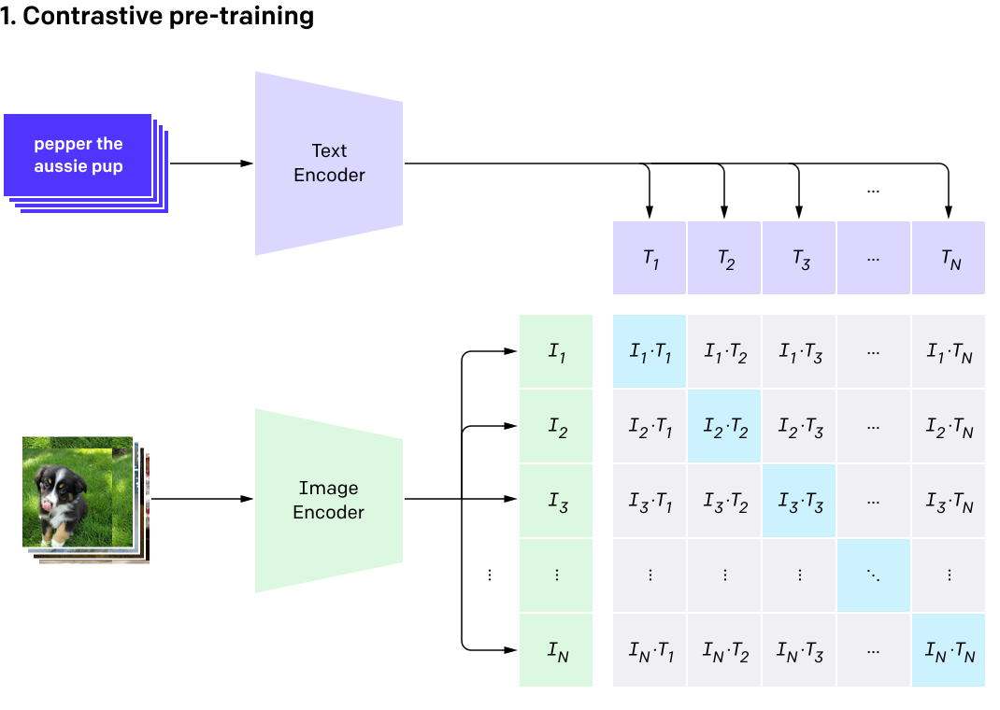
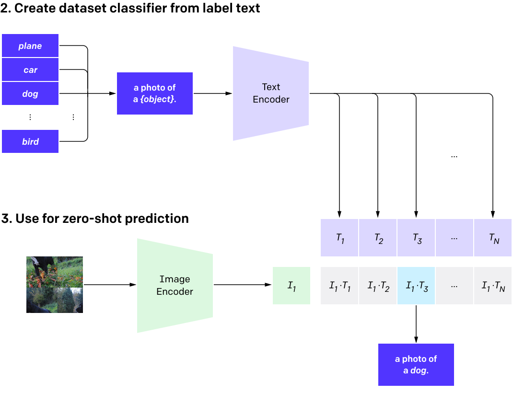

!!! tip inline end "Mais sobre PLN"

    Confira o curso de PLN do Tiago Tavares, que aborda Transformers e outros tópicos avançados de processamento de linguagem natural: [https://tiagoft.github.io/nlp_course/](https://tiagoft.github.io/nlp_course/){:target="_blank"}.

CLIP (Contrastive Language-Image Pretraining) é um modelo de aprendizado de máquina multimodal desenvolvido pela OpenAI em 2021. Ele conecta visão e linguagem ao treinar conjuntamente um codificador de imagens e um codificador de texto em um enorme dataset de pares imagem-texto coletados da internet (cerca de 400 milhões de pares). A ideia central é aprender representações nas quais imagens e suas descrições textuais correspondentes estão próximas em um espaço latente compartilhado, enquanto pares não correspondentes são afastados. Isso habilita capacidades de aprendizado zero-shot, ou seja, o CLIP pode realizar tarefas como classificação de imagens sem ter sido treinado explicitamente com dados rotulados — simplesmente comparando embeddings de imagens com embeddings de texto das descrições de classes.

## Componentes Principais

- **Codificador de Imagem**: Tipicamente um [Vision Transformer (ViT)](../vision-transformers/index.md) ou uma ResNet modificada que processa imagens em embeddings de dimensão fixa (ex: 512 ou 768 dimensões).
- **Codificador de Texto**: Um modelo baseado em Transformer (como uma variante modificada de GPT ou BERT) que codifica legendas de texto em embeddings da mesma dimensionalidade.
- **Objetivo de Treinamento**: Perda contrastiva (especificamente, uma versão simétrica da perda InfoNCE). Para um batch de N pares imagem-texto, computa uma matriz de similaridade entre todos os embeddings de imagem e texto, tratando a diagonal (pares correspondentes) como positivos e as outras entradas como negativos. O objetivo é maximizar a similaridade para positivos e minimizar para negativos.
- **Inferência**: Para classificar uma imagem, codifique-a e compare seu embedding (via similaridade cosseno) com embeddings de texto de prompts como =="uma foto de um [classe]"==. A maior similaridade vence.

{width="70%"}
/// caption
Visão geral da arquitetura CLIP. Durante o treinamento, os codificadores de imagem e texto são treinados conjuntamente com perda contrastiva em pares imagem-texto. (do artigo CLIP da OpenAI[^2])
///

{width="70%"}
/// caption
Visão geral da arquitetura CLIP. Na inferência, embeddings de imagem são comparados com embeddings de texto de prompts de classe para classificação zero-shot. (do artigo CLIP da OpenAI[^2])
///

O ponto forte do CLIP está em sua escalabilidade e generalização. Ele não requer ajuste fino específico para a tarefa e pode lidar com tarefas de vocabulário aberto, mas tem limitações como sensibilidade à engenharia de prompts e vieses provenientes dos dados da internet.

> Um modelo do ImageNet é bom em prever as 1000 categorias do ImageNet, mas é tudo o que ele pode fazer "out of the box." Se quisermos realizar qualquer outra tarefa, um profissional de ML precisa construir um novo dataset, adicionar uma cabeça de saída e ajustar o modelo. Em contraste, o CLIP pode ser adaptado para realizar uma ampla variedade de tarefas de classificação visual sem precisar de exemplos de treinamento adicionais. Para aplicar o CLIP a uma nova tarefa, basta "dizer" ao codificador de texto do CLIP os nomes dos conceitos visuais da tarefa, e ele produzirá um classificador linear das representações visuais do CLIP. A acurácia desse classificador é muitas vezes competitiva com modelos totalmente supervisionados.[^1]

!!! quote "[Limitações do CLIP](https://openai.com/research/clip#limitations)"

    Embora o CLIP geralmente tenha bom desempenho no reconhecimento de objetos comuns, ele tem dificuldades com tarefas mais abstratas ou sistemáticas, como contar o número de objetos em uma imagem, e com tarefas mais complexas, como prever quão próximo está o carro mais próximo em uma foto. Nesses dois datasets, o CLIP zero-shot é apenas ligeiramente melhor que o aleatório. O CLIP zero-shot também tem desempenho inferior em comparação com modelos específicos de tarefa em classificação muito refinada, como distinguir modelos de carros, variantes de aeronaves ou espécies de flores.

    O CLIP ainda tem fraca generalização para imagens não cobertas em seu dataset de pré-treinamento. Por exemplo, embora o CLIP aprenda um sistema OCR capaz, quando avaliado em dígitos manuscritos do dataset MNIST, o CLIP zero-shot atinge apenas 88% de acurácia, bem abaixo dos 99,75% dos humanos no dataset. Por fim, observamos que os classificadores zero-shot do CLIP podem ser sensíveis à formulação ou fraseamento e às vezes requerem tentativa e erro de "engenharia de prompt" para ter bom desempenho.[^1]

## Simulação Numérica da Perda Contrastiva do CLIP

Para ilustrar como o CLIP funciona numericamente, vamos simular um pequeno batch com 3 pares imagem-texto. Assumiremos embeddings pré-computados (na prática, eles vêm dos codificadores). Cada embedding é um vetor 3D por simplicidade (o CLIP real usa dimensões maiores como 512).

#### Configuração:

- Embeddings de imagem (I):  

    \( I_1 = [1.0, 0.0, 0.0] \)  (ex: para "gato")  
    \( I_2 = [0.0, 1.0, 0.0] \)  (ex: para "cachorro")  
    \( I_3 = [0.0, 0.0, 1.0] \)  (ex: para "pássaro")

- Embeddings de texto (T):  

    \( T_1 = [0.9, 0.1, 0.0] \)  (próximo a $I_1$)  
    \( T_2 = [0.1, 0.8, 0.1] \)  (próximo a $I_2$)  
    \( T_3 = [0.0, 0.3, 0.7] \)  (próximo a $I_3$)  

- Tamanho do batch ($N$): $3$

- Temperatura ($\tau$): $0.07$ (hiperparâmetro para escalar logits; comum no CLIP).

#### Cálculo Passo a Passo:

1. **Normalizar os Embeddings**:

    O CLIP usa embeddings L2-normalizados para similaridade cosseno. Aqui, eles já têm comprimento unitário para simplificar (assuma que são).

2. **Calcular a Matriz de Similaridade (Logits)**:

    Similaridade = \( \displaystyle \frac{(I \cdot T)}{\tau} \)  (produto escalar escalado por τ).

    \(
    \text{Logits}_{I \to T} \approx \begin{bmatrix}
    12.857 &  1.4286 &  0 \\
    1.4286 & 11.4286 &  4.2857 \\
    0 &  1.4286 & 10
    \end{bmatrix}
    \)

    Os logits de texto para imagem são a transposta: \(\text{Logits}_{T \to I} = \text{Logits}_{I \to T}^T\)

3. **Softmax para Probabilidades**:

    Para cada linha (imagem), softmax sobre os logits fornece probabilidades de correspondência de textos.

    \(
    \text{Softmax}(I) \approx \begin{bmatrix}
    0.9999 & 0 & 0 \\
    0 & 0.9992 & 0.0008 \\
    0 & 0.0002 & 0.9998
    \end{bmatrix}
    \)

    A diagonal deve ter probabilidades altas.

4. **Perda Contrastiva**:

    Log-verossimilhança negativa dos rótulos corretos (diagonal).  

    \[
    \mathcal{L}_{I \to T} = -\frac{1}{N} \sum_{i=1}^{N} \log(p_{i \to t})
    \]

    $\mathcal{L}_{I \to T} \approx 0.00016$ (perda muito baixa, pois os embeddings estão bem alinhados).

    O CLIP calcula perda simétrica:

    \[
    \displaystyle \mathcal{L} = \frac{1}{2} \left( \mathcal{L}_{I \to T} + \mathcal{L}_{T \to I} \right).
    \]

{==

Esta é uma simulação simplificada; o CLIP real lida com batches grandes (ex: 32k) e usa treinamento distribuído.

==}

---

## Adicional

### Embeddings L2-normalizados

Embeddings L2-normalizados são vetores cujo comprimento é escalado para a unidade 1, significando que sua norma L2 (comprimento euclidiano) é igual a um. Isso é obtido dividindo cada componente do vetor original por sua norma L2 total, tornando-o um método comum para garantir magnitude consistente e melhorar a eficácia de medidas de similaridade baseadas em distância, como a similaridade cosseno[^4].

**Como funciona**

1. **Calcular a norma L2**:

    Para um vetor \(v=[v_{1},v_{2},...,v_{n}]\), a norma L2 (\(||v||_{2}\)) é a raiz quadrada da soma dos quadrados de seus componentes: \(||v||_{2}=\sqrt{v_{1}^{2}+v_{2}^{2}+...+v_{n}^{2}}\).
    
2. **Dividir cada componente**:

    Cada elemento do vetor é então dividido por esta norma L2 calculada. O vetor normalizado resultante, \(v^{\prime }\), é:
    
    \(v^{\prime }=[\frac{v_{1}}{||v||_{2}},\frac{v_{2}}{||v||_{2}},...,\frac{v_{n}}{||v||_{2}}]\). 

**Por que é usado**

- **Foco na direção**: Ajuda os modelos a focarem na "direção" do vetor no espaço de alta dimensionalidade, ao invés de sua magnitude.
- **Melhora medidas de similaridade**: A normalização é crucial para técnicas que dependem de similaridade cosseno. Embeddings L2-normalizados tornam o score de similaridade igual ao produto escalar.
- **Previne viés de magnitude**: Garante que embeddings com grandes magnitudes não dominem as comparações de similaridade.

[^1]: [CLIP: Connecting Text and Images](https://openai.com/index/clip){:target="_blank"}

[^2]: [Learning Transferable Visual Models From Natural Language Supervision](https://arxiv.org/pdf/2103.00020){:target="_blank"}, Alec Radford et al., 2021.

[^3]: [How to Normalize a Vector](https://nextbridge.com/learn-how-to-normalize-a-vector/){:target="_blank"}, Nextbridge.

[^4]: [Cosine Similarity](https://www.geeksforgeeks.org/dbms/cosine-similarity/){:target="_blank"}, GeeksforGeeks.

---

--8<-- "docs/2026.2/classes/clip/quiz.pt.md"
