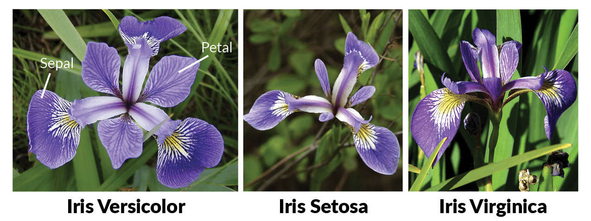

## Data Distributions and Visualization

Before building any model, you must **understand your data visually**. The distribution of features tells you which preprocessing is needed, what problems to expect, and whether the data can support a given task.

---

## Why Distribution Matters

The same algorithm applied to the same task can fail or succeed depending on the data distribution. A linear classifier works perfectly on linearly separable data but cannot learn XOR. Normalization is critical for gradient-based learning but irrelevant for decision trees.

---

## The Salmon vs Seabass Problem

A classic introductory dataset: classify fish on a conveyor belt as "salmon" or "seabass" based on two sensors — size (cm) and brightness (0–10).

$$
\mathbf{x} = \begin{bmatrix} x_1 \text{ (size)} \\ x_2 \text{ (brightness)} \end{bmatrix} \longrightarrow f(\mathbf{x}) \in \{\text{salmon}, \text{seabass}\}
$$

```python exec="1" html="1"
--8<-- "docs/2026.2/classes/data/salmon_vs_seabass_1.py"
```
/// caption
One-dimensional view: each feature individually. Note that neither size alone nor brightness alone perfectly separates the species.
///

```python exec="1" html="1"
--8<-- "docs/2026.2/classes/data/salmon_vs_seabass_2.py"
```
/// caption
Two-dimensional view: combining both features allows a linear decision boundary to separate most samples.
///

!!! tip "Lesson"
    More features = richer feature space = more separation potential. But adding irrelevant features can hurt. **Feature selection matters.**

---

## The Iris Dataset

[UCI Machine Learning Repository](https://archive.ics.uci.edu/dataset/53/iris){:target="_blank"}: introduced by Ronald A. Fisher in 1936, this 150-sample dataset of three Iris species is a cornerstone ML benchmark.



| Feature | Unit | Range |
|---------|------|-------|
| Sepal length | cm | 4.3–7.9 |
| Sepal width | cm | 2.0–4.4 |
| Petal length | cm | 1.0–6.9 |
| Petal width | cm | 0.1–2.5 |

```pyodide install="pandas,scikit-learn" exec="on" html="1"
--8<-- "docs/2026.2/classes/data/iris_data.py"
```

```python exec="1" html="1"
--8<-- "docs/2026.2/classes/data/iris_visualization.py"
```
/// caption
Pairplot of the Iris dataset. Note: petal length vs. petal width clearly separates all three species. Sepal length vs. sepal width shows overlap — not all feature pairs are equally discriminative.
///

---

## Common Distribution Shapes

```python exec="1" html="1"
--8<-- "docs/2026.2/classes/data/distributions.py"
```
/// caption
Four common 2D data distributions. The decision boundary a model needs to learn depends entirely on how the data is distributed.
///

| Distribution | Characteristics | Suitable models |
|---|---|---|
| **Linear** | Classes separated by a hyperplane | Logistic Regression, Linear SVM, Perceptron |
| **Circular / radial** | Non-linear concentric structure | RBF SVM, Neural Networks, KNN |
| **Clusters** | Groups in multiple locations | GMM, Neural Networks, CNN |
| **Spiral / complex** | Highly non-linear | Deep Neural Networks, SVM w/ kernel |

---

## Interactive: Explore a Distribution

Adjust the parameters below to see how different Gaussian distributions look and overlap.

<div id="dist-explorer" style="background:#0d1117;border-radius:12px;padding:1.5rem;margin:2rem 0;font-family:Inter,sans-serif;color:#e6edf3;">
<div style="display:grid;grid-template-columns:1fr 1fr;gap:1rem;margin-bottom:1rem;">
  <div>
    <div style="color:#58a6ff;font-weight:bold;font-size:.85rem;margin-bottom:.4rem;">Class A (blue)</div>
    <div style="font-size:.8rem;color:#8b949e;">Mean X: <input id="ax" type="range" min="-3" max="3" step="0.1" value="-1" style="accent-color:#58a6ff;" oninput="distDraw()"> <span id="ax-val"></span></div>
    <div style="font-size:.8rem;color:#8b949e;">Mean Y: <input id="ay" type="range" min="-3" max="3" step="0.1" value="0" style="accent-color:#58a6ff;" oninput="distDraw()"> <span id="ay-val"></span></div>
    <div style="font-size:.8rem;color:#8b949e;">Std: <input id="as" type="range" min="0.3" max="2" step="0.1" value="0.8" style="accent-color:#58a6ff;" oninput="distDraw()"> <span id="as-val"></span></div>
  </div>
  <div>
    <div style="color:#f0883e;font-weight:bold;font-size:.85rem;margin-bottom:.4rem;">Class B (orange)</div>
    <div style="font-size:.8rem;color:#8b949e;">Mean X: <input id="bx" type="range" min="-3" max="3" step="0.1" value="1" style="accent-color:#f0883e;" oninput="distDraw()"> <span id="bx-val"></span></div>
    <div style="font-size:.8rem;color:#8b949e;">Mean Y: <input id="by" type="range" min="-3" max="3" step="0.1" value="0" style="accent-color:#f0883e;" oninput="distDraw()"> <span id="by-val"></span></div>
    <div style="font-size:.8rem;color:#8b949e;">Std: <input id="bs" type="range" min="0.3" max="2" step="0.1" value="0.8" style="accent-color:#f0883e;" oninput="distDraw()"> <span id="bs-val"></span></div>
  </div>
</div>
<canvas id="dist-canvas" style="width:100%;display:block;border-radius:8px;"></canvas>
<div id="dist-info" style="margin-top:.6rem;font-size:.8rem;color:#8b949e;font-family:monospace;"></div>
</div>

<script>
(function(){
  function randn(seed){ let x=Math.sin(seed*31.7)*43758.5; return x-Math.floor(x); }
  // Pre-generate base samples
  const N=120;
  const baseA=Array.from({length:N},(_,i)=>[randn(i*7)*2-1, randn(i*7+1)*2-1]);
  const baseB=Array.from({length:N},(_,i)=>[randn(i*7+1000)*2-1, randn(i*7+1001)*2-1]);

  function normalSample(base, mx, my, std){
    return base.map(([bx,by])=>{ return [mx+bx*std, my+by*std]; });
  }

  window.distDraw=function(){
    const ax=+document.getElementById('ax').value, ay=+document.getElementById('ay').value, as_=+document.getElementById('as').value;
    const bx=+document.getElementById('bx').value, by=+document.getElementById('by').value, bs=+document.getElementById('bs').value;
    ['ax','ay','as','bx','by','bs'].forEach(id=>{const el=document.getElementById(id+'-val');if(el)el.textContent=document.getElementById(id).value;});

    const sampA=normalSample(baseA,ax,ay,as_);
    const sampB=normalSample(baseB,bx,by,bs);

    const canvas=document.getElementById('dist-canvas');
    const ctx=canvas.getContext('2d');
    const W=canvas.parentElement.offsetWidth-48,H=220;
    canvas.width=W;canvas.height=H;canvas.style.height=H+'px';
    ctx.fillStyle='#161b22';ctx.fillRect(0,0,W,H);

    const scale=Math.min(W,H)/6.5;
    const cx=W/2,cy=H/2;

    // Grid
    ctx.strokeStyle='#21262d';ctx.lineWidth=0.5;
    for(let i=-5;i<=5;i++){ctx.beginPath();ctx.moveTo(cx+i*scale/2,0);ctx.lineTo(cx+i*scale/2,H);ctx.stroke();ctx.beginPath();ctx.moveTo(0,cy+i*scale/2);ctx.lineTo(W,cy+i*scale/2);ctx.stroke();}

    // Plot points
    [[sampA,'#58a6ff'],[sampB,'#f0883e']].forEach(([pts,col])=>{
      pts.forEach(([px,py])=>{
        ctx.fillStyle=col+'aa';
        ctx.beginPath();ctx.arc(cx+px*scale,cy-py*scale,4,0,2*Math.PI);ctx.fill();
      });
    });

    // Compute overlap metric (rough)
    const dist=Math.sqrt((ax-bx)**2+(ay-by)**2);
    const overlap=Math.max(0,1-dist/(as_+bs));
    const sep=dist>0?dist/(as_+bs):0;

    document.getElementById('dist-info').innerHTML=
      'Class distance: <span style="color:#c9d1d9;">'+dist.toFixed(2)+'</span> &nbsp;|&nbsp; '+
      'Overlap estimate: <span style="color:'+(overlap>0.5?'#ff7b72':overlap>0.2?'#d29922':'#3fb950')+';">'+(overlap*100).toFixed(0)+'%</span> &nbsp;|&nbsp; '+
      'Separability: <span style="color:'+(sep>1.5?'#3fb950':sep>0.8?'#d29922':'#ff7b72')+';">'+(sep>1.5?'High':sep>0.8?'Medium':'Low')+'</span>';
  };
  distDraw();
  window.addEventListener('resize',distDraw);
})();
</script>

---

## Key Visualization Techniques

| Technique | Best for | Library |
|---|---|---|
| **Scatter plot** | 2D feature relationships | `matplotlib`, `seaborn` |
| **Pairplot** | All feature pairs at once | `seaborn.pairplot` |
| **Histogram** | Single feature distribution | `matplotlib.hist` |
| **Box plot** | Distribution + outliers | `seaborn.boxplot` |
| **Heatmap (correlation)** | Feature correlations | `seaborn.heatmap` |
| **t-SNE / UMAP** | High-dimensional data in 2D | `sklearn`, `umap-learn` |
| **Violin plot** | Distribution per class | `seaborn.violinplot` |

```python
import seaborn as sns
import matplotlib.pyplot as plt

# Correlation heatmap
corr = df.corr()
sns.heatmap(corr, annot=True, cmap='coolwarm', center=0)
plt.title('Feature Correlation Matrix')
plt.show()

# Distribution per class
sns.violinplot(data=df, x='class', y='feature_name')
plt.show()

# t-SNE for high-dimensional data
from sklearn.manifold import TSNE
X_2d = TSNE(n_components=2, random_state=42).fit_transform(X_scaled)
plt.scatter(X_2d[:,0], X_2d[:,1], c=y, cmap='tab10')
plt.title('t-SNE visualization')
plt.show()
```

[^1]: Fisher, R. A. (1936). [Iris](https://doi.org/10.24432/C56C76){:target="_blank"}. UCI Machine Learning Repository.
[^2]: Duda, R. O., Hart, P. E., & Stork, D. G. (2000). [Pattern Classification](https://dl.acm.org/doi/book/10.5555/954544){:target="_blank"}, 2nd Edition. Wiley.
