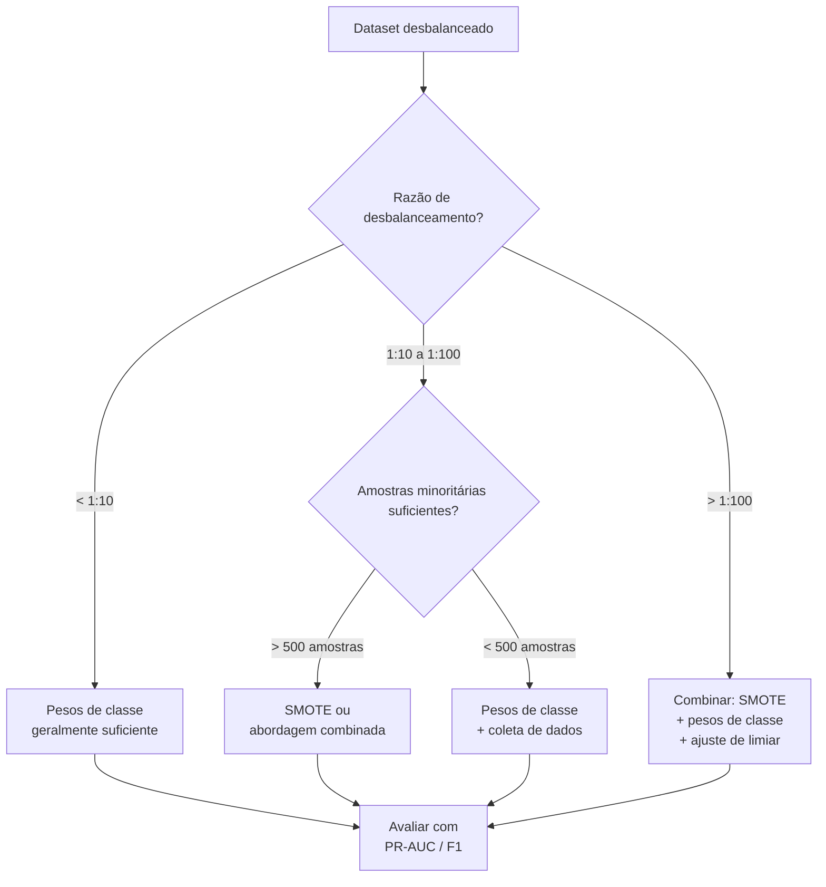

## Desbalanceamento de Classes

O desbalanceamento de classes ocorre quando a distribuição das classes alvo é altamente assimétrica — uma ou mais classes dominam o dataset. Isso é a norma, não a exceção, em problemas do mundo real: detecção de fraude (99,9% legítimo), diagnóstico de doenças (95% saudável), detecção de spam (80% e-mail legítimo).

---

## Por que o Desbalanceamento Quebra o Treinamento Padrão

Um modelo treinado com perda de entropia cruzada em um dataset desbalanceado irá **maximizar a acurácia prevendo a classe majoritária**. Com 99% de negativos, prever sempre negativo dá 99% de acurácia — mas 0% de recall nos positivos.

<div id="imb-viz" style="background:#0d1117;border-radius:12px;padding:1.5rem;margin:2rem 0;">
<canvas id="imb-canvas" style="width:100%;display:block;"></canvas>
<div style="margin-top:.8rem;">
  <label style="color:#8b949e;font-size:.85rem;">% da classe minoritária: </label>
  <input id="imb-pct" type="range" min="1" max="50" step="1" value="5" style="accent-color:#ff7b72;vertical-align:middle;width:200px;" oninput="imbDraw()">
  <span id="imb-pct-val" style="color:#ff7b72;font-family:monospace;font-weight:bold;"></span>
</div>
<div id="imb-naive-acc" style="color:#8b949e;font-size:.82rem;margin-top:.5rem;font-family:monospace;"></div>
</div>

<script>
window.imbDraw = function() {
  const canvas = document.getElementById('imb-canvas');
  const ctx = canvas.getContext('2d');
  const W = canvas.parentElement.offsetWidth - 48, H = 80;
  canvas.width = W; canvas.height = H; canvas.style.height = H + 'px';
  ctx.fillStyle = '#0d1117'; ctx.fillRect(0,0,W,H);

  const pct = +document.getElementById('imb-pct').value;
  document.getElementById('imb-pct-val').textContent = pct + '%';

  const pad = 10, bw = W - 2*pad, bh = 44, by = (H-bh)/2;
  const majW = bw * (100-pct)/100, minW = bw * pct/100;

  ctx.fillStyle = '#58a6ff22'; ctx.fillRect(pad, by, majW, bh);
  ctx.strokeStyle = '#58a6ff'; ctx.lineWidth = 2; ctx.strokeRect(pad, by, majW, bh);
  ctx.fillStyle = '#ff7b7222'; ctx.fillRect(pad+majW, by, minW, bh);
  ctx.strokeStyle = '#ff7b72'; ctx.lineWidth = 2; ctx.strokeRect(pad+majW, by, minW, bh);

  ctx.textAlign = 'center'; ctx.textBaseline = 'middle'; ctx.font = 'bold 11px Inter,sans-serif';
  if (majW > 80) { ctx.fillStyle = '#58a6ff'; ctx.fillText('Classe majoritária (' + (100-pct) + '%)', pad + majW/2, by + bh/2); }
  if (minW > 30) { ctx.fillStyle = '#ff7b72'; ctx.fillText('Minoritária (' + pct + '%)', pad+majW+minW/2, by+bh/2); }
  else { ctx.fillStyle = '#ff7b72'; ctx.font = '8px monospace'; ctx.fillText(pct+'%', pad+majW+minW/2, by+bh/2); }

  const naiveAcc = (100-pct).toFixed(1);
  document.getElementById('imb-naive-acc').innerHTML =
    'Acurácia do classificador sempre-majoritário: <span style="color:#ff7b72;font-weight:bold;">' + naiveAcc + '%</span> &nbsp;|&nbsp; ' +
    'Recall minoritário: <span style="color:#ff7b72;font-weight:bold;">0%</span> &nbsp;|&nbsp; ' +
    'F1 (minoritário): <span style="color:#ff7b72;font-weight:bold;">0,00</span> — completamente inútil apesar da alta acurácia!';
};
imbDraw();
window.addEventListener('resize', imbDraw);
</script>

---

## Estratégias para Lidar com Desbalanceamento

### 1. Use a Métrica Correta

Primeiro e mais importante: **pare de usar acurácia**. Use:

| Métrica | Bom quando |
|--------|---------|
| **F1-Score (macro/ponderado)** | Binário ou multiclasse, quer equilíbrio |
| **PR-AUC (Precision-Recall)** | Quando positivos são raros e importantes |
| **ROC-AUC** | Quando você precisa de avaliação independente do limiar |
| **Matthews Correlation Coefficient (MCC)** | Classificação binária, muito desbalanceado |
| **G-Mean** | Média geométrica do recall por classe |

### 2. Pesos de Classe

Diga à função de perda para penalizar mais os erros na classe minoritária:

```python
from sklearn.linear_model import LogisticRegression
from sklearn.utils.class_weight import compute_class_weight
import numpy as np

# Cálculo automático de pesos de classe
weights = compute_class_weight('balanced', classes=np.unique(y_train), y=y_train)
class_weight = dict(zip(np.unique(y_train), weights))

# Para modelos sklearn
model = LogisticRegression(class_weight='balanced')

# Para PyTorch
import torch
pos_weight = torch.tensor([neg_count / pos_count])
criterion = torch.nn.BCEWithLogitsLoss(pos_weight=pos_weight)
```

### 3. Oversampling — SMOTE

**SMOTE** (Synthetic Minority Over-sampling Technique) gera amostras minoritárias sintéticas interpolando entre as existentes:

```python
from imblearn.over_sampling import SMOTE

smote = SMOTE(sampling_strategy='auto', k_neighbors=5, random_state=42)
X_resampled, y_resampled = smote.fit_resample(X_train, y_train)

print(f"Antes: {dict(zip(*np.unique(y_train, return_counts=True)))}")
print(f"Depois:  {dict(zip(*np.unique(y_resampled, return_counts=True)))}")
```

!!! warning "Aplique SMOTE apenas nos dados de treino"
    Nunca reamostre o conjunto de validação ou teste. Isso daria uma distribuição de classes irreal não representativa da produção.

### 4. Undersampling

Remover amostras da classe majoritária. Mais simples que SMOTE, mas perde informação:

```python
from imblearn.under_sampling import RandomUnderSampler, TomekLinks

# Undersampling aleatório
rus = RandomUnderSampler(sampling_strategy=0.5)  # minoritária:majoritária = 1:2
X_res, y_res = rus.fit_resample(X_train, y_train)

# Tomek Links: remover amostras majoritárias próximas à fronteira
tl = TomekLinks()
X_res, y_res = tl.fit_resample(X_train, y_train)
```

### 5. Ajuste de Limiar

Classificadores padrão produzem probabilidades. O limiar padrão (0,5) pode não ser ótimo para dados desbalanceados. Ajuste-o no conjunto de validação:

```python
from sklearn.metrics import precision_recall_curve
import numpy as np

probs = model.predict_proba(X_val)[:, 1]
precisions, recalls, thresholds = precision_recall_curve(y_val, probs)

# Encontrar limiar que maximiza F1
f1_scores = 2 * precisions * recalls / (precisions + recalls + 1e-8)
best_thresh = thresholds[np.argmax(f1_scores)]
y_pred = (probs >= best_thresh).astype(int)
```

---

## Guia de Decisão de Estratégia



---

## Desbalanceamento em Aprendizado Profundo

Para redes neurais com grandes datasets, **pesos de classe** geralmente são a solução mais prática e eficaz. SMOTE em milhões de amostras é lento e as amostras sintéticas podem não corresponder bem à distribuição de features aprendida.

Técnicas adicionais específicas para aprendizado profundo:

| Técnica | Ideia |
|-----------|------|
| **Focal Loss** | Diminui o peso de exemplos fáceis (majoritários bem classificados), foca nos difíceis minoritários |
| **Suavização de Rótulos** | Previne previsões excessivamente confiantes na classe majoritária |
| **Amostragem de Batch Balanceado** | Garantir que cada batch contenha amostras iguais de cada classe |
| **Mixup** | Interpolar entre amostras de classes diferentes |

```python
# Focal Loss (binária)
class FocalLoss(torch.nn.Module):
    def __init__(self, gamma=2.0, alpha=0.25):
        super().__init__()
        self.gamma, self.alpha = gamma, alpha

    def forward(self, pred, target):
        bce = torch.nn.functional.binary_cross_entropy_with_logits(pred, target, reduction='none')
        pt = torch.exp(-bce)
        return (self.alpha * (1 - pt)**self.gamma * bce).mean()
```
