## Data in Machine Learning

All machine learning is fundamentally a **data problem**. No matter how sophisticated the model architecture, it cannot compensate for data that is poorly collected, incorrectly labeled, or improperly split. Understanding data — its types, distributions, quality, and pitfalls — is the first and most critical step in any ML project.

> "Garbage in, garbage out." — Classic ML maxim

This section is organized into six focused topics:

<a href="types/" style="text-decoration:none;">

📊 Feature Types

Numerical, categorical, ordinal, binary, text, image, time series. How data type drives modeling choices.

</a>

<a href="distributions/" style="text-decoration:none;">

📈 Distributions & Visualization

Gaussian, uniform, multimodal, and real datasets (Iris, Salmon/Seabass). How to explore and visualize data.

</a>

<a href="splitting/" style="text-decoration:none;">

✂️ Train / Val / Test Split

Why the three-way split matters, cross-validation, stratified splits, and the golden rule of the test set.

</a>

<a href="leakage/" style="text-decoration:none;">

🚨 Data Leakage

The silent model-killer. Target leakage, temporal leakage, train-test contamination, and how to detect them.

</a>

<a href="quality/" style="text-decoration:none;">

🧹 Data Quality

Missing values (MCAR/MAR/MNAR), outliers, duplicates, noise. Cleaning strategies and imputation.

</a>

<a href="imbalance/" style="text-decoration:none;">

⚖️ Class Imbalance

When one class dominates. Oversampling (SMOTE), undersampling, class weights, and proper evaluation.

</a>

---

## The Data Pipeline

Before feeding data to any model, it passes through a series of transformations. Understanding the **full pipeline** helps you avoid bugs and leakage:

```mermaid
flowchart LR
    A["Raw Data\ncollection"] --> B["Exploratory\nData Analysis"]
    B --> C["Data Cleaning\n(quality issues)"]
    C --> D["Split\ntrain / val / test"]
    D --> E["Feature Engineering\n& Preprocessing"]
    E --> F["Model\nTraining"]
    F --> G["Evaluation\non test set"]
    
    style D fill:#1f3244,stroke:#58a6ff
    style G fill:#1f3d1f,stroke:#3fb950
```

!!! danger "Critical Rule"
    **Always split BEFORE preprocessing.** Computing statistics (mean, std, min, max) on the full dataset and then splitting is data leakage. Fit all transformers on training data only.

---

## Key Data Repositories

| Source | Domain | Format |
|--------|---------|--------|
| [UCI ML Repository](https://archive.ics.uci.edu/){:target="_blank"} | General ML | CSV, ARFF |
| [Kaggle Datasets](https://www.kaggle.com/datasets){:target="_blank"} | All domains | CSV, JSON |
| [Hugging Face Datasets](https://huggingface.co/datasets){:target="_blank"} | NLP, Vision | Arrow, Parquet |
| [OpenML](https://www.openml.org/){:target="_blank"} | Benchmarks | ARFF |
| [TensorFlow Datasets](https://www.tensorflow.org/datasets){:target="_blank"} | Vision, NLP, Audio | TFRecord |
| [Papers With Code](https://paperswithcode.com/datasets){:target="_blank"} | Research benchmarks | Various |
| [Google Dataset Search](https://datasetsearch.research.google.com/){:target="_blank"} | Web-wide | Various |

---

--8<-- "docs/2026.2/classes/data/quiz.md"
