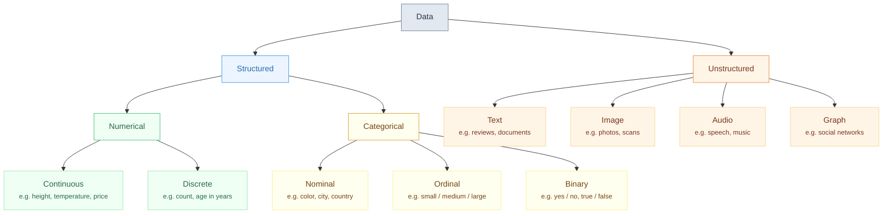

## Feature Types

The type of each feature in your dataset fundamentally shapes which preprocessing, architectures, and loss functions you can use. Misidentifying a feature type is one of the most common sources of bugs in ML pipelines.

---

## Primary Feature Types



---

## Numerical Features

Numerical features represent quantities that can be measured on a continuous or discrete scale.

| Sub-type | Description | Examples | Encoding |
|----------|-------------|---------|---------|
| **Continuous** | Infinite values in a range | Height (1.73m), Temperature (23.4°C), Price ($12.50) | Use as-is, normalize |
| **Discrete** | Countable integer values | Age (years), Number of rooms, Visit count | Treat as continuous or ordinal |

**Why it matters:** Most neural networks expect numerical inputs in a bounded range. Inputs with very different scales (e.g., age ∈ [0,100] and income ∈ [0,1,000,000]) cause some features to dominate gradient updates. Always **normalize or standardize** numerical features.

```python
from sklearn.preprocessing import StandardScaler, MinMaxScaler

# Z-score: (x - mean) / std  → mean 0, std 1
scaler = StandardScaler()
X_train_scaled = scaler.fit_transform(X_train)
X_test_scaled  = scaler.transform(X_test)   # use train stats!

# Min-Max: (x - min) / (max - min) → [0, 1]
scaler = MinMaxScaler()
X_train_scaled = scaler.fit_transform(X_train)
```

---

## Categorical Features

Categorical features represent membership in discrete groups. The key distinction is **ordinal vs. nominal**.

| Sub-type | Description | Example | Problem with raw integers |
|----------|-------------|---------|--------------------------|
| **Nominal** | No natural order | Color: {red, blue, green} | Model assumes blue > red |
| **Ordinal** | Has natural order | Size: {small, medium, large} | Encoding should respect order |
| **Binary** | Two values | Spam: {yes, no} | Encode as 0/1 |

### Encoding strategies

=== "One-Hot Encoding (nominal)"
    ```python
    import pandas as pd
    df = pd.get_dummies(df, columns=['color'])
    # color_red=1, color_blue=0, color_green=0
    ```
    Best for nominal features with low cardinality (< ~20 categories).

=== "Ordinal Encoding"
    ```python
    from sklearn.preprocessing import OrdinalEncoder
    enc = OrdinalEncoder(categories=[['small', 'medium', 'large']])
    X['size_enc'] = enc.fit_transform(X[['size']])
    # small=0, medium=1, large=2
    ```

=== "Target / Mean Encoding (high cardinality)"
    ```python
    # Replace category with mean target value
    means = train.groupby('city')['price'].mean()
    X['city_enc'] = X['city'].map(means)
    ```
    ⚠️ Must be computed on training set only to avoid leakage.

=== "Embedding (neural networks)"
    ```python
    import torch.nn as nn
    # 50 cities → 8-dimensional learned embedding
    city_emb = nn.Embedding(num_embeddings=50, embedding_dim=8)
    ```
    Best for high-cardinality categoricals in deep learning.

---

## Unstructured Feature Types

| Type | Shape | Typical representation | Common model |
|------|-------|----------------------|-------------|
| **Text** | Variable sequence | Token IDs (BPE) | Transformer |
| **Image** | H × W × C | Pixel values [0,255] | CNN, ViT |
| **Audio** | T × F | Spectrogram or waveform | Conv1D, Transformer |
| **Graph** | N nodes, E edges | Adjacency matrix + features | GNN |
| **Time Series** | T × F | Ordered sequence | LSTM, Transformer, TCN |

---

## Interactive: Identify the Feature Type

<div id="type-quiz-game" style="background:#0d1117;border-radius:12px;padding:1.5rem;margin:2rem 0;font-family:Inter,sans-serif;color:#e6edf3;">
<div style="color:#8b949e;font-size:.85rem;margin-bottom:1rem;">What is the correct feature type? Click the right answer.</div>
<div id="ftq-question" style="color:#c9d1d9;font-size:1rem;font-weight:bold;margin-bottom:1rem;min-height:2rem;"></div>
<div id="ftq-options" style="display:flex;gap:.6rem;flex-wrap:wrap;margin-bottom:.8rem;"></div>
<div id="ftq-feedback" style="font-size:.85rem;min-height:1.4rem;"></div>
<div style="margin-top:.8rem;color:#484f58;font-size:.8rem;">Score: <span id="ftq-score" style="color:#3fb950;font-weight:bold;">0</span> / <span id="ftq-total">0</span></div>
</div>

<script>
(function(){
  const questions = [
    { feat: 'Customer age (years)', ans: 'Discrete Numerical', opts: ['Continuous Numerical','Discrete Numerical','Nominal Categorical','Binary'] },
    { feat: 'Product rating: ★★★☆☆', ans: 'Ordinal Categorical', opts: ['Continuous Numerical','Nominal Categorical','Ordinal Categorical','Binary'] },
    { feat: 'Pixel values in a 224×224 photo', ans: 'Image (Unstructured)', opts: ['Continuous Numerical','Discrete Numerical','Nominal Categorical','Image (Unstructured)'] },
    { feat: 'City of residence (500 cities)', ans: 'Nominal Categorical', opts: ['Continuous Numerical','Nominal Categorical','Ordinal Categorical','Binary'] },
    { feat: 'Email text body', ans: 'Text (Unstructured)', opts: ['Continuous Numerical','Nominal Categorical','Binary','Text (Unstructured)'] },
    { feat: 'Transaction amount ($)', ans: 'Continuous Numerical', opts: ['Continuous Numerical','Discrete Numerical','Ordinal Categorical','Binary'] },
    { feat: 'Is_Fraud flag (True/False)', ans: 'Binary', opts: ['Discrete Numerical','Nominal Categorical','Ordinal Categorical','Binary'] },
    { feat: 'Daily temperature readings over 1 year', ans: 'Time Series', opts: ['Continuous Numerical','Image (Unstructured)','Time Series','Ordinal Categorical'] },
  ];

  let qi = 0, score = 0;

  function showQuestion() {
    if (qi >= questions.length) {
      document.getElementById('ftq-question').textContent = 'Quiz complete! Final score: ' + score + '/' + questions.length;
      document.getElementById('ftq-options').innerHTML = '<button onclick="ftqReset()" style="padding:6px 18px;background:#58a6ff;color:#0d1117;border:none;border-radius:5px;cursor:pointer;font-weight:bold;">Restart</button>';
      document.getElementById('ftq-feedback').textContent = '';
      return;
    }
    const q = questions[qi];
    document.getElementById('ftq-question').textContent = 'Feature: "' + q.feat + '"';
    const optsDiv = document.getElementById('ftq-options');
    optsDiv.innerHTML = '';
    q.opts.forEach(opt => {
      const btn = document.createElement('button');
      btn.textContent = opt;
      btn.style.cssText = 'padding:6px 14px;background:#21262d;color:#c9d1d9;border:1px solid #30363d;border-radius:5px;cursor:pointer;font-size:.85rem;';
      btn.onclick = () => {
        const correct = opt === q.ans;
        if (correct) score++;
        document.getElementById('ftq-total').textContent = qi + 1;
        document.getElementById('ftq-score').textContent = score;
        document.getElementById('ftq-feedback').innerHTML = correct
          ? '<span style="color:#3fb950;">✓ Correct!</span>'
          : '<span style="color:#ff7b72;">✗ Wrong — answer: <strong>' + q.ans + '</strong></span>';
        Array.from(optsDiv.children).forEach(b => { b.disabled = true; b.style.cursor = 'default'; });
        btn.style.background = correct ? '#1f3d1f' : '#3d1a1a';
        btn.style.color = correct ? '#3fb950' : '#ff7b72';
        setTimeout(() => { qi++; showQuestion(); }, 1200);
      };
      optsDiv.appendChild(btn);
    });
    document.getElementById('ftq-feedback').textContent = '';
  }

  window.ftqReset = function() { qi = 0; score = 0; document.getElementById('ftq-total').textContent = 0; document.getElementById('ftq-score').textContent = 0; showQuestion(); };
  showQuestion();
})();
</script>

---

## Feature Type → Modeling Implications

| Feature Type | Raw form | Neural network input | Pitfall |
|---|---|---|---|
| Continuous | Float | Normalize to ~N(0,1) | Large values dominate |
| Discrete | Int | Treat as continuous OR embed | Arbitrary ordering if misidentified |
| Nominal | String | One-hot or embedding | Model assumes order if label-encoded |
| Ordinal | String | Integer mapping | Distances between levels may be unequal |
| Binary | Bool | 0/1 | Class imbalance if rare |
| Text | String | Tokenize → token IDs | Vocabulary size, OOV tokens |
| Image | Array | Pixel / 255 → [0,1] | Channel order (RGB vs BGR) |
| Time series | Array | Windowed segments | Look-ahead leakage |
