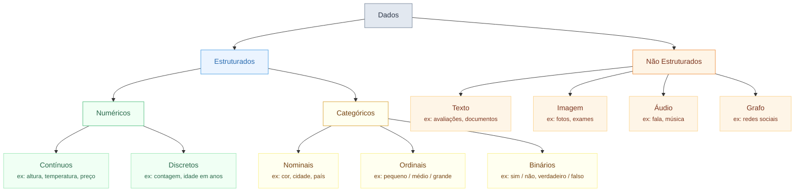

## Tipos de Features

O tipo de cada feature no seu dataset molda fundamentalmente quais pré-processamentos, arquiteturas e funções de perda você pode usar. Identificar incorretamente um tipo de feature é uma das fontes mais comuns de bugs em pipelines de AM.

---

## Tipos Primários de Features



---

## Features Numéricas

Features numéricas representam quantidades que podem ser medidas em uma escala contínua ou discreta.

| Sub-tipo | Descrição | Exemplos | Codificação |
|----------|-------------|---------|---------|
| **Contínuo** | Valores infinitos em um intervalo | Altura (1,73m), Temperatura (23,4°C), Preço (R$12,50) | Usar como está, normalizar |
| **Discreto** | Valores inteiros contáveis | Idade (anos), Número de quartos, Contagem de visitas | Tratar como contínuo ou ordinal |

**Por que importa:** A maioria das redes neurais espera entradas numéricas em um intervalo limitado. Entradas com escalas muito diferentes (ex: idade ∈ [0,100] e renda ∈ [0,1.000.000]) fazem algumas features dominarem as atualizações do gradiente. Sempre **normalize ou padronize** features numéricas.

```python
from sklearn.preprocessing import StandardScaler, MinMaxScaler

# Z-score: (x - média) / std  → média 0, desvio 1
scaler = StandardScaler()
X_train_scaled = scaler.fit_transform(X_train)
X_test_scaled  = scaler.transform(X_test)   # use as stats do treino!

# Min-Max: (x - min) / (max - min) → [0, 1]
scaler = MinMaxScaler()
X_train_scaled = scaler.fit_transform(X_train)
```

---

## Features Categóricas

Features categóricas representam pertencimento a grupos discretos. A distinção principal é entre **ordinal vs. nominal**.

| Sub-tipo | Descrição | Exemplo | Problema com inteiros brutos |
|----------|-------------|---------|--------------------------|
| **Nominal** | Sem ordem natural | Cor: {vermelho, azul, verde} | Modelo assume azul > vermelho |
| **Ordinal** | Tem ordem natural | Tamanho: {pequeno, médio, grande} | Codificação deve respeitar a ordem |
| **Binário** | Dois valores | Spam: {sim, não} | Codificar como 0/1 |

### Estratégias de Codificação

=== "One-Hot Encoding (nominal)"
    ```python
    import pandas as pd
    df = pd.get_dummies(df, columns=['cor'])
    # cor_vermelho=1, cor_azul=0, cor_verde=0
    ```
    Melhor para features nominais com baixa cardinalidade (< ~20 categorias).

=== "Codificação Ordinal"
    ```python
    from sklearn.preprocessing import OrdinalEncoder
    enc = OrdinalEncoder(categories=[['pequeno', 'médio', 'grande']])
    X['tamanho_enc'] = enc.fit_transform(X[['tamanho']])
    # pequeno=0, médio=1, grande=2
    ```

=== "Codificação por Alvo / Média (alta cardinalidade)"
    ```python
    # Substituir categoria pela média do alvo
    medias = train.groupby('cidade')['preco'].mean()
    X['cidade_enc'] = X['cidade'].map(medias)
    ```
    ⚠️ Deve ser calculado apenas no conjunto de treino para evitar vazamento.

=== "Embedding (redes neurais)"
    ```python
    import torch.nn as nn
    # 50 cidades → embedding de dimensão 8
    cidade_emb = nn.Embedding(num_embeddings=50, embedding_dim=8)
    ```
    Melhor para categóricos de alta cardinalidade em aprendizado profundo.

---

## Tipos de Features Não Estruturadas

| Tipo | Forma | Representação típica | Modelo comum |
|------|-------|----------------------|-------------|
| **Texto** | Sequência variável | IDs de tokens (BPE) | Transformer |
| **Imagem** | H × W × C | Valores de pixel [0,255] | CNN, ViT |
| **Áudio** | T × F | Espectrograma ou forma de onda | Conv1D, Transformer |
| **Grafo** | N nós, E arestas | Matriz de adjacência + features | GNN |
| **Série Temporal** | T × F | Sequência ordenada | LSTM, Transformer, TCN |

---

## Interativo: Identifique o Tipo de Feature

<div id="type-quiz-game" style="background:#0d1117;border-radius:12px;padding:1.5rem;margin:2rem 0;font-family:Inter,sans-serif;color:#e6edf3;">
<div style="color:#8b949e;font-size:.85rem;margin-bottom:1rem;">Qual é o tipo correto de feature? Clique na resposta certa.</div>
<div id="ftq-question" style="color:#c9d1d9;font-size:1rem;font-weight:bold;margin-bottom:1rem;min-height:2rem;"></div>
<div id="ftq-options" style="display:flex;gap:.6rem;flex-wrap:wrap;margin-bottom:.8rem;"></div>
<div id="ftq-feedback" style="font-size:.85rem;min-height:1.4rem;"></div>
<div style="margin-top:.8rem;color:#484f58;font-size:.8rem;">Pontuação: <span id="ftq-score" style="color:#3fb950;font-weight:bold;">0</span> / <span id="ftq-total">0</span></div>
</div>

<script>
(function(){
  const questions = [
    { feat: 'Idade do cliente (anos)', ans: 'Numérico Discreto', opts: ['Numérico Contínuo','Numérico Discreto','Categórico Nominal','Binário'] },
    { feat: 'Avaliação do produto: ★★★☆☆', ans: 'Categórico Ordinal', opts: ['Numérico Contínuo','Categórico Nominal','Categórico Ordinal','Binário'] },
    { feat: 'Valores de pixel em uma foto 224×224', ans: 'Imagem (Não Estruturada)', opts: ['Numérico Contínuo','Numérico Discreto','Categórico Nominal','Imagem (Não Estruturada)'] },
    { feat: 'Cidade de residência (500 cidades)', ans: 'Categórico Nominal', opts: ['Numérico Contínuo','Categórico Nominal','Categórico Ordinal','Binário'] },
    { feat: 'Corpo de texto do e-mail', ans: 'Texto (Não Estruturado)', opts: ['Numérico Contínuo','Categórico Nominal','Binário','Texto (Não Estruturado)'] },
    { feat: 'Valor da transação (R$)', ans: 'Numérico Contínuo', opts: ['Numérico Contínuo','Numérico Discreto','Categórico Ordinal','Binário'] },
    { feat: 'Flag É_Fraude (Verdadeiro/Falso)', ans: 'Binário', opts: ['Numérico Discreto','Categórico Nominal','Categórico Ordinal','Binário'] },
    { feat: 'Leituras diárias de temperatura ao longo de 1 ano', ans: 'Série Temporal', opts: ['Numérico Contínuo','Imagem (Não Estruturada)','Série Temporal','Categórico Ordinal'] },
  ];

  let qi = 0, score = 0;

  function showQuestion() {
    if (qi >= questions.length) {
      document.getElementById('ftq-question').textContent = 'Quiz completo! Pontuação final: ' + score + '/' + questions.length;
      document.getElementById('ftq-options').innerHTML = '<button onclick="ftqReset()" style="padding:6px 18px;background:#58a6ff;color:#0d1117;border:none;border-radius:5px;cursor:pointer;font-weight:bold;">Reiniciar</button>';
      document.getElementById('ftq-feedback').textContent = '';
      return;
    }
    const q = questions[qi];
    document.getElementById('ftq-question').textContent = 'Feature: "' + q.feat + '"';
    const optsDiv = document.getElementById('ftq-options');
    optsDiv.innerHTML = '';
    q.opts.forEach(opt => {
      const btn = document.createElement('button');
      btn.textContent = opt;
      btn.style.cssText = 'padding:6px 14px;background:#21262d;color:#c9d1d9;border:1px solid #30363d;border-radius:5px;cursor:pointer;font-size:.85rem;';
      btn.onclick = () => {
        const correct = opt === q.ans;
        if (correct) score++;
        document.getElementById('ftq-total').textContent = qi + 1;
        document.getElementById('ftq-score').textContent = score;
        document.getElementById('ftq-feedback').innerHTML = correct
          ? '<span style="color:#3fb950;">✓ Correto!</span>'
          : '<span style="color:#ff7b72;">✗ Errado — resposta: <strong>' + q.ans + '</strong></span>';
        Array.from(optsDiv.children).forEach(b => { b.disabled = true; b.style.cursor = 'default'; });
        btn.style.background = correct ? '#1f3d1f' : '#3d1a1a';
        btn.style.color = correct ? '#3fb950' : '#ff7b72';
        setTimeout(() => { qi++; showQuestion(); }, 1200);
      };
      optsDiv.appendChild(btn);
    });
    document.getElementById('ftq-feedback').textContent = '';
  }

  window.ftqReset = function() { qi = 0; score = 0; document.getElementById('ftq-total').textContent = 0; document.getElementById('ftq-score').textContent = 0; showQuestion(); };
  showQuestion();
})();
</script>

---

## Tipo de Feature → Implicações de Modelagem

| Tipo de Feature | Forma bruta | Entrada para rede neural | Armadilha |
|---|---|---|---|
| Contínuo | Float | Normalizar para ~N(0,1) | Valores grandes dominam |
| Discreto | Int | Tratar como contínuo OU embed | Ordenação arbitrária se mal identificado |
| Nominal | String | One-hot ou embedding | Modelo assume ordem se codificado como rótulo |
| Ordinal | String | Mapeamento inteiro | Distâncias entre níveis podem ser desiguais |
| Binário | Bool | 0/1 | Desbalanceamento de classes se raro |
| Texto | String | Tokenizar → IDs de tokens | Tamanho do vocabulário, tokens OOV |
| Imagem | Array | Pixel / 255 → [0,1] | Ordem dos canais (RGB vs BGR) |
| Série temporal | Array | Segmentos em janela | Vazamento de look-ahead |
