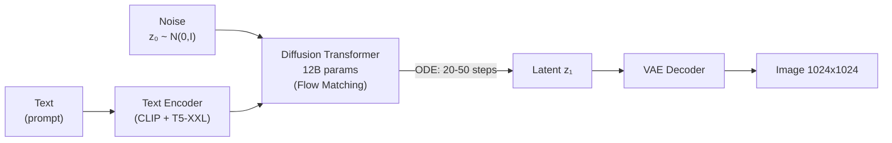

## Flow Matching

**Flow Matching**[^1] is a generative framework that trains a velocity field $v_\theta$ to transform a simple distribution (Gaussian noise $p_0$) into a complex data distribution ($p_1$) along a continuous trajectory in time.

Compared to diffusion models (DDPM), Flow Matching has **straighter** trajectories, requiring **fewer integration steps** at inference, while being simpler to train.

<iframe width="100%" height="400" src="https://www.youtube.com/embed/7NNxK3CqaDk" title="Flow Matching for Generative Modeling" frameborder="0" allow="accelerometer; autoplay; clipboard-write; encrypted-media; gyroscope; picture-in-picture; web-share" allowfullscreen style="border-radius:8px;"></iframe>

---

## Intuition: Moving Particles

Imagine you have particles scattered according to a Gaussian $p_0 = \mathcal{N}(0, I)$. You want to move them so that, by time $t=1$, they are distributed like your training data $p_1$.

Flow Matching learns a vector field $v_\theta(x, t)$ that "pushes" each particle in the right direction at every instant $t \in [0, 1]$.

<div id="flow-viz" style="background:#0d1117;border-radius:12px;padding:1.5rem;margin:2rem 0;">
<canvas id="flow-canvas" style="width:100%;display:block;border-radius:8px;"></canvas>
<div style="display:flex;gap:1rem;justify-content:center;margin-top:1rem;flex-wrap:wrap;">
  <button id="flow-btn" onclick="toggleFlow()" style="padding:6px 24px;background:#f0883e;color:#0d1117;border:none;border-radius:6px;cursor:pointer;font-weight:bold;">&#9654; Animate</button>
  <button onclick="resetFlow()" style="padding:6px 20px;background:#21262d;color:#c9d1d9;border:1px solid #30363d;border-radius:6px;cursor:pointer;">&#8635; Reset</button>
  <label style="color:#8b949e;font-size:.85rem;line-height:2.2;">
    t = <span id="t-val" style="color:#f0883e;font-weight:bold;">0.00</span>
  </label>
</div>
</div>

<script>
(function() {
  const canvas = document.getElementById('flow-canvas');
  const ctx = canvas.getContext('2d');
  let animId = null, t = 0, running = false;
  const N = 120;
  const sources = [], targets = [];

  function randn() {
    let u=0,v=0;
    while(!u) u=Math.random();
    while(!v) v=Math.random();
    return Math.sqrt(-2*Math.log(u))*Math.cos(2*Math.PI*v);
  }

  function initParticles() {
    sources.length = 0; targets.length = 0;
    for (let i = 0; i < N; i++) {
      sources.push([randn()*0.7, randn()*0.7]);
      const moon = Math.random() > 0.5 ? 0 : 1;
      const angle = Math.random() * Math.PI;
      const r = 1.0 + randn() * 0.12;
      targets.push([
        moon === 0 ? r*Math.cos(angle) - 0.5 : -r*Math.cos(angle) + 0.5,
        moon === 0 ? r*Math.sin(angle)*0.7 - 0.3 : -r*Math.sin(angle)*0.7 + 0.3
      ]);
    }
    t = 0;
    document.getElementById('t-val').textContent = '0.00';
  }

  function lerp(a, b, t) { return [a[0]*(1-t)+b[0]*t, a[1]*(1-t)+b[1]*t]; }

  function draw() {
    const W = canvas.parentElement.offsetWidth - 48;
    const H = Math.min(320, W * 0.5);
    canvas.width = W; canvas.height = H;
    canvas.style.height = H + 'px';
    ctx.fillStyle = '#161b22'; ctx.fillRect(0,0,W,H);
    const cx = W/2, cy = H/2, scale = Math.min(W,H)/4.5;

    ctx.strokeStyle = '#21262d'; ctx.lineWidth = 0.5;
    for (let i=-4;i<=4;i++) {
      ctx.beginPath(); ctx.moveTo(cx+i*scale/2,0); ctx.lineTo(cx+i*scale/2,H); ctx.stroke();
      ctx.beginPath(); ctx.moveTo(0,cy+i*scale/2); ctx.lineTo(W,cy+i*scale/2); ctx.stroke();
    }

    sources.forEach((s,i) => {
      const tg = targets[i];
      ctx.strokeStyle = 'rgba(255,255,255,0.04)'; ctx.lineWidth = 0.8;
      ctx.beginPath();
      ctx.moveTo(cx+s[0]*scale, cy-s[1]*scale);
      ctx.lineTo(cx+tg[0]*scale, cy-tg[1]*scale); ctx.stroke();
    });

    sources.forEach((s, i) => {
      const x0 = cx + s[0]*scale, y0 = cy - s[1]*scale;
      ctx.fillStyle = 'rgba(88,166,255,' + (0.25*(1-t)) + ')';
      ctx.beginPath(); ctx.arc(x0, y0, 3, 0, 2*Math.PI); ctx.fill();
    });

    targets.forEach(tg => {
      const x1 = cx + tg[0]*scale, y1 = cy - tg[1]*scale;
      ctx.fillStyle = 'rgba(240,136,62,' + (0.25*t) + ')';
      ctx.beginPath(); ctx.arc(x1, y1, 3, 0, 2*Math.PI); ctx.fill();
    });

    sources.forEach((s, i) => {
      const tg = targets[i];
      const pos = lerp(s, tg, t);
      const vel = [tg[0]-s[0], tg[1]-s[1]];
      const x = cx + pos[0]*scale, y = cy - pos[1]*scale;
      const hue = 210 + t * 60;
      ctx.fillStyle = 'hsl('+hue+',80%,60%)';
      ctx.beginPath(); ctx.arc(x, y, 4, 0, 2*Math.PI); ctx.fill();
      if (i % 4 === 0) {
        const mag = Math.sqrt(vel[0]**2+vel[1]**2);
        if (mag > 0) {
          const nx = vel[0]/mag, ny = vel[1]/mag;
          ctx.strokeStyle = 'rgba(255,255,255,0.25)'; ctx.lineWidth = 1;
          ctx.beginPath(); ctx.moveTo(x,y); ctx.lineTo(x+nx*12, y-ny*12); ctx.stroke();
        }
      }
    });

    ctx.fillStyle = '#58a6ff'; ctx.font = 'bold 11px Inter,sans-serif'; ctx.textAlign='left';
    ctx.fillText('p₀ (Gaussian)', 8, 18);
    ctx.fillStyle = '#f0883e'; ctx.fillText('p₁ (Two Moons)', 8, 32);
    ctx.fillStyle = '#8b949e'; ctx.font='10px monospace'; ctx.textAlign='right';
    ctx.fillText('t = ' + t.toFixed(2), W-8, 18);
  }

  window.toggleFlow = function() {
    running = !running;
    document.getElementById('flow-btn').textContent = running ? '⏸ Pause' : '▶ Animate';
    document.getElementById('flow-btn').style.background = running ? '#3fb950' : '#f0883e';
    if (running) animate();
    else cancelAnimationFrame(animId);
  };

  window.resetFlow = function() {
    running = false; cancelAnimationFrame(animId);
    document.getElementById('flow-btn').textContent = '▶ Animate';
    document.getElementById('flow-btn').style.background = '#f0883e';
    initParticles(); draw();
  };

  function animate() {
    t = Math.min(1, t + 0.005);
    document.getElementById('t-val').textContent = t.toFixed(2);
    draw();
    if (t < 1 && running) animId = requestAnimationFrame(animate);
    else { running = false; document.getElementById('flow-btn').textContent = '▶ Animate'; }
  }

  initParticles(); draw();
  window.addEventListener('resize', draw);
})();
</script>

---

## Mathematical Formulation

**The goal** is to learn a velocity field $v_\theta : \mathbb{R}^d \times [0,1] \to \mathbb{R}^d$ such that integrating the ODE:

$$
\frac{dx}{dt} = v_\theta(x, t), \quad x_0 \sim p_0
$$

produces $x_1 \sim p_1$.

### Conditional Flow Matching (CFM)

Given a **conditional path** $x_t = (1-t)x_0 + t x_1$ (linear interpolation — "Optimal Transport path"), the conditional velocity field is simply:

$$
u_t(x \mid x_0, x_1) = x_1 - x_0
$$

The **CFM** loss:

$$
\mathcal{L}_{\text{CFM}} = \mathbb{E}_{t, p(x_0), p(x_1)} \left[ \left\| v_\theta(x_t, t) - (x_1 - x_0) \right\|^2 \right]
$$

where $x_t = (1-t)x_0 + t x_1$. The loss is simply the MSE between the predicted field and the linear interpolation direction — no complex noise schedule.

---

## Flow Matching vs. Diffusion

| Aspect | DDPM | Flow Matching |
|---------|------|---------------|
| Trajectory | Curved (incremental noise) | Straight (OT path) |
| Inference steps | 50–1000 | 10–50 |
| Loss | Noise prediction $\epsilon$ | Velocity prediction $v$ |
| Schedule | Complex $\beta_t$ | Uniform $t \in [0,1]$ |
| Inference speed | Slower | **2–10× faster** |

---

## FLUX.1 — State of the Art (2024)

**FLUX.1**[^2] (Black Forest Labs) uses Flow Matching with **Diffusion Transformers (DiT)** — replacing the U-Net with pure Transformer blocks:



- 12B parameters (FLUX.1-dev, open-source)
- Supports multiple aspect ratios natively
- Superior quality to SDXL and SD3 on benchmarks

---

## Inference: Solving the ODE

```python
import torch

def sample_flow_matching(model, n_samples, n_steps=50, device='cuda'):
    dt = 1.0 / n_steps
    x = torch.randn(n_samples, *data_shape, device=device)  # z0 ~ N(0,I)
    
    for i in range(n_steps):
        t = torch.full((n_samples,), i * dt, device=device)
        v = model(x, t)          # predicted velocity field
        x = x + dt * v           # simple Euler integration
    
    return x  # z1 ~ p_data

# With Heun solver (2nd order, better quality):
def sample_heun(model, n_samples, n_steps=20, device='cuda'):
    dt = 1.0 / n_steps
    x = torch.randn(n_samples, *data_shape, device=device)
    for i in range(n_steps):
        t = torch.full((n_samples,), i*dt, device=device)
        v1 = model(x, t)
        x_pred = x + dt * v1
        t2 = torch.full((n_samples,), (i+1)*dt, device=device)
        v2 = model(x_pred, t2)
        x = x + dt * (v1 + v2) / 2  # Heun average
    return x
```

---

[^1]: Lipman, Y. et al. (2022). [Flow Matching for Generative Modeling](https://arxiv.org/abs/2210.02747){:target="_blank"}.
[^2]: Black Forest Labs. (2024). [FLUX.1: State-of-the-art text-to-image generation](https://github.com/black-forest-labs/flux){:target="_blank"}.
[^3]: Liu, X. et al. (2022). [Flow Straight and Fast: Rectified Flow](https://arxiv.org/abs/2209.03003){:target="_blank"}.


---

--8<-- "docs/2026.2/classes/flow-matching/quiz.md"
