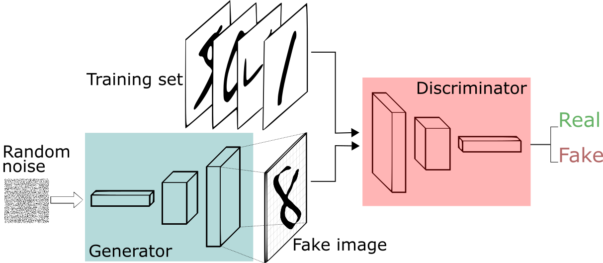
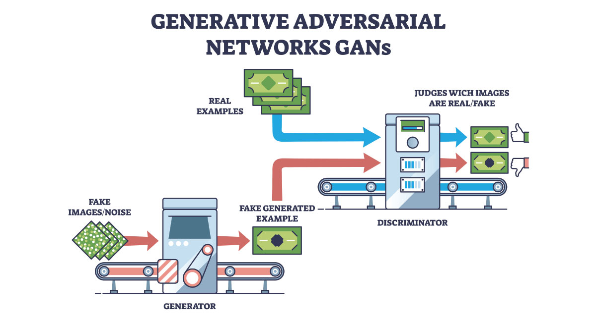
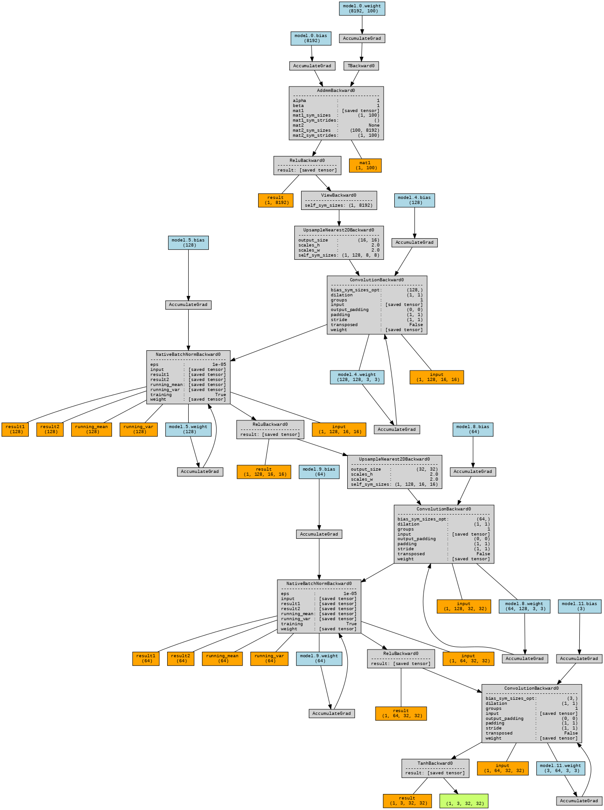
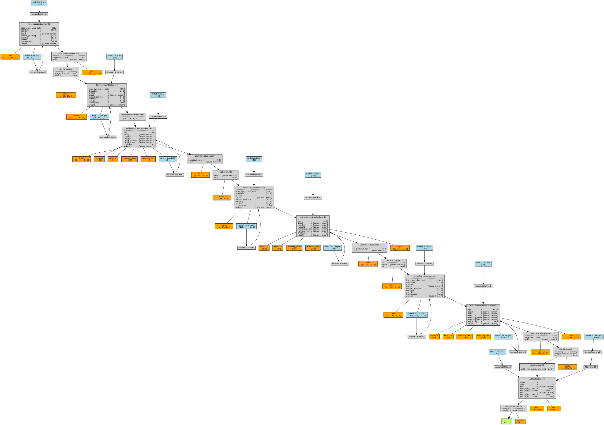

Redes Adversariais Generativas (GANs) ajudam máquinas a criar dados novos e realistas aprendendo a partir de exemplos existentes. Introduzidas por [Ian Goodfellow e sua equipe em 2014](https://arxiv.org/abs/1406.2661){:target="_blank"}, elas transformaram a forma como computadores geram imagens, vídeos, música e muito mais. Ao contrário de modelos tradicionais que apenas reconhecem ou classificam dados, as GANs criam conteúdo inteiramente novo que se assemelha de perto a dados do mundo real.[^1]

GANs consistem em dois componentes principais: **o Gerador** e **o Discriminador**. O Gerador cria novas instâncias de dados, enquanto o Discriminador as avalia quanto à autenticidade.

/// caption
Rede Adversarial Generativa (GAN) com seus dois componentes: o Gerador e o Discriminador. *Fonte da imagem: [[^4]](https://sthalles.github.io/intro-to-gans/){:target="_blank"}*
///

O objetivo do Gerador é produzir dados indistinguíveis dos dados reais, enquanto o Discriminador visa identificar corretamente se os dados são reais ou gerados. Isso cria uma dinâmica onde ambos os componentes melhoram ao longo do tempo.

/// caption
Ilustração de como as GANs funcionam. O Gerador cria dados falsos a partir de ruído aleatório, e o Discriminador avalia dados reais e falsos. *Fonte da imagem: [Caltech](https://pg-p.ctme.caltech.edu/blog/ai-ml/what-is-generative-adversarial-network-types){:target="_blank"}*
///

## Gerador

O Gerador é uma rede neural profunda que recebe ruído aleatório como entrada e gera dados que imitam a distribuição dos dados reais. Ele é treinado para minimizar a diferença entre a distribuição dos dados gerados e a distribuição dos dados reais, frequentemente usando medidas como a [Divergência de Kullback–Leibler](https://en.wikipedia.org/wiki/Kullback%E2%80%93Leibler_divergence){:target="_blank"}.[^2]

**Função de Perda do Gerador**:

$$
L_G = -\mathbb{E}_{z \sim p_z(z)}[\log(D(G(z)))]
$$

Onde:

- \( L_G \) é a perda para o Gerador.
- \( z \) é o vetor de ruído de entrada amostrado de uma distribuição a priori \( p_z(z) \).
- \( G(z) \) é o dado gerado a partir do vetor de ruído.
- \( D(G(z)) \) é a saída do Discriminador para o dado gerado.

O gerador busca maximizar \( D(G(z)) \) — quer que o discriminador classifique seus dados falsos como reais (probabilidade próxima de 1).

## Discriminador

O Discriminador é outra rede neural profunda que recebe tanto dados reais quanto gerados como entrada e tenta distinguir entre os dois. Ele produz uma pontuação de probabilidade indicando se os dados de entrada são reais (do conjunto de treinamento) ou falsos (gerados pelo Gerador).

**Função de Perda do Discriminador**:

$$
L_D = -\mathbb{E}_{x \sim p_{data}(x)}[\log(D(x))] - \mathbb{E}_{z \sim p_z(z)}[\log(1 - D(G(z)))]
$$

Onde:

- \( L_D \) é a perda para o Discriminador.
- \( x \) é uma amostra de dado real da distribuição verdadeira \( p_{data}(x) \).
- \( D(x) \) é a saída do Discriminador para o dado real.
- \( D(G(z)) \) é a saída do Discriminador para o dado gerado.

## Processo de Treinamento

O treinamento de GANs envolve um processo iterativo onde tanto o Gerador quanto o Discriminador são atualizados em turnos:

1. **Primeira Jogada do Gerador**: O gerador transforma um vetor de ruído aleatório em uma amostra de dados falsa.

2. **Turno do Discriminador**: O discriminador recebe dados reais e dados falsos, e deve classificar cada entrada como real ou falsa.

3. **Aprendizado Adversarial**:
    - Se o discriminador identifica corretamente dados reais e falsos, ele é recompensado.
    - Se o gerador engana o discriminador fazendo-o acreditar que dados falsos são reais, o gerador é recompensado.

4. **Melhoria do Gerador**: O gerador atualiza seus pesos com base no feedback do discriminador.

5. **Adaptação do Discriminador**: O discriminador também atualiza seus pesos para se tornar melhor em distinguir dados reais dos cada vez mais realistas dados falsos.

**Função de Perda MinMax**:

$$
\min_G \max_D V(D, G) = \mathbb{E}_{x \sim p_{data}(x)}[\log(D(x))] + \mathbb{E}_{z \sim p_z(z)}[\log(1 - D(G(z)))]
$$

## Variantes de GANs

| Variante | Inovação | Destaque Matemático | Descrição | Aplicações |
|---------|------------|----------------|-------------|--------------|
| DCGAN (Deep Convolutional GAN) | Usa camadas convolucionais no Gerador e Discriminador | CNNs | Introduz camadas convolucionais para melhor capturar hierarquias espaciais. | Geração de imagens, transferência de estilo |
| WGAN (Wasserstein GAN) | Usa distância de Wasserstein como métrica de perda | Distância de Wasserstein | Melhora a estabilidade do treinamento e aborda o colapso de modo. | Geração de imagens |
| CGAN (Conditional GAN) | Condiciona o processo de geração em informações adicionais | Probabilidade Condicional | Permite a geração de dados condicionados a atributos ou rótulos específicos. | Tradução imagem-para-imagem |
| StyleGAN | Arquitetura baseada em estilo | Transferência de Estilo | Permite controle sobre diferentes níveis de detalhe nas imagens geradas. | Síntese de imagens de alta resolução |
| CycleGAN | Usa perda de consistência cíclica para tradução imagem-para-imagem não pareada | Perda de Consistência Cíclica | Permite tradução imagem-para-imagem sem dados de treinamento pareados. | Transferência de estilo, adaptação de domínio |

## Desafios no Treinamento de GANs

| Desafio | Descrição |
|-----------|-------------|
| Colapso de Modo | O gerador pode produzir uma variedade limitada de saídas, levando à falta de diversidade nos dados gerados.[^6] |
| Instabilidade de Treinamento | A natureza adversarial das GANs pode levar a dinâmicas de treinamento instáveis. |
| Métricas de Avaliação | Avaliar a qualidade dos dados gerados pode ser subjetivo e desafiador. |
| Ajuste de Hiperparâmetros | Encontrar os hiperparâmetros corretos é crucial, mas pode ser demorado e complexo. |

## Aplicações de GANs

| Aplicação | Descrição |
|-------------|-------------|
| Geração de Imagens | GANs podem criar imagens de alta qualidade indistinguíveis de fotos reais. |
| Aumento de Dados | GANs podem gerar dados de treinamento adicionais para melhorar o desempenho de modelos. |
| Transferência de Estilo | GANs podem aplicar o estilo de uma imagem a outra, possibilitando transformações artísticas. |
| Super-Resolução | GANs podem aumentar a resolução de imagens, tornando-as mais nítidas e detalhadas. |
| Síntese Texto-para-Imagem | GANs podem gerar imagens a partir de descrições textuais. |
| Detecção de Anomalias | GANs podem ser usadas para identificar anomalias em dados aprendendo a distribuição normal. |

## Implementações

### CIFAR-10

??? example "CIFAR-10"

    Abaixo está um exemplo básico de como criar e treinar uma GAN no dataset CIFAR-10.

    --8<-- "docs/2026.2/classes/generative-adversarial-networks/gan_example_cifar_10.md"

    ??? info "Visualização da Arquitetura"

        === "Gerador"

            

        === "Discriminador"

            

[^1]: Geeks for Geeks: [Generative Adversarial Network (GAN)](https://www.geeksforgeeks.org/deep-learning/generative-adversarial-network-gan/){target='_blank'}

[^2]: [Kullback–Leibler Divergence](https://en.wikipedia.org/wiki/Kullback%E2%80%93Leibler_divergence){target='_blank'}

[^3]: [Wasserstein Distance](https://en.wikipedia.org/wiki/Wasserstein_metric){target='_blank'}

[^4]: [Intro to GANs](https://sthalles.github.io/intro-to-gans/){:target='_blank'} por Sthelles Silva.

[^5]: Caltech - [What is Generative Adversarial Network?](https://pg-p.ctme.caltech.edu/blog/ai-ml/what-is-generative-adversarial-network-types){target='_blank'}

[^6]: [Mode Collapse](https://en.wikipedia.org/wiki/Mode_collapse){target='_blank'}

---

--8<-- "docs/2026.2/classes/generative-adversarial-networks/quiz.pt.md"
