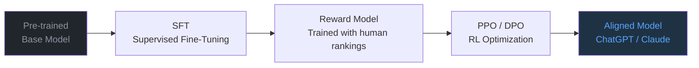

## Large Language Models (LLMs)

Large Language Models (LLMs) are Transformer neural networks trained at unprecedented scales — billions of parameters, trillions of tokens — with the goal of predicting the next token. This seemingly simple task, repeated over enough data, leads to **emergent capabilities**: reasoning, arithmetic, programming, and much more.

---

## The Scale That Changes Everything

<div id="scale-viz" style="background:#0d1117;border-radius:12px;padding:1.5rem;margin:2rem 0;overflow:hidden;">
<canvas id="scale-canvas" style="width:100%;display:block;"></canvas>
</div>

<script>
(function() {
  const canvas = document.getElementById('scale-canvas');
  const ctx = canvas.getContext('2d');

  // Timeline of key LLMs: [year, params_billions, label, color]
  const models = [
    [2018, 0.117, "GPT-1\n(117M)", '#484f58'],
    [2019, 1.5, "GPT-2\n(1.5B)", '#58a6ff'],
    [2020, 175, "GPT-3\n(175B)", '#3fb950'],
    [2021, 0.7, "BERT-Large\n(340M)", '#8b949e'],
    [2022, 540, "PaLM\n(540B)", '#d29922'],
    [2023, 70, "LLaMA-2\n(70B)", '#f0883e'],
    [2024, 8, "LLaMA-3.1\n(8B)", '#bc8cff'],
    [2024, 405, "LLaMA-3.1\n(405B)", '#bc8cff'],
    [2025, 671, "DeepSeek-V3\n(671B MoE)", '#ff7b72'],
  ];

  function draw() {
    const W = canvas.parentElement.offsetWidth - 48;
    const H = 280;
    canvas.width = W; canvas.height = H;
    canvas.style.height = H + 'px';
    ctx.fillStyle = '#0d1117'; ctx.fillRect(0,0,W,H);

    const padL = 50, padR = 20, padT = 20, padB = 40;
    const plotW = W - padL - padR;
    const plotH = H - padT - padB;

    const minYear = 2017, maxYear = 2025.5;
    const minLogP = Math.log10(0.05), maxLogP = Math.log10(1000);

    function xScale(year) { return padL + (year - minYear) / (maxYear - minYear) * plotW; }
    function yScale(params) { return padT + plotH - (Math.log10(params) - minLogP) / (maxLogP - minLogP) * plotH; }

    // Grid lines
    [0.1, 1, 10, 100, 1000].forEach(p => {
      const y = yScale(p);
      ctx.strokeStyle = '#21262d'; ctx.lineWidth = 1; ctx.setLineDash([3,3]);
      ctx.beginPath(); ctx.moveTo(padL, y); ctx.lineTo(W - padR, y); ctx.stroke();
      ctx.setLineDash([]);
      ctx.fillStyle = '#484f58'; ctx.font = '9px monospace'; ctx.textAlign = 'right'; ctx.textBaseline = 'middle';
      ctx.fillText(p >= 1 ? p+'B' : (p*1000)+'M', padL - 4, y);
    });

    [2018,2019,2020,2021,2022,2023,2024,2025].forEach(yr => {
      const x = xScale(yr);
      ctx.strokeStyle = '#21262d'; ctx.lineWidth = 1;
      ctx.beginPath(); ctx.moveTo(x, padT); ctx.lineTo(x, H - padB); ctx.stroke();
      ctx.fillStyle = '#484f58'; ctx.font = '9px monospace'; ctx.textAlign = 'center'; ctx.textBaseline = 'top';
      ctx.fillText(yr, x, H - padB + 4);
    });

    // Axis labels
    ctx.fillStyle = '#8b949e'; ctx.font = '10px Inter,sans-serif'; ctx.textAlign = 'center';
    ctx.fillText('Year', W/2, H - 6);
    ctx.save(); ctx.translate(12, H/2); ctx.rotate(-Math.PI/2);
    ctx.fillText('Parameters (log)', 0, 0);
    ctx.restore();

    // Plot points
    models.forEach(([year, params, label, color]) => {
      const x = xScale(year);
      const y = yScale(params);
      const r = Math.max(5, Math.min(18, Math.log10(params) * 5 + 5));

      ctx.fillStyle = color + '44';
      ctx.beginPath(); ctx.arc(x, y, r, 0, 2*Math.PI); ctx.fill();
      ctx.fillStyle = color; ctx.strokeStyle = color; ctx.lineWidth = 2;
      ctx.beginPath(); ctx.arc(x, y, r * 0.5, 0, 2*Math.PI); ctx.fill();

      ctx.fillStyle = color; ctx.font = 'bold 8px Inter,sans-serif'; ctx.textAlign = 'center';
      const lines = label.split('\n');
      const labelY = y < H/2 ? y + r + 10 : y - r - 14;
      lines.forEach((l, li) => ctx.fillText(l, x, labelY + li * 10));
    });

    // Trend line (rough scaling curve)
    ctx.beginPath();
    ctx.strokeStyle = '#ffffff22'; ctx.lineWidth = 1.5; ctx.setLineDash([5,4]);
    ctx.moveTo(xScale(2018), yScale(0.117));
    ctx.lineTo(xScale(2025), yScale(671));
    ctx.stroke(); ctx.setLineDash([]);
    ctx.fillStyle = '#ffffff44'; ctx.font = 'italic 9px Inter,sans-serif'; ctx.textAlign = 'left';
    ctx.fillText('scaling trend', xScale(2020.5), yScale(10) - 8);
  }

  draw(); window.addEventListener('resize', draw);
})();
</script>

---

## Pre-Training: Next Token Prediction

LLMs are pre-trained with **autoregressive language modeling**: given text $x_1, x_2, \ldots, x_T$, the cross-entropy loss is minimized:

$$
\mathcal{L} = -\sum_{t=1}^{T} \log p_\theta(x_t \mid x_1, \ldots, x_{t-1})
$$

This is a **self-supervised learning** task — the labels are the text tokens themselves, so data is extremely abundant (practically the entire internet).

The model learns a probability distribution over vocabularies of 30k–100k tokens. At inference, it samples iteratively:

$$
x_{t+1} \sim p_\theta(\cdot \mid x_1, \ldots, x_t)
$$

---

## Tokenization

Before training, text is converted to **tokens** by a *tokenizer*. The modern standard is **Byte Pair Encoding (BPE)**:

1. Starts with individual characters
2. Iterates: merges the most frequent pairs
3. Results in a subword vocabulary

```
"tokenization" → ["token", "iza", "tion"]   (BPE)
"ChatGPT"      → ["Chat", "G", "PT"]
"hello world"  → ["hello", " world"]
```

This allows compact vocabularies that handle rare words and multiple languages without a separate tokenizer per language.

---

## Emergent Capabilities

Upon crossing certain scale thresholds, LLMs exhibit capabilities that **do not exist in smaller models** — they appear to emerge non-linearly:

<div style="display:grid;grid-template-columns:1fr 1fr;gap:1rem;margin:1.5rem 0;">

<div style="background:#0d1117;border-radius:8px;padding:1rem;border:1px solid #30363d;">
<div style="color:#f0883e;font-weight:bold;margin-bottom:.5rem;">🧮 Few-Shot Learning</div>
<div style="color:#c9d1d9;font-size:.85rem;">Learns tasks from 3-5 in-context examples, without weight updates.</div>
<div style="background:#161b22;border-radius:4px;padding:.6rem;margin-top:.5rem;font-family:monospace;font-size:.75rem;color:#8b949e;">
Translate to French:<br>
English: "cat" → French: "chat"<br>
English: "dog" → French: "chien"<br>
English: "bird" → French: <span style="color:#3fb950;">"oiseau"</span>
</div>
</div>

<div style="background:#0d1117;border-radius:8px;padding:1rem;border:1px solid #30363d;">
<div style="color:#58a6ff;font-weight:bold;margin-bottom:.5rem;">🔗 Chain-of-Thought</div>
<div style="color:#c9d1d9;font-size:.85rem;">Generates step-by-step reasoning before answering, improving accuracy in math and logic.</div>
<div style="background:#161b22;border-radius:4px;padding:.6rem;margin-top:.5rem;font-family:monospace;font-size:.75rem;color:#8b949e;">
Q: If x+3=7, what is 2x?<br>
A: First, x=7-3=4.<br>
Then 2x=2×4=<span style="color:#58a6ff;">8</span>.
</div>
</div>

<div style="background:#0d1117;border-radius:8px;padding:1rem;border:1px solid #30363d;">
<div style="color:#3fb950;font-weight:bold;margin-bottom:.5rem;">💻 Code Generation</div>
<div style="color:#c9d1d9;font-size:.85rem;">Writes, explains, and debugs code in dozens of programming languages.</div>
</div>

<div style="background:#0d1117;border-radius:8px;padding:1rem;border:1px solid #30363d;">
<div style="color:#bc8cff;font-weight:bold;margin-bottom:.5rem;">🌍 Multilingual</div>
<div style="color:#c9d1d9;font-size:.85rem;">Translates, reasons, and generates in multiple languages without language-specific training.</div>
</div>

</div>

---

## The RLHF Pipeline

Base models predict text, but not necessarily helpful or safe text. **RLHF** (Reinforcement Learning from Human Feedback)[^3] adapts the model to human preferences:



1. **SFT**: Supervised fine-tuning on high-quality demonstrations
2. **Reward Model**: neural network that learns to rank responses according to human preference
3. **PPO/DPO**: RL optimization using the Reward Model as signal

**DPO** (Direct Preference Optimization) simplifies this: no explicit RL needed, trains directly on preferences:

$$
\mathcal{L}_{\text{DPO}} = -\mathbb{E}\left[\log \sigma\!\left(\beta \log \frac{\pi_\theta(y_w|x)}{\pi_{\text{ref}}(y_w|x)} - \beta \log \frac{\pi_\theta(y_l|x)}{\pi_{\text{ref}}(y_l|x)}\right)\right]
$$

where $y_w$ is the preferred response and $y_l$ the rejected one.

---

## Mixture of Experts (MoE)

To scale beyond dense models, modern LLMs use **Mixture of Experts**[^4]: each FFN layer is replaced by $E$ independent "experts", with a router that activates only $k$ of them per token:

$$
\text{MoE}(x) = \sum_{i \in \text{Top-}k(G(x))} G(x)_i \cdot E_i(x)
$$

where $G(x) = \text{Softmax}(W_g x)$ are the router weights.

**Advantage**: a model with $E$ experts has $E \times$ more parameters, but each forward pass activates only $k/E$ of them → **same computational efficiency with more capacity**.

| Model | Total Parameters | Active Parameters | Experts |
|--------|---|----|---|
| Mixtral 8×7B | 46.7B | 12.9B (28%) | 8, top-2 |
| DeepSeek-V3 | 671B | 37B (5.5%) | 256, top-8 |
| GPT-4 (speculated) | ~1.8T | ~110B | ~16 experts |

---

## Advanced Prompting

LLM behavior is strongly influenced by the **prompt**:

| Technique | Description | When to use |
|---------|-----------|-------------|
| **Zero-shot** | Direct instruction without examples | Simple tasks, large models |
| **Few-shot** | 3-5 input→output examples | Specific format, new tasks |
| **Chain-of-Thought** | Ask "let's think step by step" | Math, logic, reasoning |
| **System Prompt** | Defines model role/persona | Specialized assistants |
| **RAG** | Retrieves documents before generating | Up-to-date knowledge, factuality |
| **Tool Use** | Model calls external functions/APIs | Calculation, search, actions in the world |

---

## Challenges and Limitations

<div style="display:grid;grid-template-columns:1fr 1fr 1fr;gap:1rem;margin:1.5rem 0;">

<div style="background:#3d1a1a;border-left:3px solid #ff7b72;border-radius:8px;padding:.8rem;">
<strong style="color:#ff7b72;">Hallucination</strong><br>
<span style="color:#c9d1d9;font-size:.85rem;">LLMs fabricate facts with confidence. RAG and grounding partially mitigate this.</span>
</div>

<div style="background:#1a2d1a;border-left:3px solid #3fb950;border-radius:8px;padding:.8rem;">
<strong style="color:#3fb950;">Knowledge Cutoff</strong><br>
<span style="color:#c9d1d9;font-size:.85rem;">Training data has a cutoff date. RAG, browsing, and tool use compensate.</span>
</div>

<div style="background:#1a1a3d;border-left:3px solid #58a6ff;border-radius:8px;padding:.8rem;">
<strong style="color:#58a6ff;">Computational Cost</strong><br>
<span style="color:#c9d1d9;font-size:.85rem;">Inference is expensive. Quantization, distillation, and caching reduce costs.</span>
</div>

</div>

---

## Model Landscape (2025)

| Family | Organization | Open-source? | Specialty |
|---------|-------------|:---:|-----------|
| GPT-4o / o3 | OpenAI | ❌ | General SOTA, reasoning |
| Claude 3.7 | Anthropic | ❌ | Long context window, safety |
| Gemini 2.5 | Google | ❌ | Multimodal, Google integration |
| LLaMA 3.3 | Meta | ✅ | Base for fine-tuning |
| Mistral / Mixtral | Mistral AI | ✅ | Efficiency, MoE |
| DeepSeek-V3/R1 | DeepSeek | ✅ | Reasoning, code |
| Qwen 2.5 | Alibaba | ✅ | Multilingual |
| Gemma 3 | Google | ✅ | Small and efficient |

---

[^1]: Brown, T. et al. (2020). [Language Models are Few-Shot Learners (GPT-3)](https://arxiv.org/abs/2005.14165){:target="_blank"}.
[^2]: Wei, J. et al. (2022). [Emergent Abilities of Large Language Models](https://arxiv.org/abs/2206.07682){:target="_blank"}.
[^3]: Ouyang, L. et al. (2022). [Training language models to follow instructions with human feedback (InstructGPT)](https://arxiv.org/abs/2203.02155){:target="_blank"}.
[^4]: Shazeer, N. et al. (2017). [Outrageously Large Neural Networks: The Sparsely-Gated MoE](https://arxiv.org/abs/1701.06538){:target="_blank"}.
[^5]: Rafailov, R. et al. (2023). [Direct Preference Optimization](https://arxiv.org/abs/2305.18290){:target="_blank"}.


---

--8<-- "docs/2026.2/classes/llms/quiz.md"
