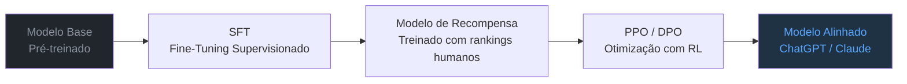

## Grandes Modelos de Linguagem (LLMs)

Grandes Modelos de Linguagem (*Large Language Models*, LLMs) são redes neurais Transformer treinadas em escalas sem precedentes — bilhões de parâmetros, trilhões de tokens — com o objetivo de prever o próximo token. Essa tarefa aparentemente simples, repetida em dados suficientes, leva a **capacidades emergentes**: raciocínio, aritmética, programação e muito mais.

---

## A Escala que Muda Tudo

<div id="scale-viz" style="background:#0d1117;border-radius:12px;padding:1.5rem;margin:2rem 0;overflow:hidden;">
<canvas id="scale-canvas" style="width:100%;display:block;"></canvas>
</div>

<script>
(function() {
  const canvas = document.getElementById('scale-canvas');
  const ctx = canvas.getContext('2d');

  const models = [
    [2018, 0.117, "GPT-1\n(117M)", '#484f58'],
    [2019, 1.5, "GPT-2\n(1.5B)", '#58a6ff'],
    [2020, 175, "GPT-3\n(175B)", '#3fb950'],
    [2021, 0.7, "BERT-Large\n(340M)", '#8b949e'],
    [2022, 540, "PaLM\n(540B)", '#d29922'],
    [2023, 70, "LLaMA-2\n(70B)", '#f0883e'],
    [2024, 8, "LLaMA-3.1\n(8B)", '#bc8cff'],
    [2024, 405, "LLaMA-3.1\n(405B)", '#bc8cff'],
    [2025, 671, "DeepSeek-V3\n(671B MoE)", '#ff7b72'],
  ];

  function draw() {
    const W = canvas.parentElement.offsetWidth - 48;
    const H = 280;
    canvas.width = W; canvas.height = H;
    canvas.style.height = H + 'px';
    ctx.fillStyle = '#0d1117'; ctx.fillRect(0,0,W,H);

    const padL = 50, padR = 20, padT = 20, padB = 40;
    const plotW = W - padL - padR;
    const plotH = H - padT - padB;
    const minYear = 2017, maxYear = 2025.5;
    const minLogP = Math.log10(0.05), maxLogP = Math.log10(1000);

    function xScale(year) { return padL + (year - minYear) / (maxYear - minYear) * plotW; }
    function yScale(params) { return padT + plotH - (Math.log10(params) - minLogP) / (maxLogP - minLogP) * plotH; }

    [0.1, 1, 10, 100, 1000].forEach(p => {
      const y = yScale(p);
      ctx.strokeStyle = '#21262d'; ctx.lineWidth = 1; ctx.setLineDash([3,3]);
      ctx.beginPath(); ctx.moveTo(padL, y); ctx.lineTo(W - padR, y); ctx.stroke();
      ctx.setLineDash([]);
      ctx.fillStyle = '#484f58'; ctx.font = '9px monospace'; ctx.textAlign = 'right'; ctx.textBaseline = 'middle';
      ctx.fillText(p >= 1 ? p+'B' : (p*1000)+'M', padL - 4, y);
    });

    [2018,2019,2020,2021,2022,2023,2024,2025].forEach(yr => {
      const x = xScale(yr);
      ctx.strokeStyle = '#21262d'; ctx.lineWidth = 1;
      ctx.beginPath(); ctx.moveTo(x, padT); ctx.lineTo(x, H - padB); ctx.stroke();
      ctx.fillStyle = '#484f58'; ctx.font = '9px monospace'; ctx.textAlign = 'center'; ctx.textBaseline = 'top';
      ctx.fillText(yr, x, H - padB + 4);
    });

    ctx.fillStyle = '#8b949e'; ctx.font = '10px Inter,sans-serif'; ctx.textAlign = 'center';
    ctx.fillText('Ano', W/2, H - 6);
    ctx.save(); ctx.translate(12, H/2); ctx.rotate(-Math.PI/2);
    ctx.fillText('Parâmetros (log)', 0, 0);
    ctx.restore();

    models.forEach(([year, params, label, color]) => {
      const x = xScale(year);
      const y = yScale(params);
      const r = Math.max(5, Math.min(18, Math.log10(params) * 5 + 5));
      ctx.fillStyle = color + '44';
      ctx.beginPath(); ctx.arc(x, y, r, 0, 2*Math.PI); ctx.fill();
      ctx.fillStyle = color; ctx.strokeStyle = color; ctx.lineWidth = 2;
      ctx.beginPath(); ctx.arc(x, y, r * 0.5, 0, 2*Math.PI); ctx.fill();
      ctx.fillStyle = color; ctx.font = 'bold 8px Inter,sans-serif'; ctx.textAlign = 'center';
      const lines = label.split('\n');
      const labelY = y < H/2 ? y + r + 10 : y - r - 14;
      lines.forEach((l, li) => ctx.fillText(l, x, labelY + li * 10));
    });

    ctx.beginPath();
    ctx.strokeStyle = '#ffffff22'; ctx.lineWidth = 1.5; ctx.setLineDash([5,4]);
    ctx.moveTo(xScale(2018), yScale(0.117));
    ctx.lineTo(xScale(2025), yScale(671));
    ctx.stroke(); ctx.setLineDash([]);
    ctx.fillStyle = '#ffffff44'; ctx.font = 'italic 9px Inter,sans-serif'; ctx.textAlign = 'left';
    ctx.fillText('tendência de escala', xScale(2020.5), yScale(10) - 8);
  }

  draw(); window.addEventListener('resize', draw);
})();
</script>

---

## Pré-Treinamento: Predição do Próximo Token

LLMs são pré-treinados com **modelagem de linguagem autorregressiva**: dado o texto $x_1, x_2, \ldots, x_T$, minimiza-se a perda de cross-entropy:

$$
\mathcal{L} = -\sum_{t=1}^{T} \log p_\theta(x_t \mid x_1, \ldots, x_{t-1})
$$

Essa é uma tarefa de **aprendizado autossupervisionado** — os rótulos são os próprios tokens do texto, portanto os dados são extremamente abundantes (praticamente toda a internet).

O modelo aprende uma distribuição de probabilidade sobre vocabulários de 30k–100k tokens. Na inferência, amostra iterativamente:

$$
x_{t+1} \sim p_\theta(\cdot \mid x_1, \ldots, x_t)
$$

---

## Tokenização

Antes do treinamento, o texto é convertido em **tokens** por um *tokenizer*. O padrão moderno é o **Byte Pair Encoding (BPE)**:

1. Começa com caracteres individuais
2. Itera: une os pares mais frequentes
3. Resulta em vocabulário de subpalavras

```
"tokenização" → ["token", "iza", "ção"]   (BPE)
"ChatGPT"     → ["Chat", "G", "PT"]
"hello world" → ["hello", " world"]
```

Isso permite vocabulários compactos que lidam com palavras raras e múltiplos idiomas sem tokenizer separado por língua.

---

## Capacidades Emergentes

Ao cruzar certos limiares de escala, LLMs exibem capacidades que **não existem em modelos menores** — parecem emergir de forma não-linear:

<div style="display:grid;grid-template-columns:1fr 1fr;gap:1rem;margin:1.5rem 0;">

<div style="background:#0d1117;border-radius:8px;padding:1rem;border:1px solid #30363d;">
<div style="color:#f0883e;font-weight:bold;margin-bottom:.5rem;">🧮 Few-Shot Learning</div>
<div style="color:#c9d1d9;font-size:.85rem;">Aprende tarefas a partir de 3-5 exemplos no contexto, sem atualização de pesos.</div>
<div style="background:#161b22;border-radius:4px;padding:.6rem;margin-top:.5rem;font-family:monospace;font-size:.75rem;color:#8b949e;">
Traduza para o francês:<br>
Inglês: "cat" → Francês: "chat"<br>
Inglês: "dog" → Francês: "chien"<br>
Inglês: "bird" → Francês: <span style="color:#3fb950;">"oiseau"</span>
</div>
</div>

<div style="background:#0d1117;border-radius:8px;padding:1rem;border:1px solid #30363d;">
<div style="color:#58a6ff;font-weight:bold;margin-bottom:.5rem;">🔗 Chain-of-Thought</div>
<div style="color:#c9d1d9;font-size:.85rem;">Gera raciocínio passo a passo antes de responder, melhora a acurácia em matemática e lógica.</div>
<div style="background:#161b22;border-radius:4px;padding:.6rem;margin-top:.5rem;font-family:monospace;font-size:.75rem;color:#8b949e;">
Q: Se x+3=7, quanto é 2x?<br>
A: Primeiro, x=7-3=4.<br>
Então 2x=2×4=<span style="color:#58a6ff;">8</span>.
</div>
</div>

<div style="background:#0d1117;border-radius:8px;padding:1rem;border:1px solid #30363d;">
<div style="color:#3fb950;font-weight:bold;margin-bottom:.5rem;">💻 Geração de Código</div>
<div style="color:#c9d1d9;font-size:.85rem;">Escreve, explica e depura código em dezenas de linguagens de programação.</div>
</div>

<div style="background:#0d1117;border-radius:8px;padding:1rem;border:1px solid #30363d;">
<div style="color:#bc8cff;font-weight:bold;margin-bottom:.5rem;">🌍 Multilíngue</div>
<div style="color:#c9d1d9;font-size:.85rem;">Traduz, raciocina e gera em múltiplos idiomas sem treinamento específico por língua.</div>
</div>

</div>

---

## O Pipeline RLHF

Modelos base prevêem texto, mas não necessariamente de forma útil ou segura. O **RLHF** (Reinforcement Learning from Human Feedback)[^3] adapta o modelo às preferências humanas:



1. **SFT**: Fine-tuning supervisionado em demonstrações de alta qualidade
2. **Reward Model**: rede neural que aprende a ranquear respostas segundo preferência humana
3. **PPO/DPO**: otimização por RL usando o Reward Model como sinal

O **DPO** (Direct Preference Optimization) simplifica isso: não precisa de RL explícito, treina diretamente nas preferências:

$$
\mathcal{L}_{\text{DPO}} = -\mathbb{E}\left[\log \sigma\!\left(\beta \log \frac{\pi_\theta(y_w|x)}{\pi_{\text{ref}}(y_w|x)} - \beta \log \frac{\pi_\theta(y_l|x)}{\pi_{\text{ref}}(y_l|x)}\right)\right]
$$

onde $y_w$ é a resposta preferida e $y_l$ a rejeitada.

---

## Mixture of Experts (MoE)

Para escalar além de modelos densos, LLMs modernos usam **Mixture of Experts**[^4]: cada camada FFN é substituída por $E$ "especialistas" independentes, com um roteador que ativa apenas $k$ deles por token:

$$
\text{MoE}(x) = \sum_{i \in \text{Top-}k(G(x))} G(x)_i \cdot E_i(x)
$$

onde $G(x) = \text{Softmax}(W_g x)$ são os pesos do roteador.

**Vantagem**: um modelo com $E$ especialistas tem $E \times$ mais parâmetros, mas por forward pass ativa apenas $k/E$ deles → **mesma eficiência computacional com mais capacidade**.

| Modelo | Parâmetros Totais | Parâmetros Ativos | Especialistas |
|--------|---|----|---|
| Mixtral 8×7B | 46,7B | 12,9B (28%) | 8, top-2 |
| DeepSeek-V3 | 671B | 37B (5,5%) | 256, top-8 |
| GPT-4 (especulado) | ~1,8T | ~110B | ~16 especialistas |

---

## Prompting Avançado

O comportamento dos LLMs é fortemente influenciado pelo **prompt**:

| Técnica | Descrição | Quando usar |
|---------|-----------|-------------|
| **Zero-shot** | Instrução direta sem exemplos | Tarefas simples, modelos grandes |
| **Few-shot** | 3-5 exemplos entrada→saída | Formato específico, tarefas novas |
| **Chain-of-Thought** | Peça "vamos pensar passo a passo" | Matemática, lógica, raciocínio |
| **System Prompt** | Define papel/personagem do modelo | Assistentes especializados |
| **RAG** | Recupera documentos antes de gerar | Conhecimento atualizado, factualidade |
| **Tool Use** | Modelo chama funções/APIs externas | Cálculo, busca, ações no mundo |

---

## Desafios e Limitações

<div style="display:grid;grid-template-columns:1fr 1fr 1fr;gap:1rem;margin:1.5rem 0;">

<div style="background:#3d1a1a;border-left:3px solid #ff7b72;border-radius:8px;padding:.8rem;">
<strong style="color:#ff7b72;">Alucinação</strong><br>
<span style="color:#c9d1d9;font-size:.85rem;">LLMs inventam fatos com confiança. RAG e grounding mitigam parcialmente.</span>
</div>

<div style="background:#1a2d1a;border-left:3px solid #3fb950;border-radius:8px;padding:.8rem;">
<strong style="color:#3fb950;">Corte de Conhecimento</strong><br>
<span style="color:#c9d1d9;font-size:.85rem;">Dados de treinamento têm data de corte. RAG, navegação web e tool use compensam.</span>
</div>

<div style="background:#1a1a3d;border-left:3px solid #58a6ff;border-radius:8px;padding:.8rem;">
<strong style="color:#58a6ff;">Custo Computacional</strong><br>
<span style="color:#c9d1d9;font-size:.85rem;">Inferência é cara. Quantização, destilação e caching reduzem custos.</span>
</div>

</div>

---

## Panorama de Modelos (2025)

| Família | Organização | Open-source? | Especialidade |
|---------|-------------|:---:|-----------|
| GPT-4o / o3 | OpenAI | ❌ | SOTA geral, raciocínio |
| Claude 3.7 | Anthropic | ❌ | Janela de contexto longa, segurança |
| Gemini 2.5 | Google | ❌ | Multimodal, integração Google |
| LLaMA 3.3 | Meta | ✅ | Base para fine-tuning |
| Mistral / Mixtral | Mistral AI | ✅ | Eficiência, MoE |
| DeepSeek-V3/R1 | DeepSeek | ✅ | Raciocínio, código |
| Qwen 2.5 | Alibaba | ✅ | Multilíngue |
| Gemma 3 | Google | ✅ | Pequeno e eficiente |

---

[^1]: Brown, T. et al. (2020). [Language Models are Few-Shot Learners (GPT-3)](https://arxiv.org/abs/2005.14165){:target="_blank"}.
[^2]: Wei, J. et al. (2022). [Emergent Abilities of Large Language Models](https://arxiv.org/abs/2206.07682){:target="_blank"}.
[^3]: Ouyang, L. et al. (2022). [Training language models to follow instructions with human feedback (InstructGPT)](https://arxiv.org/abs/2203.02155){:target="_blank"}.
[^4]: Shazeer, N. et al. (2017). [Outrageously Large Neural Networks: The Sparsely-Gated MoE](https://arxiv.org/abs/1701.06538){:target="_blank"}.
[^5]: Rafailov, R. et al. (2023). [Direct Preference Optimization](https://arxiv.org/abs/2305.18290){:target="_blank"}.


---

--8<-- "docs/2026.2/classes/llms/quiz.pt.md"
