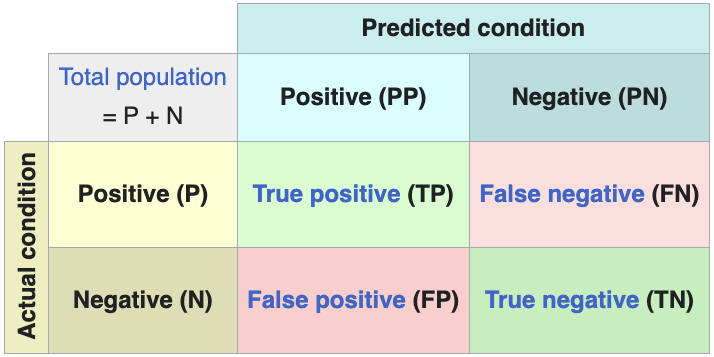

<style>
table.confusion-matrix {
    border-collapse: collapse;
    margin: 10px 0;
}
table.confusion-matrix td {
    border: 1px solid #ddd;
    padding: 8px;
    text-align: center;
    width: 50px;
    height: 50px;
}
table.confusion-matrix tr:nth-child(even){background-color: #f2f2f2;}
table.confusion-matrix tr:hover {background-color: #ddd;}
table.confusion-matrix th {
    padding-top: 12px;
    padding-bottom: 12px;
    text-align: center;
    background-color: #4CAF50;
    color: white;
}
</style>

Abaixo está uma lista detalhada de métricas comumente usadas para avaliar a acurácia e o desempenho de modelos de classificação e regressão em aprendizado de máquina, incluindo redes neurais. As métricas são categorizadas de acordo com sua aplicabilidade a tarefas de classificação ou regressão, com explicações e formulações matemáticas quando relevante.


## Métricas de Classificação

Tarefas de classificação envolvem a previsão de rótulos de classe discretos. As seguintes métricas avaliam a acurácia e eficácia desses modelos:

| Métrica | Propósito | Caso de Uso |
|--------|---------|----------|
| **Acurácia** <br> \( \displaystyle \frac{VP + VN}{VP + VN + FP + FN} \) | Mede a proporção de previsões corretas em todas as classes | Adequada para datasets balanceados, mas enganosa para desbalanceados |
| **Precisão** <br> \( \displaystyle \frac{VP}{VP + FP} \) | Avalia a proporção de previsões positivas que estão corretas | Importante quando falsos positivos são custosos (ex: detecção de spam) |
| **Recall (Sensibilidade)** <br> \( \displaystyle \frac{VP}{VP + FN} \) | Avalia a proporção de positivos reais corretamente identificados | Crítico quando falsos negativos são custosos (ex: detecção de doenças) |
| **F1-Score** <br> \( \displaystyle 2 \cdot \frac{\text{Precisão} \cdot \text{Recall}}{\text{Precisão} + \text{Recall}} \) | Média harmônica de precisão e recall, equilibrando ambas as métricas | Útil para datasets desbalanceados onde precisão e recall importam |
| **AUC-ROC** <br> Área sob a curva que plota a Taxa de Verdadeiro Positivo (Recall) vs. Taxa de Falso Positivo \( \displaystyle \left( \frac{FP}{FP + VN} \right) \) | Mede a capacidade do modelo de distinguir entre classes em todos os limiares | Eficaz para classificação binária e avaliação de robustez do modelo |
| **AUC-PR** <br> Área sob a curva que plota Precisão vs. Recall | Foca no tradeoff precisão-recall, especialmente para datasets desbalanceados | Preferida quando a classe positiva é rara (ex: detecção de fraude) |
| **Matriz de Confusão**[^1] <br>  | Fornece um resumo tabular dos resultados de previsão (VP, VN, FP, FN) | Oferece insights detalhados sobre desempenho por classe, especialmente para problemas multiclasse |
| **Hamming Loss** <br> \( \displaystyle \frac{1}{N} \sum_{i=1}^N \frac{1}{L} \sum_{j=1}^L \mathbf{1}(y_{ij} \neq \hat{y}_{ij}) \) | Calcula a fração de rótulos incorretos para o total de rótulos | Adequada para tarefas de classificação multi-rótulo |
| **Acurácia Balanceada** <br> \( \displaystyle \frac{1}{C} \sum_{i=1}^C \frac{VP_i}{VP_i + FN_i} \) | Média do recall obtido em cada classe, útil para datasets desbalanceados | Eficaz para problemas multiclasse com desbalanceamento de classes |


## Funções de Perda

Funções de perda comumente usadas em tarefas de classificação:

| Métrica | Propósito | Caso de Uso |
|--------|---------|----------|
| **Entropia Cruzada** <br> \( \displaystyle -\frac{1}{N} \sum_{i=1}^{N} \left[ y_i \log(\hat{y}_i) + (1 - y_i) \log(1 - \hat{y}_i) \right] \) | Mede o desempenho de um modelo de classificação cuja saída é um valor de probabilidade entre 0 e 1 | Comumente usada em tarefas de classificação com saídas probabilísticas |
| **Entropia Cruzada Binária**[^2] <br> \( \displaystyle -\frac{1}{N} \sum_{i=1}^{N} \left[ y_i \log(\hat{y}_i) + (1 - y_i) \log(1 - \hat{y}_i) \right] \) | Usada para tarefas de classificação binária | Comum em problemas de classificação binária |
| **Entropia Cruzada Categórica** <br> \( \displaystyle -\sum_{i=1}^{N} \sum_{c=1}^{C} y_{i,c} \log(\hat{y}_{i,c}) \) | Usada quando há duas ou mais classes de rótulo | Adequada para tarefas de classificação multiclasse com rótulos one-hot |
| **Entropia Cruzada Categórica Esparsa** <br> \( \displaystyle -\sum_{i=1}^{N} \log(\hat{y}_{i,y_i}) \) | Semelhante à categórica, mas usada quando rótulos são inteiros | Útil para classificação multiclasse com rótulos inteiros |
| **Divergência de Kullback-Leibler** <br> \( \displaystyle D_{KL}(P \| Q) = \sum_{i} P(i) \log\left(\frac{P(i)}{Q(i)}\right) \)  | Mede como uma distribuição de probabilidade diverge de uma segunda distribuição esperada | Útil em modelos probabilísticos e distribuições |
| **Focal Loss**[^2] <br> \( \displaystyle -\frac{1}{N} \sum_{i=1}^{N} \alpha_t (1 - p_t)^\gamma \log(p_t) \) | Versão modificada da entropia cruzada que aborda desbalanceamento de classes diminuindo o peso de exemplos fáceis | Benéfica em cenários com desbalanceamento de classes significativo |

---

## Adicional

### Explicação da Curva ROC (AUC-ROC)

Uma curva ROC plota a Taxa de Verdadeiro Positivo (TVP, ou sensibilidade/recall) contra a Taxa de Falso Positivo (TFP) em vários limiares de classificação:

- **Taxa de Verdadeiro Positivo (TVP)**: A proporção de positivos reais corretamente identificados (VP / (VP + FN)).
- **Taxa de Falso Positivo (TFP)**: A proporção de negativos reais incorretamente classificados como positivos (FP / (FP + VN)).
- A **Área Sob a Curva (AUC)** quantifica o desempenho geral, com AUC = 1 indicando um classificador perfeito e AUC = 0,5 indicando um classificador aleatório.

```python exec="on" html="1"
--8<-- "docs/2026.2/classes/metrics/classification/auc-roc-example.py"
```

<iframe width="100%" height="470" src="https://www.youtube.com/embed/4jRBRDbJemM" title="ROC and AUC, Clearly Explained!" frameborder="0" allow="accelerometer; autoplay; clipboard-write; encrypted-media; gyroscope; picture-in-picture; web-share" referrerpolicy="strict-origin-when-cross-origin" allowfullscreen></iframe>


[^1]: [:material-wikipedia: Confusion Matrix](https://en.wikipedia.org/wiki/Confusion_matrix)

[^2]: [Focal Loss vs. Binary Cross-Entropy](https://blog.dailydoseofds.com/p/focal-loss-vs-binary-cross-entropy){:target="_blank"}

[^3]: [Binary Cross-Entropy Loss for Binary Classification](https://www.geeksforgeeks.org/deep-learning/binary-cross-entropy-log-loss-for-binary-classification){:target="_blank"}

---

--8<-- "docs/2026.2/classes/metrics/classification/quiz.pt.md"
