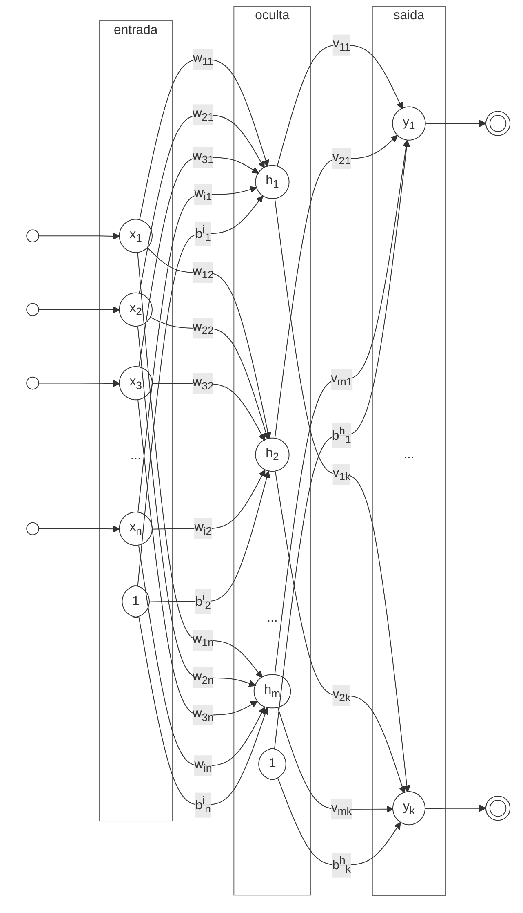

## Apresentação: Perceptrons Multi-Camada (MLPs)

<i>Arquitetura do Perceptron Multi-Camada (MLP).</i>

$$
y_k = \sigma \left( \sum_{j=1}^{m} \sigma \left( \sum_{i=1}^{n} x_i w_{ij} + b^{h}_{i} \right) v_{jk} + b^{y}_{j} \right)
$$

onde:

- $y_k$ é a saída para o $k$-ésimo neurônio de saída.
- $x_i$ são as features de entrada.
- $w_{ij}$ são os pesos conectando a $i$-ésima entrada ao $j$-ésimo neurônio oculto.
- $v_{jk}$ são os pesos conectando o $j$-ésimo neurônio oculto ao $k$-ésimo neurônio de saída.
- $b^{h}_{i}$ é o bias para o $i$-ésimo neurônio oculto.
- $b^{y}_{j}$ é o bias para o $j$-ésimo neurônio de saída.
- $m$ é o número de neurônios ocultos.
- $n$ é o número de features de entrada.
- $\sigma$ é a função de ativação aplicada às somas ponderadas em cada camada, como sigmoid, tanh ou ReLU.

Representação matricial da arquitetura MLP:

$$
\begin{align*}
\text{Camada de Entrada:} & \quad \mathbf{x} = [x_1, x_2, \ldots, x_n]^T \\
\text{Camada Oculta:} & \quad \mathbf{h} = \sigma (\mathbf{W} \mathbf{x} + \mathbf{b}^h) \\
\text{Camada de Saída:} & \quad \mathbf{y} = \sigma (\mathbf{V} \mathbf{h} + \mathbf{b}^y)
\end{align*}
$$

| Sigmoid | Tanh    | ReLU  |
|---------|---------|-------|
| $\sigma(x) = \displaystyle \frac{1}{1 + e^{-x}}$ | $\tanh(x) = \displaystyle \frac{e^{2x} - 1}{e^{2x} + 1}$ | $\text{ReLU}(x) = \max(0, x)$ |
| $\sigma'(x) = \sigma(x)(1 - \sigma(x))$ | $\tanh'(x) = 1 - \tanh^2(x)$ | $\text{ReLU}'(x) = \begin{cases} 1 & \text{se } x > 0 \\ 0 & \text{se } x \leq 0 \end{cases}$ |
|  |  |  |
| Sigmoid é uma curva S suave que produz valores entre 0 e 1, sendo adequada para classificação binária. | Tanh é uma curva suave que produz valores entre -1 e 1, centralizando os dados em zero, o que pode ajudar na convergência. | ReLU é uma função linear por partes que produz zero para entradas negativas e a própria entrada para positivas, permitindo treinamento mais rápido e reduzindo o gradiente desvanecente. |

A retropropagação é o algoritmo usado para treinar MLPs ajustando pesos e biases com base no erro entre a saída prevista e o alvo real. O processo envolve dois passos principais:

1. **Passagem Direta**: Os dados de entrada passam pela rede, camada por camada, para calcular a saída. A saída é comparada ao valor alvo para calcular a perda.
2. **Cálculo da Perda**: Calcula-se a perda entre a saída prevista e o alvo real usando uma função de perda, como erro quadrático médio ou cross-entropy.
3. **Passagem Reversa**: O erro é propagado de volta pela rede para calcular os gradientes da perda em relação a cada peso e bias. Esses gradientes são usados para atualizar os pesos e biases usando um algoritmo de otimização, como SGD ou Adam.

## Passagem Direta (Feedforward)

Considere um MLP com:

- 2 neurônios de entrada: $x_1$ e $x_2$
- 1 camada oculta com 2 neurônios: $h_1$ e $h_2$
- 1 neurônio de saída: $y$

Assumimos funções de ativação sigmoid para as camadas oculta e de saída:

$$\displaystyle \sigma(z) = \frac{1}{1 + e^{-z}}$$

com derivada $\sigma'(z) = \sigma(z)(1 - \sigma(z))$.

Em termos matemáticos, o processo de passagem direta é descrito como:

$$
\begin{align*}
\text{Camada de Entrada:} & \quad \mathbf{x} = [x_1, x_2]^T \\
\text{Camada Oculta:} & \quad \mathbf{h} = \sigma (\mathbf{W} \mathbf{x} + \mathbf{b}^h) \\
\text{Camada de Saída:} & \quad \mathbf{y} = \sigma (\mathbf{V} \mathbf{h} + \mathbf{b}^y)
\end{align*}
$$

ou, mais canonicamente:

$$
\hat{y} = \sigma \left(
v_{11}
    \sigma \left(w_{11} x_1 + w_{21} x_2 + b^h_1\right)
    + v_{21}
    \sigma \left(w_{12} x_1 + w_{22} x_2 + b^h_2\right) + b^y_1
\right)
$$

1. Pré-ativação da camada oculta:

$$z_1 = w_{11} x_1 + w_{21} x_2 + b^h_1, \quad z_2 = w_{12} x_1 + w_{22} x_2 + b^h_2$$

2. Ativações da camada oculta:

$$h_1 = \sigma(z_1), \quad h_2 = \sigma(z_2)$$

3. Pré-ativação da camada de saída:

$$u = v_{11} h_1 + v_{21} h_2 + b^y_1$$

4. Ativação da camada de saída:

$$\hat{y} = \sigma(u)$$

## Cálculo da Perda

A função de perda quantifica a diferença entre a saída prevista e o alvo real. Para tarefas de regressão, o Erro Quadrático Médio (MSE) é comum:

$$L = \text{MSE} = \frac{1}{N} \sum_{i=1}^{N} (y_i - \hat{y}_i)^2$$

## Retropropagação: Calculando Gradientes

O algoritmo de retropropagação calcula as derivadas parciais de $L$ em relação a cada parâmetro usando a regra da cadeia, partindo da saída e propagando os erros de volta.

### Regra de Atualização

Para atualizar parâmetros (ex: via gradiente descendente com taxa de aprendizado $\eta$):

$$p \leftarrow p - \eta \cdot \frac{\partial L}{\partial p}$$

### Passo 1: Erro da Camada de Saída

$$\sigma_y = \frac{\partial L}{\partial u} = \frac{2}{N}(y - \hat{y}) \cdot \hat{y}(1 - \hat{y})$$

### Passo 2: Gradientes para Pesos e Bias de Saída

$$\frac{\partial L}{\partial v_{11}} = \sigma_y \cdot h_1, \quad \frac{\partial L}{\partial v_{21}} = \sigma_y \cdot h_2, \quad \frac{\partial L}{\partial b^y_1} = \sigma_y$$

### Passo 3: Erros da Camada Oculta

$$\sigma_{h_1} = (\sigma_y \cdot v_{11}) \cdot h_1(1 - h_1), \quad \sigma_{h_2} = (\sigma_y \cdot v_{21}) \cdot h_2(1 - h_2)$$

### Passo 4: Gradientes para Pesos e Biases Ocultos

$$\frac{\partial L}{\partial w_{11}} = \sigma_{h_1} \cdot x_1, \quad \frac{\partial L}{\partial w_{21}} = \sigma_{h_1} \cdot x_2$$

$$\frac{\partial L}{\partial w_{12}} = \sigma_{h_2} \cdot x_1, \quad \frac{\partial L}{\partial w_{22}} = \sigma_{h_2} \cdot x_2$$

$$\frac{\partial L}{\partial b^h_1} = \sigma_{h_1}, \quad \frac{\partial L}{\partial b^h_2} = \sigma_{h_2}$$

### Passo 5: Atualizar Pesos e Biases

Usando os gradientes calculados e a taxa de aprendizado $\eta$:

$$\mathbf{W} \leftarrow \mathbf{W} - \eta \frac{\partial L}{\partial \mathbf{W}}, \quad \mathbf{V} \leftarrow \mathbf{V} - \eta \frac{\partial L}{\partial \mathbf{V}}$$

---

## Simulação Numérica

Com base na arquitetura MLP e nos passos de retropropagação descritos, podemos implementar uma simulação numérica simples para demonstrar o processo de treinamento.

### Inicialização

As matrizes de pesos e vetores de bias são inicializados aleatoriamente em $[0,1]$:

$$\mathbf{W} = \begin{bmatrix} 0.2 & 0.4 \\ 0.6 & 0.8 \end{bmatrix}, \quad \mathbf{b}^h = [0.1, 0.2]^T$$

$$\mathbf{V} = \begin{bmatrix} 0.3 & 0.5 \end{bmatrix}, \quad b^y = 0.4, \quad \eta = 0.7$$

### Passagem Direta

Para a amostra $\mathbf{x} = [0.5, 0.8]^T$, $y = 0$:

1. Pré-ativação oculta: $\mathbf{z} = [0.52, 1.14]^T$
2. Ativações ocultas: $\mathbf{h} \approx [0.627, 0.758]^T$
3. Pré-ativação de saída: $u \approx 0.967$
4. Ativação de saída: $\hat{y} \approx 0.725$

### Cálculo da Perda

$$L = (0 - 0.725)^2 \approx 0.5249$$

### Passagem Reversa

1. $\partial L / \partial u \approx -0.289$
2. Gradientes da camada oculta: $\approx [-0.020, -0.026]^T$
3. Pesos atualizados: $\mathbf{W} \leftarrow \begin{bmatrix} 0.207 & 0.409 \\ 0.611 & 0.815 \end{bmatrix}$

Repita o processo de treinamento para cada amostra ou múltiplas épocas.

- **Aprendizado online**: atualiza o modelo após cada exemplo de treinamento.
- **Aprendizado em batch**: atualiza o modelo após processar um batch de exemplos.

## Recursos Adicionais

Para uma compreensão mais intuitiva de redes neurais, recomendo a série de vídeos do 3Blue1Brown: [https://www.3blue1brown.com/lessons/neural-networks](https://www.3blue1brown.com/lessons/neural-networks){target="_blank"}

<iframe width="100%" height="470" src="https://www.youtube.com/embed/aircAruvnKk" title="But what is a neural network? | Deep learning chapter 1" frameborder="0" allow="accelerometer; autoplay; clipboard-write; encrypted-media; gyroscope; picture-in-picture; web-share" referrerpolicy="strict-origin-when-cross-origin" allowfullscreen></iframe>

[^1]: Haykin, S. (1994). Neural Networks: A Comprehensive Foundation. Prentice Hall.
[^2]: Bishop, C. M. (2006). Pattern Recognition and Machine Learning. Springer.
[^3]: Goodfellow, I., Bengio, Y., & Courville, A. (2016). Deep Learning. MIT Press.
[:octicons-download-24:](https://www.deeplearningbook.org/){target="_blank"}

---

## Interativo: Visualizador de Passagem Direta do MLP

Observe as ativações se propagando por uma rede 2-entradas → 3-ocultos → 2-saídas. Ajuste os sliders de entrada e veja os valores fluírem camada por camada.

  

    
Entrada x₁

    <input id="mlp-x1" type="range" min="-2" max="2" step="0.05" value="0.8" style="width:100%;accent-color:#58a6ff;" oninput="mlpForward()">
    

  

  

    
Entrada x₂

    <input id="mlp-x2" type="range" min="-2" max="2" step="0.05" value="-0.5" style="width:100%;accent-color:#58a6ff;" oninput="mlpForward()">
    

  

  

    
Ativação

    <select id="mlp-act" onchange="mlpForward()" style="background:#161b22;color:#c9d1d9;border:1px solid #30363d;border-radius:4px;padding:4px 8px;width:100%;">
      <option value="relu">ReLU</option>
      <option value="sigmoid">Sigmoid</option>
      <option value="tanh">Tanh</option>
    </select>
  

<canvas id="mlp-canvas" style="width:100%;display:block;border-radius:8px;"></canvas>

---

--8<-- "docs/2026.2/classes/mlp/quiz.pt.md"
