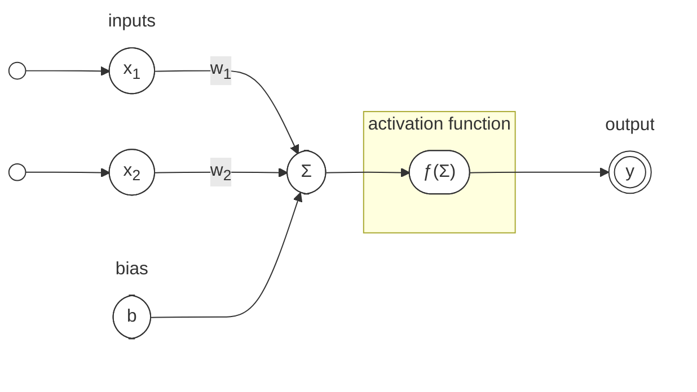

## Biological Inspiration

Since the inception of artificial neural networks (ANNs), their design has been heavily influenced by the structure and function of biological neural networks. The human brain, with its complex network of neurons, serves as a foundational model for understanding how ANNs can process information. The base of an ANN is a neuron, which mimics the behavior of biological neurons. Each neuron receives inputs, processes them, and produces an output, similar to how biological neurons communicate through synapses.

{ width=70% }
/// caption
*Diagram of Neuron.* <br><small>Source: [Wikipedia - Neuron](https://en.wikipedia.org/wiki/Neuron){ target=_blank }</small>
///

The biological neuron consists of a cell body (soma), dendrites, and an axon. Dendrites receive signals from other neurons, the soma processes these signals, and the axon transmits the output to other neurons. This structure allows for complex interactions and information processing, which is essential for learning and decision-making in biological systems. The signal produced by a neuron is known as an **action potential**, which is an electrical impulse that travels along the axon to communicate with other neurons. The action potential is generated when the neuron receives sufficient input from its dendrites, leading to a change in the electrical potential across its membrane. This process is known as **neural activation** and is crucial for the functioning of both biological and artificial neurons.

{ width=70% }
/// caption
*Action potential.* <br><small>Source: [Wikipedia - Action potential](https://en.wikipedia.org/wiki/Action_potential){ target=_blank }</small>
///

Basead on this biological inspiration, McCulloch and Pitts[^1] proposed the first mathematical model of a neuron in 1943. This model laid the groundwork for the development of artificial neurons, which are the building blocks of ANNs. The McCulloch-Pitts neuron is a simple binary model that outputs a signal based on whether the weighted sum of its inputs exceeds a certain threshold.

$$
\begin{align*}
    N_i(t+1) = H \left( \sum_{j=1}^n w_{ij}(t) N_j(t) - \theta_ i (t) \right), & \\
    & H(x) := 
    \begin{cases}
        1, & x \geq 0 \\
        0, & x < 0
    \end{cases}
\end{align*}
$$

This equation describes how the output of neuron \(N_i\) at time \(t+1\) is determined by the weighted sum of its inputs \(N_j\) at time \(t\), adjusted by a threshold \(\theta_i(t)\). The function \(H\) is a step function that activates the neuron if the input exceeds the threshold. Note, the results of the McCulloch-Pitts model are binary, meaning the output is either 0 or 1, which corresponds to the neuron being inactive or active, respectively - see a connection to symbolic logic.

This model, while simplistic, captures the essence of how neurons process information and has been foundational in the development of more complex neural network architectures.

## Mathematical Foundations

The mathematical foundations of artificial neural networks are built upon linear algebra, calculus, and probability theory. These areas provide the tools necessary to understand how ANNs operate, how they learn from data, and how they can be optimized for various tasks.

**The Perceptron**, introduced by Rosenblatt[^2] in 1958, is one of the earliest and simplest forms of an ANN. It consists of a single layer of neurons that can classify linearly separable data. The Perceptron algorithm adjusts the weights of the inputs based on the error in the output, allowing it to learn from examples.

The Perceptron can be mathematically described as follows:

<center>

</center>

The Perceptron computes the output \(y\) as follows:

\[
y = \text{activation}\left(\sum_{i=1}^n w_i x_i + b\right)
\]

A perceptron is a simple artificial neuron that takes multiple inputs, applies weights to them, sums them up, adds a bias, and passes the result through an activation function (typically a step function) to produce a binary output (e.g., 0 or 1). It’s used to solve linearly separable classification problems.

The perceptron’s output is computed as:

- **Input**: a vector of features \( \mathbf{x} = [x_1, x_2, \dots, x_n] \).

- **Weights**: a vector \( \mathbf{w} = [w_1, w_2, \dots, w_n] \) representing the importance of each input.

- **Bias**: a scalar \( b \) that shifts the decision boundary.

- **Output**:

    \[ y = \text{activation}(\mathbf{w} \cdot \mathbf{x} + b) \]

    where \( \mathbf{w} \cdot \mathbf{x} = w_1x_1 + w_2x_2 + \dots + w_nx_n \), and the activation function is typically a step function:

    \[
    \text{activation}(z) = 
    \begin{cases} 
    1 & \text{if } z \geq 0 \\
    0 & \text{if } z < 0 
    \end{cases}
    \]

The goal of training is to find the optimal weights \( \mathbf{w} \) and bias \( b \) so the perceptron correctly classifies the training data.

## Perceptron Training Process
The perceptron training algorithm adjusts the weights and bias iteratively based on errors in classification. Here’s a step-by-step explanation:

### 1. **Initialize Weights and Bias**

Start with small random values for the weights \( \mathbf{w} \) and bias \( b \), or initialize them to zero. These initial values don’t need to be perfect, as the algorithm will adjust them during training.

### 2. **Provide Training Data**

The training dataset consists of input-output pairs \( \{(\mathbf{x}^{(i)}, y^{(i)})\} \), where:

- \( \mathbf{x}^{(i)} \) is the feature vector for the \( i \)-th example.
- \( y^{(i)} \) is the true label (0 or 1).

The data must be **linearly separable** for the perceptron to converge (i.e., a straight line or hyperplane can separate the two classes).

### 3. **Forward Pass: Compute Prediction**

For each training example \( \mathbf{x}^{(i)} \):

Calculate the weighted sum:
  
\( z = \mathbf{w} \cdot \mathbf{x}^{(i)} + b \).

Apply the activation function to get the predicted output \( \hat{y}^{(i)} \):

\[
\hat{y}^{(i)} = \text{activation}(z)
\]

Compare the predicted output \( \hat{y}^{(i)} \) with the true label \( y^{(i)} \).

### 4. **Compute Error**

The error is the difference between the true label and the predicted label:

\[
\text{error} = y^{(i)} - \hat{y}^{(i)}
\]

Since \( y^{(i)} \) and \( \hat{y}^{(i)} \) are binary (0 or 1), the error can be:

- \( 0 \) (correct prediction),
- \( 1 \) (predicted 0, but true label is 1),
- \( -1 \) (predicted 1, but true label is 0).

### 5. **Update Weights and Bias**

If the prediction is correct (\( \text{error} = 0 \)), no update is needed.

If the prediction is incorrect, adjust the weights and bias using the perceptron learning rule[^4]:

\[
\mathbf{w} \gets \mathbf{w} + \eta \cdot \text{error} \cdot \mathbf{x}^{(i)}
\]

\[
b \gets b + \eta \cdot \text{error}
\]

where:

\( \eta \) (eta) is the **learning rate**, a small positive number (e.g., 0.01) that controls the size of the update.

The update moves the decision boundary to reduce the error for the current example.

### 6. **Iterate**

Repeat steps 3–5 for all training examples in the dataset (one pass through the dataset is called an **epoch**).

!!! warning "Stop Criteria"

    Continue iterating for a fixed number of epochs or until the perceptron correctly classifies all training examples (i.e., no errors).

### 7. **Convergence**

If the data is linearly separable, the perceptron is guaranteed to converge to a solution that correctly classifies all training examples.

!!! warning "Stop Criteria"

    If the data is not linearly separable, the algorithm will not converge and may oscillate. In such cases, you may need to limit the number of epochs or use a different model.

---

### Intuition Behind the Training

- The perceptron learns by adjusting the decision boundary (a hyperplane defined by \( \mathbf{w} \cdot \mathbf{x} + b = 0 \)) to separate the two classes.
- Each weight update moves the hyperplane slightly to reduce misclassification errors.
- The learning rate \( \eta \) controls how aggressively the hyperplane is adjusted:
  - A large \( \eta \) makes big changes, which can lead to faster learning but may overshoot.
  - A small \( \eta \) makes small changes, leading to slower but more stable learning.

---

## Example: Training a Perceptron
Suppose we have a dataset with two features \( \mathbf{x} = [x_1, x_2] \) and binary labels (0 or 1). Let’s train a perceptron to classify points.

### Dataset:

<div style="float: right; width: 35%;">
``` python exec="on" html="on"
--8<-- "docs/2026.2/classes/perceptron/perceptron-dataset.py"
```
</div>

| \( x_1 \) | \( x_2 \) | Label (\( y \)) |
|:---------:|:--------:|:---------------:|
| 1         | 1         | 1               |
| 2         | 2         | 1               |
| -1        | -1        | 0               |
| -2        | -1        | 0               |

#### Step-by-Step:

1. **Initialize**: Set \( \mathbf{w} = [0, 0] \), \( b = 0 \), and \( \eta = 0.1 \).

2. **First Example**: \( \mathbf{x}^{(1)} = [1, 1] \), \( y^{(1)} = 1 \).

    - Compute: \( z = \underbrace{0}_{w_1} \cdot \underbrace{1}_{x_1} + \underbrace{0}_{w_2} \cdot \underbrace{1}_{x_2} + \underbrace{0}_{b} = 0 \), so \( \hat{y}^{(1)} = 1 \) (since \( z \geq 0 \)).
    - Error: \( y^{(1)} - \hat{y}^{(1)} = 1 - 1 = 0 \). No update needed.

3. **Second Example**: \( \mathbf{x}^{(2)} = [2, 2] \), \( y^{(2)} = 1 \).

    - Compute: \( z = \underbrace{0}_{w_1} \cdot \underbrace{2}_{x_1} + \underbrace{0}_{w_2} \cdot \underbrace{2}_{x_2} + \underbrace{0}_{b} = 0 \), so \( \hat{y}^{(2)} = 1 \).
    - Error: \( \underbrace{1}_{y^{(1)}} - \underbrace{1}_{\hat{y}^{(1)}} = 0 \). No update.

4. **Third Example**: \( \mathbf{x}^{(3)} = [-1, -1] \), \( y^{(3)} = 0 \).

    - Compute: \( z = \underbrace{0}_{w_1} \cdot \underbrace{-1}_{x_1} + \underbrace{0}_{w_2} \cdot \underbrace{-1}_{x_2} + \underbrace{0}_{b} = 0 \), so \( \hat{y}^{(3)} = 1 \).
    - Error: \( \underbrace{0}_{y^{(1)}} - \underbrace{1}_{\hat{y}^{(1)}} = -1 \).
    - Update:

    \[
    \mathbf{w} = \underbrace{[0, 0]}_{\mathbf{w}} + \underbrace{0.1}_{\eta} \cdot \underbrace{-1}_{\text{error}} \cdot \underbrace{[-1, -1]}_{\mathbf{x}^{(3)}} = [0, 0] + [0.1, 0.1] = [0.1, 0.1]
    \]

    \[
    b = \underbrace{0}_{b} + \underbrace{0.1}_{\eta} \cdot \underbrace{-1}_{\text{error}} = -0.1
    \]

5. **Fourth Example**: \( \mathbf{x}^{(4)} = [-2, -1] \), \( y^{(4)} = 0 \).

    - Compute: \( z = \underbrace{0.1}_{w_1} \cdot \underbrace{-2}_{x_1} + \underbrace{0.1}_{w_2} \cdot \underbrace{-1}_{x_2} + \underbrace{-0.1}_{b} = -0.4 \), so \( \hat{y}^{(4)} = 0 \).

    - Error: \( \underbrace{0}_{y^{(4)}} - \underbrace{0}_{\hat{y}^{(4)}} = 0 \). No update.

6. **Repeat**: Continue iterating through the dataset, updating weights and bias when errors occur, until all examples are correctly classified or a maximum number of epochs is reached.


``` python exec="on" html="on"
--8<-- "docs/2026.2/classes/perceptron/perceptron_animate.py"
```

---

### Key Points
- **Linear Separability**: The perceptron only works for datasets where a single hyperplane can separate the classes. For non-linearly separable data (e.g., XOR problem), a single perceptron fails, and you’d need a multi-layer perceptron (MLP) or other models.
- **Learning Rate**: Choosing an appropriate \( \eta \) is crucial. Too large, and the algorithm may oscillate; too small, and it may converge too slowly.
- **Convergence**: The perceptron convergence theorem guarantees that the algorithm will find a solution in a finite number of steps if the data is linearly separable.
- **Limitations**: The perceptron is a simple model and cannot handle complex patterns or multi-class problems without extensions (e.g., combining multiple perceptrons).

---

### Visualizing the Decision Boundary
The decision boundary is the hyperplane where \( \mathbf{w} \cdot \mathbf{x} + b = 0 \). For a 2D dataset (\( x_1, x_2 \)), this is a line:

\[
w_1x_1 + w_2x_2 + b = 0 \implies x_2 = -\frac{w_1}{w_2}x_1 - \frac{b}{w_2}
\]

During training, the weights and bias are adjusted to move this line so that it separates the two classes correctly.

---

## Practical Considerations
- **Preprocessing**: Normalize or standardize input features to ensure they’re on similar scales, which helps the perceptron learn more effectively.
- **Epochs**: Set a maximum number of epochs to prevent infinite loops if the data is not linearly separable.
- **Extensions**: To handle multi-class problems, you can use multiple perceptrons (one-vs-rest) or move to more advanced models like MLPs or support vector machines (SVMs).

---

## Limitations of the Perceptron

While the perceptron is a foundational model in machine learning, it has several limitations:

1. **Linearly Separable Data**: The perceptron can only solve problems where the classes are linearly separable. If the data cannot be separated by a straight line (or hyperplane in higher dimensions), the perceptron will fail to converge. A classic example of this limitation is the **XOR problem**[^5], which cannot be solved by a single-layer perceptron.

    ``` python exec="on" html="on"
    --8<-- "docs/2026.2/classes/perceptron/xor-problem.py"
    ```

2. **Binary Classification**: The basic perceptron is designed for binary classification tasks. While it can be extended to multi-class problems using techniques like one-vs-rest, it is not inherently suited for multi-class classification.
3. **No Probability Estimates**: The perceptron outputs binary decisions (0 or 1) without providing probability estimates for its predictions. This can be a limitation in applications where understanding the confidence of predictions is important.
4. **Sensitivity to Learning Rate**: The choice of learning rate can significantly affect the training process. A learning rate that is too high can cause the algorithm to overshoot the optimal solution, while a learning rate that is too low can lead to slow convergence.

---

## Playground Interativo: Treine um Perceptron

Clique na área abaixo para adicionar pontos (clique normal = Classe A, Shift+clique = Classe B). O perceptron atualiza os pesos automaticamente a cada época usando a regra de aprendizado de Rosenblatt.

<div id="perceptron-playground" style="background:#0d1117;border-radius:12px;padding:1.5rem;margin:2rem 0;font-family:Inter,sans-serif;color:#e6edf3;">

<div style="display:flex;gap:1rem;flex-wrap:wrap;margin-bottom:1rem;align-items:center;">
  <div>
    <span style="color:#58a6ff;font-weight:bold;">● Classe A</span>
    <span style="color:#f0883e;font-weight:bold;margin-left:1rem;">● Classe B</span>
    <span style="color:#8b949e;font-size:.8rem;margin-left:1rem;">(Shift+clique para Classe B)</span>
  </div>
  <div style="margin-left:auto;display:flex;gap:.5rem;flex-wrap:wrap;">
    <button onclick="runEpoch()" style="padding:5px 16px;background:#3fb950;color:#0d1117;border:none;border-radius:5px;cursor:pointer;font-weight:bold;">▶ Época</button>
    <button onclick="runEpochs(20)" style="padding:5px 16px;background:#58a6ff;color:#0d1117;border:none;border-radius:5px;cursor:pointer;font-weight:bold;">▶▶ 20 Épocas</button>
    <button onclick="clearPlayground()" style="padding:5px 16px;background:#21262d;color:#c9d1d9;border:1px solid #30363d;border-radius:5px;cursor:pointer;">Limpar</button>
    <button onclick="addDemo()" style="padding:5px 16px;background:#21262d;color:#c9d1d9;border:1px solid #30363d;border-radius:5px;cursor:pointer;">Exemplo</button>
  </div>
</div>

<canvas id="perc-canvas" style="width:100%;display:block;border-radius:8px;cursor:crosshair;border:1px solid #21262d;"></canvas>

<div style="display:flex;gap:2rem;margin-top:.8rem;flex-wrap:wrap;">
  <div style="font-size:.85rem;">
    <span style="color:#8b949e;">Época: </span><span id="epoch-count" style="color:#f0883e;font-weight:bold;">0</span>
    <span style="color:#8b949e;margin-left:1rem;">Erros: </span><span id="error-count" style="color:#ff7b72;font-weight:bold;">0</span>
    <span style="color:#8b949e;margin-left:1rem;">Acurácia: </span><span id="acc-count" style="color:#3fb950;font-weight:bold;">-</span>
  </div>
  <div style="font-size:.8rem;color:#8b949e;">
    w = [<span id="w-display" style="color:#bc8cff;font-family:monospace;">0.00, 0.00</span>],
    b = <span id="b-display" style="color:#bc8cff;font-family:monospace;">0.00</span>,
    η = <span id="eta-display" style="color:#d29922;">0.10</span>
  </div>
</div>
<div style="margin-top:.5rem;">
  <label style="color:#8b949e;font-size:.8rem;">Taxa de aprendizado η: </label>
  <input id="eta-slider" type="range" min="0.01" max="0.5" step="0.01" value="0.1" style="accent-color:#d29922;vertical-align:middle;" oninput="document.getElementById(‘eta-display’).textContent=this.value;">
</div>
</div>

<script>
(function() {
  const canvas = document.getElementById(‘perc-canvas’);
  const ctx = canvas.getContext(‘2d’);
  let points = [];
  let w = [0, 0], b = 0;
  let epoch = 0, errors = 0;

  function getEta() { return +document.getElementById(‘eta-slider’).value; }

  function resize() {
    const W = canvas.parentElement.offsetWidth - 48;
    canvas.width = W; canvas.height = Math.round(W * 0.55);
    canvas.style.height = canvas.height + ‘px’;
    drawAll();
  }

  function toCanvas(px, py) {
    return [px * canvas.width, py * canvas.height];
  }

  function fromCanvas(cx, cy) {
    return [cx / canvas.width, cy / canvas.height];
  }

  function sign(x) { return x >= 0 ? 1 : -1; }

  function predict(px, py) {
    // Map [0,1]×[0,1] to [-1,1]×[-1,1] for computation
    const x = px * 2 - 1, y = -(py * 2 - 1);
    return sign(w[0]*x + w[1]*y + b);
  }

  function drawAll() {
    const W = canvas.width, H = canvas.height;
    ctx.fillStyle = ‘#161b22’; ctx.fillRect(0,0,W,H);

    // Decision boundary
    if (points.length >= 2) {
      // w0*x + w1*y + b = 0 → y = -(w0*x + b)/w1
      // in canvas coords: x_c = (x+1)/2*W, y_c = (-y+1)/2*H
      ctx.strokeStyle = ‘#ffffff44’; ctx.lineWidth = 2; ctx.setLineDash([6,4]);
      ctx.beginPath();
      let started = false;
      for (let cx = 0; cx <= W; cx += 2) {
        const x = cx / W * 2 - 1;
        if (Math.abs(w[1]) > 1e-6) {
          const y = -(w[0]*x + b) / w[1];
          const cy = (-y + 1) / 2 * H;
          if (!started) { ctx.moveTo(cx, cy); started = true; }
          else ctx.lineTo(cx, cy);
        }
      }
      ctx.stroke(); ctx.setLineDash([]);

      // Shade regions
      const imgData = ctx.getImageData(0, 0, W, H);
      for (let cy = 0; cy < H; cy += 3) {
        for (let cx = 0; cx < W; cx += 3) {
          const [px, py] = fromCanvas(cx, cy);
          const pred = predict(px, py);
          const idx = (cy * W + cx) * 4;
          if (pred >= 0) {
            imgData.data[idx] = 88; imgData.data[idx+1] = 166; imgData.data[idx+2] = 255; imgData.data[idx+3] = 18;
          } else {
            imgData.data[idx] = 240; imgData.data[idx+1] = 136; imgData.data[idx+2] = 62; imgData.data[idx+3] = 18;
          }
        }
      }
      ctx.putImageData(imgData, 0, 0);
      // Redraw boundary on top
      ctx.strokeStyle = ‘#ffffffaa’; ctx.lineWidth = 2; ctx.setLineDash([6,4]);
      ctx.beginPath(); started = false;
      for (let cx = 0; cx <= W; cx += 2) {
        const x = cx / W * 2 - 1;
        if (Math.abs(w[1]) > 1e-6) {
          const y = -(w[0]*x + b) / w[1];
          const cy = (-y+1)/2*H;
          if (!started) { ctx.moveTo(cx, cy); started=true; }
          else ctx.lineTo(cx, cy);
        }
      }
      ctx.stroke(); ctx.setLineDash([]);
    }

    // Grid
    ctx.strokeStyle = ‘#21262d’; ctx.lineWidth = 0.5;
    for (let i=1; i<5; i++) {
      ctx.beginPath(); ctx.moveTo(i*W/5, 0); ctx.lineTo(i*W/5, H); ctx.stroke();
      ctx.beginPath(); ctx.moveTo(0, i*H/5); ctx.lineTo(W, i*H/5); ctx.stroke();
    }

    // Points
    points.forEach(p => {
      const [cx, cy] = toCanvas(p.x, p.y);
      const pred = predict(p.x, p.y);
      const correct = pred === p.label;
      const baseColor = p.label >= 0 ? ‘#58a6ff’ : ‘#f0883e’;
      ctx.fillStyle = correct ? baseColor : ‘#ff7b7288’;
      ctx.strokeStyle = correct ? baseColor : ‘#ff7b72’;
      ctx.lineWidth = correct ? 0 : 2.5;
      ctx.beginPath(); ctx.arc(cx, cy, 7, 0, 2*Math.PI); ctx.fill();
      if (!correct) ctx.stroke();
      // Cross for misclassified
      if (!correct) {
        ctx.strokeStyle = ‘#ff7b72’; ctx.lineWidth = 1.5;
        ctx.beginPath(); ctx.moveTo(cx-5,cy-5); ctx.lineTo(cx+5,cy+5); ctx.stroke();
        ctx.beginPath(); ctx.moveTo(cx+5,cy-5); ctx.lineTo(cx-5,cy+5); ctx.stroke();
      }
    });

    // Status
    if (points.length === 0) {
      ctx.fillStyle = ‘#484f58’; ctx.font = ‘14px Inter,sans-serif’; ctx.textAlign=’center’; ctx.textBaseline=’middle’;
      ctx.fillText(‘Clique para adicionar pontos da Classe A’, W/2, H/2 - 10);
      ctx.fillText(‘Shift+Clique para Classe B’, W/2, H/2 + 14);
    }
  }

  function updateStats(errs) {
    document.getElementById(‘epoch-count’).textContent = epoch;
    document.getElementById(‘error-count’).textContent = errs;
    const total = points.length;
    const acc = total > 0 ? ((total - errs) / total * 100).toFixed(1) + ‘%’ : ‘-’;
    document.getElementById(‘acc-count’).textContent = acc;
    document.getElementById(‘w-display’).textContent = w.map(x=>x.toFixed(2)).join(‘, ‘);
    document.getElementById(‘b-display’).textContent = b.toFixed(2);
  }

  window.runEpoch = function() {
    if (points.length === 0) return;
    const eta = getEta();
    let errs = 0;
    // Shuffle
    const shuffled = [...points].sort(() => Math.random() - 0.5);
    shuffled.forEach(p => {
      const x = p.x * 2 - 1, y = -(p.y * 2 - 1);
      const pred = sign(w[0]*x + w[1]*y + b);
      if (pred !== p.label) {
        errs++;
        w[0] += eta * p.label * x;
        w[1] += eta * p.label * y;
        b += eta * p.label;
      }
    });
    epoch++;
    updateStats(errs);
    drawAll();
  };

  window.runEpochs = function(n) {
    for (let i=0; i<n; i++) runEpoch();
  };

  window.clearPlayground = function() {
    points = []; w = [0,0]; b = 0; epoch = 0;
    updateStats(0);
    drawAll();
  };

  window.addDemo = function() {
    points = [];
    w = [0,0]; b = 0; epoch = 0;
    // Linearly separable demo
    const classA = [[0.2,0.3],[0.15,0.5],[0.25,0.7],[0.3,0.2],[0.1,0.4],[0.35,0.6]];
    const classB = [[0.7,0.3],[0.8,0.5],[0.6,0.7],[0.75,0.2],[0.65,0.4],[0.85,0.6]];
    classA.forEach(([x,y]) => points.push({x,y,label:1}));
    classB.forEach(([x,y]) => points.push({x,y,label:-1}));
    updateStats(points.length);
    drawAll();
  };

  canvas.addEventListener(‘click’, e => {
    const rect = canvas.getBoundingClientRect();
    const px = (e.clientX - rect.left) / rect.width;
    const py = (e.clientY - rect.top) / rect.height;
    const label = e.shiftKey ? -1 : 1;
    points.push({x: px, y: py, label});
    updateStats(points.filter(p => predict(p.x,p.y)!==p.label).length);
    drawAll();
  });

  window.addEventListener(‘resize’, resize);
  resize();
})();
</script>

## Summary

The perceptron training algorithm is a simple, iterative process that adjusts weights and bias to minimize classification errors on a linearly separable dataset. It involves initializing parameters, computing predictions, calculating errors, and updating weights based on the perceptron learning rule. While limited to binary classification and linearly separable data, it’s a foundational concept for understanding more complex neural networks.

{ width=100% }


[^1]: McCulloch, W. S., & Pitts, W. (1943). A logical calculus of the ideas immanent in nervous activity. *The Bulletin of Mathematical Biophysics*, 5(4), 115-133.
[doi:10.1007/BF02478259](https://doi.org/10.1007/BF02478259){ target=_blank }

[^2]: Rosenblatt, F. (1958). The Perceptron: A probabilistic model for information storage and organization in the brain. *Psychological Review*, 65(6), 386-408.
[doi:10.1037/h0042519](https://doi.org/10.1037/h0042519){ target=_blank }

[^3]: Jurafsky, D., & Martin, J. H. (2025). Speech and Language Processing: An Introduction to Natural Language Processing, Computational Linguistics, and Speech Recognition with Language Models.
[:octicons-download-24:](https://web.stanford.edu/~jurafsky/slp3/ed3book_Jan25.pdf){ target=_blank }

[^4]: Hebb, D. O. (1949). The organization of behavior: A neuropsychological theory. *John Wiley & Sons*.
[doi.org/10.1002/sce.37303405110](https://doi.org/10.1002/sce.37303405110){ target=_blank }
[:material-wikipedia:](https://en.wikipedia.org/wiki/Hebbian_learning){ target=_blank }
[:octicons-download-24:](https://pure.mpg.de/pubman/item/item_2346268_3/component/file_2346267/Hebb_1949_The_Organization_of_Behavior.pdf){ target=_blank }

[^5]: Minsky, M., & Papert, S. (1969). Perceptrons: An introduction to computational geometry. *MIT Press*.
[:octicons-book-24:](https://mitpress.mit.edu/9780262630221/perceptrons/){target='_blank'} 
[:material-wikipedia:](https://en.wikipedia.org/wiki/Perceptrons_(book)){target='_blank'}
[:octicons-download-24:](https://rodsmith.nz/wp-content/uploads/Minsky-and-Papert-Perceptrons.pdf){target='_blank'},


---

--8<-- "docs/2026.2/classes/perceptron/quiz.md"
