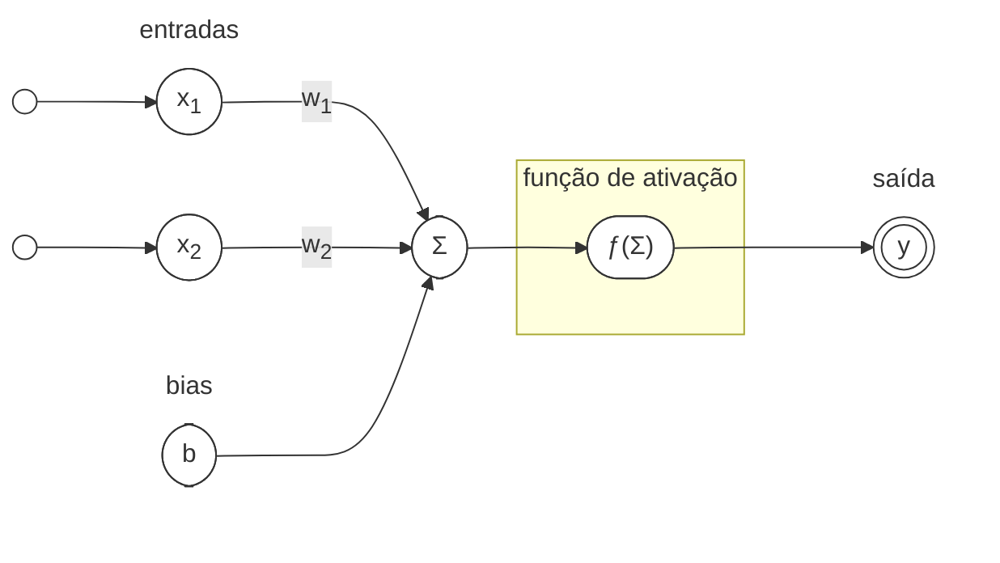
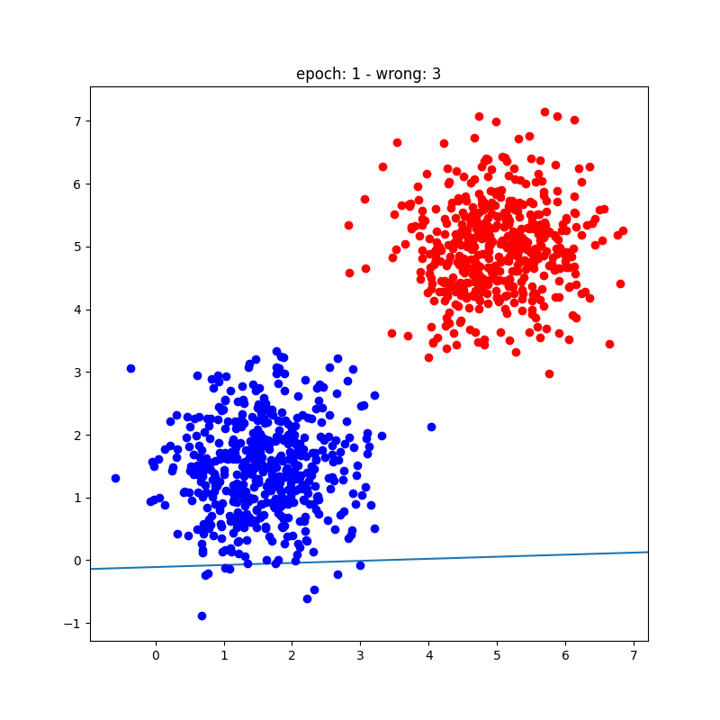

## Inspiração Biológica

Desde o início das redes neurais artificiais (ANNs), seu design foi fortemente influenciado pela estrutura e função das redes neurais biológicas. O cérebro humano, com sua complexa rede de neurônios, serve como modelo fundamental para entender como as ANNs podem processar informações. A base de uma ANN é um neurônio, que imita o comportamento dos neurônios biológicos. Cada neurônio recebe entradas, as processa e produz uma saída, similar à forma como os neurônios biológicos se comunicam através de sinapses.

{ width=70% }
/// caption
*Diagrama de um Neurônio.* <br><small>Fonte: [Wikipedia - Neurônio](https://pt.wikipedia.org/wiki/Neur%C3%B4nio){ target=_blank }</small>
///

O neurônio biológico consiste em um corpo celular (soma), dendritos e um axônio. Os dendritos recebem sinais de outros neurônios, o soma processa esses sinais e o axônio transmite a saída para outros neurônios. Essa estrutura permite interações complexas e processamento de informações, essencial para aprendizado e tomada de decisão em sistemas biológicos. O sinal produzido por um neurônio é conhecido como **potencial de ação**, um impulso elétrico que percorre o axônio para se comunicar com outros neurônios. O potencial de ação é gerado quando o neurônio recebe entrada suficiente de seus dendritos, levando a uma mudança no potencial elétrico através de sua membrana. Esse processo é conhecido como **ativação neural** e é crucial para o funcionamento tanto de neurônios biológicos quanto artificiais.

{ width=70% }
/// caption
*Potencial de ação.* <br><small>Fonte: [Wikipedia - Potencial de ação](https://pt.wikipedia.org/wiki/Potencial_de_a%C3%A7%C3%A3o){ target=_blank }</small>
///

Com base nessa inspiração biológica, McCulloch e Pitts[^1] propuseram o primeiro modelo matemático de um neurônio em 1943. Esse modelo lançou as bases para o desenvolvimento de neurônios artificiais, os blocos construtivos das ANNs. O neurônio McCulloch-Pitts é um modelo binário simples que produz um sinal baseado em se a soma ponderada de suas entradas excede um certo limiar.

$$
\begin{align*}
    N_i(t+1) = H \left( \sum_{j=1}^n w_{ij}(t) N_j(t) - \theta_ i (t) \right), & \\
    & H(x) := 
    \begin{cases}
        1, & x \geq 0 \\
        0, & x < 0
    \end{cases}
\end{align*}
$$

Esta equação descreve como a saída do neurônio $N_i$ no tempo $t+1$ é determinada pela soma ponderada de suas entradas $N_j$ no tempo $t$, ajustada por um limiar $\theta_i(t)$. A função $H$ é uma função degrau que ativa o neurônio se a entrada exceder o limiar. Os resultados do modelo McCulloch-Pitts são binários — a saída é 0 ou 1, correspondendo ao neurônio inativo ou ativo, respectivamente.

## Fundamentos Matemáticos

Os fundamentos matemáticos das redes neurais artificiais são construídos sobre álgebra linear, cálculo e teoria da probabilidade.

**O Perceptron**, introduzido por Rosenblatt[^2] em 1958, é uma das formas mais antigas e simples de ANN. Consiste em uma única camada de neurônios que pode classificar dados linearmente separáveis. O algoritmo do Perceptron ajusta os pesos das entradas com base no erro na saída, permitindo que aprenda a partir de exemplos.

O Perceptron pode ser matematicamente descrito como:

<center>

</center>

O Perceptron calcula a saída $y$ como:

$$y = \text{ativação}\left(\sum_{i=1}^n w_i x_i + b\right)$$

Um perceptron é um neurônio artificial simples que recebe múltiplas entradas, aplica pesos a elas, as soma, adiciona um bias e passa o resultado por uma função de ativação (tipicamente uma função degrau) para produzir uma saída binária. É usado para resolver problemas de classificação linearmente separáveis.

- **Entrada**: vetor de features $\mathbf{x} = [x_1, x_2, \dots, x_n]$.
- **Pesos**: vetor $\mathbf{w} = [w_1, w_2, \dots, w_n]$ representando a importância de cada entrada.
- **Bias**: escalar $b$ que desloca a fronteira de decisão.
- **Saída**: $y = \text{ativação}(\mathbf{w} \cdot \mathbf{x} + b)$, onde a ativação é a função degrau.

O objetivo do treinamento é encontrar os pesos ótimos $\mathbf{w}$ e bias $b$ para que o perceptron classifique corretamente os dados de treinamento.

## Processo de Treinamento do Perceptron

O algoritmo de treinamento ajusta os pesos e bias iterativamente com base em erros de classificação.

### 1. Inicializar Pesos e Bias

Comece com valores aleatórios pequenos para os pesos $\mathbf{w}$ e bias $b$, ou inicialize-os com zero.

### 2. Fornecer Dados de Treinamento

O conjunto de treinamento consiste em pares entrada-saída $\{(\mathbf{x}^{(i)}, y^{(i)})\}$. Os dados devem ser **linearmente separáveis** para que o perceptron convirja.

### 3. Passagem Direta: Calcular Predição

Para cada exemplo $\mathbf{x}^{(i)}$: calcule a soma ponderada $z = \mathbf{w} \cdot \mathbf{x}^{(i)} + b$ e aplique a função de ativação para obter $\hat{y}^{(i)}$.

### 4. Calcular Erro

$\text{erro} = y^{(i)} - \hat{y}^{(i)}$

### 5. Atualizar Pesos e Bias

Se a predição estiver incorreta, ajuste usando a regra de aprendizado do perceptron[^4]:

$$\mathbf{w} \gets \mathbf{w} + \eta \cdot \text{erro} \cdot \mathbf{x}^{(i)}$$
$$b \gets b + \eta \cdot \text{erro}$$

onde $\eta$ é a **taxa de aprendizado**.

### 6. Iterar

Repita os passos 3–5 para todos os exemplos de treinamento (uma passagem pelo conjunto é chamada de **época**).

!!! warning "Critério de Parada"
    Continue iterando por um número fixo de épocas ou até que o perceptron classifique corretamente todos os exemplos de treinamento.

### 7. Convergência

Se os dados são linearmente separáveis, o perceptron é garantido de convergir para uma solução que classifica corretamente todos os exemplos.

!!! warning "Critério de Parada"
    Se os dados não são linearmente separáveis, o algoritmo não converge e pode oscilar. Nesses casos, limite o número de épocas ou use um modelo diferente.

---

### Intuição por Trás do Treinamento

- O perceptron aprende ajustando a fronteira de decisão (um hiperplano definido por $\mathbf{w} \cdot \mathbf{x} + b = 0$) para separar as duas classes.
- Cada atualização de peso move o hiperplano ligeiramente para reduzir erros de classificação.
- A taxa de aprendizado $\eta$ controla o quão agressivamente o hiperplano é ajustado.

---

## Exemplo: Treinando um Perceptron

Suponha um dataset com duas features $\mathbf{x} = [x_1, x_2]$ e rótulos binários (0 ou 1).

### Dataset:

<div style="float: right; width: 35%;">
``` python exec="on" html="on"
--8<-- "docs/2026.2/classes/perceptron/perceptron-dataset.py"
```
</div>

| $x_1$ | $x_2$ | Rótulo ($y$) |
|:---------:|:--------:|:---------------:|
| 1         | 1         | 1               |
| 2         | 2         | 1               |
| -1        | -1        | 0               |
| -2        | -1        | 0               |

#### Passo a Passo:

1. **Inicializar**: $\mathbf{w} = [0, 0]$, $b = 0$, $\eta = 0.1$.

2. **Primeiro Exemplo**: $\mathbf{x}^{(1)} = [1, 1]$, $y^{(1)} = 1$. Calcula $z = 0$, então $\hat{y}^{(1)} = 1$. Erro = 0. Nenhuma atualização.

3. **Segundo Exemplo**: $\mathbf{x}^{(2)} = [2, 2]$, $y^{(2)} = 1$. Calcula $z = 0$, então $\hat{y}^{(2)} = 1$. Erro = 0.

4. **Terceiro Exemplo**: $\mathbf{x}^{(3)} = [-1, -1]$, $y^{(3)} = 0$. $z = 0$, $\hat{y}^{(3)} = 1$. Erro = −1. Atualiza: $\mathbf{w} = [0.1, 0.1]$, $b = -0.1$.

5. **Quarto Exemplo**: $\mathbf{x}^{(4)} = [-2, -1]$. $z = -0.4$, $\hat{y}^{(4)} = 0$. Erro = 0.

6. **Repetir**: Continue iterando até todos os exemplos serem classificados corretamente.

``` python exec="on" html="on"
--8<-- "docs/2026.2/classes/perceptron/perceptron_animate.py"
```

---

### Pontos Principais
- **Separabilidade Linear**: O perceptron só funciona para datasets onde uma única hiperplano pode separar as classes. Para dados não linearmente separáveis (ex: problema XOR), um único perceptron falha.
- **Taxa de Aprendizado**: Escolher um $\eta$ adequado é crucial. Muito grande e o algoritmo pode oscilar; muito pequeno e pode convergir lentamente.
- **Convergência**: O teorema de convergência do perceptron garante que o algoritmo encontrará uma solução em um número finito de passos se os dados são linearmente separáveis.

---

### Visualizando a Fronteira de Decisão

A fronteira de decisão é o hiperplano onde $\mathbf{w} \cdot \mathbf{x} + b = 0$. Para um dataset 2D ($x_1, x_2$), isso é uma linha:

$$w_1x_1 + w_2x_2 + b = 0 \implies x_2 = -\frac{w_1}{w_2}x_1 - \frac{b}{w_2}$$

Durante o treinamento, os pesos e bias são ajustados para mover essa linha de forma que separe as duas classes corretamente.

---

## Considerações Práticas
- **Pré-processamento**: Normalize ou padronize as features de entrada para garantir que estejam em escalas similares.
- **Épocas**: Defina um número máximo de épocas para evitar loops infinitos se os dados não são linearmente separáveis.
- **Extensões**: Para lidar com problemas multiclasse, use múltiplos perceptrons (um-vs-resto) ou avance para modelos como MLPs ou máquinas de vetores de suporte (SVMs).

---

## Limitações do Perceptron

1. **Dados Linearmente Separáveis**: O perceptron só resolve problemas onde as classes são linearmente separáveis. O **problema XOR**[^5] é o exemplo clássico dessa limitação.

    ``` python exec="on" html="on"
    --8<-- "docs/2026.2/classes/perceptron/xor-problem.py"
    ```

2. **Classificação Binária**: O perceptron básico é projetado para classificação binária.
3. **Sem Estimativas de Probabilidade**: O perceptron produz decisões binárias (0 ou 1) sem fornecer estimativas de probabilidade.
4. **Sensibilidade à Taxa de Aprendizado**: A escolha da taxa de aprendizado pode afetar significativamente o processo de treinamento.

---

## Playground Interativo: Treine um Perceptron

Clique na área abaixo para adicionar pontos (clique normal = Classe A, Shift+clique = Classe B). O perceptron atualiza os pesos automaticamente a cada época usando a regra de aprendizado de Rosenblatt.

<div id="perceptron-playground" style="background:#0d1117;border-radius:12px;padding:1.5rem;margin:2rem 0;font-family:Inter,sans-serif;color:#e6edf3;">

<div style="display:flex;gap:1rem;flex-wrap:wrap;margin-bottom:1rem;align-items:center;">
  <div>
    <span style="color:#58a6ff;font-weight:bold;">● Classe A</span>
    <span style="color:#f0883e;font-weight:bold;margin-left:1rem;">● Classe B</span>
    <span style="color:#8b949e;font-size:.8rem;margin-left:1rem;">(Shift+clique para Classe B)</span>
  </div>
  <div style="margin-left:auto;display:flex;gap:.5rem;flex-wrap:wrap;">
    <button onclick="runEpoch()" style="padding:5px 16px;background:#3fb950;color:#0d1117;border:none;border-radius:5px;cursor:pointer;font-weight:bold;">▶ Época</button>
    <button onclick="runEpochs(20)" style="padding:5px 16px;background:#58a6ff;color:#0d1117;border:none;border-radius:5px;cursor:pointer;font-weight:bold;">▶▶ 20 Épocas</button>
    <button onclick="clearPlayground()" style="padding:5px 16px;background:#21262d;color:#c9d1d9;border:1px solid #30363d;border-radius:5px;cursor:pointer;">Limpar</button>
    <button onclick="addDemo()" style="padding:5px 16px;background:#21262d;color:#c9d1d9;border:1px solid #30363d;border-radius:5px;cursor:pointer;">Exemplo</button>
  </div>
</div>

<canvas id="perc-canvas" style="width:100%;display:block;border-radius:8px;cursor:crosshair;border:1px solid #21262d;"></canvas>

<div style="display:flex;gap:2rem;margin-top:.8rem;flex-wrap:wrap;">
  <div style="font-size:.85rem;">
    <span style="color:#8b949e;">Época: </span><span id="epoch-count" style="color:#f0883e;font-weight:bold;">0</span>
    <span style="color:#8b949e;margin-left:1rem;">Erros: </span><span id="error-count" style="color:#ff7b72;font-weight:bold;">0</span>
    <span style="color:#8b949e;margin-left:1rem;">Acurácia: </span><span id="acc-count" style="color:#3fb950;font-weight:bold;">-</span>
  </div>
  <div style="font-size:.8rem;color:#8b949e;">
    w = [<span id="w-display" style="color:#bc8cff;font-family:monospace;">0.00, 0.00</span>],
    b = <span id="b-display" style="color:#bc8cff;font-family:monospace;">0.00</span>,
    η = <span id="eta-display" style="color:#d29922;">0.10</span>
  </div>
</div>
<div style="margin-top:.5rem;">
  <label style="color:#8b949e;font-size:.8rem;">Taxa de aprendizado η: </label>
  <input id="eta-slider" type="range" min="0.01" max="0.5" step="0.01" value="0.1" style="accent-color:#d29922;vertical-align:middle;" oninput="document.getElementById('eta-display').textContent=this.value;">
</div>
</div>

<script>
(function() {
  const canvas = document.getElementById('perc-canvas');
  const ctx = canvas.getContext('2d');
  let points = [];
  let w = [0, 0], b = 0;
  let epoch = 0, errors = 0;

  function getEta() { return +document.getElementById('eta-slider').value; }

  function resize() {
    const W = canvas.parentElement.offsetWidth - 48;
    canvas.width = W; canvas.height = Math.round(W * 0.55);
    canvas.style.height = canvas.height + 'px';
    drawAll();
  }

  function toCanvas(px, py) { return [px * canvas.width, py * canvas.height]; }
  function fromCanvas(cx, cy) { return [cx / canvas.width, cy / canvas.height]; }
  function sign(x) { return x >= 0 ? 1 : -1; }

  function predict(px, py) {
    const x = px * 2 - 1, y = -(py * 2 - 1);
    return sign(w[0]*x + w[1]*y + b);
  }

  function drawAll() {
    const W = canvas.width, H = canvas.height;
    ctx.fillStyle = '#161b22'; ctx.fillRect(0,0,W,H);

    if (points.length >= 2) {
      ctx.strokeStyle = '#ffffff44'; ctx.lineWidth = 2; ctx.setLineDash([6,4]);
      ctx.beginPath();
      let started = false;
      for (let cx = 0; cx <= W; cx += 2) {
        const x = cx / W * 2 - 1;
        if (Math.abs(w[1]) > 1e-6) {
          const y = -(w[0]*x + b) / w[1];
          const cy = (-y + 1) / 2 * H;
          if (!started) { ctx.moveTo(cx, cy); started = true; }
          else ctx.lineTo(cx, cy);
        }
      }
      ctx.stroke(); ctx.setLineDash([]);

      const imgData = ctx.getImageData(0, 0, W, H);
      for (let cy = 0; cy < H; cy += 3) {
        for (let cx = 0; cx < W; cx += 3) {
          const [px, py] = fromCanvas(cx, cy);
          const pred = predict(px, py);
          const idx = (cy * W + cx) * 4;
          if (pred >= 0) {
            imgData.data[idx] = 88; imgData.data[idx+1] = 166; imgData.data[idx+2] = 255; imgData.data[idx+3] = 18;
          } else {
            imgData.data[idx] = 240; imgData.data[idx+1] = 136; imgData.data[idx+2] = 62; imgData.data[idx+3] = 18;
          }
        }
      }
      ctx.putImageData(imgData, 0, 0);
      ctx.strokeStyle = '#ffffffaa'; ctx.lineWidth = 2; ctx.setLineDash([6,4]);
      ctx.beginPath(); started = false;
      for (let cx = 0; cx <= W; cx += 2) {
        const x = cx / W * 2 - 1;
        if (Math.abs(w[1]) > 1e-6) {
          const y = -(w[0]*x + b) / w[1];
          const cy = (-y+1)/2*H;
          if (!started) { ctx.moveTo(cx, cy); started=true; }
          else ctx.lineTo(cx, cy);
        }
      }
      ctx.stroke(); ctx.setLineDash([]);
    }

    ctx.strokeStyle = '#21262d'; ctx.lineWidth = 0.5;
    for (let i=1; i<5; i++) {
      ctx.beginPath(); ctx.moveTo(i*W/5, 0); ctx.lineTo(i*W/5, H); ctx.stroke();
      ctx.beginPath(); ctx.moveTo(0, i*H/5); ctx.lineTo(W, i*H/5); ctx.stroke();
    }

    points.forEach(p => {
      const [cx, cy] = toCanvas(p.x, p.y);
      const pred = predict(p.x, p.y);
      const correct = pred === p.label;
      const baseColor = p.label >= 0 ? '#58a6ff' : '#f0883e';
      ctx.fillStyle = correct ? baseColor : '#ff7b7288';
      ctx.strokeStyle = correct ? baseColor : '#ff7b72';
      ctx.lineWidth = correct ? 0 : 2.5;
      ctx.beginPath(); ctx.arc(cx, cy, 7, 0, 2*Math.PI); ctx.fill();
      if (!correct) ctx.stroke();
      if (!correct) {
        ctx.strokeStyle = '#ff7b72'; ctx.lineWidth = 1.5;
        ctx.beginPath(); ctx.moveTo(cx-5,cy-5); ctx.lineTo(cx+5,cy+5); ctx.stroke();
        ctx.beginPath(); ctx.moveTo(cx+5,cy-5); ctx.lineTo(cx-5,cy+5); ctx.stroke();
      }
    });

    if (points.length === 0) {
      ctx.fillStyle = '#484f58'; ctx.font = '14px Inter,sans-serif'; ctx.textAlign='center'; ctx.textBaseline='middle';
      ctx.fillText('Clique para adicionar pontos da Classe A', W/2, H/2 - 10);
      ctx.fillText('Shift+Clique para Classe B', W/2, H/2 + 14);
    }
  }

  function updateStats(errs) {
    document.getElementById('epoch-count').textContent = epoch;
    document.getElementById('error-count').textContent = errs;
    const total = points.length;
    const acc = total > 0 ? ((total - errs) / total * 100).toFixed(1) + '%' : '-';
    document.getElementById('acc-count').textContent = acc;
    document.getElementById('w-display').textContent = w.map(x=>x.toFixed(2)).join(', ');
    document.getElementById('b-display').textContent = b.toFixed(2);
  }

  window.runEpoch = function() {
    if (points.length === 0) return;
    const eta = getEta();
    let errs = 0;
    const shuffled = [...points].sort(() => Math.random() - 0.5);
    shuffled.forEach(p => {
      const x = p.x * 2 - 1, y = -(p.y * 2 - 1);
      const pred = sign(w[0]*x + w[1]*y + b);
      if (pred !== p.label) {
        errs++;
        w[0] += eta * p.label * x;
        w[1] += eta * p.label * y;
        b += eta * p.label;
      }
    });
    epoch++;
    updateStats(errs);
    drawAll();
  };

  window.runEpochs = function(n) { for (let i=0; i<n; i++) runEpoch(); };

  window.clearPlayground = function() {
    points = []; w = [0,0]; b = 0; epoch = 0;
    updateStats(0); drawAll();
  };

  window.addDemo = function() {
    points = []; w = [0,0]; b = 0; epoch = 0;
    const classA = [[0.2,0.3],[0.15,0.5],[0.25,0.7],[0.3,0.2],[0.1,0.4],[0.35,0.6]];
    const classB = [[0.7,0.3],[0.8,0.5],[0.6,0.7],[0.75,0.2],[0.65,0.4],[0.85,0.6]];
    classA.forEach(([x,y]) => points.push({x,y,label:1}));
    classB.forEach(([x,y]) => points.push({x,y,label:-1}));
    updateStats(points.length); drawAll();
  };

  canvas.addEventListener('click', e => {
    const rect = canvas.getBoundingClientRect();
    const px = (e.clientX - rect.left) / rect.width;
    const py = (e.clientY - rect.top) / rect.height;
    const label = e.shiftKey ? -1 : 1;
    points.push({x: px, y: py, label});
    updateStats(points.filter(p => predict(p.x,p.y)!==p.label).length);
    drawAll();
  });

  window.addEventListener('resize', resize);
  resize();
})();
</script>

## Resumo

O algoritmo de treinamento do perceptron é um processo simples e iterativo que ajusta pesos e bias para minimizar erros de classificação em um dataset linearmente separável. Envolve inicializar parâmetros, calcular predições, calcular erros e atualizar pesos com base na regra de aprendizado do perceptron. Embora limitado a classificação binária e dados linearmente separáveis, é um conceito fundamental para entender redes neurais mais complexas.

{ width=100% }


[^1]: McCulloch, W. S., & Pitts, W. (1943). A logical calculus of the ideas immanent in nervous activity. *The Bulletin of Mathematical Biophysics*, 5(4), 115-133.
[doi:10.1007/BF02478259](https://doi.org/10.1007/BF02478259){ target=_blank }

[^2]: Rosenblatt, F. (1958). The Perceptron: A probabilistic model for information storage and organization in the brain. *Psychological Review*, 65(6), 386-408.
[doi:10.1037/h0042519](https://doi.org/10.1037/h0042519){ target=_blank }

[^3]: Jurafsky, D., & Martin, J. H. (2025). Speech and Language Processing.
[:octicons-download-24:](https://web.stanford.edu/~jurafsky/slp3/ed3book_Jan25.pdf){ target=_blank }

[^4]: Hebb, D. O. (1949). The organization of behavior: A neuropsychological theory. *John Wiley & Sons*.
[doi.org/10.1002/sce.37303405110](https://doi.org/10.1002/sce.37303405110){ target=_blank }

[^5]: Minsky, M., & Papert, S. (1969). Perceptrons: An introduction to computational geometry. *MIT Press*.
[:octicons-book-24:](https://mitpress.mit.edu/9780262630221/perceptrons/){target='_blank'}


---

--8<-- "docs/2026.2/classes/perceptron/quiz.pt.md"
