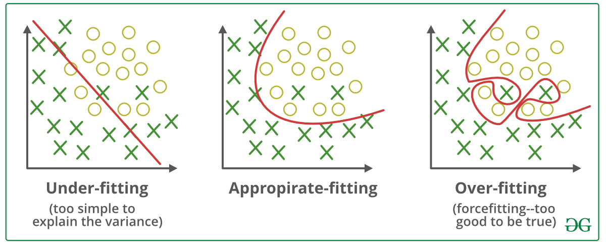
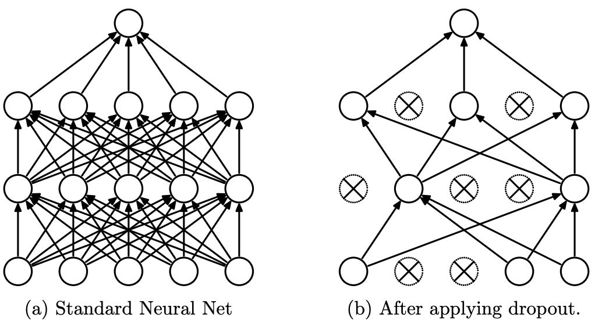

Técnicas de regularização para prevenir overfitting em MLPs, como dropout, regularizações L1 e L2, batch normalization e early stopping.

!!! info "Equilíbrio Entre Viés e Variância"

    A relação entre viés e variância é frequentemente chamada de tradeoff viés-variância, que destaca a necessidade de equilíbrio:

    Aumentar a complexidade do modelo reduz o viés mas aumenta a variância (risco de overfitting).
    Simplificar o modelo reduz a variância mas aumenta o viés (risco de underfitting).
    O objetivo é encontrar um equilíbrio ótimo onde ambos sejam minimizados, resultando em bom desempenho de generalização.

    
    /// caption
    Ilustração de underfitting e overfitting em redes neurais. Fonte: [GeeksforGeeks](https://www.geeksforgeeks.org/machine-learning/underfitting-and-overfitting-in-machine-learning/)
    ///

    

    -   __Reduzindo Underfitting__

        ---

        - Aumentar a complexidade do modelo.
        - Aumentar o número de features, realizando engenharia de features.
        - Remover ruído dos dados.
        - Aumentar o número de épocas ou a duração do treinamento para obter melhores resultados.

    -   __Reduzindo Overfitting__

        ---

        - Melhorar a qualidade dos dados de treinamento reduz o overfitting ao focar em padrões significativos.
        - Aumentar os dados de treinamento pode melhorar a capacidade do modelo de generalizar.
        - Reduzir a complexidade do modelo.
        - Early stopping durante a fase de treinamento.
        - Regularização Ridge e Lasso.
        - Usar dropout em redes neurais.
    
    

---

## Dropout

Dropout[^1] é uma técnica de regularização onde, durante o treinamento, um subconjunto aleatório de neurônios (ou suas conexões) é "descartado" (definido como zero) em cada passagem direta e reversa. Isso impede que a rede dependa muito de neurônios específicos.

Durante o treinamento, cada neurônio tem uma probabilidade $p$ (tipicamente 0,2 a 0,5) de ser descartado. Isso força a rede a aprender representações redundantes, tornando-a mais robusta e menos propensa a memorizar os dados de treinamento. No momento de teste, todos os neurônios estão ativos, mas seus pesos são escalados por $1-p$.

O Dropout age como se estivesse treinando um ensemble de sub-redes menores, reduzindo a co-dependência entre neurônios.

/// caption
Modelo de Rede Neural com Dropout. Esquerda: rede padrão com 2 camadas ocultas. Direita: exemplo de rede reduzida produzida aplicando dropout. Unidades com X foram descartadas. Fonte: [Dropout: A Simple Way to Prevent Neural Networks from Overfitting](https://www.cs.toronto.edu/~hinton/absps/JMLRdropout.pdf){:target="_blank"}
///

### Dicas Práticas

- Taxas comuns: 20–50% para camadas ocultas, menor (10–20%) para camadas de entrada.
- Use em redes profundas, especialmente em camadas totalmente conectadas ou CNNs.
- Evite dropout na camada de saída ou quando a rede é pequena.

-   __Prós__

    ---

    - Eficaz para redes profundas;
    - Computacionalmente barato.

-   __Contras__

    ---

    - Requer ajuste de $p$; pode desacelerar a convergência;
    - Pode não funcionar bem com todos os datasets;
    - Pode introduzir ruído, dificultando a otimização.

---

## Regularizações L1 e L2

- **Regularização L1 (Lasso)** adiciona um termo de penalidade à função de perda baseado nos valores absolutos dos pesos do modelo, incentivando esparsidade na matriz de pesos:

    $$\text{Perda} = \text{Perda Original} + \lambda \sum |w_i|$$

    onde $w_i$ são os pesos do modelo e $\lambda$ controla o impacto da penalidade.

- **Regularização L2 (Weight Decay)** adiciona um termo de penalidade baseado na magnitude dos pesos, desencorajando pesos grandes que podem levar a modelos complexos e com overfitting:

    $$\text{Perda} = \text{Perda Original} + \lambda \sum w_i^2$$

    Durante a otimização, essa penalidade incentiva pesos menores, simplificando o modelo.

### Diferenças Principais

- **L1**: Incentiva **modelos esparsos** (alguns pesos = 0), útil para seleção de features.
- **L2**: Produz **pesos pequenos mas não-nulos**, geralmente levando a melhor generalização em redes neurais profundas.

### Dicas Práticas

- $\lambda$ comum: $10^{-5}$ a $10^{-2}$, ajustado por validação cruzada.
- Funciona bem em modelos lineares, NNs totalmente conectadas e CNNs.
- Combine com outras técnicas (ex: dropout) para melhores resultados.

-   __Prós__

    ---

    - Incentiva modelos mais simples;
    - Pode melhorar a generalização.

-   __Contras__

    ---

    - Requer ajuste cuidadoso de $\lambda$;
    - Pode não funcionar bem com todos os datasets.

---

## Batch Normalization

Batch Normalization[^2] é uma técnica para melhorar o treinamento de redes neurais profundas normalizando as entradas de cada camada. Reduz o deslocamento interno de covariáveis (internal covariate shift), permitindo treinamento mais rápido.

Durante o treinamento, normaliza as entradas de uma camada para cada mini-batch:

$$\hat{x} = \frac{x - \mu}{\sigma + \epsilon}$$

onde $\mu$ é a média do batch, $\sigma$ é o desvio padrão e $\epsilon$ é uma constante pequena para estabilidade numérica.

Após a normalização, a camada pode aprender parâmetros de escala ($\gamma$) e deslocamento ($\beta$):

$$y = \gamma \hat{x} + \beta$$

### Dicas Práticas

- Use batch normalization após camadas convolucionais ou totalmente conectadas.
- Pode ser usada com outras técnicas de regularização (ex: dropout).

-   __Prós__

    ---

    - Acelera o treinamento;
    - Permite taxas de aprendizado maiores;
    - Reduz sensibilidade à inicialização.

-   __Contras__

    ---

    - Adiciona complexidade ao modelo;
    - Pode não melhorar sempre o desempenho.

---

## Early Stopping

O Early Stopping é uma técnica de regularização usada para prevenir overfitting em modelos de aprendizado de máquina. A ideia é monitorar o desempenho do modelo em um conjunto de validação durante o treinamento e parar o treinamento quando o desempenho começar a piorar.

Os passos principais são:

1. **Dividir os Dados**: Dividir o dataset em conjuntos de treinamento, validação e teste.
2. **Monitorar o Desempenho**: Durante o treinamento, avaliar periodicamente o modelo no conjunto de validação.
3. **Definir Paciência**: Definir um parâmetro de paciência — o número de épocas para aguardar por uma melhora antes de parar.
4. **Parar o Treinamento**: Se o desempenho de validação não melhorar pelo número de épocas especificado, parar o treinamento.

### Dicas Práticas

- Use early stopping em conjunto com outras técnicas de regularização para melhores resultados.
- Monitore múltiplas métricas para tomar decisões informadas sobre quando parar.

-   __Prós__

    ---

    - Ajuda a prevenir overfitting;
    - Pode economizar tempo de treinamento.

-   __Contras__

    ---

    - Requer ajuste cuidadoso da paciência;
    - Pode parar o treinamento muito cedo.

---

## Recursos Adicionais

<iframe width="100%" height="470" src="https://www.youtube.com/embed/EuBBz3bI-aA" title="Machine Learning Fundamentals: Bias and Variance" frameborder="0" allow="accelerometer; autoplay; clipboard-write; encrypted-media; gyroscope; picture-in-picture; web-share" referrerpolicy="strict-origin-when-cross-origin" allowfullscreen></iframe>

[^1]: [Dropout: A Simple Way to Prevent Neural Networks from Overfitting](https://jmlr.org/papers/volume15/srivastava14a/srivastava14a.pdf){:target="_blank"}, Srivastava, N. et al.
[^2]: [Batch Normalization: Accelerating Deep Network Training by Reducing Internal Covariate Shift](https://arxiv.org/abs/1502.03167){:target="_blank"}, Ioffe, S., & Szegedy, C.

---

--8<-- "docs/2026.2/classes/regularization/quiz.pt.md"
