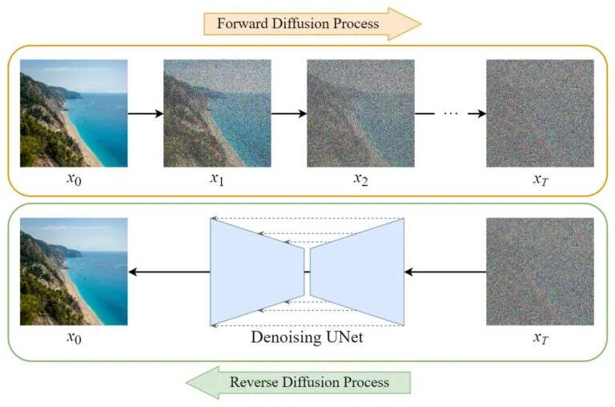
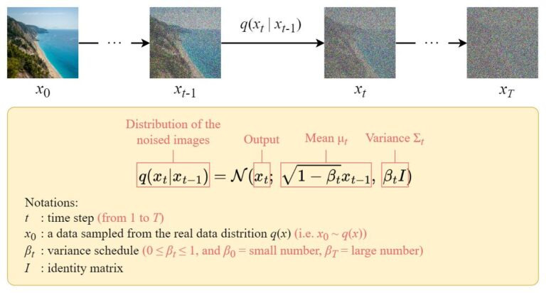
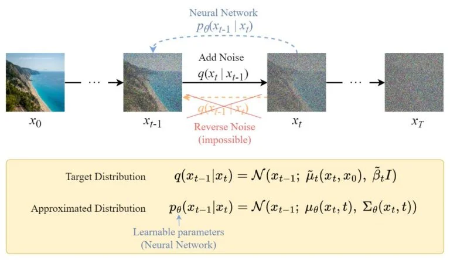
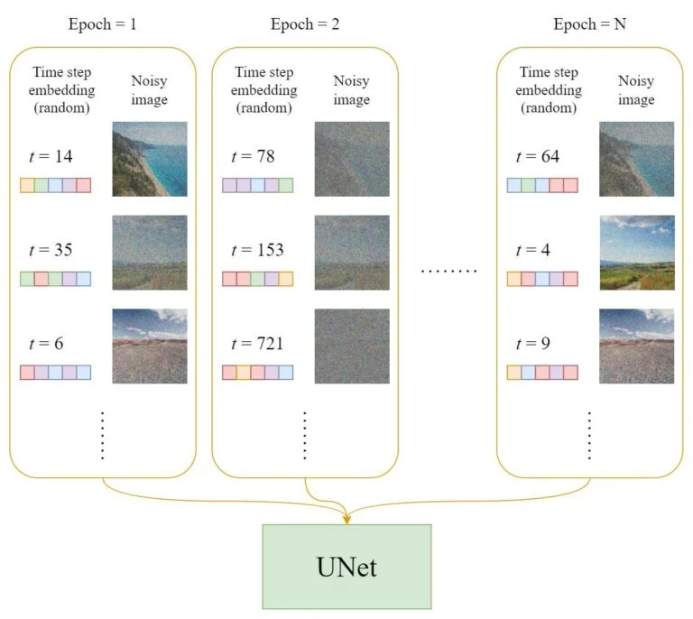
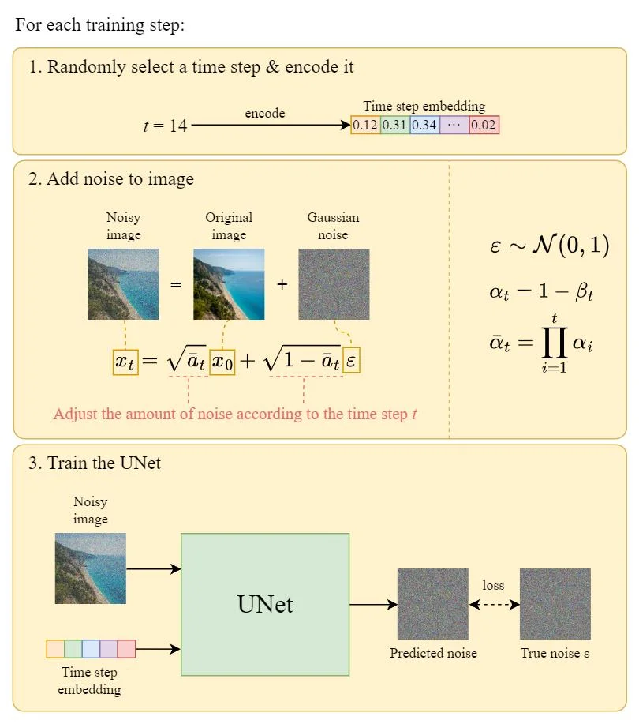
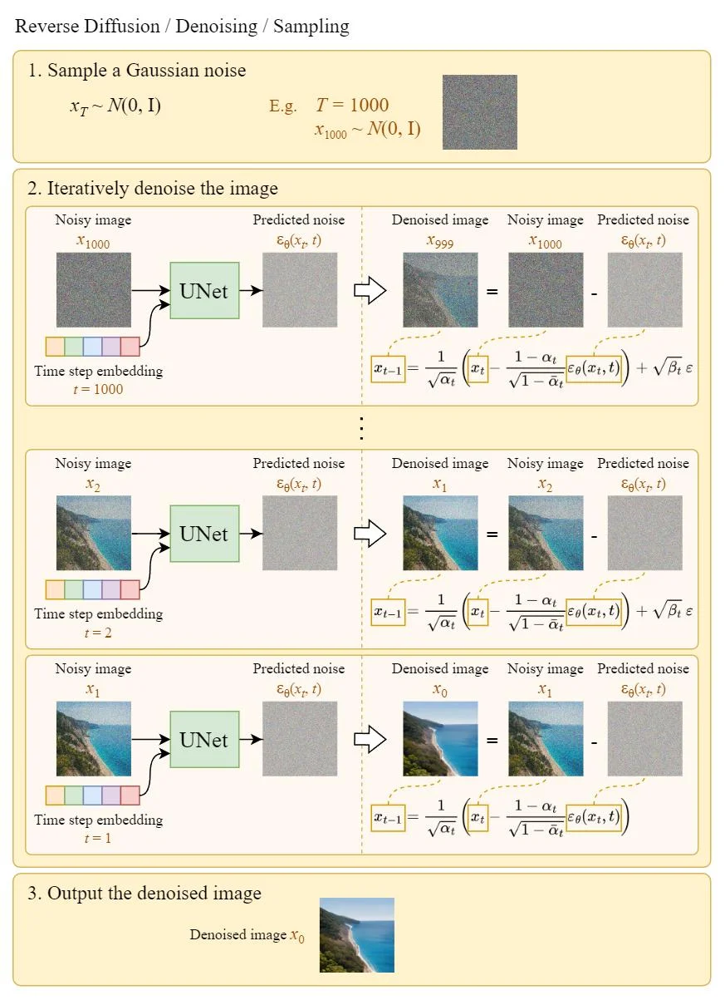
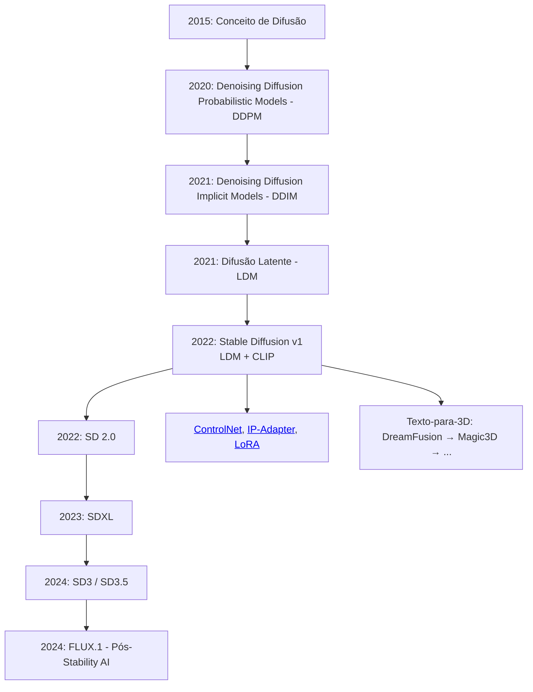
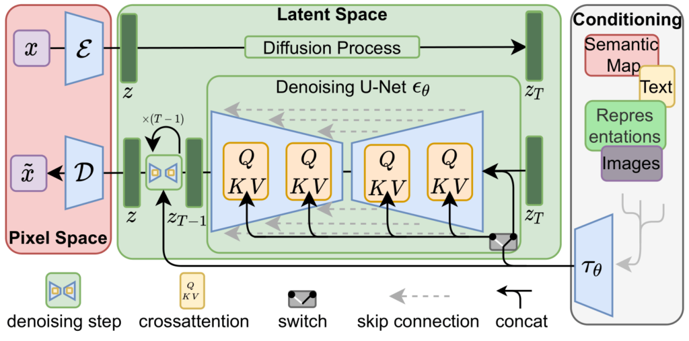
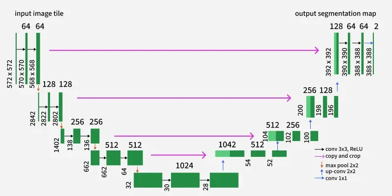

Stable Diffusion é um modelo generativo de texto-para-imagem de última geração desenvolvido pela Stability AI em colaboração com pesquisadores da [EleutherAI](https://www.eleuther.ai/){:target="_blank"} e [LAION](https://laion.ai/){:target="_blank"}. Ele aproveita Modelos de Difusão Latente (LDMs) para gerar imagens de alta qualidade a partir de descrições textuais de forma eficiente. O Stable Diffusion ganhou atenção significativa por sua capacidade de produzir imagens detalhadas e diversas.

O modelo é baseado nos princípios dos modelos de difusão, que envolvem um processo de dois passos: primeiro, adicionar ruído a uma imagem para criar uma versão ruidosa, e depois treinar uma rede neural para reverter esse processo desruidizando a imagem passo a passo. O Stable Diffusion opera em um espaço latente, o que permite gerar imagens de forma mais eficiente do que modelos de difusão no espaço de pixels.

---


## Modelos de Difusão

Modelos de difusão são treinados para prever uma forma de desruidizar levemente uma amostra em cada passo, e após algumas iterações, um resultado é obtido. Modelos de difusão já foram aplicados a uma variedade de tarefas de geração, como síntese de imagens, fala, formas 3D e grafos.

Modelos de difusão consistem em dois passos:

<div class="grid cards" markdown>

-   **Difusão Direta**

    ---

    Mapeia dados para ruído perturbando gradualmente os dados de entrada. Isso é formalmente alcançado por um processo estocástico simples que começa a partir de uma amostra de dados e iterativamente gera amostras mais ruidosas usando um simples kernel de difusão gaussiana.
    
    {==
    
    Este processo é usado apenas durante o treinamento e não na inferência.

    ==}

-   **Difusão Reversa**

    ---

    Desfaz a difusão direta e realiza desruidização iterativa. Este processo representa a síntese de dados e é treinado para gerar dados convertendo ruído aleatório em dados realistas.

</div>

{:style="max-width: 100%; height: auto;"}
/// caption
Visão geral do DDPM. Fonte: [^12].
///

### Processo de Difusão Direta

No processo de difusão direta, uma amostra de dados \( x_0 \) (ex: uma imagem) é gradualmente corrompida pela adição de ruído gaussiano ao longo de uma série de passos de tempo \( t = 1, 2, \ldots, T \). Em cada passo de tempo, uma pequena quantidade de ruído é adicionada à amostra, resultando em uma sequência de amostras progressivamente mais ruidosas. O processo pode ser descrito matematicamente como:

\[
q(x_t | x_{t-1}) = \mathcal{N}(x_t; \sqrt{1 - \beta_t} x_{t-1}, \beta_t I)
\]

onde \( \beta_t \) é um cronograma de variância que controla a quantidade de ruído adicionada em cada passo.

{:style="max-width: 100%; height: auto;"}
/// caption
Processo de Difusão Direta. Fonte: [^12].
///

### Processo de Difusão Reversa

O processo de difusão reversa visa reconstruir a amostra de dados original a partir da versão ruidosa, desruidizando-a iterativamente. Uma rede neural, tipicamente uma arquitetura U-Net, é treinada para prever o ruído adicionado em cada passo de tempo. O processo reverso pode ser expresso como:

\[
p_\theta(x_{t-1} | x_t) = \mathcal{N}(x_{t-1}; \mu_\theta(x_t, t), \Sigma_\theta(x_t, t))
\]

onde \( \mu_\theta \) e \( \Sigma_\theta \) são a média e covariância previstas pela rede neural parametrizada por \( \theta \).

{:style="max-width: 100%; height: auto;"}
/// caption
Processo de Difusão Reversa. Fonte: [^12].
///

Ao contrário do processo direto, não podemos usar \( q(x_{t-1} | x_t) \) diretamente porque requer conhecimento da distribuição de dados original — ==é intratável (incomputável)==. Em vez disso, treinamos a rede neural para aproximar essa distribuição minimizando uma função de perda.

### Treinamento da U-Net

A U-Net é treinada usando um dataset de imagens [^8].

#### Dataset

Em cada época:

1. Um passo de tempo aleatório \( t \) será selecionado para cada amostra de treinamento (imagem).
1. Aplicar o ruído gaussiano (correspondente a \( t \)) a cada imagem.
1. Converter os passos de tempo em embeddings (vetores).

{:style="max-width: 100%; height: auto;"}
/// caption
Preparação do Dataset de Treinamento da U-Net. Fonte: [^8].
///

#### Treinamento

O diagrama a seguir ilustra como um passo de treinamento funciona:

{:style="max-width: 100%; height: auto;"}
/// caption
Passo de Treinamento da U-Net. Fonte: [^8].
///

#### Difusão Reversa / Desruidização / Amostragem

Uma vez que a U-Net é treinada, o processo de difusão reversa pode ser usado para gerar novas imagens a partir de ruído aleatório:

{:style="max-width: 100%; height: auto;"}
/// caption
Amostragem da U-Net. Fonte: [^8].
///


---


## Marcos




---


## Stable Diffusion

O Stable Diffusion é um modelo generativo de texto-para-imagem que utiliza Modelos de Difusão Latente (LDMs) para criar imagens de alta qualidade a partir de descrições textuais. O modelo opera em um espaço latente, o que permite síntese eficiente de imagens mantendo alta fidelidade.

A arquitetura do Stable Diffusion consiste em três componentes principais:

- **O Codificador de Texto**: Um codificador de texto pré-treinado (como CLIP) é usado para converter o prompt de texto de entrada em um embedding semântico que guia o processo de desruidização.

- **O Modelo de Difusão**: O núcleo do LDM é uma arquitetura U-Net que aprende a desruidizar as representações latentes. Recebe como entrada o tensor latente ruidoso e o embedding de texto (do codificador de texto) e refina iterativamente a representação latente ao longo de uma série de passos de tempo.

- **O Autoencoder**: A entrada do modelo é um ruído aleatório do tamanho da saída desejada. Primeiro, reduz a amostra para um espaço latente de menor dimensão. Para isso, os autores usaram a [Arquitetura VAE](../variational-autoencoders/index.md), que consiste em duas partes — encoder e decoder.

{:style="max-width: 100%; height: auto;"}
/// caption
Arquitetura do Modelo de Difusão Latente. Fonte: [^6].
///

### Inferência

=== "Pipeline Simplificado"

    ```mermaid
    graph TD
        A[Prompt de Texto] --> B(Codificador de Texto CLIP)
        B --> C[Embedding de Texto]

        D[Ruído Aleatório<br><small>Latente</small>] --> E[Modelo de Difusão<br><small>UNet + Agendador</small>]
        C --> E

        E --> F[Imagem Latente<br><small>após desruidização</small>]

        F --> G(Decoder VAE)
        G --> H[Imagem Final<br><small>em pixels</small>]

        subgraph "Espaço Latente"
            D
            E
            F
        end

        style A fill:#a8e6cf,stroke:#333
        style B fill:#ffccbc,stroke:#333
        style C fill:#ffccbc,stroke:#333
        style D fill:#ffd3b6,stroke:#333
        style E fill:#dcedc1,stroke:#333
        style F fill:#dcedc1,stroke:#333
        style G fill:#c7ceea,stroke:#333
        style H fill:#c7ceea,stroke:#333
    ```

O processo de inferência envolve:

1. **Codificação do Texto**: O prompt de texto de entrada é processado usando um codificador de texto (como CLIP) para gerar um embedding de texto.

2. **Inicialização no Espaço Latente**: Um tensor de ruído aleatório é gerado no espaço latente.

3. **Processo de Difusão**: O modelo de difusão (U-Net) recebe o tensor latente ruidoso e o embedding de texto, e desruidiza iterativamente o tensor latente guiado pelo embedding de texto.

4. **Decodificação de Imagem**: Após a desruidização, a representação latente final é passada por um decoder VAE para converter de volta ao espaço de pixels.


---


## Adicional

### DDPM vs DDIM

| Aspecto | DDPM | DDIM |
|--------|------|------|
| Natureza | Probabilística | Determinística |
| Velocidade | Mais passos (mais lento) | Menos passos (mais rápido) |
| Qualidade | Alta variabilidade | Mais consistente |


### Arquitetura U-Net

U-Net é uma arquitetura de rede neural convolucional originalmente projetada para segmentação de imagens biomédicas[^13]. Foi amplamente adotada em várias tarefas de geração de imagens, incluindo modelos de difusão como o Stable Diffusion. A arquitetura U-Net é caracterizada por sua estrutura em formato de U, que consiste em um encoder (caminho de contração) e um decoder (caminho de expansão) com conexões de salto entre camadas correspondentes.

{:max-width: 100%; height: auto;}
/// caption
Arquitetura U-Net. Fonte: [^14].
///


### Vídeos

=== "Deepia: DDPM"

    **Deepia: Diffusion Models: DDPM | Generative AI Animated**

    <iframe width="100%" height="480" src="https://www.youtube.com/embed/EhndHhIvWWw" title="Diffusion Models: DDPM | Generative AI Animated" frameborder="0" allow="accelerometer; autoplay; clipboard-write; encrypted-media; gyroscope; picture-in-picture; web-share" referrerpolicy="strict-origin-when-cross-origin" allowfullscreen></iframe>

=== "Deepia: Score-based"

    **Deepia: Score-based Diffusion Models | Generative AI Animated**

    <iframe width="100%" height="480" src="https://www.youtube.com/embed/lUljxdkolK8" title="Score-based Diffusion Models | Generative AI Animated" frameborder="0" allow="accelerometer; autoplay; clipboard-write; encrypted-media; gyroscope; picture-in-picture; web-share" referrerpolicy="strict-origin-when-cross-origin" allowfullscreen></iframe>

=== "Latent Diffusion Models"

    <iframe width="100%" height="480" src="https://www.youtube.com/embed/wuwByIh5kDU" title="Latent Diffusion Models" frameborder="0" allow="accelerometer; autoplay; clipboard-write; encrypted-media; gyroscope; picture-in-picture; web-share" referrerpolicy="strict-origin-when-cross-origin" allowfullscreen></iframe>


[^1]: [Deep Unsupervised Learning using Nonequilibrium Thermodynamics](https://arxiv.org/abs/1503.03585){:target="_blank"}, 2015.

[^2]: [Denoising Diffusion Probabilistic Models](https://arxiv.org/abs/2006.11239){:target="_blank"}, 2020.

[^3]: [Denoising Diffusion Implicit Models](https://arxiv.org/abs/2010.02502){:target="_blank"}, 2020.

[^4]: [Latent Diffusion Models](https://github.com/CompVis/latent-diffusion){:target="_blank"}, 2021.

[^5]: [Hugging Face - Stable Diffusion v1 - Release](https://huggingface.co/blog/stable_diffusion){:target="_blank"}

[^6]: [Dagshub - Stable Diffusion: Best Open Source Version of DALL-E 2](https://dagshub.com/blog/stable-diffusion-best-open-source-version-of-dall-e-2/){:target="_blank"}

[^7]: [Score-Based Generative Modeling through Stochastic Differential Equations](https://arxiv.org/abs/2011.13456){:target="_blank"}

[^8]: [Diffusion Models Clearly Explained](https://codoraven.com/blog/ai/diffusion-model-clearly-explained/){:target="_blank"}

[^9]: [Generate Images from Text in Python - Stable Diffusion](https://www.geeksforgeeks.org/deep-learning/generate-images-from-text-in-python-stable-diffusion/){:target="_blank"}

[^12]: [How to Run Stable Diffusion: A Step-by-Step Guide](https://www.datacamp.com/tutorial/how-to-run-stable-diffusion){:target="_blank"}

[^13]: [U-Net: Convolutional Networks for Biomedical Image Segmentation](https://arxiv.org/abs/1505.04597){:target="_blank"}

[^14]: GeeksForGeeks - [U-Net Architecture Explained](https://www.geeksforgeeks.org/machine-learning/u-net-architecture-explained/){:target="_blank"}

---

--8<-- "docs/2026.2/classes/stable-diffusion/quiz.pt.md"
