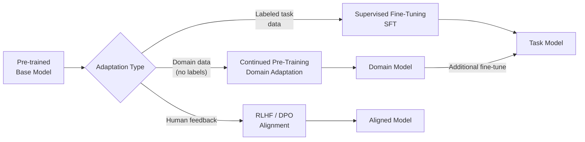

## Transfer Learning and Fine-Tuning

Training a deep neural network from scratch requires enormous amounts of labeled data and compute. **Transfer Learning** solves this: instead of random weight initialization, we start from a model already trained on a rich task (usually at large scale) and adapt it to our specific task.

The intuition: the early layers of a CNN trained on ImageNet learn edge, texture, and shape detectors — useful for *any* vision task. The later layers specialize in ImageNet categories. We replace those final layers and fine-tune the model.

---

## Taxonomy of Approaches

<div id="tl-taxonomy" style="background:#0d1117;border-radius:12px;padding:1.5rem;margin:2rem 0;overflow:hidden;">
<canvas id="tl-canvas" style="width:100%;display:block;"></canvas>
</div>

<script>
(function() {
  const canvas = document.getElementById('tl-canvas');
  const ctx = canvas.getContext('2d');

  function draw() {
    const W = canvas.parentElement.offsetWidth - 48;
    const H = 260;
    canvas.width = W; canvas.height = H;
    canvas.style.height = H + 'px';
    ctx.fillStyle = '#0d1117'; ctx.fillRect(0,0,W,H);

    const approaches = [
      { label: "Feature Extraction", sub: "Freeze all pre-trained\nweights, train\nonly final head", color: '#58a6ff', frozen: 5, trained: 1 },
      { label: "Partial Fine-Tuning", sub: "Freeze early layers,\nfine-tune final layers\n+ head", color: '#3fb950', frozen: 3, trained: 3 },
      { label: "Full Fine-Tuning", sub: "Train all weights\nwith very small lr\n(1e-5)", color: '#f0883e', frozen: 0, trained: 6 },
      { label: "LoRA / PEFT", sub: "Freeze everything, add\ntrainable low-rank\nmatrices", color: '#bc8cff', frozen: 6, trained: 0, lora: true },
    ];

    const colW = (W - 20) / approaches.length;
    const layerH = 26;
    const totalLayers = 6;
    const startY = 20;

    approaches.forEach((a, col) => {
      const cx = col * colW + colW/2 + 10;

      ctx.fillStyle = a.color; ctx.font = 'bold 11px Inter,sans-serif';
      ctx.textAlign = 'center'; ctx.fillText(a.label, cx, startY + 8);

      for (let l = 0; l < totalLayers; l++) {
        const ly = startY + 22 + l * (layerH + 4);
        const isFrozen = a.lora ? true : l < a.frozen;

        ctx.fillStyle = isFrozen ? '#21262d' : a.color + '88';
        ctx.beginPath(); ctx.roundRect(cx - 45, ly, 90, layerH, 4); ctx.fill();
        ctx.strokeStyle = isFrozen ? '#30363d' : a.color;
        ctx.lineWidth = 1; ctx.stroke();

        ctx.fillStyle = isFrozen ? '#484f58' : '#0d1117';
        ctx.font = '9px monospace'; ctx.textAlign = 'center'; ctx.textBaseline = 'middle';
        ctx.fillText(l < 3 ? 'Layer ' + (l+1) + ' (low)' : 'Layer ' + (l+1) + ' (high)', cx, ly + layerH/2);

        if (a.lora) {
          ctx.fillStyle = '#bc8cff44';
          ctx.beginPath(); ctx.roundRect(cx + 48, ly + 3, 22, layerH - 6, 3); ctx.fill();
          ctx.strokeStyle = '#bc8cff'; ctx.lineWidth = 1; ctx.stroke();
          ctx.fillStyle = '#bc8cff'; ctx.font = '7px monospace';
          ctx.fillText('LoRA', cx + 59, ly + layerH/2);
        }
      }

      const headY = startY + 22 + totalLayers * (layerH + 4) + 4;
      ctx.fillStyle = a.color;
      ctx.beginPath(); ctx.roundRect(cx - 45, headY, 90, layerH, 4); ctx.fill();
      ctx.fillStyle = '#0d1117'; ctx.font = 'bold 9px monospace'; ctx.textBaseline = 'middle';
      ctx.fillText('Task Head', cx, headY + layerH/2);

      ctx.fillStyle = '#8b949e'; ctx.font = '9px Inter,sans-serif';
      const lines = a.sub.split('\n');
      lines.forEach((line, li) => ctx.fillText(line, cx, headY + layerH + 12 + li*12));
    });

    ctx.fillStyle = '#30363d'; ctx.fillRect(0, H - 22, W, 1);
    [['#21262d','Frozen'],['#58a6ff88','Trainable'],['#bc8cff','LoRA Adapter']].forEach(([c,l],i) => {
      ctx.fillStyle = c; ctx.fillRect(10+i*130, H-16, 12, 10);
      ctx.strokeStyle = c === '#21262d' ? '#30363d' : c; ctx.lineWidth=1;
      ctx.strokeRect(10+i*130, H-16, 12, 10);
      ctx.fillStyle = '#8b949e'; ctx.font = '9px Inter,sans-serif'; ctx.textAlign='left';
      ctx.fillText(l, 26+i*130, H-8);
    });
  }

  draw(); window.addEventListener('resize', draw);
})();
</script>

---

## LoRA: Low-Rank Adaptation

LoRA[^2] is the most popular PEFT (*Parameter-Efficient Fine-Tuning*) technique. The idea is simple and elegant:

For a frozen pre-trained weight matrix $W_0 \in \mathbb{R}^{d \times k}$, we add a **low-rank** perturbation:

$$
W = W_0 + \Delta W = W_0 + BA
$$

where $B \in \mathbb{R}^{d \times r}$ and $A \in \mathbb{R}^{r \times k}$, with $r \ll \min(d, k)$.

- During the forward pass: $h = W_0 x + BAx = W_0 x + \Delta W x$
- During training: only $A$ and $B$ update ($W_0$ is frozen)
- Trainable parameters: $r(d + k)$ vs $dk$ in full fine-tuning

**Example with GPT-3 (175B parameters):**

| Configuration | Trainable Params |
|---|---|
| Full fine-tuning | 175 billion |
| LoRA ($r=4$, attention) | **4.7 million** (~0.003%) |
| LoRA ($r=16$, attention) | ~18.9 million |

<div style="background:#161b22;border-radius:8px;padding:1.2rem;margin:1.5rem 0;">

```python
from peft import LoraConfig, get_peft_model
from transformers import AutoModelForCausalLM

model = AutoModelForCausalLM.from_pretrained("meta-llama/Llama-3.1-8B")

lora_config = LoraConfig(
    r=16,                  # matrix rank
    lora_alpha=32,         # scaling (alpha/r = scale factor)
    target_modules=["q_proj", "v_proj"],  # where to apply LoRA
    lora_dropout=0.05,
    bias="none",
    task_type="CAUSAL_LM"
)

model = get_peft_model(model, lora_config)
model.print_trainable_parameters()
# trainable params: 6,815,744 || all params: 8,037,269,504 || trainable%: 0.0848
```

</div>

---

## Interactive: Fine-Tuning Cost Calculator

<div id="cost-viz" style="background:#0d1117;border-radius:12px;padding:1.5rem;margin:2rem 0;color:#e6edf3;font-family:Inter,sans-serif;">

<div style="margin-bottom:1rem;">
  <label style="color:#8b949e;font-size:.85rem;">Model size (billion parameters): </label>
  <input id="model-size" type="range" min="0.1" max="70" step="0.1" value="7" style="width:60%;accent-color:#f0883e;vertical-align:middle;">
  <span id="model-size-val" style="color:#f0883e;font-weight:bold;margin-left:.5rem;"></span>
</div>

<div style="margin-bottom:1rem;">
  <label style="color:#8b949e;font-size:.85rem;">LoRA rank (r): </label>
  <input id="lora-rank" type="range" min="1" max="64" step="1" value="8" style="width:60%;accent-color:#bc8cff;vertical-align:middle;">
  <span id="lora-rank-val" style="color:#bc8cff;font-weight:bold;margin-left:.5rem;"></span>
</div>

<div id="cost-bars" style="margin-top:1.2rem;"></div>
</div>

<script>
(function() {
  function update() {
    const B = +document.getElementById('model-size').value;
    const r = +document.getElementById('lora-rank').value;
    document.getElementById('model-size-val').textContent = B.toFixed(1) + 'B';
    document.getElementById('lora-rank-val').textContent = r;

    const fullParams = B;
    const d = Math.round(Math.sqrt(B * 1e9 / 32));
    const loraParams = (4 * r * d * 2 * 32) / 1e9;
    const fullVRAM = B * 16;
    const loraVRAM = B * 2 + loraParams * 16;

    const bars = [
      { label: "Full Fine-Tuning (trainable parameters)", val: fullParams, max: fullParams, unit: "B params", color: '#f0883e' },
      { label: "LoRA (trainable parameters)", val: loraParams, max: fullParams, unit: "B params", color: '#bc8cff' },
      { label: "Full FT — estimated VRAM", val: fullVRAM, max: fullVRAM * 1.1, unit: "GB", color: '#d29922' },
      { label: "LoRA — estimated VRAM (QLoRA 4-bit)", val: loraVRAM, max: fullVRAM * 1.1, unit: "GB", color: '#3fb950' },
    ];

    document.getElementById('cost-bars').innerHTML = bars.map(b => {
      const pct = Math.min(100, (b.val / b.max) * 100);
      return '<div style="margin:.5rem 0;"><div style="color:#8b949e;font-size:.8rem;margin-bottom:.2rem;">' + b.label + '</div><div style="display:flex;align-items:center;gap:.8rem;"><div style="flex:1;background:#21262d;border-radius:4px;height:20px;overflow:hidden;"><div style="width:' + pct + '%;height:100%;background:' + b.color + ';border-radius:4px;transition:width .4s;"></div></div><span style="color:' + b.color + ';font-weight:bold;font-size:.9rem;width:90px;text-align:right;">' + b.val.toFixed(2) + ' ' + b.unit + '</span></div></div>';
    }).join('');
  }

  document.getElementById('model-size').addEventListener('input', update);
  document.getElementById('lora-rank').addEventListener('input', update);
  update();
})();
</script>

---

## Other PEFT Techniques

| Technique | Idea | Parameters |
|-----------|------|-----------|
| **LoRA** | Low-rank matrices on attention weights | $r(d+k)$ per layer |
| **QLoRA** | LoRA + model frozen in 4-bit (NF4) | ~LoRA, reduced VRAM |
| **Prefix Tuning** | Learns virtual tokens prepended to the sequence | $\text{num\_prefix} \times d_{\text{model}}$ |
| **Prompt Tuning** | Only prompt embeddings are trainable | $\text{num\_tokens} \times d_{\text{model}}$ |
| **Adapter Layers** | Inserts small FFN layers between existing ones | $2 \times r \times d$ per layer |
| **DoRA** | LoRA decomposed into magnitude + direction | Similar to LoRA |

---

## Domain Adaptation vs. Task Adaptation



**Practical recipe for LLM fine-tuning (2025):**

1. Start with a suitable base model (LLaMA-3, Mistral, Gemma)
2. Quantize to 4-bit (QLoRA) if VRAM is limited
3. Apply LoRA with $r \in \{8, 16, 32\}$ on Q and V projections
4. Use `TRL` + `SFTTrainer` for supervised fine-tuning
5. Optionally apply DPO for preference alignment

---

## When to Use Each Approach

| Situation | Recommendation |
|----------|---------------|
| Task data: < 1,000 samples | Feature Extraction or Prompt Tuning |
| Data: 1k–100k samples, limited hardware | LoRA/QLoRA |
| Data: > 100k samples, hardware available | Full Fine-Tuning |
| New domain (medical, legal, code) | Domain Adaptation → Fine-Tuning |
| Alignment with values/preferences | SFT → RLHF or DPO |

---

[^1]: Pan, S. J., & Yang, Q. (2010). [A Survey on Transfer Learning](https://doi.org/10.1109/TKDE.2009.191){:target="_blank"}. IEEE TKDE.
[^2]: Hu, E. et al. (2021). [LoRA: Low-Rank Adaptation of Large Language Models](https://arxiv.org/abs/2106.09685){:target="_blank"}.
[^3]: Dettmers, T. et al. (2023). [QLoRA: Efficient Finetuning of Quantized LLMs](https://arxiv.org/abs/2305.14314){:target="_blank"}.
[^4]: Rafailov, R. et al. (2023). [Direct Preference Optimization](https://arxiv.org/abs/2305.18290){:target="_blank"}.


---

--8<-- "docs/2026.2/classes/transfer-learning/quiz.md"
