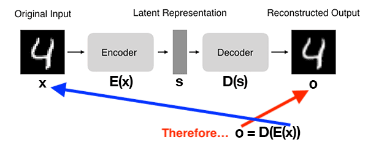
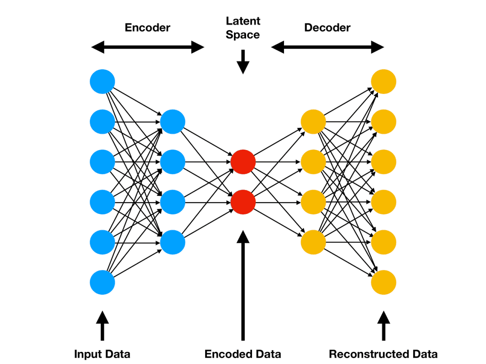
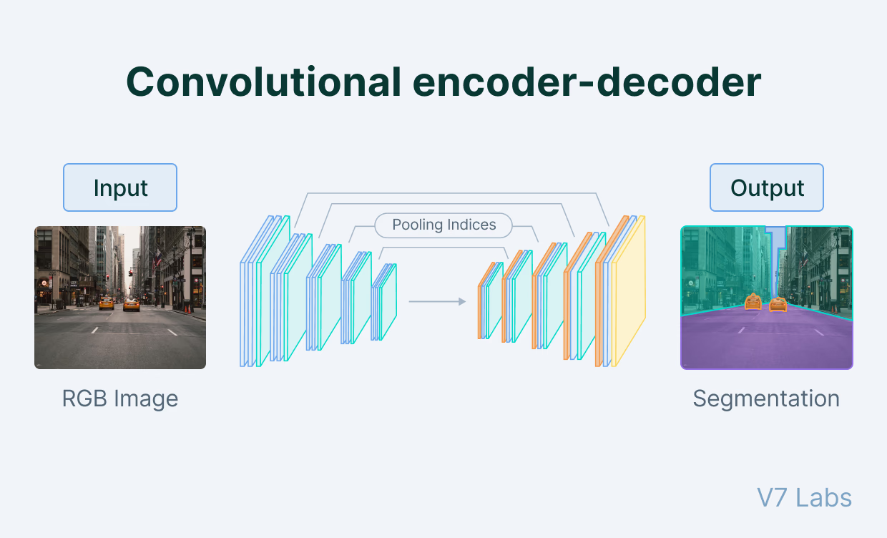
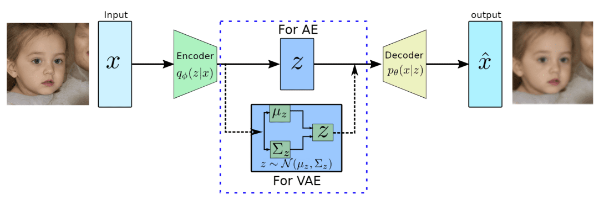
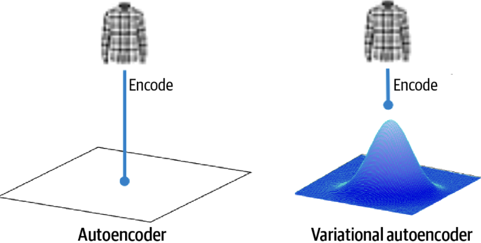
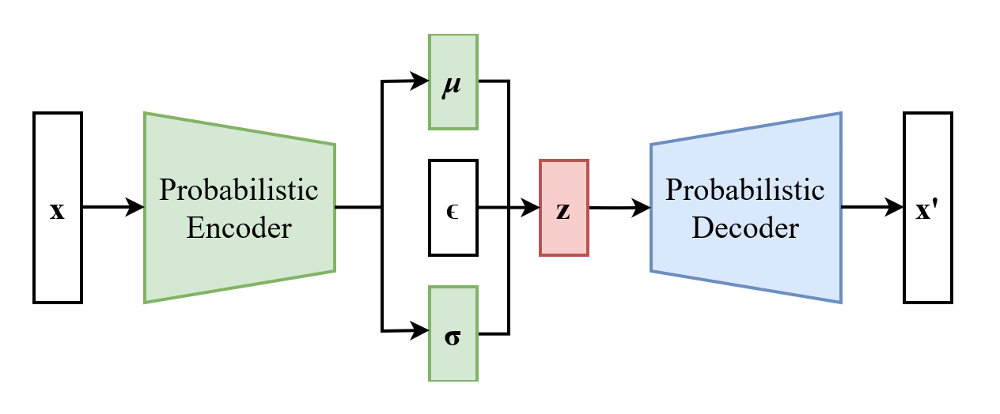

## Autoencoders

**Autoencoders (AEs)** são redes neurais projetadas para aprender:

1. codificações eficientes de dados de entrada, comprimindo-os em uma representação de menor dimensão, e então;
2. reconstruindo-os de volta à forma original.

Autoencoders consistem em dois componentes principais:

- **um encoder**, que comprime dados de entrada em uma representação de menor dimensão conhecida como **espaço latente** ou código. Este espaço latente, frequentemente chamado de embedding, visa reter o máximo de informação possível, permitindo ao decoder reconstruir os dados com alta precisão. Se denotarmos nossos dados de entrada como \( x \) e o encoder como \( E \), então a representação do espaço latente de saída, \( s \), seria \( s=E(x) \).

- **um decoder**, que reconstrói os dados de entrada originais aceitando a representação do espaço latente \( s \). Se denotarmos a função decoder como \( D \) e a saída do decoder como \( o \), então podemos representar o decoder como \( o = D(s) \).

Tanto o encoder quanto o decoder são tipicamente compostos de uma ou mais camadas, que podem ser totalmente conectadas, convolucionais ou recorrentes, dependendo da natureza dos dados de entrada e da arquitetura do autoencoder.[^1] O processo completo do autoencoder pode ser resumido como:

\[
o = D(E(x))
\]

/// caption
Uma ilustração da arquitetura de autoencoders. Fonte: [^1].
///

## Tipos de Autoencoder

Existem vários tipos de autoencoders, cada um com suas particularidades:

### **Autoencoders Vanilla**

Autoencoders vanilla são camadas totalmente conectadas para encoder e decoder. Funcionam para comprimir informações de entrada e são aplicados em dados simples.

{width="90%"}
/// caption
Tanto o encoder quanto o decoder são redes totalmente conectadas. O encoder mapeia os dados de entrada para o espaço latente (espaço comprimido — dados codificados). O decoder mapeia os dados do espaço latente para a saída (dados reconstruídos). Fonte: [^1].
///

O Espaço Latente é uma representação comprimida dos dados de entrada. A dimensionalidade do espaço latente é tipicamente muito menor do que a dos dados de entrada, o que força o autoencoder a aprender uma representação compacta que captura as features mais importantes dos dados.

### **Autoencoders Convolucionais**

Em autoencoders convolucionais, o encoder e o decoder são redes neurais baseadas em Redes Neurais Convolucionais. Portanto, a abordagem é mais intensiva para lidar com dados de imagem.

/// caption
Em autoencoders convolucionais, o encoder e o decoder são baseados em CNNs. Esta arquitetura é particularmente eficaz para dados de imagem, pois pode capturar hierarquias e padrões espaciais. Fonte: [^2].
///

### **Autoencoders Variacionais**

Autoencoders Variacionais (VAEs) são modelos generativos que aprendem a codificar dados em um espaço latente de menor dimensão e depois decodificá-los de volta ao espaço original. VAEs podem gerar novas amostras a partir da distribuição latente aprendida, tornando-os ideais para geração de imagens e transferência de estilo.

/// caption
Um VAE mapeia dados de entrada \( \mathbf{x} \) para o espaço latente \( \mathbf{z} \) e então os reconstrói de volta ao espaço original \( \mathbf{\hat{x}} \) (saída). Fonte: [^2].
///

VAEs foram introduzidos em [2013 por Diederik et al. - Auto-Encoding Variational Bayes](https://arxiv.org/abs/1312.6114){:target="_blank"}.

{width="70%"}
/// caption
*Figura: Comparação entre um Autoencoder padrão e um Autoencoder Variacional (VAE). Em um Autoencoder padrão, o encoder mapeia dados de entrada \( \mathbf{x} \) para uma representação latente fixa \( \mathbf{z} \). Em contraste, um VAE codifica os dados de entrada em uma distribuição sobre o espaço latente, tipicamente modelada como uma distribuição gaussiana com média \( \mu \) e desvio padrão \( \sigma \). Dataset: [Fashion-MNIST](https://github.com/zalandoresearch/fashion-mnist){:target="_blank"}. Fonte: [^3].*
///

#### Características Principais dos VAEs

VAEs têm a capacidade de aprender espaços latentes suaves e contínuos, o que permite interpolação significativa entre pontos de dados. Isso é particularmente útil em aplicações como geração de imagens. A natureza probabilística dos VAEs também ajuda a regularizar o espaço latente, prevenindo overfitting.

Aspectos dos VAEs incluem:

- **Regularização e Continuidade**: O espaço latente nos VAEs é regularizado para seguir uma distribuição a priori (geralmente uma distribuição normal padrão), encorajando um espaço latente contínuo e suave.

- **Simplicidade na Amostragem**: VAEs podem gerar novas amostras simplesmente amostrando do espaço latente da distribuição gaussiana.

- **Truque de Reparametrização**: Para habilitar a retropropagação pelo processo de amostragem estocástica, os VAEs empregam o truque de reparametrização, expressando a variável latente amostrada \( \mathbf{z} \) como uma função determinística de \( \mathbf{x} \) e uma variável de ruído aleatório \( \mathbf{\epsilon} \).

- **Espaço Latente Equilibrado**: O termo de divergência KL na função de perda do VAE encoraja o espaço latente aprendido a ser similar à distribuição a priori.

#### Treinamento de VAEs

VAEs usam a Divergência de Kullback-Leibler (KL) em sua função de perda, que mede a diferença entre a distribuição latente aprendida e a distribuição a priori. A função de perda é uma combinação da perda de reconstrução e do termo de divergência KL.

Queremos encontrar uma distribuição \( p(z|x) \) usando o Teorema de Bayes:

\[
p(z|x) = \displaystyle \frac{p(x|z)p(z)}{p(x)}
\]

Mas o problema é que $p(x)$ é intratável:

\[
p(x) = \displaystyle \int p(x|z)p(z)dz
\]

Esta integral frequentemente é intratável. Portanto, aproximamos com uma distribuição variacional \( q(z|x) \), que é mais fácil de calcular, minimizando a divergência KL entre \( q(z|x) \) e \( p(z|x) \):

\[
\min \text{KL} ( q(z|x) || (z|x) )
\]

Por simplificação, isto equivale ao seguinte problema de maximização:

\[
\mathbb{E}_{q(z|x)}[\log p(x|z)] - \text{KL}(q(z|x) || p(z))
\]

Portanto, a função de perda para treinar um VAE pode ser expressa como:

\[
\mathcal{L} = -\mathbb{E}_{q(z|x)}[\log p(x|z)] + \text{KL}(q(z|x) || p(z))
\]

/// caption
*Figura: Arquitetura básica de um Autoencoder Variacional (VAE). O encoder mapeia dados de entrada \( \mathbf{x} \) para uma representação latente \( \mathbf{z} \), e o decoder reconstrói \( \mathbf{x'} \) a partir de \( \mathbf{z} \). Fonte: [Wikipedia](https://en.wikipedia.org/wiki/Variational_autoencoder){:target="_blank"}*
///

#### Truque de Reparametrização

O truque de reparametrização é uma inovação chave que permite a retropropagação eficiente através das camadas estocásticas de um VAE. Em vez de amostrar \( z \) diretamente de \( q(z|x) \), expressamos \( z \) como uma função determinística de \( x \) e algum ruído \( \epsilon \) retirado de uma distribuição simples (ex: gaussiana):

\[
z = \mu + \sigma \cdot \epsilon
\]

onde \( \mu \) e \( \sigma \) são as saídas de média e desvio padrão do encoder. Esta transformação permite a retropropagação através da rede enquanto mantém a natureza estocástica da variável latente.

---

#### Simulação Numérica

???+ example "VAE - Autoencoder Variacional"

    --8<-- "docs/2026.2/classes/variational-autoencoders/vae-numerical-simulation.md"

---

## Adicional

### Relação entre Log Variância e Desvio Padrão

???+ tip "Relação entre Log Variância e Desvio Padrão"

    - Nos VAEs, o encoder produz a média \( \mu \) e a log variância \( \log(\sigma^2) \) da distribuição do espaço latente.
    - O desvio padrão \( \sigma \) pode ser derivado da log variância usando a relação:

    \[
    \sigma = \exp\left(\frac{1}{2} \log(\sigma^2)\right)
    \]

    - Esta transformação garante estabilidade numérica e positividade da variância durante o treinamento.

    ---

    --8<-- "docs/2026.2/classes/variational-autoencoders/relation-log-variance-std.md"

[^1]: [Sharma, A. "Introduction to Autoencoders," PyImageSearch, 2023](https://pyimg.co/ehnlf){:target="_blank"}.

[^2]: [Bandyopadhyay, H. "What is an autoencoder and how does it work?"](https://www.v7labs.com/blog/autoencoders-guide){:target="_blank"}.

[^3]: [Sharma, A. "A Deep Dive into Variational Autoencoders with PyTorch," PyImageSearch, 2023](https://pyimg.co/7e4if){:target="_blank"}.

[^4]: [Wikipedia - Kullback–Leibler divergence](https://en.wikipedia.org/wiki/Kullback%E2%80%93Leibler_divergence){:target="_blank"}.

[^5]: [GeeksforGeeks - Understanding KL Divergence in PyTorch](https://www.geeksforgeeks.org/deep-learning/understanding-kl-divergence-in-pytorch/){:target="_blank"}.

[^6]: [DataCamp - Variational Autoencoders](https://www.datacamp.com/tutorial/variational-autoencoders){:target="_blank"}.

[^7]: [Variational AutoEncoders (VAE) with PyTorch](https://avandekleut.github.io/vae/){:target="_blank"}.

---

--8<-- "docs/2026.2/classes/variational-autoencoders/quiz.pt.md"
