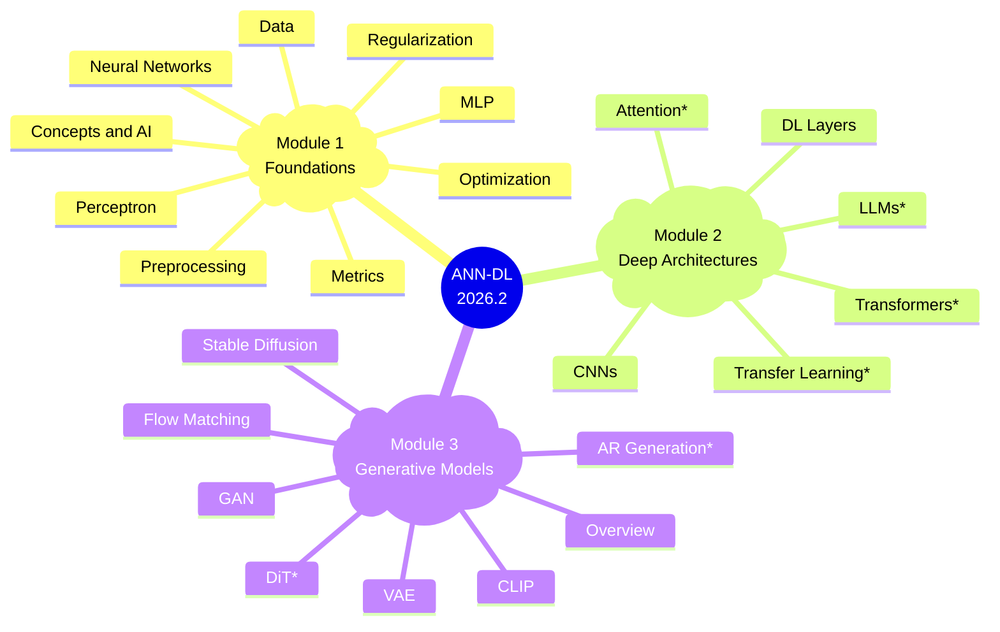

# 2026.2 — Artificial Neural Networks and Deep Learning

## Instructor

| :fontawesome-regular-address-book: | :fontawesome-regular-envelope: |
|-|-:|
| [Humberto Sandmann](https://hsandmann.github.io){target='_blank'} | [humbertors@insper.edu.br](mailto:humbertors@insper.edu.br){target='_blank'} |

## Schedule

| :octicons-location-24: | :fontawesome-regular-calendar: | :fontawesome-regular-clock: |
|-|:-:|:-:|
| Lecture | - | -h00 :fontawesome-solid-arrow-right-long: -h00 |
| Lecture | - | -h00 :fontawesome-solid-arrow-right-long: -h00 |
| Office Hours | - | -h00 :fontawesome-solid-arrow-right-long: -h30 |

## Final Grade

$$
\text{Final} = \left\{\begin{array}{lll}
    \text{Individual} \geq 5 \bigwedge \text{Team} \geq 5 &
    \implies &
    \displaystyle \frac{ \text{Individual} + \text{Team} } {2}
    \\
    \\
    \text{Otherwise} &
    \implies &
    \min\left(\text{Individual}, \text{Team}\right)
    \end{array}\right.
$$

---

## Syllabus 2026.2

!!! tip "New in 2026.2"
    Classes marked **\*** are **new this edition**: Attention Mechanisms, Transformers, Transfer Learning, Diffusion Transformers, Autoregressive Generation, and Large Language Models. All classes have been revised with interactive visualizations and end-of-class quizzes.

* = new in 2026.2

---

## Course Description

This course provides a comprehensive introduction to Artificial Neural Networks and Deep Learning, using modern frameworks (primarily PyTorch). Topics span mathematical foundations, core architectures (MLPs, CNNs, Transformers), attention mechanisms, generative models (GANs, VAEs, Diffusion, Flow Matching), Diffusion Transformers, and Large Language Models. Equal emphasis is placed on theoretical understanding and practical application.

## Learning Objectives

By the end of this course, students will be able to:

1. **Understand Fundamentals**: explain gradient descent, backpropagation, activation functions, and regularization.
2. **Master Key Architectures**: describe and motivate MLPs, CNNs, Transformers, and LLMs.
3. **Implement with PyTorch**: train and debug deep learning models.
4. **Evaluate Performance**: apply appropriate metrics and regularization/optimization techniques.
5. **Work with Generative Models**: understand and apply GANs, VAEs, Diffusion, and Flow Matching.
6. **Apply Transfer Learning**: fine-tune pre-trained models using PEFT techniques (LoRA, QLoRA).
7. **Understand LLMs**: grasp architecture, training (RLHF, DPO), and applications of Large Language Models.
8. **Critically Evaluate Research**: read and assess current deep learning papers.

## Bibliography

**Core:**

1. Fleuret, F. (2023). [The Little Book of Deep Learning](https://fleuret.org/lbdl){:target="_blank"}.
1. Goodfellow, I., Bengio, Y., & Courville, A. (2016). [Deep Learning](https://www.deeplearningbook.org/){:target="_blank"}. MIT Press.

**Supplementary:**

1. Nielsen, M. A. (2019). [Neural Networks and Deep Learning](http://neuralnetworksanddeeplearning.com/){:target="_blank"}.
1. Zhang, A. et al. (2024). [Dive into Deep Learning](https://d2l.ai/){:target="_blank"}.
1. Vaswani, A. et al. (2017). [Attention Is All You Need](https://arxiv.org/abs/1706.03762){:target="_blank"}.
1. Brown, T. et al. (2020). [Language Models are Few-Shot Learners](https://arxiv.org/abs/2005.14165){:target="_blank"}.
