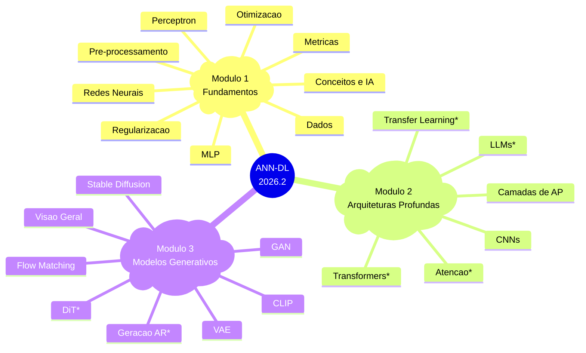

# 2026.2 — Redes Neurais Artificiais e Aprendizado Profundo

## Instrutor

| :fontawesome-regular-address-book: | :fontawesome-regular-envelope: |
|-|-:|
| [Humberto Sandmann](https://hsandmann.github.io){target='_blank'} | [humbertors@insper.edu.br](mailto:humbertors@insper.edu.br){target='_blank'} |

## Horário

| :octicons-location-24: | :fontawesome-regular-calendar: | :fontawesome-regular-clock: |
|-|:-:|:-:|
| Aula | - | -h00 :fontawesome-solid-arrow-right-long: -h00 |
| Aula | - | -h00 :fontawesome-solid-arrow-right-long: -h00 |
| Atendimento | - | -h00 :fontawesome-solid-arrow-right-long: -h30 |

## Nota Final

$$
\text{Final} = \left\{\begin{array}{lll}
    \text{Individual} \geq 5 \bigwedge \text{Equipe} \geq 5 &
    \implies &
    \displaystyle \frac{ \text{Individual} + \text{Equipe} } {2}
    \\
    \\
    \text{Caso contrário} &
    \implies &
    \min\left(\text{Individual}, \text{Equipe}\right)
    \end{array}\right.
$$

---

## Ementa 2026.2

!!! tip "Novo em 2026.2"
    As aulas marcadas com **\*** são **novas nesta edição**: Mecanismos de Atenção, Transformers, Transfer Learning, Transformers de Difusão, Geração Autorregressiva e Grandes Modelos de Linguagem. Todas as aulas foram revisadas com visualizações interativas e quizzes ao final de cada aula.

* = novo em 2026.2

---

## Descrição do Curso

Este curso fornece uma introdução abrangente às Redes Neurais Artificiais e ao Aprendizado Profundo, usando frameworks modernos (principalmente PyTorch). Os tópicos abrangem fundamentos matemáticos, arquiteturas principais (MLPs, CNNs, Transformers), mecanismos de atenção, modelos generativos (GANs, VAEs, Difusão, Flow Matching), Transformers de Difusão e Grandes Modelos de Linguagem. É dada ênfase igual à compreensão teórica e à aplicação prática.

## Objetivos de Aprendizagem

Ao final deste curso, os alunos serão capazes de:

1. **Entender os Fundamentos**: explicar gradiente descendente, retropropagação, funções de ativação e regularização.
2. **Dominar Arquiteturas Principais**: descrever e motivar MLPs, CNNs, Transformers e LLMs.
3. **Implementar com PyTorch**: treinar e depurar modelos de aprendizado profundo.
4. **Avaliar o Desempenho**: aplicar métricas apropriadas e técnicas de regularização/otimização.
5. **Trabalhar com Modelos Generativos**: entender e aplicar GANs, VAEs, Difusão e Flow Matching.
6. **Aplicar Transfer Learning**: fazer fine-tuning de modelos pré-treinados usando técnicas PEFT (LoRA, QLoRA).
7. **Entender LLMs**: compreender arquitetura, treinamento (RLHF, DPO) e aplicações de Grandes Modelos de Linguagem.
8. **Avaliar Pesquisas Criticamente**: ler e avaliar artigos atuais de aprendizado profundo.

## Bibliografia

**Principal:**

1. Fleuret, F. (2023). [The Little Book of Deep Learning](https://fleuret.org/lbdl){:target="_blank"}.
1. Goodfellow, I., Bengio, Y., & Courville, A. (2016). [Deep Learning](https://www.deeplearningbook.org/){:target="_blank"}. MIT Press.

**Complementar:**

1. Nielsen, M. A. (2019). [Neural Networks and Deep Learning](http://neuralnetworksanddeeplearning.com/){:target="_blank"}.
1. Zhang, A. et al. (2024). [Dive into Deep Learning](https://d2l.ai/){:target="_blank"}.
1. Vaswani, A. et al. (2017). [Attention Is All You Need](https://arxiv.org/abs/1706.03762){:target="_blank"}.
1. Brown, T. et al. (2020). [Language Models are Few-Shot Learners](https://arxiv.org/abs/2005.14165){:target="_blank"}.
