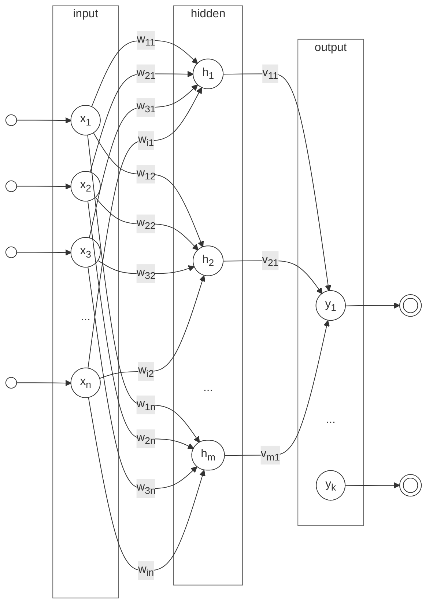
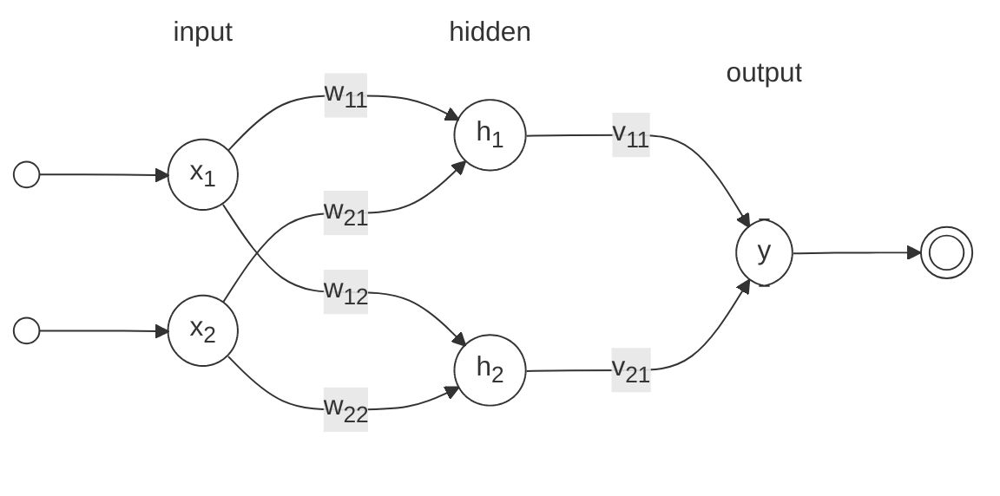

## Fast Forward: Multi-Layer Perceptrons (MLPs)

<i>Multi-Layer Perceptron (MLP) Architecture.</i>

$$
y_k = f \left( \sum_{j=1}^{m} f \left( \sum_{i=1}^{n} x_i w_{ij} + b^{h}_{i} \right) v_{jk} + b^{y}_{j} \right)
$$

where:

- \( y_k \) is the output for the \( k \)-th output neuron.
- \( x_i \) are the input features.
- \( w_{ij} \) are the weights connecting the \( i \)-th input to the \( j \)-th hidden neuron.
- \( v_{jk} \) are the weights connecting the \( j \)-th hidden neuron to the \( k \)-th output neuron.
- \( b^{h}_{i} \) is the bias for the \( i \)-th hidden neuron.
- \( b^{y}_{j} \) is the bias for the \( j \)-th output neuron.
- \( m \) is the number of hidden neurons.
- \( n \) is the number of input features.
- \( f \) is the activation function applied to the weighted sums at each layer, such as sigmoid, tanh, or ReLU.

Matrix representation of the MLP architecture:

$$
\begin{align*}
\text{Input Layer:} & \quad \mathbf{x} = [x_1, x_2, \ldots, x_n]^T \\
\text{Hidden Layer:} & \quad \mathbf{h} = \sigma(\mathbf{W} \mathbf{x} + \mathbf{b}^h) \\
\text{Output Layer:} & \quad \mathbf{y} = \sigma(\mathbf{V} \mathbf{h} + \mathbf{b}^y)
\end{align*}
$$

<i>Multi-Layer Perceptron (MLP) Architecture.</i>

| Sigmoid | Tanh    | ReLU  |
|---------|---------|-------|
| \( \sigma(x) = \displaystyle \frac{1}{1 + e^{-x}} \) | \( \tanh(x) = \displaystyle \frac{e^{2x} - 1}{e^{2x} + 1} \) | \( \text{ReLU}(x) = \max(0, x) \) |
| \( \sigma'(x) = \sigma(x)(1 - \sigma(x)) \)          | \( \tanh'(x) = 1 - \tanh^2(x) \)                             | \( \text{ReLU}'(x) = \begin{cases} 1 & \text{if } x > 0 \\ 0 & \text{if } x \leq 0 \end{cases} \) |
|  |  |  |
| Sigmoid is a smooth, S-shaped curve that outputs values between 0 and 1, making it suitable for binary classification tasks. | Tanh is a smooth curve that outputs values between -1 and 1, centering the data around zero, which can help with convergence in training. | ReLU is a piecewise linear function that outputs zero for negative inputs and the input itself for positive inputs, allowing for faster training and reducing the vanishing gradient problem. |

Backpropagation is the algorithm used to train multi-layer perceptrons (MLPs) by adjusting the weights and biases based on the error between the predicted output and the actual target. The process involves two main steps:

1. **Forward Pass**: The input data is passed through the network, layer by layer, to compute the output. The output is compared to the target value to calculate the loss (error).
2. **Loss Calculation**: Calculate the loss (error) between the predicted output and the actual target using a loss function, such as mean squared error or cross-entropy.
3. **Backward Pass**: The error is propagated backward through the network to compute the gradients of the loss with respect to each weight and bias. These gradients are then used to update the weights and biases using an optimization algorithm, such as stochastic gradient descent (SGD) or Adam.

## Feedforward

<i>Multi-Layer Perceptron (MLP) Architecture.</i>

In cannonical form, the MLP can be expressed as:

$$
\begin{align}
h_1 & = f ( x_1 * w_{11} + x_2 * w_{12} + b^h_1 ) \\
h_2 & = f ( x_1 * w_{21} + x_2 * w_{22} + b^h_2 ) \\
\\
y & = f ( h_1 * v_{11} + h_2 * v_{21} + b^v_1 ) \\
\\ \therefore \\
\\
y & = f \left( f ( x_1 * w_{11} + x_2 * w_{12} + b^h_{1} ) * v_{1} + f ( x_1 * w_{21} + x_2 * w_{22} + b^h_{2} )  * v_{2} + b^v_{1} \right)
\end{align}
$$

where \( f \) is the activation function, \( w_{ij} \) are the weights connecting inputs to hidden neurons, and \( v_{ij} \) are the weights connecting hidden neurons to output neurons. The biases \( b_1, b_2, \) and \( b_y \) are added to the respective layers.

## Backpropagation

The backpropagation algorithm is a method used to train multi-layer perceptrons (MLPs) by minimizing the error between the predicted output and the actual target. It involves two main steps: the forward pass and the backward pass. The update of weights and biases is done using the gradients computed during the backward pass.

more:

- Limitations of Perceptrons, such as their inability to solve non-linearly separable problems.
- Introduction to Multi-Layer Perceptrons (MLPs) as an extension of the Perceptron model.
- Structure of MLPs, including input, hidden, and output layers.
- Activation functions used in MLPs, such as sigmoid, tanh, and ReLU.
- The concept of feedforward and backpropagation in MLPs.
- The role of weights and biases in MLPs and how they are adjusted during training.
- The training process of MLPs, including the use of gradient descent and backpropagation.
- The importance of loss functions in MLP training, such as mean squared error and cross-entropy.

## Regularization techniques to prevent overfitting in MLPs, such as dropout and L2 regularization. https://grok.com/chat/0e1af7da-0d92-4603-84a6-99f2aa1b8686

### Dropout
What it is: Dropout is a regularization technique where, during training, a random subset of neurons (or their connections) is "dropped" (set to zero) in each forward and backward pass. This prevents the network from relying too heavily on specific neurons.
How it works:

During training, each neuron has a probability $ p $ (typically 0.2 to 0.5) of being dropped.
This forces the network to learn redundant representations, making it more robust and less likely to memorize the training data.
At test time, all neurons are active, but their weights are scaled by $ 1-p $ to account for the reduced activation during training.

Why it prevents overfitting:

Dropout acts like training an ensemble of smaller subnetworks, reducing co-dependency between neurons.
It introduces noise, making the model less sensitive to specific patterns in the training data.

Practical tips:

Common dropout rates: 20–50% for hidden layers, lower (10–20%) for input layers.
Use in deep networks, especially in fully connected layers or convolutional neural networks (CNNs).
Avoid dropout in the output layer or when the network is small (it may hurt performance).

### L2 Regularization (Weight Decay)
What it is: L2 regularization adds a penalty term to the loss function based on the magnitude of the model’s weights, discouraging large weights that can lead to complex, overfitted models.
How it works:

The loss function is modified to include an L2 penalty:
$$\text{Loss} = \text{Original Loss} + \lambda \sum w_i^2$$
where $ w_i $ are the model’s weights, and $ \lambda $ (regularization strength) controls the penalty’s impact.
During optimization, this penalty encourages smaller weights, simplifying the model.

Why it prevents overfitting:

Large weights amplify small input changes, leading to overfitting. L2 regularization constrains weights, making the model smoother and less sensitive to noise.
It effectively reduces the model’s capacity to memorize training data.

Practical tips:

Common $ \lambda $: $ 10^{-5} $ to $ 10^{-2} $, tuned via cross-validation.
Works well in linear models, fully connected NNs, and CNNs.
Combine with other techniques (e.g., dropout) for better results.

- Optimization algorithms used in MLP training, such as stochastic gradient descent (SGD), Adam, and RMSprop.
- Evaluation metrics for MLP performance, such as accuracy, precision, recall, and F1 score.
- Common challenges in training MLPs, such as overfitting, underfitting, the vanishing gradient problem and the need for large datasets.
- Real-world applications of MLPs in various fields, including computer vision, natural language processing, and time series forecasting.
- Applications of MLPs in various domains, including image recognition, natural language processing, and time series prediction.

- Backpropagation: ./ann/backpropagation.md
- Regularization: ./ann/regularization.md
- Optimization: ./ann/optimization.md
- Comparison of MLPs with other neural network architectures, such as convolutional neural networks (CNNs) and recurrent neural networks (RNNs).

<iframe width="100%" height="470" src="https://www.youtube.com/embed/aircAruvnKk" allowfullscreen></iframe>

### Training and Optimization

Algorithms for training ANNs involve adjusting the weights of the connections between neurons to minimize a loss function, which quantifies the difference between the predicted output and the true output. The most common optimization algorithm used in training ANNs is stochastic gradient descent (SGD), which iteratively updates the weights based on the gradient of the loss function with respect to the weights.

## Additional Resources

- [TensorFlow Playground](https://playground.tensorflow.org/){target="_blank"} is an interactive platform that allows users to visualize and experiment with neural networks. It provides a user-friendly interface to create, train, and test simple neural networks, making it an excellent tool for understanding the concepts of neural networks and their behavior. Users can adjust parameters such as the number of layers, activation functions, and learning rates to see how these changes affect the network's performance on various datasets.

[^1]: Haykin, S. (1994). Neural Networks: A Comprehensive Foundation. Prentice Hall.
[:fontawesome-brands-amazon:](https://www.amazon.com/Neural-Networks-Comprehensive-Foundation-2nd/dp/0132733501){target="_blank"}

[^2]: Bishop, C. M. (2006). Pattern Recognition and Machine Learning. Springer.
[:fontawesome-brands-amazon:](https://www.amazon.com/Pattern-Recognition-Learning-Information-Statistics/dp/0387310738){target="_blank"}
[:octicons-download-24:](https://www.microsoft.com/en-us/research/wp-content/uploads/2006/01/Bishop-Pattern-Recognition-and-Machine-Learning-2006.pdf){target="_blank"}

[^3]: Goodfellow, I., Bengio, Y., & Courville, A. (2016). Deep Learning. MIT Press.
[:fontawesome-brands-amazon:](https://www.amazon.com/Deep-Learning-Adaptive-Computation-Machine/dp/0262035618){target="_blank"}
[:octicons-download-24:](https://www.deeplearningbook.org/){target="_blank"}

