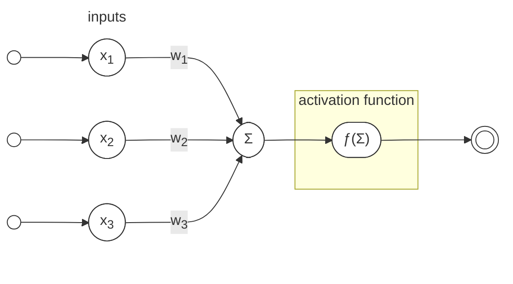

## Biological Inspiration

Since the inception of artificial neural networks (ANNs), their design has been heavily influenced by the structure and function of biological neural networks. The human brain, with its complex network of neurons, serves as a foundational model for understanding how ANNs can process information. The base of an ANN is a neuron, which mimics the behavior of biological neurons. Each neuron receives inputs, processes them, and produces an output, similar to how biological neurons communicate through synapses.

{ width=100% }
/// caption
*Diagram of Neuron.* <br><small>Source: [Wikipedia - Neuron](https://en.wikipedia.org/wiki/Neuron){ target=_blank }</small>
///

The biological neuron consists of a cell body (soma), dendrites, and an axon. Dendrites receive signals from other neurons, the soma processes these signals, and the axon transmits the output to other neurons. This structure allows for complex interactions and information processing, which is essential for learning and decision-making in biological systems. The signal produced by a neuron is known as an **action potential**, which is an electrical impulse that travels along the axon to communicate with other neurons. The action potential is generated when the neuron receives sufficient input from its dendrites, leading to a change in the electrical potential across its membrane. This process is known as **neural activation** and is crucial for the functioning of both biological and artificial neurons.

{ width=100% }
/// caption
*Action potential.* <br><small>Source: [Wikipedia - Action potential](https://en.wikipedia.org/wiki/Action_potential){ target=_blank }</small>
///

Basead on this biological inspiration, McCulloch and Pitts[^1] proposed the first mathematical model of a neuron in 1943. This model laid the groundwork for the development of artificial neurons, which are the building blocks of ANNs. The McCulloch-Pitts neuron is a simple binary model that outputs a signal based on whether the weighted sum of its inputs exceeds a certain threshold.

$$
\begin{align*}
    N_i(t+1) = H \left( \sum_{j=1}^n w_{ij}(t) N_j(t) - \theta_ i (t) \right), & \\
    & H(x) := 
    \begin{cases}
        1, & x \geq 0 \\
        0, & x < 0
    \end{cases}
\end{align*}
$$

This equation describes how the output of neuron \(N_i\) at time \(t+1\) is determined by the weighted sum of its inputs \(N_j\) at time \(t\), adjusted by a threshold \(\theta_i(t)\). The function \(H\) is a step function that activates the neuron if the input exceeds the threshold. Note, the results of the McCulloch-Pitts model are binary, meaning the output is either 0 or 1, which corresponds to the neuron being inactive or active, respectively - see a connection to symbolic logic.

This model, while simplistic, captures the essence of how neurons process information and has been foundational in the development of more complex neural network architectures.

## Mathematical Foundations

The mathematical foundations of artificial neural networks are built upon linear algebra, calculus, and probability theory. These areas provide the tools necessary to understand how ANNs operate, how they learn from data, and how they can be optimized for various tasks. The Perceptron, introduced by Rosenblatt[^2] in 1958, is one of the earliest and simplest forms of an ANN. It consists of a single layer of neurons that can classify linearly separable data. The Perceptron algorithm adjusts the weights of the inputs based on the error in the output, allowing it to learn from examples.

<center>

</center>

TODO: improve Perceptron description, add more math, and explain the learning rule. Herbian learning rule, etc.

The Perceptron learning rule can be expressed mathematically as follows:

$$
w_i(t+1) = w_i(t) + \eta (y - \hat{y}) x_i
$$

where:
- \(w_i(t)\) is the weight of the \(i\)-th input at time \(t\),
- \(\eta\) is the learning rate,
- \(y\) is the true label,
- \(\hat{y}\) is the predicted output,
- \(x_i\) is the \(i\)-th input feature.

This equation updates the weights based on the difference between the true label and the predicted output, scaled by the learning rate and the input feature. The learning rate \(\eta\) controls how much the weights are adjusted during each iteration, balancing the speed of learning and stability of convergence.

This simple model can operate as a linear classifier, but it is limited to linearly separable data. 

Minsky and Papert's work in the 1960s highlighted the limitations of the Perceptron, particularly its inability to solve problems like the XOR problem, which are not linearly separable. This led to a temporary decline in interest in neural networks, often referred to as the "AI winter." However, the development of multi-layer networks and backpropagation in the 1980s revived interest in ANNs, leading to the powerful deep learning models we see today.

TODO: draw the XOR problem, explain it, and how the Perceptron cannot solve it.
```python exec="on" html="1"
--8<-- "docs/ann/xor-problem.py"
```


- Activation Functions: ./ann/activation-functions.md

The input domain of ANNs is typically represented as a vector of features, where each feature corresponds to a specific aspect of the input data. The output domain can vary depending on the task, such as classification (discrete labels) or regression (continuous values). The architecture of an ANN consists of layers of neurons, where each layer transforms the input data through weighted connections and activation functions. The connections between neurons are represented by weights, which are adjusted during the training process to minimize the error in predictions.


### Training and Optimization

Algorithms for training ANNs involve adjusting the weights of the connections between neurons to minimize a loss function, which quantifies the difference between the predicted output and the true output. The most common optimization algorithm used in training ANNs is stochastic gradient descent (SGD), which iteratively updates the weights based on the gradient of the loss function with respect to the weights.


[^1]: McCulloch, W. S., & Pitts, W. (1943). A logical calculus of the ideas immanent in nervous activity. *The Bulletin of Mathematical Biophysics*, 5(4), 115-133. [doi:10.1007/BF02478259](https://doi.org/10.1007/BF02478259){ target=_blank }
[^2]: Rosenblatt, F. (1958). The Perceptron: A probabilistic model for information storage and organization in the brain. *Psychological Review*, 65(6), 386-408. [doi:10.1037/h0042519](https://doi.org/10.1037/h0042519){ target=_blank }
[^3]: Jurafsky, D., & Martin, J. H. (2025). Speech and Language Processing: An Introduction to Natural Language Processing, Computational Linguistics, and Speech Recognition with Language Models. [:fontawesome-regular-file-pdf:](https://web.stanford.edu/~jurafsky/slp3/ed3book_Jan25.pdf){ target=_blank }
