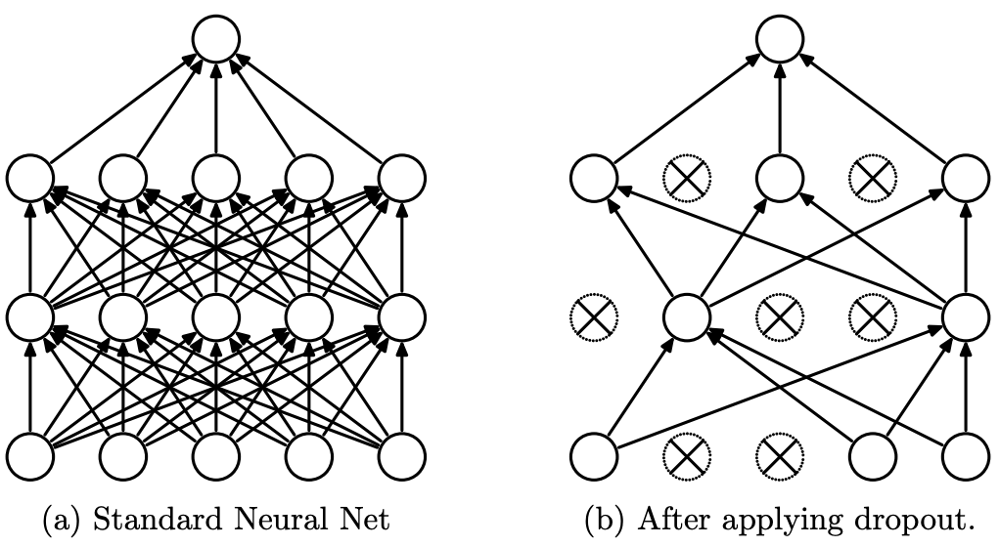

{width="90%"}
/// caption
Dropout Neural Net Model. Left: A standard neural net with 2 hidden layers. Right:
An example of a thinned net produced by applying dropout to the network on the left.
Crossed units have been dropped. Source: [Dropout: A Simple Way to Prevent Neural Networks from Overfitting](https://www.cs.toronto.edu/~hinton/absps/JMLRdropout.pdf){:target="_blank"}
///

**Forward Pass**: Mask during training.

**Backward Pass**: Same mask applied to upstream gradient (scale by 1/(1-p)).

**Numerical Example**: Same as forward; backward passes dy through mask.

**Implementation**:

```pyodide install="pandas,scikit-learn" exec="on" html="1"
--8<-- "docs/classes/deep-learning/dropout.py"
```
