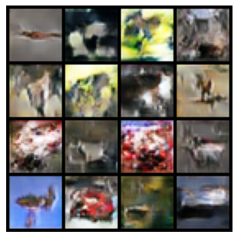
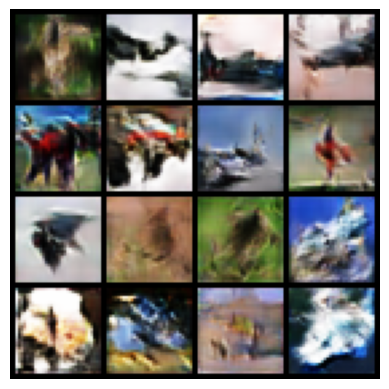
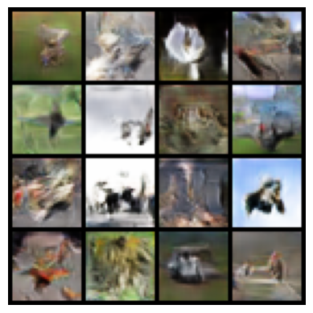

Example extracted from [https://www.geeksforgeeks.org/deep-learning/generative-adversarial-network-gan/](https://www.geeksforgeeks.org/deep-learning/generative-adversarial-network-gan/)

#### 1. Importing Libraries


```python
import torch
import torch.nn as nn
import torch.optim as optim
import torchvision
from torchvision import datasets, transforms
import matplotlib.pyplot as plt
import numpy as np

device = torch.device('cuda' if torch.cuda.is_available() else 'cpu')
```

#### 2. Defining Image Transformations


```python
transform = transforms.Compose([
    transforms.ToTensor(),
    transforms.Normalize((0.5, 0.5, 0.5), (0.5, 0.5, 0.5))
])
```

#### 3. Loaging the CIFAR-10 Dataset


```python
train_dataset = datasets.CIFAR10(root='./data',\
              train=True, download=True, transform=transform)
dataloader = torch.utils.data.DataLoader(train_dataset, \
                                batch_size=32, shuffle=True)
```

    100%|██████████| 170M/170M [00:16<00:00, 10.5MB/s]


#### 4. Defining GAN Hyperparameters

Set important training parameters:

- **latent_dim**: Dimensionality of the noise vector.
- **lr**: Learning rate of the optimizer.
- **beta1**, **beta2**: Beta parameters for Adam optimizer (e.g 0.5, 0.999)
- **num_epochs**: Number of times the entire dataset will be processed (e.g 10)


```python
latent_dim = 100
lr = 0.0002
beta1 = 0.5
beta2 = 0.999
num_epochs = 30
```

#### 5. Building the Generator

Create a neural network that converts random noise into images. Use transpose convolutional layers, batch normalization and ReLU activations. The final layer uses Tanh activation to scale outputs to the range [-1, 1].

- **nn.Linear(latent_dim, 128 * 8 * 8)**: Defines a fully connected layer that projects the noise vector into a higher dimensional feature space.
- **nn.Upsample(scale_factor=2)**: Doubles the spatial resolution of the feature maps by upsampling.
- **nn.Conv2d(128, 128, kernel_size=3, padding=1)**: Applies a convolutional layer keeping the number of channels the same to refine features.


```python
class Generator(nn.Module):
    def __init__(self, latent_dim):
        super(Generator, self).__init__()

        self.model = nn.Sequential(
            nn.Linear(latent_dim, 128 * 8 * 8),
            nn.ReLU(),
            nn.Unflatten(1, (128, 8, 8)),
            nn.Upsample(scale_factor=2),
            nn.Conv2d(128, 128, kernel_size=3, padding=1),
            nn.BatchNorm2d(128, momentum=0.78),
            nn.ReLU(),
            nn.Upsample(scale_factor=2),
            nn.Conv2d(128, 64, kernel_size=3, padding=1),
            nn.BatchNorm2d(64, momentum=0.78),
            nn.ReLU(),
            nn.Conv2d(64, 3, kernel_size=3, padding=1),
            nn.Tanh()
        )

    def forward(self, z):
        img = self.model(z)
        return img
```

#### 6. Building the Discriminator

Create a binary classifier network that distinguishes real from fake images. Use convolutional layers, batch normalization, dropout, LeakyReLU activation and a Sigmoid output layer to give a probability between 0 and 1.

- **nn.Conv2d(32, 64, kernel_size=3, stride=2, padding=1)**: Second convolutional layer increasing channels to 64, downsampling further.
- **nn.BatchNorm2d(256, momentum=0.8)**: Batch normalization for 256 feature maps with momentum 0.8.


```python
class Discriminator(nn.Module):
    def __init__(self):
        super(Discriminator, self).__init__()

        self.model = nn.Sequential(
        nn.Conv2d(3, 32, kernel_size=3, stride=2, padding=1),
        nn.LeakyReLU(0.2),
        nn.Dropout(0.25),
        nn.Conv2d(32, 64, kernel_size=3, stride=2, padding=1),
        nn.ZeroPad2d((0, 1, 0, 1)),
        nn.BatchNorm2d(64, momentum=0.82),
        nn.LeakyReLU(0.25),
        nn.Dropout(0.25),
        nn.Conv2d(64, 128, kernel_size=3, stride=2, padding=1),
        nn.BatchNorm2d(128, momentum=0.82),
        nn.LeakyReLU(0.2),
        nn.Dropout(0.25),
        nn.Conv2d(128, 256, kernel_size=3, stride=1, padding=1),
        nn.BatchNorm2d(256, momentum=0.8),
        nn.LeakyReLU(0.25),
        nn.Dropout(0.25),
        nn.Flatten(),
        nn.Linear(256 * 5 * 5, 1),
        nn.Sigmoid()
    )

    def forward(self, img):
        validity = self.model(img)
        return validity
```

#### 7. Initializing

- Generator and Discriminator are initialized on the available device (GPU or CPU).
- Binary Cross-Entropy (BCE) Loss is chosen as the loss function.
- Adam optimizers are defined separately for the generator and discriminator with specified learning rates and betas.


```python
generator = Generator(latent_dim).to(device)
discriminator = Discriminator().to(device)

adversarial_loss = nn.BCELoss()

optimizer_G = optim.Adam(generator.parameters()\
                         , lr=lr, betas=(beta1, beta2))
optimizer_D = optim.Adam(discriminator.parameters()\
                         , lr=lr, betas=(beta1, beta2))
```

#### 8. Training

Train the discriminator on real and fake images, then update the generator to improve its fake image quality. Track losses and visualize generated images after each epoch.

- **valid = torch.ones(real_images.size(0), 1, device=device)**: Create a tensor of ones representing real labels for the discriminator.
- **fake = torch.zeros(real_images.size(0), 1, device=device)**: Create a tensor of zeros representing fake labels for the discriminator.
- **z = torch.randn(real_images.size(0), latent_dim, device=device)**: Generate random noise vectors as input for the generator.
- **g_loss = adversarial_loss(discriminator(gen_images), valid)**: Calculate generator loss based on the discriminator classifying fake images as real.
- **grid = torchvision.utils.make_grid(generated, nrow=4, normalize=True)**: Arrange generated images into a grid for display, normalizing pixel values.


```python
for epoch in range(num_epochs):
    for i, batch in enumerate(dataloader):

        real_images = batch[0].to(device)

        # Create a tensor of ones representing real labels for the discriminator.
        valid = torch.ones(real_images.size(0), 1, device=device)
        # Create a tensor of zeros representing fake labels for the discriminator.
        fake = torch.zeros(real_images.size(0), 1, device=device)

        real_images = real_images.to(device)

        optimizer_D.zero_grad()

        # Generate random noise vectors as input for the generator.
        z = torch.randn(real_images.size(0), latent_dim, device=device)

        fake_images = generator(z)

        real_loss = adversarial_loss(discriminator\
                                     (real_images), valid)
        fake_loss = adversarial_loss(discriminator\
                                     (fake_images.detach()), fake)
        d_loss = (real_loss + fake_loss) / 2

        d_loss.backward()
        optimizer_D.step()

        optimizer_G.zero_grad()

        gen_images = generator(z)

        # Calculate generator loss based on the discriminator classifying fake images as real.
        g_loss = adversarial_loss(discriminator(gen_images), valid)
        g_loss.backward()
        optimizer_G.step()

        if (i + 1) % 100 == 0:
            print(
                f"Epoch [{epoch+1}/{num_epochs}]\
                        Batch {i+1}/{len(dataloader)} "
                f"Discriminator Loss: {d_loss.item():.4f} "
                f"Generator Loss: {g_loss.item():.4f}"
            )
    if (epoch + 1) % 10 == 0:
        with torch.no_grad():
            z = torch.randn(16, latent_dim, device=device)
            generated = generator(z).detach().cpu()
            # Arrange generated images into a grid for display, normalizing pixel values.
            grid = torchvision.utils.make_grid(generated,\
                                        nrow=4, normalize=True)
            plt.imshow(np.transpose(grid, (1, 2, 0)))
            plt.axis("off")
            plt.show()

plt.close()
```

    Epoch [1/30]                        Batch 100/1563 Discriminator Loss: 0.6310 Generator Loss: 1.0856
    Epoch [1/30]                        Batch 200/1563 Discriminator Loss: 0.7243 Generator Loss: 1.0722
    Epoch [1/30]                        Batch 300/1563 Discriminator Loss: 0.7337 Generator Loss: 1.1005
    Epoch [1/30]                        Batch 400/1563 Discriminator Loss: 0.6917 Generator Loss: 1.1717
    Epoch [1/30]                        Batch 500/1563 Discriminator Loss: 0.5310 Generator Loss: 1.1474
    Epoch [1/30]                        Batch 600/1563 Discriminator Loss: 0.7355 Generator Loss: 0.8708
    Epoch [1/30]                        Batch 700/1563 Discriminator Loss: 0.6745 Generator Loss: 1.2315
    Epoch [1/30]                        Batch 800/1563 Discriminator Loss: 0.7858 Generator Loss: 0.8245
    Epoch [1/30]                        Batch 900/1563 Discriminator Loss: 0.6330 Generator Loss: 0.9612
    Epoch [1/30]                        Batch 1000/1563 Discriminator Loss: 0.6853 Generator Loss: 1.1186
    Epoch [1/30]                        Batch 1100/1563 Discriminator Loss: 0.5872 Generator Loss: 1.3537
    Epoch [1/30]                        Batch 1200/1563 Discriminator Loss: 0.6135 Generator Loss: 1.0075
    Epoch [1/30]                        Batch 1300/1563 Discriminator Loss: 0.5315 Generator Loss: 1.4053
    Epoch [1/30]                        Batch 1400/1563 Discriminator Loss: 0.7756 Generator Loss: 0.8813
    Epoch [1/30]                        Batch 1500/1563 Discriminator Loss: 0.6498 Generator Loss: 0.8439
    Epoch [2/30]                        Batch 100/1563 Discriminator Loss: 0.6724 Generator Loss: 0.7996
    Epoch [2/30]                        Batch 200/1563 Discriminator Loss: 0.8157 Generator Loss: 0.7308
    Epoch [2/30]                        Batch 300/1563 Discriminator Loss: 0.5542 Generator Loss: 1.0256
    Epoch [2/30]                        Batch 400/1563 Discriminator Loss: 0.5977 Generator Loss: 1.1029
    Epoch [2/30]                        Batch 500/1563 Discriminator Loss: 0.6931 Generator Loss: 0.8717
    Epoch [2/30]                        Batch 600/1563 Discriminator Loss: 0.5693 Generator Loss: 1.3365
    Epoch [2/30]                        Batch 700/1563 Discriminator Loss: 0.6488 Generator Loss: 0.9503
    Epoch [2/30]                        Batch 800/1563 Discriminator Loss: 0.6761 Generator Loss: 0.8909
    Epoch [2/30]                        Batch 900/1563 Discriminator Loss: 0.5708 Generator Loss: 0.9972
    Epoch [2/30]                        Batch 1000/1563 Discriminator Loss: 0.6001 Generator Loss: 1.1221
    Epoch [2/30]                        Batch 1100/1563 Discriminator Loss: 0.6978 Generator Loss: 0.8663
    Epoch [2/30]                        Batch 1200/1563 Discriminator Loss: 0.7402 Generator Loss: 1.1249
    Epoch [2/30]                        Batch 1300/1563 Discriminator Loss: 0.6372 Generator Loss: 1.0888
    Epoch [2/30]                        Batch 1400/1563 Discriminator Loss: 0.6317 Generator Loss: 0.9584
    Epoch [2/30]                        Batch 1500/1563 Discriminator Loss: 0.5677 Generator Loss: 1.0163
    Epoch [3/30]                        Batch 100/1563 Discriminator Loss: 0.6370 Generator Loss: 1.3195
    Epoch [3/30]                        Batch 200/1563 Discriminator Loss: 0.5646 Generator Loss: 1.3755
    Epoch [3/30]                        Batch 300/1563 Discriminator Loss: 0.7698 Generator Loss: 0.8023
    Epoch [3/30]                        Batch 400/1563 Discriminator Loss: 0.5839 Generator Loss: 1.0319
    Epoch [3/30]                        Batch 500/1563 Discriminator Loss: 0.5613 Generator Loss: 1.2391
    Epoch [3/30]                        Batch 600/1563 Discriminator Loss: 0.5798 Generator Loss: 1.1867
    Epoch [3/30]                        Batch 700/1563 Discriminator Loss: 0.6622 Generator Loss: 1.4665
    Epoch [3/30]                        Batch 800/1563 Discriminator Loss: 0.7389 Generator Loss: 1.3259
    Epoch [3/30]                        Batch 900/1563 Discriminator Loss: 0.6855 Generator Loss: 1.4243
    Epoch [3/30]                        Batch 1000/1563 Discriminator Loss: 0.5348 Generator Loss: 1.5141
    Epoch [3/30]                        Batch 1100/1563 Discriminator Loss: 0.4696 Generator Loss: 1.3948
    Epoch [3/30]                        Batch 1200/1563 Discriminator Loss: 0.5467 Generator Loss: 0.6435
    Epoch [3/30]                        Batch 1300/1563 Discriminator Loss: 0.6741 Generator Loss: 0.9211
    Epoch [3/30]                        Batch 1400/1563 Discriminator Loss: 0.4664 Generator Loss: 1.0165
    Epoch [3/30]                        Batch 1500/1563 Discriminator Loss: 0.4799 Generator Loss: 0.9388
    Epoch [4/30]                        Batch 100/1563 Discriminator Loss: 0.6887 Generator Loss: 0.9108
    Epoch [4/30]                        Batch 200/1563 Discriminator Loss: 0.7852 Generator Loss: 0.8538
    Epoch [4/30]                        Batch 300/1563 Discriminator Loss: 0.5036 Generator Loss: 0.7702
    Epoch [4/30]                        Batch 400/1563 Discriminator Loss: 0.4476 Generator Loss: 1.3409
    Epoch [4/30]                        Batch 500/1563 Discriminator Loss: 0.6550 Generator Loss: 1.2383
    Epoch [4/30]                        Batch 600/1563 Discriminator Loss: 0.7891 Generator Loss: 1.6518
    Epoch [4/30]                        Batch 700/1563 Discriminator Loss: 0.5458 Generator Loss: 1.3395
    Epoch [4/30]                        Batch 800/1563 Discriminator Loss: 0.6637 Generator Loss: 0.9561
    Epoch [4/30]                        Batch 900/1563 Discriminator Loss: 0.6408 Generator Loss: 1.4673
    Epoch [4/30]                        Batch 1000/1563 Discriminator Loss: 0.5879 Generator Loss: 0.8866
    Epoch [4/30]                        Batch 1100/1563 Discriminator Loss: 0.5762 Generator Loss: 1.2028
    Epoch [4/30]                        Batch 1200/1563 Discriminator Loss: 0.4307 Generator Loss: 1.8184
    Epoch [4/30]                        Batch 1300/1563 Discriminator Loss: 0.8079 Generator Loss: 0.7371
    Epoch [4/30]                        Batch 1400/1563 Discriminator Loss: 0.5739 Generator Loss: 0.9877
    Epoch [4/30]                        Batch 1500/1563 Discriminator Loss: 0.5317 Generator Loss: 1.7946
    Epoch [5/30]                        Batch 100/1563 Discriminator Loss: 0.4036 Generator Loss: 1.1946
    Epoch [5/30]                        Batch 200/1563 Discriminator Loss: 0.4312 Generator Loss: 1.4645
    Epoch [5/30]                        Batch 300/1563 Discriminator Loss: 0.4584 Generator Loss: 1.0263
    Epoch [5/30]                        Batch 400/1563 Discriminator Loss: 0.5096 Generator Loss: 1.4634
    Epoch [5/30]                        Batch 500/1563 Discriminator Loss: 0.6048 Generator Loss: 1.7682
    Epoch [5/30]                        Batch 600/1563 Discriminator Loss: 0.7375 Generator Loss: 1.0852
    Epoch [5/30]                        Batch 700/1563 Discriminator Loss: 0.6004 Generator Loss: 1.3448
    Epoch [5/30]                        Batch 800/1563 Discriminator Loss: 0.5066 Generator Loss: 1.0084
    Epoch [5/30]                        Batch 900/1563 Discriminator Loss: 0.6089 Generator Loss: 1.0463
    Epoch [5/30]                        Batch 1000/1563 Discriminator Loss: 0.4824 Generator Loss: 1.2175
    Epoch [5/30]                        Batch 1100/1563 Discriminator Loss: 0.7544 Generator Loss: 0.8785
    Epoch [5/30]                        Batch 1200/1563 Discriminator Loss: 0.4876 Generator Loss: 1.2693
    Epoch [5/30]                        Batch 1300/1563 Discriminator Loss: 0.4419 Generator Loss: 0.9601
    Epoch [5/30]                        Batch 1400/1563 Discriminator Loss: 0.5805 Generator Loss: 1.0689
    Epoch [5/30]                        Batch 1500/1563 Discriminator Loss: 0.5700 Generator Loss: 1.5043
    Epoch [6/30]                        Batch 100/1563 Discriminator Loss: 0.3690 Generator Loss: 1.8759
    Epoch [6/30]                        Batch 200/1563 Discriminator Loss: 0.4619 Generator Loss: 1.5484
    Epoch [6/30]                        Batch 300/1563 Discriminator Loss: 0.5607 Generator Loss: 1.1555
    Epoch [6/30]                        Batch 400/1563 Discriminator Loss: 0.3786 Generator Loss: 1.5910
    Epoch [6/30]                        Batch 500/1563 Discriminator Loss: 0.6497 Generator Loss: 0.9485
    Epoch [6/30]                        Batch 600/1563 Discriminator Loss: 0.4534 Generator Loss: 1.4235
    Epoch [6/30]                        Batch 700/1563 Discriminator Loss: 0.5807 Generator Loss: 0.6237
    Epoch [6/30]                        Batch 800/1563 Discriminator Loss: 0.5381 Generator Loss: 1.4090
    Epoch [6/30]                        Batch 900/1563 Discriminator Loss: 0.4686 Generator Loss: 1.3971
    Epoch [6/30]                        Batch 1000/1563 Discriminator Loss: 0.4787 Generator Loss: 1.4606
    Epoch [6/30]                        Batch 1100/1563 Discriminator Loss: 0.6769 Generator Loss: 1.3275
    Epoch [6/30]                        Batch 1200/1563 Discriminator Loss: 0.4402 Generator Loss: 1.3996
    Epoch [6/30]                        Batch 1300/1563 Discriminator Loss: 0.6449 Generator Loss: 1.2970
    Epoch [6/30]                        Batch 1400/1563 Discriminator Loss: 0.7675 Generator Loss: 1.1988
    Epoch [6/30]                        Batch 1500/1563 Discriminator Loss: 0.6860 Generator Loss: 1.0752
    Epoch [7/30]                        Batch 100/1563 Discriminator Loss: 0.5656 Generator Loss: 0.5764
    Epoch [7/30]                        Batch 200/1563 Discriminator Loss: 0.4979 Generator Loss: 1.2684
    Epoch [7/30]                        Batch 300/1563 Discriminator Loss: 0.6714 Generator Loss: 0.9369
    Epoch [7/30]                        Batch 400/1563 Discriminator Loss: 0.6402 Generator Loss: 1.0803
    Epoch [7/30]                        Batch 500/1563 Discriminator Loss: 0.5717 Generator Loss: 1.3460
    Epoch [7/30]                        Batch 600/1563 Discriminator Loss: 0.4720 Generator Loss: 1.2296
    Epoch [7/30]                        Batch 700/1563 Discriminator Loss: 0.5592 Generator Loss: 1.6116
    Epoch [7/30]                        Batch 800/1563 Discriminator Loss: 0.7146 Generator Loss: 1.3487
    Epoch [7/30]                        Batch 900/1563 Discriminator Loss: 0.4830 Generator Loss: 1.3931
    Epoch [7/30]                        Batch 1000/1563 Discriminator Loss: 0.4894 Generator Loss: 1.7213
    Epoch [7/30]                        Batch 1100/1563 Discriminator Loss: 0.8574 Generator Loss: 1.3492
    Epoch [7/30]                        Batch 1200/1563 Discriminator Loss: 0.8195 Generator Loss: 0.9998
    Epoch [7/30]                        Batch 1300/1563 Discriminator Loss: 0.7399 Generator Loss: 1.3046
    Epoch [7/30]                        Batch 1400/1563 Discriminator Loss: 0.5688 Generator Loss: 0.9374
    Epoch [7/30]                        Batch 1500/1563 Discriminator Loss: 0.4341 Generator Loss: 1.2548
    Epoch [8/30]                        Batch 100/1563 Discriminator Loss: 0.6533 Generator Loss: 1.1707
    Epoch [8/30]                        Batch 200/1563 Discriminator Loss: 0.4287 Generator Loss: 1.1481
    Epoch [8/30]                        Batch 300/1563 Discriminator Loss: 0.5281 Generator Loss: 1.7373
    Epoch [8/30]                        Batch 400/1563 Discriminator Loss: 0.5967 Generator Loss: 0.9080
    Epoch [8/30]                        Batch 500/1563 Discriminator Loss: 0.6105 Generator Loss: 1.0256
    Epoch [8/30]                        Batch 600/1563 Discriminator Loss: 0.5247 Generator Loss: 1.5951
    Epoch [8/30]                        Batch 700/1563 Discriminator Loss: 0.7669 Generator Loss: 1.3100
    Epoch [8/30]                        Batch 800/1563 Discriminator Loss: 0.5892 Generator Loss: 1.1584
    Epoch [8/30]                        Batch 900/1563 Discriminator Loss: 0.8667 Generator Loss: 0.8409
    Epoch [8/30]                        Batch 1000/1563 Discriminator Loss: 0.8007 Generator Loss: 0.6958
    Epoch [8/30]                        Batch 1100/1563 Discriminator Loss: 0.6248 Generator Loss: 1.0027
    Epoch [8/30]                        Batch 1200/1563 Discriminator Loss: 0.9791 Generator Loss: 1.2779
    Epoch [8/30]                        Batch 1300/1563 Discriminator Loss: 0.6273 Generator Loss: 1.3308
    Epoch [8/30]                        Batch 1400/1563 Discriminator Loss: 0.4397 Generator Loss: 2.0570
    Epoch [8/30]                        Batch 1500/1563 Discriminator Loss: 0.5385 Generator Loss: 1.1689
    Epoch [9/30]                        Batch 100/1563 Discriminator Loss: 0.8302 Generator Loss: 1.3391
    Epoch [9/30]                        Batch 200/1563 Discriminator Loss: 0.4323 Generator Loss: 1.5036
    Epoch [9/30]                        Batch 300/1563 Discriminator Loss: 0.6001 Generator Loss: 2.3062
    Epoch [9/30]                        Batch 400/1563 Discriminator Loss: 0.5612 Generator Loss: 1.0222
    Epoch [9/30]                        Batch 500/1563 Discriminator Loss: 0.5333 Generator Loss: 1.5129
    Epoch [9/30]                        Batch 600/1563 Discriminator Loss: 0.4739 Generator Loss: 0.9228
    Epoch [9/30]                        Batch 700/1563 Discriminator Loss: 0.6237 Generator Loss: 1.3650
    Epoch [9/30]                        Batch 800/1563 Discriminator Loss: 0.6755 Generator Loss: 0.7273
    Epoch [9/30]                        Batch 900/1563 Discriminator Loss: 0.5411 Generator Loss: 1.7899
    Epoch [9/30]                        Batch 1000/1563 Discriminator Loss: 0.5930 Generator Loss: 1.0269
    Epoch [9/30]                        Batch 1100/1563 Discriminator Loss: 0.5476 Generator Loss: 1.8822
    Epoch [9/30]                        Batch 1200/1563 Discriminator Loss: 0.7660 Generator Loss: 1.4145
    Epoch [9/30]                        Batch 1300/1563 Discriminator Loss: 0.5074 Generator Loss: 1.5135
    Epoch [9/30]                        Batch 1400/1563 Discriminator Loss: 0.5582 Generator Loss: 1.1927
    Epoch [9/30]                        Batch 1500/1563 Discriminator Loss: 0.8168 Generator Loss: 1.2279
    Epoch [10/30]                        Batch 100/1563 Discriminator Loss: 0.2423 Generator Loss: 1.7337
    Epoch [10/30]                        Batch 200/1563 Discriminator Loss: 0.9663 Generator Loss: 1.0028
    Epoch [10/30]                        Batch 300/1563 Discriminator Loss: 0.5886 Generator Loss: 0.9407
    Epoch [10/30]                        Batch 400/1563 Discriminator Loss: 0.7274 Generator Loss: 1.0736
    Epoch [10/30]                        Batch 500/1563 Discriminator Loss: 0.6266 Generator Loss: 0.8596
    Epoch [10/30]                        Batch 600/1563 Discriminator Loss: 0.5225 Generator Loss: 2.0611
    Epoch [10/30]                        Batch 700/1563 Discriminator Loss: 0.4990 Generator Loss: 1.6639
    Epoch [10/30]                        Batch 800/1563 Discriminator Loss: 0.8305 Generator Loss: 0.8100
    Epoch [10/30]                        Batch 900/1563 Discriminator Loss: 0.5522 Generator Loss: 1.2785
    Epoch [10/30]                        Batch 1000/1563 Discriminator Loss: 0.8009 Generator Loss: 1.3512
    Epoch [10/30]                        Batch 1100/1563 Discriminator Loss: 0.6749 Generator Loss: 1.1727
    Epoch [10/30]                        Batch 1200/1563 Discriminator Loss: 0.8850 Generator Loss: 1.1001
    Epoch [10/30]                        Batch 1300/1563 Discriminator Loss: 0.6387 Generator Loss: 1.4558
    Epoch [10/30]                        Batch 1400/1563 Discriminator Loss: 0.6613 Generator Loss: 2.5028
    Epoch [10/30]                        Batch 1500/1563 Discriminator Loss: 0.5191 Generator Loss: 0.9412


    

    


    Epoch [11/30]                        Batch 100/1563 Discriminator Loss: 0.6146 Generator Loss: 1.1872
    Epoch [11/30]                        Batch 200/1563 Discriminator Loss: 0.7205 Generator Loss: 1.0533
    Epoch [11/30]                        Batch 300/1563 Discriminator Loss: 0.6223 Generator Loss: 1.1095
    Epoch [11/30]                        Batch 400/1563 Discriminator Loss: 0.5828 Generator Loss: 0.7897
    Epoch [11/30]                        Batch 500/1563 Discriminator Loss: 0.5107 Generator Loss: 1.1712
    Epoch [11/30]                        Batch 600/1563 Discriminator Loss: 0.5452 Generator Loss: 1.1918
    Epoch [11/30]                        Batch 700/1563 Discriminator Loss: 0.4733 Generator Loss: 1.6043
    Epoch [11/30]                        Batch 800/1563 Discriminator Loss: 0.6569 Generator Loss: 1.1823
    Epoch [11/30]                        Batch 900/1563 Discriminator Loss: 0.7731 Generator Loss: 0.9131
    Epoch [11/30]                        Batch 1000/1563 Discriminator Loss: 0.7283 Generator Loss: 0.9966
    Epoch [11/30]                        Batch 1100/1563 Discriminator Loss: 0.6360 Generator Loss: 1.4022
    Epoch [11/30]                        Batch 1200/1563 Discriminator Loss: 0.6779 Generator Loss: 1.6380
    Epoch [11/30]                        Batch 1300/1563 Discriminator Loss: 0.5721 Generator Loss: 1.0732
    Epoch [11/30]                        Batch 1400/1563 Discriminator Loss: 0.5500 Generator Loss: 1.6293
    Epoch [11/30]                        Batch 1500/1563 Discriminator Loss: 0.6260 Generator Loss: 1.6629
    Epoch [12/30]                        Batch 100/1563 Discriminator Loss: 0.2396 Generator Loss: 1.8887
    Epoch [12/30]                        Batch 200/1563 Discriminator Loss: 0.8208 Generator Loss: 0.7347
    Epoch [12/30]                        Batch 300/1563 Discriminator Loss: 0.7865 Generator Loss: 1.2288
    Epoch [12/30]                        Batch 400/1563 Discriminator Loss: 0.8839 Generator Loss: 1.5515
    Epoch [12/30]                        Batch 500/1563 Discriminator Loss: 0.4100 Generator Loss: 1.6313
    Epoch [12/30]                        Batch 600/1563 Discriminator Loss: 0.5070 Generator Loss: 0.7579
    Epoch [12/30]                        Batch 700/1563 Discriminator Loss: 0.4470 Generator Loss: 1.4843
    Epoch [12/30]                        Batch 800/1563 Discriminator Loss: 0.3804 Generator Loss: 1.9155
    Epoch [12/30]                        Batch 900/1563 Discriminator Loss: 0.8740 Generator Loss: 0.9627
    Epoch [12/30]                        Batch 1000/1563 Discriminator Loss: 0.6253 Generator Loss: 1.2338
    Epoch [12/30]                        Batch 1100/1563 Discriminator Loss: 0.5772 Generator Loss: 0.7276
    Epoch [12/30]                        Batch 1200/1563 Discriminator Loss: 0.6984 Generator Loss: 1.2770
    Epoch [12/30]                        Batch 1300/1563 Discriminator Loss: 0.5281 Generator Loss: 1.6734
    Epoch [12/30]                        Batch 1400/1563 Discriminator Loss: 0.7011 Generator Loss: 1.5269
    Epoch [12/30]                        Batch 1500/1563 Discriminator Loss: 0.6542 Generator Loss: 1.1141
    Epoch [13/30]                        Batch 100/1563 Discriminator Loss: 0.3590 Generator Loss: 1.6407
    Epoch [13/30]                        Batch 200/1563 Discriminator Loss: 0.6046 Generator Loss: 0.6858
    Epoch [13/30]                        Batch 300/1563 Discriminator Loss: 0.5175 Generator Loss: 2.0719
    Epoch [13/30]                        Batch 400/1563 Discriminator Loss: 0.6386 Generator Loss: 1.1742
    Epoch [13/30]                        Batch 500/1563 Discriminator Loss: 0.5023 Generator Loss: 1.7407
    Epoch [13/30]                        Batch 600/1563 Discriminator Loss: 0.4565 Generator Loss: 1.8108
    Epoch [13/30]                        Batch 700/1563 Discriminator Loss: 0.3615 Generator Loss: 0.7747
    Epoch [13/30]                        Batch 800/1563 Discriminator Loss: 0.5649 Generator Loss: 1.1583
    Epoch [13/30]                        Batch 900/1563 Discriminator Loss: 0.5132 Generator Loss: 1.2286
    Epoch [13/30]                        Batch 1000/1563 Discriminator Loss: 0.6191 Generator Loss: 1.4292
    Epoch [13/30]                        Batch 1100/1563 Discriminator Loss: 0.4916 Generator Loss: 1.4518
    Epoch [13/30]                        Batch 1200/1563 Discriminator Loss: 0.5353 Generator Loss: 1.0762
    Epoch [13/30]                        Batch 1300/1563 Discriminator Loss: 0.6027 Generator Loss: 0.7657
    Epoch [13/30]                        Batch 1400/1563 Discriminator Loss: 0.6896 Generator Loss: 1.5476
    Epoch [13/30]                        Batch 1500/1563 Discriminator Loss: 0.5865 Generator Loss: 0.7674
    Epoch [14/30]                        Batch 100/1563 Discriminator Loss: 0.3891 Generator Loss: 1.4870
    Epoch [14/30]                        Batch 200/1563 Discriminator Loss: 0.4392 Generator Loss: 0.7682
    Epoch [14/30]                        Batch 300/1563 Discriminator Loss: 0.9042 Generator Loss: 0.7021
    Epoch [14/30]                        Batch 400/1563 Discriminator Loss: 0.5336 Generator Loss: 1.6118
    Epoch [14/30]                        Batch 500/1563 Discriminator Loss: 0.6186 Generator Loss: 1.0359
    Epoch [14/30]                        Batch 600/1563 Discriminator Loss: 0.7181 Generator Loss: 0.8545
    Epoch [14/30]                        Batch 700/1563 Discriminator Loss: 0.8549 Generator Loss: 0.8246
    Epoch [14/30]                        Batch 800/1563 Discriminator Loss: 0.8046 Generator Loss: 1.3709
    Epoch [14/30]                        Batch 900/1563 Discriminator Loss: 0.4450 Generator Loss: 1.2583
    Epoch [14/30]                        Batch 1000/1563 Discriminator Loss: 0.4912 Generator Loss: 1.8047
    Epoch [14/30]                        Batch 1100/1563 Discriminator Loss: 0.4890 Generator Loss: 1.1271
    Epoch [14/30]                        Batch 1200/1563 Discriminator Loss: 0.7053 Generator Loss: 1.3877
    Epoch [14/30]                        Batch 1300/1563 Discriminator Loss: 0.8480 Generator Loss: 0.9890
    Epoch [14/30]                        Batch 1400/1563 Discriminator Loss: 0.3800 Generator Loss: 1.6878
    Epoch [14/30]                        Batch 1500/1563 Discriminator Loss: 0.4641 Generator Loss: 1.5752
    Epoch [15/30]                        Batch 100/1563 Discriminator Loss: 0.6491 Generator Loss: 1.2644
    Epoch [15/30]                        Batch 200/1563 Discriminator Loss: 0.5590 Generator Loss: 0.9048
    Epoch [15/30]                        Batch 300/1563 Discriminator Loss: 0.7712 Generator Loss: 1.0408
    Epoch [15/30]                        Batch 400/1563 Discriminator Loss: 0.6446 Generator Loss: 1.2220
    Epoch [15/30]                        Batch 500/1563 Discriminator Loss: 0.5891 Generator Loss: 0.8177
    Epoch [15/30]                        Batch 600/1563 Discriminator Loss: 0.4539 Generator Loss: 1.5968
    Epoch [15/30]                        Batch 700/1563 Discriminator Loss: 0.9036 Generator Loss: 1.2203
    Epoch [15/30]                        Batch 800/1563 Discriminator Loss: 0.6573 Generator Loss: 1.2048
    Epoch [15/30]                        Batch 900/1563 Discriminator Loss: 0.5110 Generator Loss: 0.8048
    Epoch [15/30]                        Batch 1000/1563 Discriminator Loss: 0.6662 Generator Loss: 1.6221
    Epoch [15/30]                        Batch 1100/1563 Discriminator Loss: 0.4542 Generator Loss: 1.4416
    Epoch [15/30]                        Batch 1200/1563 Discriminator Loss: 0.5644 Generator Loss: 1.5006
    Epoch [15/30]                        Batch 1300/1563 Discriminator Loss: 0.5741 Generator Loss: 1.5613
    Epoch [15/30]                        Batch 1400/1563 Discriminator Loss: 0.5394 Generator Loss: 1.6310
    Epoch [15/30]                        Batch 1500/1563 Discriminator Loss: 0.2746 Generator Loss: 1.2002
    Epoch [16/30]                        Batch 100/1563 Discriminator Loss: 0.9168 Generator Loss: 1.0404
    Epoch [16/30]                        Batch 200/1563 Discriminator Loss: 0.3522 Generator Loss: 2.0820
    Epoch [16/30]                        Batch 300/1563 Discriminator Loss: 1.0174 Generator Loss: 1.2016
    Epoch [16/30]                        Batch 400/1563 Discriminator Loss: 0.9039 Generator Loss: 0.9897
    Epoch [16/30]                        Batch 500/1563 Discriminator Loss: 0.7441 Generator Loss: 1.5617
    Epoch [16/30]                        Batch 600/1563 Discriminator Loss: 0.6339 Generator Loss: 0.7029
    Epoch [16/30]                        Batch 700/1563 Discriminator Loss: 0.6705 Generator Loss: 1.2205
    Epoch [16/30]                        Batch 800/1563 Discriminator Loss: 0.4608 Generator Loss: 1.9291
    Epoch [16/30]                        Batch 900/1563 Discriminator Loss: 0.3003 Generator Loss: 2.2707
    Epoch [16/30]                        Batch 1000/1563 Discriminator Loss: 0.4935 Generator Loss: 0.9453
    Epoch [16/30]                        Batch 1100/1563 Discriminator Loss: 0.6426 Generator Loss: 2.0306
    Epoch [16/30]                        Batch 1200/1563 Discriminator Loss: 0.3256 Generator Loss: 1.9450
    Epoch [16/30]                        Batch 1300/1563 Discriminator Loss: 0.4460 Generator Loss: 1.3895
    Epoch [16/30]                        Batch 1400/1563 Discriminator Loss: 0.5697 Generator Loss: 1.8839
    Epoch [16/30]                        Batch 1500/1563 Discriminator Loss: 0.3510 Generator Loss: 1.2868
    Epoch [17/30]                        Batch 100/1563 Discriminator Loss: 0.4061 Generator Loss: 1.5765
    Epoch [17/30]                        Batch 200/1563 Discriminator Loss: 0.6059 Generator Loss: 1.4607
    Epoch [17/30]                        Batch 300/1563 Discriminator Loss: 0.3888 Generator Loss: 2.0352
    Epoch [17/30]                        Batch 400/1563 Discriminator Loss: 0.9055 Generator Loss: 1.5344
    Epoch [17/30]                        Batch 500/1563 Discriminator Loss: 0.4919 Generator Loss: 2.0243
    Epoch [17/30]                        Batch 600/1563 Discriminator Loss: 0.5129 Generator Loss: 1.3443
    Epoch [17/30]                        Batch 700/1563 Discriminator Loss: 0.5908 Generator Loss: 1.3944
    Epoch [17/30]                        Batch 800/1563 Discriminator Loss: 0.6198 Generator Loss: 1.9401
    Epoch [17/30]                        Batch 900/1563 Discriminator Loss: 0.4722 Generator Loss: 1.3389
    Epoch [17/30]                        Batch 1000/1563 Discriminator Loss: 0.6337 Generator Loss: 1.2892
    Epoch [17/30]                        Batch 1100/1563 Discriminator Loss: 0.4962 Generator Loss: 1.3870
    Epoch [17/30]                        Batch 1200/1563 Discriminator Loss: 0.4610 Generator Loss: 0.8908
    Epoch [17/30]                        Batch 1300/1563 Discriminator Loss: 0.7297 Generator Loss: 1.1273
    Epoch [17/30]                        Batch 1400/1563 Discriminator Loss: 0.7066 Generator Loss: 0.8907
    Epoch [17/30]                        Batch 1500/1563 Discriminator Loss: 0.4157 Generator Loss: 1.4886
    Epoch [18/30]                        Batch 100/1563 Discriminator Loss: 0.4349 Generator Loss: 2.3884
    Epoch [18/30]                        Batch 200/1563 Discriminator Loss: 0.6107 Generator Loss: 0.9189
    Epoch [18/30]                        Batch 300/1563 Discriminator Loss: 0.6645 Generator Loss: 0.9639
    Epoch [18/30]                        Batch 400/1563 Discriminator Loss: 0.6846 Generator Loss: 1.6454
    Epoch [18/30]                        Batch 500/1563 Discriminator Loss: 0.6662 Generator Loss: 1.3799
    Epoch [18/30]                        Batch 600/1563 Discriminator Loss: 0.3959 Generator Loss: 1.6886
    Epoch [18/30]                        Batch 700/1563 Discriminator Loss: 0.7645 Generator Loss: 0.4036
    Epoch [18/30]                        Batch 800/1563 Discriminator Loss: 0.3437 Generator Loss: 1.5305
    Epoch [18/30]                        Batch 900/1563 Discriminator Loss: 0.7294 Generator Loss: 1.9114
    Epoch [18/30]                        Batch 1000/1563 Discriminator Loss: 0.3701 Generator Loss: 2.1974
    Epoch [18/30]                        Batch 1100/1563 Discriminator Loss: 0.3689 Generator Loss: 1.6446
    Epoch [18/30]                        Batch 1200/1563 Discriminator Loss: 0.4035 Generator Loss: 1.3158
    Epoch [18/30]                        Batch 1300/1563 Discriminator Loss: 0.6356 Generator Loss: 1.4208
    Epoch [18/30]                        Batch 1400/1563 Discriminator Loss: 0.6068 Generator Loss: 1.0243
    Epoch [18/30]                        Batch 1500/1563 Discriminator Loss: 0.7674 Generator Loss: 1.6801
    Epoch [19/30]                        Batch 100/1563 Discriminator Loss: 0.4846 Generator Loss: 1.2064
    Epoch [19/30]                        Batch 200/1563 Discriminator Loss: 0.6070 Generator Loss: 1.7031
    Epoch [19/30]                        Batch 300/1563 Discriminator Loss: 0.7450 Generator Loss: 1.0996
    Epoch [19/30]                        Batch 400/1563 Discriminator Loss: 0.6458 Generator Loss: 1.0814
    Epoch [19/30]                        Batch 500/1563 Discriminator Loss: 0.4784 Generator Loss: 1.4959
    Epoch [19/30]                        Batch 600/1563 Discriminator Loss: 0.3522 Generator Loss: 1.8114
    Epoch [19/30]                        Batch 700/1563 Discriminator Loss: 0.6813 Generator Loss: 1.4926
    Epoch [19/30]                        Batch 800/1563 Discriminator Loss: 0.3082 Generator Loss: 1.2779
    Epoch [19/30]                        Batch 900/1563 Discriminator Loss: 0.4817 Generator Loss: 1.6282
    Epoch [19/30]                        Batch 1000/1563 Discriminator Loss: 0.6549 Generator Loss: 1.8198
    Epoch [19/30]                        Batch 1100/1563 Discriminator Loss: 0.5999 Generator Loss: 2.1225
    Epoch [19/30]                        Batch 1200/1563 Discriminator Loss: 0.2709 Generator Loss: 1.7114
    Epoch [19/30]                        Batch 1300/1563 Discriminator Loss: 0.5228 Generator Loss: 1.3422
    Epoch [19/30]                        Batch 1400/1563 Discriminator Loss: 0.6171 Generator Loss: 1.0001
    Epoch [19/30]                        Batch 1500/1563 Discriminator Loss: 0.5075 Generator Loss: 1.5396
    Epoch [20/30]                        Batch 100/1563 Discriminator Loss: 0.7957 Generator Loss: 1.0529
    Epoch [20/30]                        Batch 200/1563 Discriminator Loss: 0.4388 Generator Loss: 0.9466
    Epoch [20/30]                        Batch 300/1563 Discriminator Loss: 0.3565 Generator Loss: 1.0153
    Epoch [20/30]                        Batch 400/1563 Discriminator Loss: 0.5776 Generator Loss: 1.3406
    Epoch [20/30]                        Batch 500/1563 Discriminator Loss: 0.5628 Generator Loss: 1.7318
    Epoch [20/30]                        Batch 600/1563 Discriminator Loss: 0.6587 Generator Loss: 1.0502
    Epoch [20/30]                        Batch 700/1563 Discriminator Loss: 0.3938 Generator Loss: 1.5252
    Epoch [20/30]                        Batch 800/1563 Discriminator Loss: 0.5031 Generator Loss: 1.4253
    Epoch [20/30]                        Batch 900/1563 Discriminator Loss: 0.8166 Generator Loss: 0.8745
    Epoch [20/30]                        Batch 1000/1563 Discriminator Loss: 0.8261 Generator Loss: 0.7913
    Epoch [20/30]                        Batch 1100/1563 Discriminator Loss: 0.3707 Generator Loss: 1.8016
    Epoch [20/30]                        Batch 1200/1563 Discriminator Loss: 0.5905 Generator Loss: 1.0425
    Epoch [20/30]                        Batch 1300/1563 Discriminator Loss: 0.4316 Generator Loss: 1.2454
    Epoch [20/30]                        Batch 1400/1563 Discriminator Loss: 0.6296 Generator Loss: 1.1763
    Epoch [20/30]                        Batch 1500/1563 Discriminator Loss: 0.3132 Generator Loss: 1.5287


    

    


    Epoch [21/30]                        Batch 100/1563 Discriminator Loss: 0.6704 Generator Loss: 0.9994
    Epoch [21/30]                        Batch 200/1563 Discriminator Loss: 0.4294 Generator Loss: 1.6680
    Epoch [21/30]                        Batch 300/1563 Discriminator Loss: 0.3051 Generator Loss: 1.7558
    Epoch [21/30]                        Batch 400/1563 Discriminator Loss: 0.5725 Generator Loss: 1.0703
    Epoch [21/30]                        Batch 500/1563 Discriminator Loss: 0.5754 Generator Loss: 0.8874
    Epoch [21/30]                        Batch 600/1563 Discriminator Loss: 0.5921 Generator Loss: 0.9687
    Epoch [21/30]                        Batch 700/1563 Discriminator Loss: 0.3578 Generator Loss: 2.0567
    Epoch [21/30]                        Batch 800/1563 Discriminator Loss: 0.3976 Generator Loss: 1.6124
    Epoch [21/30]                        Batch 900/1563 Discriminator Loss: 0.5874 Generator Loss: 1.4437
    Epoch [21/30]                        Batch 1000/1563 Discriminator Loss: 0.3392 Generator Loss: 1.8707
    Epoch [21/30]                        Batch 1100/1563 Discriminator Loss: 0.6126 Generator Loss: 0.8583
    Epoch [21/30]                        Batch 1200/1563 Discriminator Loss: 0.6787 Generator Loss: 1.2624
    Epoch [21/30]                        Batch 1300/1563 Discriminator Loss: 0.4979 Generator Loss: 1.1952
    Epoch [21/30]                        Batch 1400/1563 Discriminator Loss: 0.4609 Generator Loss: 1.2393
    Epoch [21/30]                        Batch 1500/1563 Discriminator Loss: 0.4389 Generator Loss: 1.0301
    Epoch [22/30]                        Batch 100/1563 Discriminator Loss: 0.5087 Generator Loss: 0.8303
    Epoch [22/30]                        Batch 200/1563 Discriminator Loss: 0.5395 Generator Loss: 1.7216
    Epoch [22/30]                        Batch 300/1563 Discriminator Loss: 0.7014 Generator Loss: 1.3354
    Epoch [22/30]                        Batch 400/1563 Discriminator Loss: 0.4920 Generator Loss: 1.2890
    Epoch [22/30]                        Batch 500/1563 Discriminator Loss: 0.6030 Generator Loss: 0.8941
    Epoch [22/30]                        Batch 600/1563 Discriminator Loss: 0.5582 Generator Loss: 0.8958
    Epoch [22/30]                        Batch 700/1563 Discriminator Loss: 0.5013 Generator Loss: 2.0577
    Epoch [22/30]                        Batch 800/1563 Discriminator Loss: 0.6041 Generator Loss: 1.3337
    Epoch [22/30]                        Batch 900/1563 Discriminator Loss: 0.5399 Generator Loss: 0.9913
    Epoch [22/30]                        Batch 1000/1563 Discriminator Loss: 0.6801 Generator Loss: 0.9158
    Epoch [22/30]                        Batch 1100/1563 Discriminator Loss: 0.4355 Generator Loss: 1.8976
    Epoch [22/30]                        Batch 1200/1563 Discriminator Loss: 0.6911 Generator Loss: 1.3129
    Epoch [22/30]                        Batch 1300/1563 Discriminator Loss: 0.5185 Generator Loss: 1.0487
    Epoch [22/30]                        Batch 1400/1563 Discriminator Loss: 0.7541 Generator Loss: 1.2654
    Epoch [22/30]                        Batch 1500/1563 Discriminator Loss: 0.4369 Generator Loss: 1.2044
    Epoch [23/30]                        Batch 100/1563 Discriminator Loss: 0.5012 Generator Loss: 0.8639
    Epoch [23/30]                        Batch 200/1563 Discriminator Loss: 0.7417 Generator Loss: 1.0816
    Epoch [23/30]                        Batch 300/1563 Discriminator Loss: 0.5031 Generator Loss: 1.6705
    Epoch [23/30]                        Batch 400/1563 Discriminator Loss: 0.7800 Generator Loss: 1.1085
    Epoch [23/30]                        Batch 500/1563 Discriminator Loss: 0.6581 Generator Loss: 0.7194
    Epoch [23/30]                        Batch 600/1563 Discriminator Loss: 0.6880 Generator Loss: 1.2136
    Epoch [23/30]                        Batch 700/1563 Discriminator Loss: 0.8604 Generator Loss: 1.2978
    Epoch [23/30]                        Batch 800/1563 Discriminator Loss: 0.4069 Generator Loss: 1.5116
    Epoch [23/30]                        Batch 900/1563 Discriminator Loss: 0.6084 Generator Loss: 1.3218
    Epoch [23/30]                        Batch 1000/1563 Discriminator Loss: 0.3370 Generator Loss: 2.3237
    Epoch [23/30]                        Batch 1100/1563 Discriminator Loss: 0.5806 Generator Loss: 1.6243
    Epoch [23/30]                        Batch 1200/1563 Discriminator Loss: 0.5700 Generator Loss: 1.3030
    Epoch [23/30]                        Batch 1300/1563 Discriminator Loss: 0.4817 Generator Loss: 1.0187
    Epoch [23/30]                        Batch 1400/1563 Discriminator Loss: 0.5350 Generator Loss: 0.9343
    Epoch [23/30]                        Batch 1500/1563 Discriminator Loss: 0.3988 Generator Loss: 1.9423
    Epoch [24/30]                        Batch 100/1563 Discriminator Loss: 0.5867 Generator Loss: 1.8228
    Epoch [24/30]                        Batch 200/1563 Discriminator Loss: 0.6380 Generator Loss: 0.7886
    Epoch [24/30]                        Batch 300/1563 Discriminator Loss: 1.0712 Generator Loss: 1.7067
    Epoch [24/30]                        Batch 400/1563 Discriminator Loss: 0.3691 Generator Loss: 1.6998
    Epoch [24/30]                        Batch 500/1563 Discriminator Loss: 0.7596 Generator Loss: 0.6284
    Epoch [24/30]                        Batch 600/1563 Discriminator Loss: 0.8459 Generator Loss: 1.5625
    Epoch [24/30]                        Batch 700/1563 Discriminator Loss: 0.4499 Generator Loss: 1.0025
    Epoch [24/30]                        Batch 800/1563 Discriminator Loss: 0.3667 Generator Loss: 1.3655
    Epoch [24/30]                        Batch 900/1563 Discriminator Loss: 0.8259 Generator Loss: 1.6259
    Epoch [24/30]                        Batch 1000/1563 Discriminator Loss: 0.8847 Generator Loss: 1.0071
    Epoch [24/30]                        Batch 1100/1563 Discriminator Loss: 0.2908 Generator Loss: 2.2473
    Epoch [24/30]                        Batch 1200/1563 Discriminator Loss: 0.8809 Generator Loss: 0.8121
    Epoch [24/30]                        Batch 1300/1563 Discriminator Loss: 0.5599 Generator Loss: 0.8316
    Epoch [24/30]                        Batch 1400/1563 Discriminator Loss: 0.5931 Generator Loss: 1.6818
    Epoch [24/30]                        Batch 1500/1563 Discriminator Loss: 0.4780 Generator Loss: 1.4393
    Epoch [25/30]                        Batch 100/1563 Discriminator Loss: 0.4862 Generator Loss: 1.0551
    Epoch [25/30]                        Batch 200/1563 Discriminator Loss: 0.7419 Generator Loss: 0.8418
    Epoch [25/30]                        Batch 300/1563 Discriminator Loss: 0.3005 Generator Loss: 1.4868
    Epoch [25/30]                        Batch 400/1563 Discriminator Loss: 0.4458 Generator Loss: 0.8691
    Epoch [25/30]                        Batch 500/1563 Discriminator Loss: 0.4591 Generator Loss: 1.3558
    Epoch [25/30]                        Batch 600/1563 Discriminator Loss: 0.2917 Generator Loss: 1.1712
    Epoch [25/30]                        Batch 700/1563 Discriminator Loss: 0.6088 Generator Loss: 1.1128
    Epoch [25/30]                        Batch 800/1563 Discriminator Loss: 0.8086 Generator Loss: 1.5543
    Epoch [25/30]                        Batch 900/1563 Discriminator Loss: 0.5244 Generator Loss: 1.4409
    Epoch [25/30]                        Batch 1000/1563 Discriminator Loss: 0.6720 Generator Loss: 1.2794
    Epoch [25/30]                        Batch 1100/1563 Discriminator Loss: 0.5955 Generator Loss: 1.0705
    Epoch [25/30]                        Batch 1200/1563 Discriminator Loss: 0.6215 Generator Loss: 1.2729
    Epoch [25/30]                        Batch 1300/1563 Discriminator Loss: 1.2661 Generator Loss: 1.4346
    Epoch [25/30]                        Batch 1400/1563 Discriminator Loss: 0.6111 Generator Loss: 1.4205
    Epoch [25/30]                        Batch 1500/1563 Discriminator Loss: 0.5564 Generator Loss: 1.5329
    Epoch [26/30]                        Batch 100/1563 Discriminator Loss: 0.7150 Generator Loss: 1.1040
    Epoch [26/30]                        Batch 200/1563 Discriminator Loss: 0.5486 Generator Loss: 0.8081
    Epoch [26/30]                        Batch 300/1563 Discriminator Loss: 0.4655 Generator Loss: 1.0543
    Epoch [26/30]                        Batch 400/1563 Discriminator Loss: 0.6280 Generator Loss: 1.3089
    Epoch [26/30]                        Batch 500/1563 Discriminator Loss: 0.6435 Generator Loss: 1.2938
    Epoch [26/30]                        Batch 600/1563 Discriminator Loss: 0.5681 Generator Loss: 0.6704
    Epoch [26/30]                        Batch 700/1563 Discriminator Loss: 0.5975 Generator Loss: 1.6594
    Epoch [26/30]                        Batch 800/1563 Discriminator Loss: 0.5214 Generator Loss: 1.5375
    Epoch [26/30]                        Batch 900/1563 Discriminator Loss: 0.7233 Generator Loss: 2.1745
    Epoch [26/30]                        Batch 1000/1563 Discriminator Loss: 0.7600 Generator Loss: 1.9514
    Epoch [26/30]                        Batch 1100/1563 Discriminator Loss: 0.4599 Generator Loss: 1.6351
    Epoch [26/30]                        Batch 1200/1563 Discriminator Loss: 0.4130 Generator Loss: 0.6645
    Epoch [26/30]                        Batch 1300/1563 Discriminator Loss: 0.7173 Generator Loss: 1.5409
    Epoch [26/30]                        Batch 1400/1563 Discriminator Loss: 0.6444 Generator Loss: 0.4363
    Epoch [26/30]                        Batch 1500/1563 Discriminator Loss: 0.8130 Generator Loss: 0.5472
    Epoch [27/30]                        Batch 100/1563 Discriminator Loss: 0.3806 Generator Loss: 2.5330
    Epoch [27/30]                        Batch 200/1563 Discriminator Loss: 0.6471 Generator Loss: 1.4548
    Epoch [27/30]                        Batch 300/1563 Discriminator Loss: 0.4945 Generator Loss: 2.0417
    Epoch [27/30]                        Batch 400/1563 Discriminator Loss: 0.8287 Generator Loss: 0.8313
    Epoch [27/30]                        Batch 500/1563 Discriminator Loss: 0.2590 Generator Loss: 1.3648
    Epoch [27/30]                        Batch 600/1563 Discriminator Loss: 0.7229 Generator Loss: 1.0506
    Epoch [27/30]                        Batch 700/1563 Discriminator Loss: 0.5257 Generator Loss: 0.6630
    Epoch [27/30]                        Batch 800/1563 Discriminator Loss: 0.7077 Generator Loss: 1.5787
    Epoch [27/30]                        Batch 900/1563 Discriminator Loss: 0.2241 Generator Loss: 2.4144
    Epoch [27/30]                        Batch 1000/1563 Discriminator Loss: 0.9249 Generator Loss: 1.0945
    Epoch [27/30]                        Batch 1100/1563 Discriminator Loss: 0.5512 Generator Loss: 1.3305
    Epoch [27/30]                        Batch 1200/1563 Discriminator Loss: 0.6963 Generator Loss: 0.6857
    Epoch [27/30]                        Batch 1300/1563 Discriminator Loss: 0.6866 Generator Loss: 1.0320
    Epoch [27/30]                        Batch 1400/1563 Discriminator Loss: 0.8760 Generator Loss: 0.5938
    Epoch [27/30]                        Batch 1500/1563 Discriminator Loss: 0.6564 Generator Loss: 1.1705
    Epoch [28/30]                        Batch 100/1563 Discriminator Loss: 0.6794 Generator Loss: 0.6070
    Epoch [28/30]                        Batch 200/1563 Discriminator Loss: 0.5660 Generator Loss: 1.3422
    Epoch [28/30]                        Batch 300/1563 Discriminator Loss: 0.4716 Generator Loss: 1.3143
    Epoch [28/30]                        Batch 400/1563 Discriminator Loss: 0.5311 Generator Loss: 1.8503
    Epoch [28/30]                        Batch 500/1563 Discriminator Loss: 0.5435 Generator Loss: 1.4696
    Epoch [28/30]                        Batch 600/1563 Discriminator Loss: 0.4778 Generator Loss: 1.1126
    Epoch [28/30]                        Batch 700/1563 Discriminator Loss: 0.4951 Generator Loss: 0.9386
    Epoch [28/30]                        Batch 800/1563 Discriminator Loss: 0.5161 Generator Loss: 1.7677
    Epoch [28/30]                        Batch 900/1563 Discriminator Loss: 0.5352 Generator Loss: 1.3093
    Epoch [28/30]                        Batch 1000/1563 Discriminator Loss: 0.4307 Generator Loss: 1.0498
    Epoch [28/30]                        Batch 1100/1563 Discriminator Loss: 0.8755 Generator Loss: 1.3385
    Epoch [28/30]                        Batch 1200/1563 Discriminator Loss: 0.5321 Generator Loss: 1.0425
    Epoch [28/30]                        Batch 1300/1563 Discriminator Loss: 0.6281 Generator Loss: 0.8529
    Epoch [28/30]                        Batch 1400/1563 Discriminator Loss: 0.5690 Generator Loss: 1.3257
    Epoch [28/30]                        Batch 1500/1563 Discriminator Loss: 1.0743 Generator Loss: 1.1915
    Epoch [29/30]                        Batch 100/1563 Discriminator Loss: 0.6799 Generator Loss: 1.0841
    Epoch [29/30]                        Batch 200/1563 Discriminator Loss: 0.6932 Generator Loss: 1.3634
    Epoch [29/30]                        Batch 300/1563 Discriminator Loss: 0.4663 Generator Loss: 1.1661
    Epoch [29/30]                        Batch 400/1563 Discriminator Loss: 0.7206 Generator Loss: 0.9654
    Epoch [29/30]                        Batch 500/1563 Discriminator Loss: 0.7813 Generator Loss: 1.4285
    Epoch [29/30]                        Batch 600/1563 Discriminator Loss: 0.8215 Generator Loss: 1.1129
    Epoch [29/30]                        Batch 700/1563 Discriminator Loss: 0.5939 Generator Loss: 1.5154
    Epoch [29/30]                        Batch 800/1563 Discriminator Loss: 0.6840 Generator Loss: 1.2734
    Epoch [29/30]                        Batch 900/1563 Discriminator Loss: 0.4068 Generator Loss: 1.2772
    Epoch [29/30]                        Batch 1000/1563 Discriminator Loss: 0.6416 Generator Loss: 0.4559
    Epoch [29/30]                        Batch 1100/1563 Discriminator Loss: 0.4972 Generator Loss: 1.6791
    Epoch [29/30]                        Batch 1200/1563 Discriminator Loss: 0.8609 Generator Loss: 1.1342
    Epoch [29/30]                        Batch 1300/1563 Discriminator Loss: 0.6266 Generator Loss: 0.8422
    Epoch [29/30]                        Batch 1400/1563 Discriminator Loss: 0.5542 Generator Loss: 1.1366
    Epoch [29/30]                        Batch 1500/1563 Discriminator Loss: 0.5414 Generator Loss: 1.0412
    Epoch [30/30]                        Batch 100/1563 Discriminator Loss: 1.0110 Generator Loss: 0.9997
    Epoch [30/30]                        Batch 200/1563 Discriminator Loss: 0.4734 Generator Loss: 1.2250
    Epoch [30/30]                        Batch 300/1563 Discriminator Loss: 0.3835 Generator Loss: 1.3170
    Epoch [30/30]                        Batch 400/1563 Discriminator Loss: 0.3179 Generator Loss: 2.2588
    Epoch [30/30]                        Batch 500/1563 Discriminator Loss: 0.3329 Generator Loss: 1.5280
    Epoch [30/30]                        Batch 600/1563 Discriminator Loss: 0.3452 Generator Loss: 0.8436
    Epoch [30/30]                        Batch 700/1563 Discriminator Loss: 0.8666 Generator Loss: 0.6735
    Epoch [30/30]                        Batch 800/1563 Discriminator Loss: 0.6920 Generator Loss: 1.8045
    Epoch [30/30]                        Batch 900/1563 Discriminator Loss: 0.6625 Generator Loss: 0.8388
    Epoch [30/30]                        Batch 1000/1563 Discriminator Loss: 0.7458 Generator Loss: 2.1390
    Epoch [30/30]                        Batch 1100/1563 Discriminator Loss: 1.4766 Generator Loss: 1.7256
    Epoch [30/30]                        Batch 1200/1563 Discriminator Loss: 0.4399 Generator Loss: 1.4570
    Epoch [30/30]                        Batch 1300/1563 Discriminator Loss: 0.4310 Generator Loss: 1.7740
    Epoch [30/30]                        Batch 1400/1563 Discriminator Loss: 0.4642 Generator Loss: 1.1918
    Epoch [30/30]                        Batch 1500/1563 Discriminator Loss: 0.5108 Generator Loss: 1.7462


    

    

