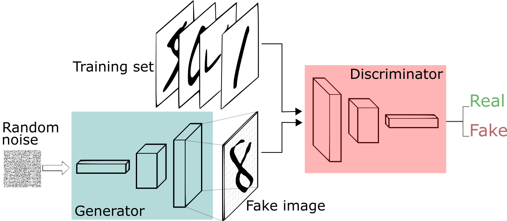
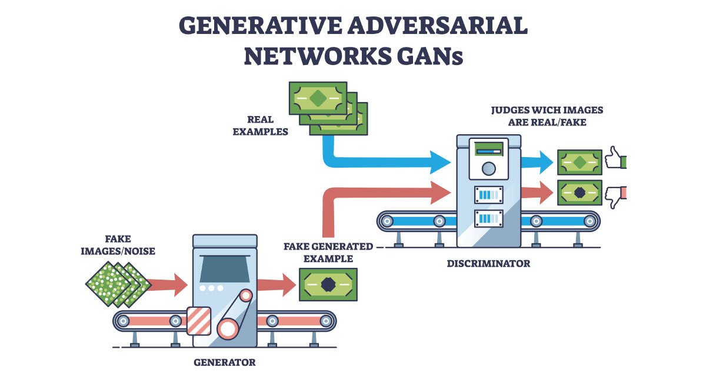
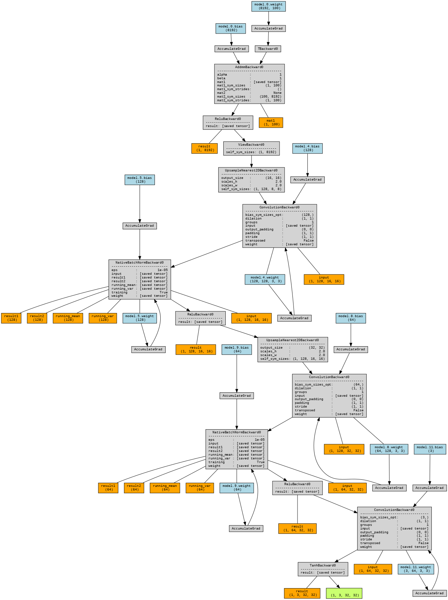
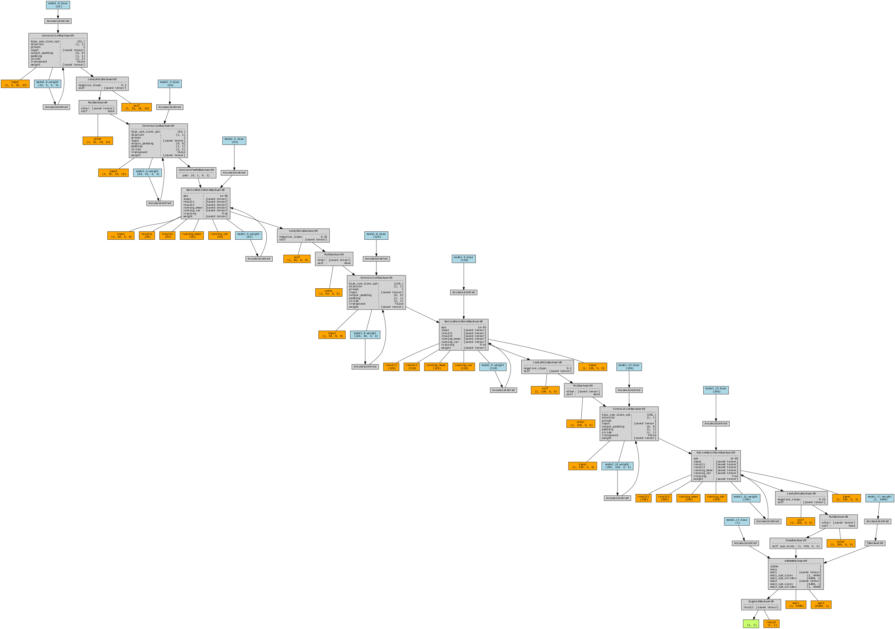

Generative Adversarial Networks (GAN) help machines to create new, realistic data by learning from existing examples. It is introduced by [Ian Goodfellow and his team in 2014](https://arxiv.org/abs/1406.2661){:target="_blank"} and they have transformed how computers generate images, videos, music and more. Unlike traditional models that only recognize or classify data, they take a creative way by generating entirely new content that closely resembles real-world data. This ability helped various fields such as art, gaming, healthcare and data science. In this article, we will see more about GANs and its core concepts.[^1]

GAN consists of two main components: **the Generator** and **the Discriminator**. The Generator creates new data instances, while the Discriminator evaluates them for authenticity.

/// caption
Generative Adversarial Network (GAN) consists of two main components: the Generator and the Discriminator. The Generator creates new data instances, while the Discriminator evaluates them for authenticity. *Image Source: [[^4]](https://sthalles.github.io/intro-to-gans/){:target="_blank"}*
///

The goal of the Generator is to produce data that is indistinguishable from real data, while the Discriminator aims to correctly identify whether the data is real or generated. This creates a dynamic where both components improve over time, leading to the generation of highly realistic data.

/// caption
Illustration of how GANs work. The Generator creates fake data from random noise, and the Discriminator evaluates both real and fake data to determine their authenticity. Over time, both networks improve through this adversarial process. *Image Source: [Caltech - What is Generative Adversarial Network?](https://pg-p.ctme.caltech.edu/blog/ai-ml/what-is-generative-adversarial-network-types){:target="_blank"}*
///

## Generator

The Generator is a deep neural network that takes random noise as input and generates data that mimics the real data distribution. It aims to produce outputs that are so realistic that the Discriminator cannot distinguish them from actual data. The Generator is trained to minimize the difference between the generated data distribution and the real data distribution, often using measures like [Kullback–Leibler Divergence](https://en.wikipedia.org/wiki/Kullback%E2%80%93Leibler_divergence){:target="_blank"}.[^2]

**Generator Loss Function**:

$$
L_G = -\mathbb{E}_{z \sim p_z(z)}[\log(D(G(z)))]
$$

Where:

- \( L_G \) is the loss for the Generator.
- \( z \) is the input noise vector sampled from a prior distribution \( p_z(z) \).
- \( G(z) \) is the generated data from the noise vector.
- \( D(G(z)) \) is the Discriminator's output for the generated data.

The generator aims to maximize \( D(G(z)) \) meaning it wants the discriminator to classify its fake data as real (probability close to 1).

The Generator is typically implemented as a deep neural network that takes the noise vector \( z \) as input and produces a data sample \( G(z) \) as output.

## Discriminator

The Discriminator is another deep neural network that takes both real and generated data as input and tries to distinguish between the two. It outputs a probability score indicating whether the input data is real (from the training set) or fake (generated by the Generator). The Discriminator is trained to maximize its accuracy in classifying real and generated data, often using binary cross-entropy loss.

**Discriminator Loss Function**:

$$
L_D = -\mathbb{E}_{x \sim p_{data}(x)}[\log(D(x))] - \mathbb{E}_{z \sim p_z(z)}[\log(1 - D(G(z)))]
$$

Where:

- \( L_D \) is the loss for the Discriminator.
- \( x \) is a real data sample from the true data distribution \( p_{data}(x) \).
- \( z \) is the input noise vector sampled from a prior distribution \( p_z(z) \).
- \( G(z) \) is the generated data from the noise vector.
- \( D(x) \) is the Discriminator's output for the real data.
- \( D(G(z)) \) is the Discriminator's output for the generated data.

The discriminator wants to correctly classify real data as real (maximize \( D(x) \)) and generated data as fake (minimize \( D(G(z)) \)).

During training, the Discriminator receives feedback on its performance, which helps it become better at identifying subtle differences between real and generated data. As the Generator improves and produces more realistic data, the Discriminator must also adapt to maintain its ability to differentiate between the two.

The interplay between the Generator and Discriminator creates a competitive environment, driving both networks to improve continuously. This adversarial process is what gives GANs their name and is key to their success in generating high-quality, realistic data.

## Training Process

The training of GANs involves an iterative process where both the Generator and Discriminator are updated in turns. The typical training loop consists of the following steps:

1. Generator's First Move

    The generator starts by taking a random noise vector (often sampled from a normal or uniform distribution) and transforms it into a fake data sample.

2. Discriminator's Turn

    The discriminator receives two types of data:

    - Real data from the training dataset.
    - Fake data generated by the generator.

    The discriminator has to classify each input as real or fake. It produces a probability score for each input, indicating the likelihood of it being real, ranging from 0 (fake) to 1 (real).

3. Adversarial Learning

    - If the discriminator correctly identifies real and fake data, it gets rewarded.

    - If the generator successfully fools the discriminator into thinking fake data is real, it gets rewarded, and the discriminator is penalized.

4. Generator's Improvement

    The generator updates its weights based on the feedback from the discriminator. It aims to produce more convincing fake data that can better deceive the discriminator in future iterations.

5. Discriminator's Adaptation

    The discriminator also updates its weights based on its performance. It learns to become more adept at distinguishing real data from the increasingly realistic fake data produced by the generator.

6. Training Progression

    As training continues, the generator becomes highly proficient at producing realistic data. Eventually the discriminator struggles to distinguish real from fake shows that the GAN has reached a well-trained state. At this point, the generator can produce high-quality synthetic data that can be used for different applications.

**MinMax Loss Function**:

GANs are trained using a MinMax game between the Generator and Discriminator. The Generator tries to minimize the probability of the Discriminator correctly identifying fake data, while the Discriminator tries to maximize its accuracy in distinguishing real from fake data.

The overall objective of GANs can be summarized with the following MinMax loss function:

$$
\min_G \max_D V(D, G) = \mathbb{E}_{x \sim p_{data}(x)}[\log(D(x))] + \mathbb{E}_{z \sim p_z(z)}[\log(1 - D(G(z)))]
$$

Where:

- \( V(D, G) \) is the value function representing the adversarial game between the Generator and Discriminator.
- The Generator \( G \) aims to minimize this value function, while the Discriminator \( D \) aims to maximize it.
- \( x \) is a real data sample from the true data distribution \( p_{data}(x) \).
- \( z \) is the input noise vector sampled from a prior distribution \( p_z(z) \).
- \( G(z) \) is the generated data from the noise vector.
- \( D(x) \) is the Discriminator's output for the real data.

This process is repeated for many iterations, with the Generator and Discriminator continuously improving in response to each other's performance. The training continues until the Generator produces data that is indistinguishable from real data, or until a predefined number of iterations is reached.

## Variants of GANs

Over the years, several variants of GANs have been developed to address specific challenges and improve performance. Some notable variants include:

| Variant | Innovation | Math Highlight | Description | Applications |
|---------|------------|----------------|-------------|--------------|
| DCGAN (Deep Convolutional GAN) | Uses convolutional layers in both the Generator and Discriminator | Convolutional Neural Networks (CNNs) | Introduces convolutional layers to better capture spatial hierarchies in image data. | Image generation, style transfer |
| WGAN (Wasserstein GAN) | Uses Wasserstein distance as a loss metric | Wasserstein Distance | | Improves training stability and addresses mode collapse by using the Wasserstein distance as a loss function. | Image generation, text-to-image synthesis |
| CGAN (Conditional GAN) | Conditions the generation process on additional information | Conditional Probability | Allows the generation of data conditioned on specific attributes or labels. | Image-to-image translation, text-to-image synthesis |
| StyleGAN | Introduces style-based architecture | Style Transfer | Enables control over different levels of detail in generated images through a style-based architecture. | High-resolution image synthesis, face generation |
| CycleGAN | Uses cycle consistency loss for unpaired image-to-image translation | Cycle Consistency Loss | Enables image-to-image translation without paired training data by enforcing cycle consistency. | Style transfer, domain adaptation |

## Challenges in Training GANs

Training GANs can be challenging due to several factors:

| Challenge | Description |
|-----------|-------------|
| Mode Collapse | The generator may produce a limited variety of outputs, leading to a lack of diversity in the generated data.[^6] |
| Training Instability | The adversarial nature of GANs can lead to unstable training dynamics, making it difficult to achieve convergence. |
| Evaluation Metrics | Assessing the quality of generated data can be subjective and challenging, as traditional metrics may not fully capture the realism of the outputs. |
| Hyperparameter Tuning | Finding the right hyperparameters (e.g., learning rates, batch sizes) for both the Generator and Discriminator is crucial for stable training but can be time-consuming and complex. |

## Applications of GANs

GANs have a wide range of applications across various fields:

| Application | Description |
|-------------|-------------|
| Image Generation | GANs can create high-quality images that are indistinguishable from real photos. |
| Data Augmentation | GANs can generate additional training data to improve the performance of machine learning models. |
| Style Transfer | GANs can apply the style of one image to another, enabling artistic transformations. |
| Super-Resolution | GANs can enhance the resolution of images, making them clearer and more detailed. |
| Text-to-Image Synthesis | GANs can generate images from textual descriptions, enabling creative content generation. |
| Anomaly Detection | GANs can be used to identify anomalies in data by learning the normal data distribution. |

## Implementations

??? example "CIFAR-10"

    Below is a basic example of how to create and train a GAN on the CIFAR-10 dataset.

    --8<-- "docs/classes/generative-adversarial-networks/gan_example_cifar_10.md"

    ??? info "Architecture Visualization"

        === "Generator"

            

        === "Discriminator"

            

<!-- ??? example "MNIST"

    Below is a basic example of how to create and train a GAN on the MNIST dataset.

    --8<-- "docs/classes/generative-adversarial-networks/gan_example_mnist.md"
 -->

[^1]: Geeks for Geeks: [Generative Adversarial Network (GAN)](https://www.geeksforgeeks.org/deep-learning/generative-adversarial-network-gan/){target='_blank'}

[^2]: [Kullback–Leibler Divergence](https://en.wikipedia.org/wiki/Kullback%E2%80%93Leibler_divergence){target='_blank'} is a measure of how one probability distribution diverges from a second, expected probability distribution. In the context of GANs, it can be used to quantify the difference between the distribution of real data and the distribution of data generated by the Generator. Minimizing this divergence helps improve the quality of the generated data, making it more similar to the real data.

[^3]: [Wasserstein Distance](https://en.wikipedia.org/wiki/Wasserstein_metric){target='_blank'} is another metric used to measure the distance between two probability distributions. In the context of GANs, the Wasserstein GAN (WGAN) uses this distance to provide a more stable training process and to mitigate issues like mode collapse.

[^4]: [Intro to GANs](https://sthalles.github.io/intro-to-gans/){:target='_blank'} by Sthelles Silva provides a comprehensive introduction to the concepts and workings of Generative Adversarial Networks (GANs). The article covers the fundamental principles behind GANs, including the roles of the Generator and Discriminator, the adversarial training process, and common challenges faced during training. It also discusses various applications of GANs in fields such as image generation, data augmentation, and more. This resource is valuable for anyone looking to understand how GANs function and their significance in the field of machine learning.

[^5]: Caltech - [What is Generative Adversarial Network?](https://pg-p.ctme.caltech.edu/blog/ai-ml/what-is-generative-adversarial-network-types){target='_blank'}

[^6]: [Mode Collapse](https://en.wikipedia.org/wiki/Mode_collapse){target='_blank'} is a common problem in GAN training where the Generator produces a limited variety of outputs, often collapsing to a few modes of the data distribution. This results in a lack of diversity in the generated samples, which can be detrimental to the overall performance of the GAN.

[^7]: [GAN Lab](https://poloclub.github.io/ganlab/){target='_blank'} is an interactive visualization tool that helps users understand how Generative Adversarial Networks (GANs) work. It provides a hands-on experience of training GANs, allowing users to visualize the generator and discriminator networks, observe their interactions, and see how they evolve during the training process. This tool is particularly useful for those new to GANs or for educators looking to demonstrate the concepts behind adversarial training in a more intuitive way.

[^8]: [TensorFlow GAN Tutorial](https://www.tensorflow.org/tutorials/generative/dcgan){target='_blank'} provides a step-by-step guide on how to implement a Deep Convolutional Generative Adversarial Network (DCGAN) using TensorFlow and Keras. The tutorial covers the essential components of GANs, including the architecture of the Generator and Discriminator, the training process, and how to generate new images after training. It is a practical resource for those looking to gain hands-on experience with GANs and understand their implementation in a deep learning framework.

[^9]: [ThisPersonDoesNotExist](https://thispersondoesnotexist.com/){target='_blank'} is a website that uses Generative Adversarial Networks (GANs) to generate realistic images of human faces that do not belong to any real person. Each time the page is refreshed, a new, unique face is created by the GAN model, showcasing the impressive capabilities of AI in generating lifelike images. The site serves as a fascinating demonstration of how GANs can be used for creative and practical applications in image synthesis.