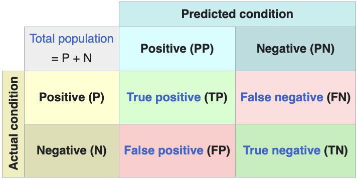

<style>
table.confusion-matrix {
    border-collapse: collapse;
    margin: 10px 0;
}
table.confusion-matrix td {
    border: 1px solid #ddd;
    padding: 8px;
    text-align: center;
    width: 50px;
    height: 50px;
}
table.confusion-matrix tr:nth-child(even){background-color: #f2f2f2;}
table.confusion-matrix tr:hover {background-color: #ddd;}
table.confusion-matrix th {
    padding-top: 12px;
    padding-bottom: 12px;
    text-align: center;
    background-color: #4CAF50;
    color: white;
}
</style>

Below is a detailed list of metrics commonly used to evaluate the accuracy and performance of classification and regression models in machine learning, including neural networks. The metrics are categorized based on their applicability to classification or regression tasks, with explanations of their purpose and mathematical formulations where relevant.


## Classification Metrics

Classification tasks involve predicting discrete class labels. The following metrics assess the accuracy and effectiveness of such models:

| Metric | Purpose | Formula | Use Case |
|--------|---------|:-------:|----------|
| Accuracy | Measures the proportion of correct predictions across all classes | \( \displaystyle \frac{TP + TN}{TP + TN + FP + FN} \) | Suitable for balanced datasets but misleading for imbalanced ones |
| Precision | Evaluates the proportion of positive predictions that are actually correct | \( \displaystyle \frac{TP}{TP + FP} \) | Important when false positives are costly (e.g., spam detection) |
| Recall (Sensitivity) | Assesses the proportion of actual positives correctly identified | \( \displaystyle \frac{TP}{TP + FN} \) | Critical when false negatives are costly (e.g., disease detection) |
| F1-Score | Harmonic mean of precision and recall, balancing both metrics | \( \displaystyle 2 \cdot \frac{\text{Precision} \cdot \text{Recall}}{\text{Precision} + \text{Recall}} \) | Useful for imbalanced datasets where both precision and recall matter |
| AUC-ROC | Measures the model’s ability to distinguish between classes across all thresholds | Area under the curve plotting True Positive Rate (Recall) vs. False Positive Rate \( \displaystyle \left( \frac{FP}{FP + TN} \right) \) | Effective for binary classification and assessing model robustness |
| AUC-PR | Focuses on precision and recall trade-off, especially for imbalanced datasets | Area under the curve plotting Precision vs. Recall | Preferred when positive class is rare (e.g., fraud detection) |
| Confusion Matrix[^1] | Provides a tabular summary of prediction outcomes (TP, TN, FP, FN) |  | Offers detailed insights into class-specific performance, especially for multi-class problems |
| Hamming Loss | Calculates the fraction of incorrect labels to the total number of labels | \( \displaystyle \frac{1}{N} \sum_{i=1}^N \frac{1}{L} \sum_{j=1}^L \mathbf{1}(y_{ij} \neq \hat{y}_{ij}) \) | Suitable for multi-label classification tasks |
| Balanced Accuracy | Average of recall obtained on each class, useful for imbalanced datasets | \( \displaystyle \frac{1}{C} \sum_{i=1}^C \frac{TP_i}{TP_i + FN_i} \) | Effective for multi-class problems with class imbalance |

<!-- | Log Loss | Penalizes incorrect predictions based on predicted probabilities | \( \displaystyle -\frac{1}{N} \sum_{i=1}^N [y_i \log(\hat{y}_i) + (1 - y_i) \log(1 - \hat{y}_i)] \) | Common in probabilistic classifiers like neural networks with softmax outputs | -->


### Explanation of ROC Curve (AUC-ROC)

An ROC curve plots the True Positive Rate (TPR, or sensitivity/recall) against the False Positive Rate (FPR) at various classification thresholds. It helps visualize the trade-off between sensitivity and specificity for a classifier:

- **True Positive Rate (TPR)**: The proportion of actual positives correctly identified (TP / (TP + FN)).

- **False Positive Rate (FPR)**: The proportion of actual negatives incorrectly classified as positives (FP / (FP + TN)).

- The **Area Under the Curve (AUC)** quantifies the overall performance, with AUC = 1 indicating a perfect classifier and AUC = 0.5 indicating a random classifier.

```python exec="on" html="1"
--8<-- "docs/classes/metrics/classification/auc-roc-example.py"
```

---

## Additional

<iframe width="100%" height="470" src="https://www.youtube.com/embed/4jRBRDbJemM" title="ROC and AUC, Clearly Explained!" frameborder="0" allow="accelerometer; autoplay; clipboard-write; encrypted-media; gyroscope; picture-in-picture; web-share" referrerpolicy="strict-origin-when-cross-origin" allowfullscreen></iframe>

---

Loss functions commonly used in classification tasks include:

| Metric | Purpose | Formula | Use Case |
|--------|---------|:-------:|----------|
| **Cross-Entropy Loss** | Measures the performance of a classification model whose output is a probability value between 0 and 1. It increases as the predicted probability diverges from the actual label. | \[ \text{Cross-Entropy Loss} = -\frac{1}{N} \sum_{i=1}^{N} \left[ y_i \log(\hat{y}_i) + (1 - y_i) \log(1 - \hat{y}_i) \right] \] | Commonly used in classification tasks with probabilistic outputs. |
| **Binary Cross-Entropy** | Used for binary classification tasks, measuring the difference between two probability distributions. | \[ \text{Binary Cross-Entropy} = -\frac{1}{N} \sum_{i=1}^{N} \left[ y_i \log(\hat{y}_i) + (1 - y_i) \log(1 - \hat{y}_i) \right] \] | Commonly used in binary classification problems. |
| **Categorical Cross-Entropy** | Used when there are two or more label classes. It is a generalization of binary cross-entropy to multi-class problems. | \[ \text{Categorical Cross-Entropy} = -\sum_{i=1}^{N} \sum_{c=1}^{C} y_{i,c} \log(\hat{y}_{i,c}) \] | Suitable for multi-class classification tasks with one-hot encoded labels. |
| **Sparse Categorical Cross-Entropy** | Similar to categorical cross-entropy but used when labels are provided as integers rather than one-hot encoded vectors. | \[ \text{Sparse Categorical Cross-Entropy} = -\sum_{i=1}^{N} \log(\hat{y}_{i,y_i}) \] | Useful for multi-class classification with integer labels. |
| **Balanced Cross-Entropy** | | Adjusts the standard cross-entropy loss to account for class imbalance by weighting classes inversely proportional to their frequency. | \[ \text{Balanced Cross-Entropy} = -\frac{1}{N} \sum_{i=1}^{N} \left[ w_1 y_i \log(\hat{y}_i) + w_0 (1 - y_i) \log(1 - \hat{y}_i) \right] \] | Useful in imbalanced classification tasks. |
| **Kullback-Leibler Divergence** | Measures how one probability distribution diverges from a second, expected probability distribution. It is often used in variational autoencoders and other probabilistic models. | \[ D_{KL}(P \| Q) = \sum_{i} P(i) \log\left(\frac{P(i)}{Q(i)}\right) \]  | Useful in scenarios involving probabilistic models and distributions. |
| **Hinge Loss** | Used for "maximum-margin" classification, primarily for support vector machines (SVMs). It is designed to ensure that the correct class is not only predicted but also separated from the decision boundary by a margin. | \[ \text{Hinge Loss} = \sum_{i=1}^{N} \max(0, 1 - y_i \cdot \hat{y}_i) \] | Effective for SVMs and tasks requiring a margin between classes. |
| **Focal Loss** | A modified version of cross-entropy loss that addresses class imbalance by down-weighting easy examples and focusing training on hard negatives. | \[ \text{Focal Loss} = -\frac{1}{N} \sum_{i=1}^{N} \alpha_t (1 - p_t)^\gamma \log(p_t) \] | Beneficial in scenarios with significant class imbalance, such as object detection. |
| **Multi-Class Log Loss** | Extends binary log loss to multi-class classification problems, penalizing incorrect predictions based on predicted probabilities. | \[ \text{Multi-Class Log Loss} = -\frac{1}{N} \sum_{i=1}^{N} \sum_{c=1}^{C} y_{i,c} \log(\hat{y}_{i,c}) \] | Suitable for multi-class classification tasks. |
| **Hamming Loss** | Measures the fraction of incorrect labels to the total number of labels, useful for multi-label classification tasks. | \[ \text{Hamming Loss} = \frac{1}{N} \sum_{i=1}^N \frac{1}{L} \sum_{j=1}^L \mathbf{1}(y_{ij} \neq \hat{y}_{ij}) \] | Effective for multi-label classification scenarios. |

[^1]: [:material-wikipedia: Confusion Matrix](https://en.wikipedia.org/wiki/Confusion_matrix)