## Fast Forward: Multi-Layer Perceptrons (MLPs)

<i>Multi-Layer Perceptron (MLP) Architecture.</i>

$$
y_k = f \left( \sum_{j=1}^{m} f \left( \sum_{i=1}^{n} x_i w_{ij} + b^{h}_{i} \right) v_{jk} + b^{y}_{j} \right)
$$

where:

- \( y_k \) is the output for the \( k \)-th output neuron.
- \( x_i \) are the input features.
- \( w_{ij} \) are the weights connecting the \( i \)-th input to the \( j \)-th hidden neuron.
- \( v_{jk} \) are the weights connecting the \( j \)-th hidden neuron to the \( k \)-th output neuron.
- \( b^{h}_{i} \) is the bias for the \( i \)-th hidden neuron.
- \( b^{y}_{j} \) is the bias for the \( j \)-th output neuron.
- \( m \) is the number of hidden neurons.
- \( n \) is the number of input features.
- \( f \) is the activation function applied to the weighted sums at each layer, such as sigmoid, tanh, or ReLU.

Matrix representation of the MLP architecture:

$$
\begin{align*}
\text{Input Layer:} & \quad \mathbf{x} = [x_1, x_2, \ldots, x_n]^T \\
\text{Hidden Layer:} & \quad \mathbf{h} = f (\mathbf{W} \mathbf{x} + \mathbf{b}^h) \\
\text{Output Layer:} & \quad \mathbf{y} = f (\mathbf{V} \mathbf{h} + \mathbf{b}^y)
\end{align*}
$$

<i>Multi-Layer Perceptron (MLP) Architecture.</i>

| Sigmoid | Tanh    | ReLU  |
|---------|---------|-------|
| \( \sigma(x) = \displaystyle \frac{1}{1 + e^{-x}} \) | \( \tanh(x) = \displaystyle \frac{e^{2x} - 1}{e^{2x} + 1} \) | \( \text{ReLU}(x) = \max(0, x) \) |
| \( \sigma'(x) = \sigma(x)(1 - \sigma(x)) \)          | \( \tanh'(x) = 1 - \tanh^2(x) \)                             | \( \text{ReLU}'(x) = \begin{cases} 1 & \text{if } x > 0 \\ 0 & \text{if } x \leq 0 \end{cases} \) |
|  |  |  |
| Sigmoid is a smooth, S-shaped curve that outputs values between 0 and 1, making it suitable for binary classification tasks. | Tanh is a smooth curve that outputs values between -1 and 1, centering the data around zero, which can help with convergence in training. | ReLU is a piecewise linear function that outputs zero for negative inputs and the input itself for positive inputs, allowing for faster training and reducing the vanishing gradient problem. |

Backpropagation is the algorithm used to train multi-layer perceptrons (MLPs) by adjusting the weights and biases based on the error between the predicted output and the actual target. The process involves two main steps:

1. **Forward Pass**: The input data is passed through the network, layer by layer, to compute the output. The output is compared to the target value to calculate the loss (error).
2. **Loss Calculation**: Calculate the loss (error) between the predicted output and the actual target using a loss function, such as mean squared error or cross-entropy.
3. **Backward Pass**: The error is propagated backward through the network to compute the gradients of the loss with respect to each weight and bias. These gradients are then used to update the weights and biases using an optimization algorithm, such as stochastic gradient descent (SGD) or Adam.

## Feedforward

Consider a Multi-Layer Perceptron (MLP) with:

- 2 input neurons: \(x_1\) and \(x_2\)
- 1 hidden layer with 2 neurons: \(h_1\) and \(h_2\)
- 1 output neuron: \(y\)

We assume sigmoid activation functions for both the hidden and output layers:

$$\displaystyle f(z) = \frac{1}{1 + e^{-z}}$$

, with derivative

$$f'(z) = f(z)(1 - f(z))$$

The architecture can be visualized as follows:

``` mermaid
flowchart LR
    classDef default fill:transparent,stroke:#333,stroke-width:1px;
    classDef others fill:transparent,stroke:transparent,stroke-width:0px;
    subgraph input
        x1(["x<sub>1</sub>"])
        x2(["x<sub>2</sub>"])
    end
    subgraph hidden
        direction TB
        subgraph nh1[" "]
            direction TB
            style nh1 fill:transparent,stroke:transparent,stroke-width:0px
            h1(["h<sub>1</sub>"])
            bh1(["b<sup>h</sup><sub>1</sub>"])
        end
        subgraph nh2[" "]
            direction TB
            style nh2 fill:transparent,stroke:transparent,stroke-width:0px
            h2(["h<sub>2</sub>"])
            bh2(["b<sup>h</sup><sub>2</sub>"])
        end
    end
    subgraph output
        subgraph ny[" "]
            direction TB
            style ny fill:transparent,stroke:transparent,stroke-width:0px
            y(["y"])
            by(["b<sup>y</sup><sub>1</sub>"])
        end
    end
    in1@{ shape: circle, label: " " } --> x1
    in2@{ shape: circle, label: " " } --> x2

    x1 -->|"w<sub>11</sub>"|h1
    x1 -->|"w<sub>12</sub>"|h2
    x2 -->|"w<sub>21</sub>"|h1
    x2 -->|"w<sub>22</sub>"|h2
    
    h1 -->|"v<sub>11</sub>"|y
    h2 -->|"v<sub>21</sub>"|y

    y(("ŷ")) --> out1@{ shape: dbl-circ, label: " " }

    style input fill:#fff,stroke:#666,stroke-width:0px
    style hidden fill:#fff,stroke:#666,stroke-width:0px
    style output fill:#fff,stroke:#666,stroke-width:0px
```

<i>Multi-Layer Perceptron (MLP) Architecture.</i>

In mathematical terms, the feedforward process can be described as follows:

$$
\begin{align*}
\text{Input Layer:} & \quad \mathbf{x} = [x_1, x_2]^T \\
\text{Hidden Layer:} & \quad \mathbf{h} = f (\mathbf{W} \mathbf{x} + \mathbf{b}^h) \\
\text{Output Layer:} & \quad \mathbf{y} = f (\mathbf{V} \mathbf{h} + \mathbf{b}^y)
\end{align*}
$$

or, more canonical for our simple MLP:

1. Hidden layer pre-activation:

$$
\begin{align}
z_1 & = w_{11} x_1 + w_{21} x_2 + b^h_1 \\
z_2 & = w_{12} x_1 + w_{22} x_2 + b^h_2
\end{align}
$$

2. Hidden layer activations:

$$
\begin{align}
h_1 & = f(z_1) \\
h_2 & = f(z_2)
\end{align}
$$

3. Output layer pre-activation:

$$
\begin{align}
u & = v_{11} h_1 + v_{21} h_2 + b^y_1
\end{align}
$$

4. Output layer activation:

$$
\begin{align}
\hat{y} & = f(u)
\end{align}
$$

where \( f \) is the activation function, \( w_{ij} \) are the weights connecting inputs to hidden neurons, and \( v_{ij} \) are the weights connecting hidden neurons to output neurons. The biases \( b^h_1, b^h_2, \) and \( b^y_1 \) are added to the respective layers. \( \hat{y} \) is the predicted output of the MLP.

## Loss Calculation

The loss function quantifies the difference between the predicted output and the actual target. For regression tasks, a common loss function is the Mean Squared Error (MSE):

$$
L = \text{MSE} = \frac{1}{N} \sum_{i=1}^{N} (y_i - \hat{y}_i)^2
$$

where \( N \) is the number of samples, \( y_i \) is the true output, and \( \hat{y}_i \) is the predicted output.

## Backpropagation: Computing Gradients

The backpropagation algorithm is a method used to train multi-layer perceptrons (MLPs) by minimizing the error between the predicted output and the actual target. It involves two main steps: the forward pass and the backward pass. The update of weights and biases is done using the gradients computed during the backward pass.

Backpropagation computes the partial derivatives of \(L\) with respect to each parameter using the chain rule, starting from the output and propagating errors backward.

### Update Rule

To update parameters during training (e.g., via gradient descent with learning rate \(\eta\)), for each weight/bias \(p\):

$$
p \leftarrow p - \eta \cdot \frac{\partial L}{\partial p}
$$

This derivation assumes a single example; for batches, average the gradients. For other activations or losses (e.g., softmax + cross-entropy), the deltas would adjust accordingly, but the chain rule structure remains similar.

### Step 1: Output Layer Error

The error term (delta) for the output is:

$$
\begin{align}
    \delta_y = \frac{\partial L}{\partial u} &= \overbrace{\frac{\partial L}{\partial y} \cdot \frac{\partial y}{\partial u}}^{\text{chain rule}} \\ 
    &= \overbrace{(y - \hat{y})}^{\text{MSE}} \cdot \overbrace{\sigma'(u)}^{\text{sigmoid}} \\
    \\
    &= (y - \hat{y}) \cdot \hat{y}(1 - \hat{y})
\end{align}
$$

### Step 2: Gradients for Output Weights and Bias

!!! info inline end "Remember"

    $$
    \begin{align}
    u & = v_{11} h_1 + v_{21} h_2 + b^y_1
    \end{align}
    $$

Using \(\delta_y\):

$\begin{align}
    \frac{\partial L}{\partial v_{11}} &= \delta_y \cdot h_1 \\
    \\
    \overbrace{\frac{\partial L}{\partial u} \cdot \frac{\partial u}{\partial v_{11}}}^{\text{chain rule}} &= \delta_y \cdot h_1
\end{align}$

Similarly:

$\begin{align}
    \frac{\partial L}{\partial v_{21}} &= \delta_y \cdot h_2 \\
    \\
    \overbrace{\frac{\partial L}{\partial u} \cdot \frac{\partial u}{\partial v_{21}}}^{\text{chain rule}} &= \delta_y \cdot h_2
\end{align}$

### Step 3: Hidden Layer Errors

!!! info inline end "Remember"

    $$
    \begin{align}
    z_1 & = w_{11} x_1 + w_{21} x_2 + b^h_1 \\
    z_2 & = w_{12} x_1 + w_{22} x_2 + b^h_2
    \end{align}
    $$

Propagate the error back to the hidden layer. For each hidden neuron:

$\begin{align}
    \delta_{h_1} &= \frac{\partial L}{\partial z_1} \\
    \\
    &= \frac{\partial L}{\partial h_1} & \cdot \frac{\partial h_1}{\partial z_1} \\
    \\
    &= \left( \frac{\partial L}{\partial u} \cdot \frac{\partial u}{\partial h_1} \right) & \cdot \sigma'(z_1) \\
    \\
    &= (\delta_y \cdot v_1) & \cdot \sigma'(z_1) \\
    \\
    &= (\delta_y \cdot v_1) & \cdot h_1(1 - h_1)
\end{align}$

Similarly:

$\delta_{h_2} = (\delta_y \cdot v_2) \cdot h_2(1 - h_2)$

### Step 4: Gradients for Hidden Weights and Biases

Using the hidden deltas:

$\begin{align}
\frac{\partial L}{\partial w_{11}}
&= \frac{\partial L}{\partial z_1} \cdot \frac{\partial z_1}{\partial w_{11}}
&= \delta_{h_1} \cdot x_1
\end{align}$

$\begin{align}
\frac{\partial L}{\partial w_{21}}
&= \frac{\partial L}{\partial z_1} \cdot \frac{\partial z_1}{\partial w_{21}}
&= \delta_{h_1} \cdot x_2
\end{align}$

$\begin{align}
\frac{\partial L}{\partial w_{12}}
&= \frac{\partial L}{\partial z_2} \cdot \frac{\partial z_2}{\partial w_{12}}
&= \delta_{h_2} \cdot x_1
\end{align}$

$\begin{align}
\frac{\partial L}{\partial w_{22}} 
&= \frac{\partial L}{\partial z_2} \cdot \frac{\partial z_2}{\partial w_{22}}
&= \delta_{h_2} \cdot x_2
\end{align}$

similarly for biases:

$\begin{align}
\frac{\partial L}{\partial b_1}
&= \delta_{h_1} \cdot 1
&= \delta_{h_1}
\end{align}$

$\begin{align}
\frac{\partial L}{\partial b_2}
&= \delta_{h_2} \cdot 1
&= \delta_{h_2}
\end{align}$

### Step 5: Update Weights and Biases

!!! info inline end "Remember"

    $$
    p \leftarrow p - \eta \cdot \frac{\partial L}{\partial p}
    $$

Finally, update the weights and biases using the computed gradients and a learning rate \(\eta\):

$\begin{align}
v_{11} & \leftarrow v_{11} - \eta \cdot \frac{\partial L}{\partial v_{11}} \\
v_{21} & \leftarrow v_{21} - \eta \cdot \frac{\partial L}{\partial v_{21}} \\
w_{11} & \leftarrow w_{11} - \eta \cdot \frac{\partial L}{\partial w_{11}} \\
w_{21} & \leftarrow w_{21} - \eta \cdot \frac{\partial L}{\partial w_{21}} \\
w_{12} & \leftarrow w_{12} - \eta \cdot \frac{\partial L}{\partial w_{12}} \\
w_{22} & \leftarrow w_{22} - \eta \cdot \frac{\partial L}{\partial w_{22}} \\
b^h_1 & \leftarrow b^h_1 - \eta \cdot \frac{\partial L}{\partial b^h_1} \\
b^h_2 & \leftarrow b^h_2 - \eta \cdot \frac{\partial L}{\partial b^h_2} \\
b^y_1 & \leftarrow b^y_1 - \eta \cdot \frac{\partial L}{\partial b^y_1}
\end{align}$

---

{width="100%"}

<!-- ## Training Process

Online learning is a method of training multi-layer perceptrons (MLPs) where the model is updated after each training example. This approach allows for faster convergence and can be more effective in scenarios with large datasets or when the data is not stationary.

Batch learning, on the other hand, involves updating the model after processing a batch of training examples. This method can lead to more stable updates and is often used in practice due to its efficiency in utilizing computational resources.

more: -->

[^1]: Haykin, S. (1994). Neural Networks: A Comprehensive Foundation. Prentice Hall.
[:fontawesome-brands-amazon:](https://www.amazon.com/Neural-Networks-Comprehensive-Foundation-2nd/dp/0132733501){target="_blank"}

[^2]: Bishop, C. M. (2006). Pattern Recognition and Machine Learning. Springer.
[:fontawesome-brands-amazon:](https://www.amazon.com/Pattern-Recognition-Learning-Information-Statistics/dp/0387310738){target="_blank"}
[:octicons-download-24:](https://www.microsoft.com/en-us/research/wp-content/uploads/2006/01/Bishop-Pattern-Recognition-and-Machine-Learning-2006.pdf){target="_blank"}

[^3]: Goodfellow, I., Bengio, Y., & Courville, A. (2016). Deep Learning. MIT Press.
[:fontawesome-brands-amazon:](https://www.amazon.com/Deep-Learning-Adaptive-Computation-Machine/dp/0262035618){target="_blank"}
[:octicons-download-24:](https://www.deeplearningbook.org/){target="_blank"}

