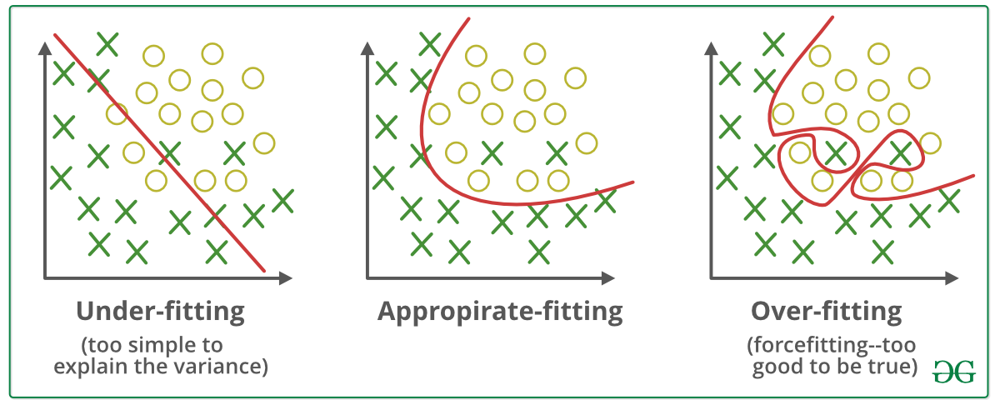

Regularization techniques to prevent overfitting in MLPs, such as dropout, L1 and L2 regularization, batch normalization, and early stopping.

!!! info "Balance Between Bias and Variance"

    The relationship between bias and variance is often referred to as the bias-variance tradeoff, which highlights the need for balance:

    Increasing model complexity reduces bias but increases variance (risk of overfitting).
    Simplifying the model reduces variance but increases bias (risk of underfitting).
    The goal is to find an optimal balance where both bias and variance are minimized, resulting in good generalization performance.

    
    /// caption
    Illustration of underfitting and overfitting in neural networks. Source: [GeeksforGeeks](https://www.geeksforgeeks.org/machine-learning/underfitting-and-overfitting-in-machine-learning/)
    ///

    

    -   __Reducing Underfitting__

        ---

        - Increase model complexity.
        - Increase the number of features, performing feature engineering.
        - Remove noise from the data.
        - Increase the number of epochs or increase the duration of training to get better results.

    -   __Reducing Overfitting__

        ---

        - Improving the quality of training data reduces overfitting by focusing on meaningful patterns, mitigate the risk of fitting the noise or irrelevant features.
        - Increase the training data can improve the model's ability to generalize to unseen data and reduce the likelihood of overfitting.
        - Reduce model complexity.
        - Early stopping during the training phase (have an eye over the loss over the training period as soon as loss begins to increase stop training).
        - Ridge Regularization and Lasso Regularization.
        - Use dropout for neural networks to tackle overfitting.
    
    

---

## Dropout

Dropout[^1] is a regularization technique where, during training, a random subset of neurons (or their connections) is "dropped" (set to zero) in each forward and backward pass. This prevents the network from relying too heavily on specific neurons.

During training, each neuron has a probability \( p \) (typically 0.2 to 0.5) of being dropped.
This forces the network to learn redundant representations, making it more robust and less likely to memorize the training data. At test time, all neurons are active, but their weights are scaled by \( 1-p \) to account for the reduced activation during training.

Dropout acts like training an ensemble of smaller subnetworks, reducing co-dependency between neurons.
It introduces noise, making the model less sensitive to specific patterns in the training data, thus improving generalization.

/// caption
Dropout Neural Net Model. Left: A standard neural net with 2 hidden layers. Right:
An example of a thinned net produced by applying dropout to the network on the left.
Crossed units have been dropped. Source: [Dropout: A Simple Way to Prevent Neural Networks from Overfitting](https://www.cs.toronto.edu/~hinton/absps/JMLRdropout.pdf){:target="_blank"}
///

### Practical tips

- Common dropout rates: 20–50% for hidden layers, lower (10–20%) for input layers.

- Use in deep networks, especially in fully connected layers or convolutional neural networks (CNNs).
Avoid dropout in the output layer or when the network is small (it may hurt performance).

-   __Pros__

    ---

    - Effective for deep networks;
    - Computationally cheap.

-   __Cons__

    ---

    - Requires tuning \( p \); can slow convergence;
    - May not work well with all datasets;
    - Can introduce noise, making optimization harder.

---

## L1 and L2 Regularizations

- **L1 regularization (Lasso)** adds a penalty term to the loss function based on the absolute values of the model’s weights, encouraging sparsity in the weight matrix. This means that some weights can become exactly zero, effectively performing feature selection.

    The loss function is modified to include an L1 penalty:

    $$\text{Loss} = \text{Original Loss} + \lambda \sum |w_i|$$

    where \( w_i \) are the model’s weights, and \( \lambda \) (regularization strength) controls the penalty’s impact. During training, this encourages the model to focus on the most important features, potentially improving generalization.

- **L2 regularization (Weight Decay)** adds a penalty term to the loss function based on the magnitude of the model’s weights, discouraging large weights that can lead to complex, overfitted models.

    The loss function is modified to include an L2 penalty:

    $$\text{Loss} = \text{Original Loss} + \lambda \sum w_i^2$$

    where \( w_i \) are the model’s weights, and \( \lambda \) (regularization strength) controls the penalty’s impact.

    During optimization, this penalty encourages smaller weights, simplifying the model.

    Large weights amplify small input changes, leading to overfitting. L2 regularization constrains weights, making the model smoother and less sensitive to noise.
    It effectively reduces the model’s capacity to memorize training data.

### Key Differences

- **L1**: Encourages **sparse models** (some weights = 0), useful for feature selection or when you want a simpler model with fewer active connections.

- **L2**: Produces **small but non-zero weights**, often leading to better generalization in many cases, especially in deep neural networks.

### Practical tips

- Common \( \lambda \): \( 10^{-5} \) to \( 10^{-2} \), tuned via cross-validation.
- Works well in linear models, fully connected NNs, and CNNs.
- Combine with other techniques (e.g., dropout) for better results.
- The regularization affects the **weights** (not biases, typically) of the chosen layers.

-   __Pros__

    ---

    - Encourages simpler models;
    - Can improve generalization.

-   __Cons__

    ---

    - Requires careful tuning of \( \lambda \);
    - May not work well with all datasets;

---

## Batch Normalization

Batch normalization[^2] is a technique to improve the training of deep neural networks by normalizing the inputs to each layer. It reduces internal covariate shift, allowing for faster training and potentially better performance.

During training, batch normalization standardizes the inputs to a layer for each mini-batch:

$$\hat{x} = \frac{x - \mu}{\sigma + \epsilon}$$

where \( \mu \) is the batch mean, \( \sigma \) is the batch standard deviation, and \( \epsilon \) is a small constant for numerical stability.

After normalization, the layer can learn a scale ( \( \gamma \) ) and shift ( \( \beta \) ) parameter:

$$y = \gamma \hat{x} + \beta$$

This allows the model to maintain the representational power while benefiting from the normalization.

### Practical tips

- Use batch normalization after convolutional layers or fully connected layers.
- It can be used with other regularization techniques (e.g., dropout) for improved generalization.
- Consider using it in the training phase only, and not during inference, to avoid introducing noise.

-   __Pros__

    ---

    - Speeds up training;
    - Allows higher learning rates;
    - Reduces sensitivity to initialization.

-   __Cons__

    ---

    - Adds complexity to the model;
    - May not always improve performance.

---

## Early Stopping

Early stopping is a regularization technique used to prevent overfitting in machine learning models, particularly in deep learning. The idea is to monitor the model's performance on a validation set during training and stop the training process once the performance starts to degrade.

The key steps involved in early stopping are:

1. **Split the Data**: Divide the dataset into training, validation, and test sets.
2. **Monitor Performance**: During training, periodically evaluate the model on the validation set and track the performance metric (e.g., accuracy, loss).
3. **Set Patience**: Define a patience parameter, which is the number of epochs to wait for an improvement in the validation performance before stopping training.
4. **Stop Training**: If the validation performance does not improve for a specified number of epochs (patience), stop the training process.

Early stopping helps to find a balance between underfitting and overfitting by allowing the model to train long enough to learn the underlying patterns in the data while preventing it from fitting noise.

### Practical tips

- Use early stopping in conjunction with other regularization techniques (e.g., dropout, weight decay) for better results.
- Monitor multiple metrics (e.g., training loss, validation loss) to make informed decisions about stopping.

-   __Pros__

    ---

    - Helps prevent overfitting;
    - Can save training time.

-   __Cons__

    ---

    - Requires careful tuning of patience;
    - May stop training too early.

---

## Additional

<iframe width="100%" height="470" src="https://www.youtube.com/embed/EuBBz3bI-aA" title="Machine Learning Fundamentals: Bias and Variance" frameborder="0" allow="accelerometer; autoplay; clipboard-write; encrypted-media; gyroscope; picture-in-picture; web-share" referrerpolicy="strict-origin-when-cross-origin" allowfullscreen></iframe>

[^1]: [Dropout: A Simple Way to Prevent Neural Networks from Overfitting](https://jmlr.org/papers/volume15/srivastava14a/srivastava14a.pdf){:target="_blank"}, Srivastava, N., Hinton, G., Krizhevsky, A., Sutskever, I., & Salakhutdinov, R.

[^2]: [Batch Normalization: Accelerating Deep Network Training by Reducing Internal Covariate Shift](https://arxiv.org/abs/1502.03167){:target="_blank"}, Ioffe, S., & Szegedy, C.

[^3]: [Underfitting and Overfitting in Machine Learning](https://www.geeksforgeeks.org/machine-learning/underfitting-and-overfitting-in-machine-learning/)