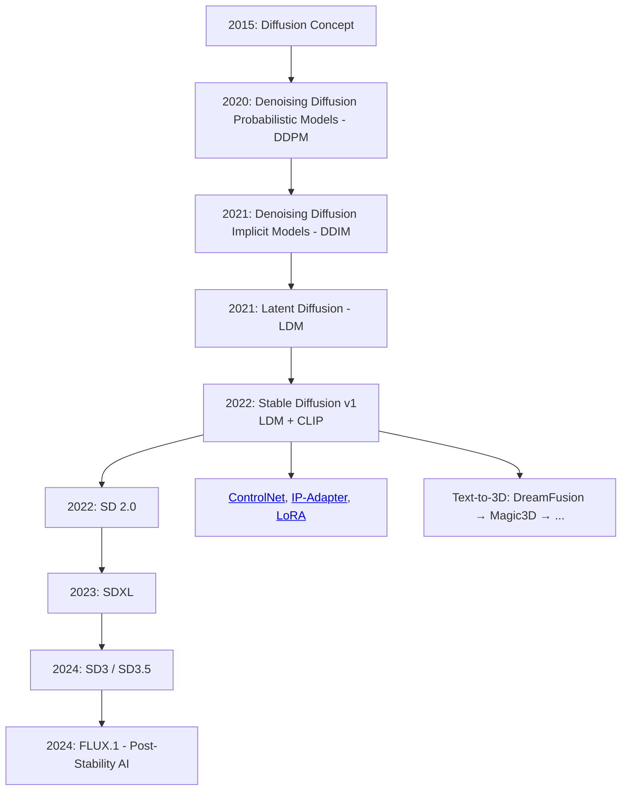

Stable Diffusion is a state-of-the-art text-to-image generative model developed by Stability AI in collaboration with researchers at [EleutherAI](https://www.eleuther.ai/){:target="_blank"} and [LAION](https://laion.ai/){:target="_blank"}. It leverages Latent Diffusion Models (LDMs) to generate high-quality images from textual descriptions efficiently. Stable Diffusion has gained significant attention for its ability to produce detailed and diverse images, making it a popular choice for various applications in art, design, and content creation.

It is based on the principles of diffusion models, which involve a two-step process: first, adding noise to an image to create a noisy version, and then training a neural network to reverse this process by denoising the image step-by-step. Stable Diffusion operates in a latent space, which allows it to generate images more efficiently than traditional pixel-space diffusion models.

<!-- [timeline left alternate(./docs/classes/stable-diffusion/timeline.json)] -->


---


## Diffusion Models

Diffusion models are trained to predict a way to slightly denoise a sample in each step, and after a few iterations, a result is obtained. Diffusion models have already been applied to a variety of generation tasks, such as image, speech, 3D shape, and graph synthesis.

Diffusion models consist of two steps:

<div class="grid cards" markdown>

-   **Forward Diffusion**

    ---

    Maps data to noise by gradually perturbing the input data. This is formally achieved by a simple stochastic process that starts from a data sample and iteratively generates noisier samples using a simple Gaussian diffusion kernel.
    
    {==
    
    This process is used only during training and not on inference.

    ==}

-   **Reverse Diffusion**

    ---

    Undoes the forward diffusion and performs iterative denoising. This process represents data synthesis and is trained to generate data by converting random noise into realistic data.

</div>

{:style="max-width: 100%; height: auto;"}
/// caption
Overview of DDPM. Source: [^12].
///

### Forward Diffusion Process

In the forward diffusion process, a data sample \( x_0 \) (e.g., an image) is gradually corrupted by adding Gaussian noise over a series of time steps \( t = 1, 2, \ldots, T \). At each time step, a small amount of noise is added to the sample, resulting in a sequence of increasingly noisy samples \( x_1, x_2, \ldots, x_T \). The process can be mathematically described as:

\[
q(x_t | x_{t-1}) = \mathcal{N}(x_t; \sqrt{1 - \beta_t} x_{t-1}, \beta_t I)
\]

where \( \beta_t \) is a variance schedule that controls the amount of noise added at each step.

{:style="max-width: 100%; height: auto;"}
/// caption
Forward Diffusion Process. Source: [^12].
///

### Reverse Diffusion Process

The reverse diffusion process aims to reconstruct the original data sample from the noisy version by iteratively denoising it. A neural network, typically a U-Net architecture, is trained to predict the noise added at each time step. The reverse process can be expressed as:

\[
p_\theta(x_{t-1} | x_t) = \mathcal{N}(x_{t-1}; \mu_\theta(x_t, t), \Sigma_\theta(x_t, t))
\]

where \( \mu_\theta \) and \( \Sigma_\theta \) are the mean and covariance predicted by the neural network parameterized by \( \theta \).

{:style="max-width: 100%; height: auto;"}
/// caption
Reverse Diffusion Process. Source: [^12].
///

Unlike the forward process, we cannot use \( q(x_{t-1} | x_t) \) directly because it requires knowledge of the original data distribution - ==it is intractable (uncomputable)==. Instead, we train the neural network to approximate this distribution by minimizing a loss function that measures the difference between the predicted noise and the actual noise added during the forward process.

Usually, a [U-Net architecture](https://arxiv.org/abs/1505.04597){:target="_blank"} is used as the neural network for the reverse diffusion process due to its ability to capture multi-scale features effectively.

### U-Net Training

The U-Net is trained using a dataset of images [^8].

#### Dataset

In each epoch:

1. A random time step  \( t \) will be selected for each training sample (image).
1. Apply the Gaussian noise (corresponding to \( t \)) to each image.
1. Convert the time steps to embeddings (vectors).

{:style="max-width: 100%; height: auto;"}
/// caption
U-Net Training Dataset Preparation. Source: [^8].
///

#### Training

The official training algorithm is as above, and the following diagram is an illustration of how a training step works:

{:style="max-width: 100%; height: auto;"}
/// caption
U-Net Training Step. Source: [^8].
///

#### Reverse Diffusion / Denoising / Sampling

Once the U-Net is trained, the reverse diffusion process can be used to generate new images from random noise. The generation process involves the following steps:

{:style="max-width: 100%; height: auto;"}
/// caption
U-Net Sampling. Source: [^8].
///


---


## Milestones




---


## Stable Diffusion

Stable Diffusion is a text-to-image generative model that utilizes Latent Diffusion Models (LDMs) to create high-quality images from textual descriptions. The model operates in a latent space, which allows for efficient image synthesis while maintaining high fidelity.

The Stable Diffusion architecture consists of three main components:

- **The Text Encoder**: A pre-trained text encoder (like CLIP) is used to convert the input text prompt into a semantic embedding that guides the denoising process.

- **The Diffusion Model**: The core of the LDM is a U-Net architecture that learns to denoise the latent representations. It takes as input the noisy latent tensor and the text embedding (from the text encoder) and iteratively refines the latent representation over a series of time steps.

- **The Autoencoder**: The input of the model is a random noise of the size of the desired output. It will first reduce the sample to a lower dimensional latent space. For that, the authors used the [VAE Architecture](../variational-autoencoders/), which consists of two parts - encoder and decoder. The encoder is used during training to convert the sample into a lower latent representation and passes it as input to the next block. On inference, the denoised, generated samples undergo reverse diffusion and are transformed back to their original dimensional latent space.

{:style="max-width: 100%; height: auto;"}
/// caption
Latent Diffusion Model Architecture. Source: [^6].
///

### Inference

=== "Simplified Pipeline"

    ```mermaid
    graph TD
        A[Text Prompt] --> B(CLIP Text Encoder)
        B --> C[Text Embedding]

        D[Random Noise<br><small>Latent</small>] --> E[Diffusion Model<br><small>UNet + Scheduler</small>]
        C --> E

        E --> F[Latent Image<br><small>after denoising</small>]

        F --> G(VAE Decoder)
        G --> H[Final Image<br><small>in pixels</small>]

        subgraph "Latent Space"
            D
            E
            F
        end

        style A fill:#a8e6cf,stroke:#333
        style B fill:#ffccbc,stroke:#333
        style C fill:#ffccbc,stroke:#333
        style D fill:#ffd3b6,stroke:#333
        style E fill:#dcedc1,stroke:#333
        style F fill:#dcedc1,stroke:#333
        style G fill:#c7ceea,stroke:#333
        style H fill:#c7ceea,stroke:#333
    ```

=== "Detailed Pipeline"

    ```mermaid
    graph TD
        A["Text Prompt<br>'A cat in space'"] --> B["CLIP Text Encoder<br><small>(Transformer)</small>"]
        B --> C["Text Embedding<br><small>(77 tokens × 768 dim)</small>"]

        D["Random Gaussian Noise<br>z₀ ~ N(0,1)<br><small>(4 × 64 × 64)</small>"] 

        subgraph Diffusion_Model ["Diffusion Model<br>(Latent Space)"]
            direction TB
            E["UNet with Cross-Attention<br>Predicting noise ε(θ)"]
            F["Scheduler<br><small>DDIM, PLMS, etc.</small>"]
            G["Cross-Attention Layers<br>Query: latent image<br>Key/Value: CLIP embedding"]

            D --> E
            C --> G
            G --> E
            E --> F
            F --> H{Denoising Loop<br>T steps}
            H -->|Step t| E
        end

        H --> I["Final Latent Image<br>ẑ_T<br><small>(4 × 64 × 64)</small>"]

        I --> J["VAE Decoder"]
        J --> K["Final Image in Pixels<br><small>(3 × 512 × 512)</small>"]

        subgraph Training ["Training<br><small>optional</small>"]
            L["Real Image<br>(3 × 512 × 512)"] --> M["VAE Encoder<br>(Downsampling)"]
            M --> N["Latent Image<br>z = μ + σ⊙ε"]
            N --> O["Add Noise<br>q(z_t | z_0)"]
            O --> E
        end

        classDef text fill:#fadadd,stroke:#e74c3c,stroke-width:2px
        classDef latent fill:#fff2cc,stroke:#f39c12,stroke-width:2px
        classDef pixel fill:#d5f5e3,stroke:#27ae60,stroke-width:2px
        classDef model fill:#ebebeb,stroke:#7f8c8d,stroke-width:2px

        class A,C text
        class D,I latent
        class K,L pixel
        class B,E,F,G,J model
    ```

<!-- === "Original Pipeline"

    {:style="max-width: 100%; height: auto;"}
 -->


1. **Text Encoding**: The input text prompt is processed using a text encoder (like CLIP) to generate a text embedding that captures the semantic meaning of the prompt.

2. **Latent Space Initialization**: A random noise tensor is generated in the latent space, which serves as the starting point for the image generation process.

3. **Diffusion Process**: The diffusion model, typically a U-Net architecture, takes the noisy latent tensor and the text embedding as inputs. It iteratively denoises the latent tensor over a series of time steps, guided by the text embedding to ensure that the generated image aligns with the input prompt.

4. **Image Decoding**: Once the denoising process is complete, the final latent representation is passed through a Variational Autoencoder (VAE) decoder to convert it back into pixel space, resulting in the final generated image.


---


### Example


* [GeeksForGeeks - Generate Images from Text in Python - Stable Diffusion](https://www.geeksforgeeks.org/deep-learning/generate-images-from-text-in-python-stable-diffusion/){:target="_blank"}[^9]. Coded at: [https://colab.research.google.com/drive/1LzkO8GySnbTLMNQj_xVJCVRAjWD3JkpX](https://colab.research.google.com/drive/1LzkO8GySnbTLMNQj_xVJCVRAjWD3JkpX){:target="_blank"}

* [Data Camp - How to Use the Stable Diffusion 3 API](https://www.datacamp.com/tutorial/how-to-use-stable-diffusion-3-api){:target="_blank"}[^17]


---


## Additional

### DDPM vs DDIM

| Aspect | DDPM | DDIM |
|--------|------|------|
| Background | Probabilistic | Deterministic |
| Speed | More steps (slower) | Fewer steps (faster) |
| Quality | High variability | More consistent |


### SDE

{:style="max-width: 100%; height: auto;"}
/// caption
Denoising Diffusion Probabilistic Models (DDPM) and Score-based Generative Modeling through Stochastic Differential Equations (SDE). Source: [^7].
///

### U-Net Architecture

U-Net is a convolutional neural network architecture originally designed for biomedical image segmentation[^13]. It has since been widely adopted in various image generation tasks, including diffusion models like Stable Diffusion. The U-Net architecture is characterized by its U-shaped structure, which consists of an encoder (contracting path) and a decoder (expanding path) with skip connections between corresponding layers.

{:max-width: 100%; height: auto;}
/// caption
U-Net Architecture. Source: [^14].
///


??? example "Stable Diffusion U-Net Architecture"

    ```mermaid
    graph TD
        subgraph Input
            Z["Noisy Latent z_t<br>(B,4,64,64)"] 
            T[Timestep t]
            C["CLIP Text Emb<br>(B,77,768)"]
        end

        Z --> ConvIn[Initial Conv<br>→ 320 ch]
        T --> TEmb[Sinusoidal → MLP → 320]
        C --> CProj[Linear 768→320]

        ConvIn --> D1[Down Block 1<br>320 → 320]
        D1 --> P1[Downsample]
        P1 --> D2[Down Block 2<br>320 → 640]
        D2 --> P2[Downsample]
        P2 --> D3[Down Block 3<br>640 → 1280]
        D3 --> P3[Downsample]
        P3 --> Bottleneck[Bottleneck<br>1280 ch + Self-Attn]

        %% Skip connections
        D1 --> S1[Skip 1<br>320,32x32]
        D2 --> S2[Skip 2<br>640,16x16]
        D3 --> S3[Skip 3<br>1280,8x8]

        Bottleneck --> U1[Up Block 1<br>+ Skip 3]
        S3 --> U1
        U1 --> Up1[Upsample]
        Up1 --> U2[Up Block 2<br>+ Skip 2 + Cross-Attn]
        S2 --> U2
        CProj --> U2
        U2 --> Up2[Upsample]
        Up2 --> U3[Up Block 3<br>+ Skip 1 + Cross-Attn]
        S1 --> U3
        CProj --> U3

        U3 --> Out[Final Conv<br>→ 4 ch]
        Out --> Eps["ε_pred(z_t, t, c)"]

        style Z fill:#ffd3b6
        style Eps fill:#a8e6cf
        style Bottleneck fill:#ff9999
        style U1,U2,U3 fill:#dcedc1
    ```

### Deepia: Diffusion Models: DDPM | Generative AI Animated

<iframe width="100%" height="480" src="https://www.youtube.com/embed/EhndHhIvWWw" title="Diffusion Models: DDPM | Generative AI Animated" frameborder="0" allow="accelerometer; autoplay; clipboard-write; encrypted-media; gyroscope; picture-in-picture; web-share" referrerpolicy="strict-origin-when-cross-origin" allowfullscreen></iframe>

### Welch Labs: But how do AI images and videos actually work?

<iframe width="100%" height="480" src="https://www.youtube.com/embed/iv-5mZ_9CPY" title="But how do AI images and videos actually work? | Guest video by Welch Labs" frameborder="0" allow="accelerometer; autoplay; clipboard-write; encrypted-media; gyroscope; picture-in-picture; web-share" referrerpolicy="strict-origin-when-cross-origin" allowfullscreen></iframe>


[^1]: [Deep Unsupervised Learning using Nonequilibrium Thermodynamics](https://arxiv.org/abs/1503.03585){:target="_blank"}, 2015.

[^2]: [Denoising Diffusion Probabilistic Models](https://arxiv.org/abs/2006.11239){:target="_blank"}, 2020.

[^3]: [Denoising Diffusion Implicit Models](https://arxiv.org/abs/2010.02502){:target="_blank"}, 2020.

[^4]: [Latent Diffusion Models](https://github.com/CompVis/latent-diffusion){:target="_blank"}, 2021.

[^5]: [Hugging Face - Stable Diffusion v1 - Release](https://huggingface.co/blog/stable_diffusion){:target="_blank"}

[^6]: [Dagshub - Stable Diffusion: Best Open Source Version of DALL-E 2](https://dagshub.com/blog/stable-diffusion-best-open-source-version-of-dall-e-2/){:target="_blank"}

[^7]: [Score-Based Generative Modeling through Stochastic Differential Equations](https://arxiv.org/abs/2011.13456){:target="_blank"}

[^8]: [Diffusion Models Clearly Explained](https://codoraven.com/blog/ai/diffusion-model-clearly-explained/){:target="_blank"}

[^9]: [Generate Images from Text in Python - Stable Diffusion](https://www.geeksforgeeks.org/deep-learning/generate-images-from-text-in-python-stable-diffusion/){:target="_blank"}

[^10]: [Hugging Face - Diffusers](https://github.com/huggingface/diffusers){:target="_blank"}

[^11]: [Hugging Face - Diffusion Course](https://huggingface.co/learn/diffusion-course/){:target="_blank"}

[^12]: [How to Run Stable Diffusion: A Step-by-Step Guide](https://www.datacamp.com/tutorial/how-to-run-stable-diffusion){:target="_blank"}

[^13]: [U-Net: Convolutional Networks for Biomedical Image Segmentation](https://arxiv.org/abs/1505.04597){:target="_blank"}

[^14]: GeeksForGeeks - [U-Net Architecture Explained](https://www.geeksforgeeks.org/machine-learning/u-net-architecture-explained/){:target="_blank"}

[^15]: [Polo Club - Diffusion Explainer](https://poloclub.github.io/diffusion-explainer/){:target="_blank"}

[^16]: [Hugging Face - Stable Diffusion 3.5 Large](https://huggingface.co/stabilityai/stable-diffusion-3.5-large){:target="_blank"}

[^17]: [How to Use Stable Diffusion 3 API](https://www.datacamp.com/tutorial/how-to-use-stable-diffusion-3-api){:target="_blank"}