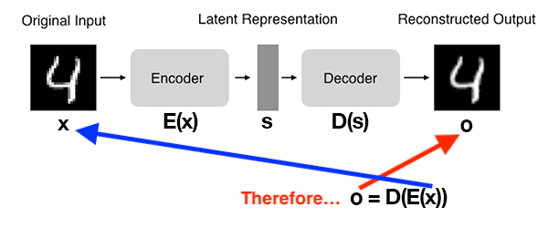
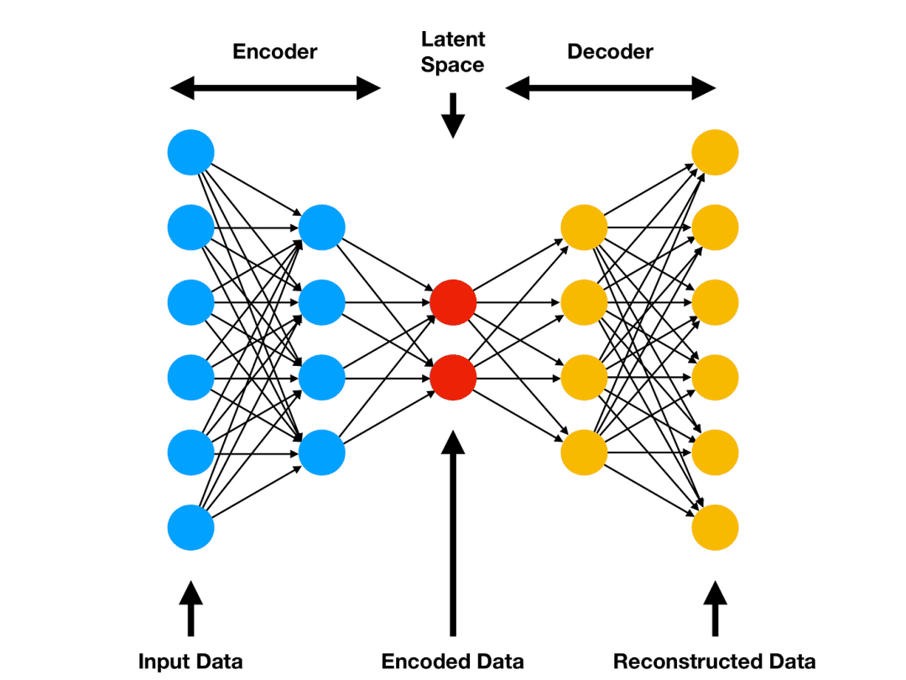
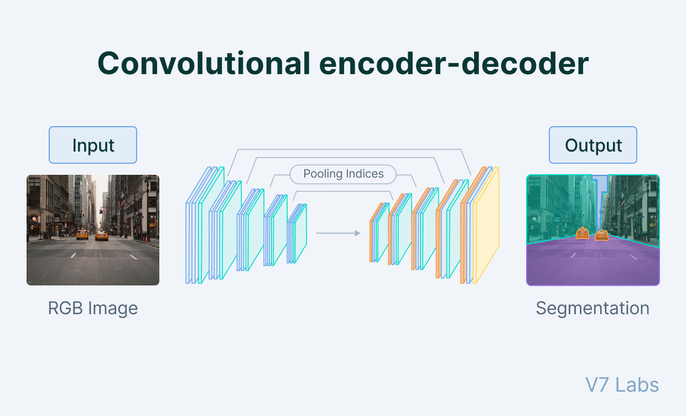
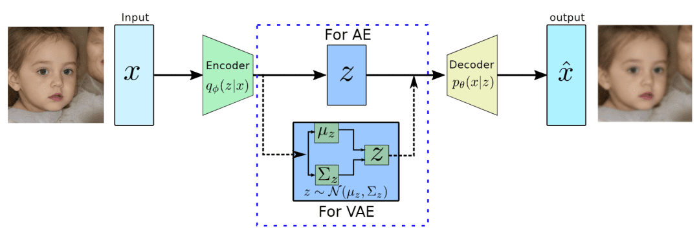
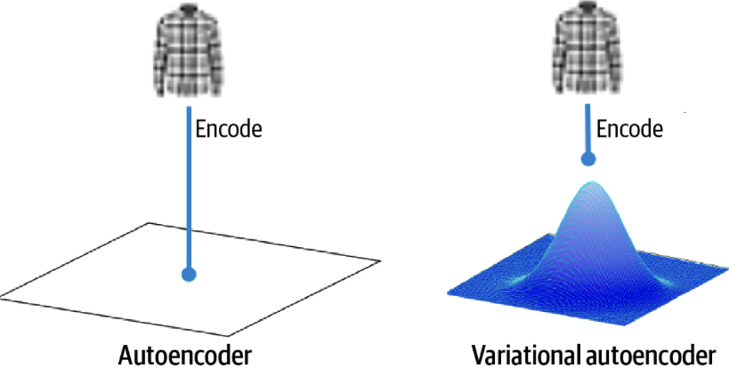
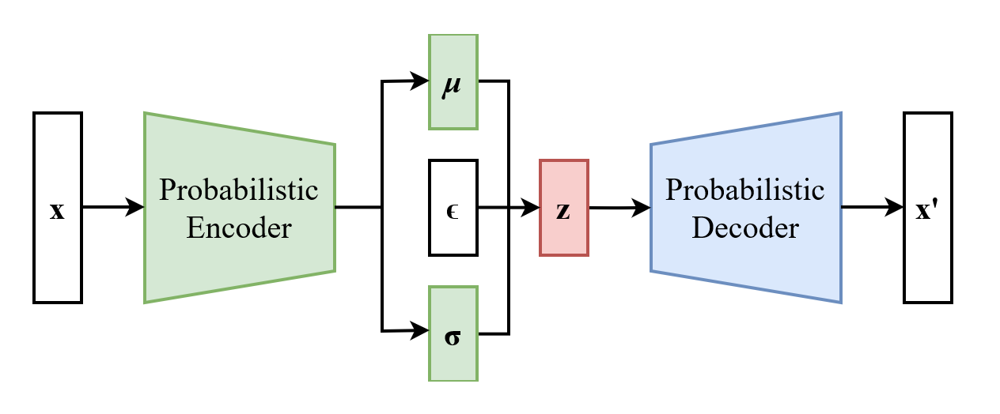
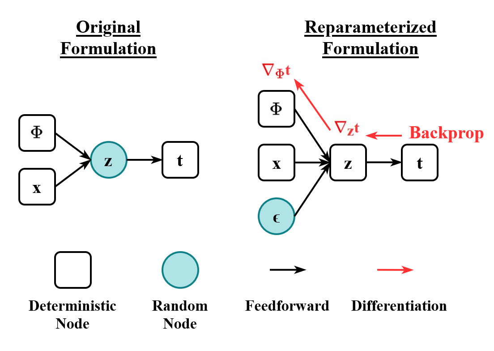

## Autoencoders

**Autoencoders (AEs)** are neural networks designed to learn efficient:

1. codings of input data by compressing it into a lower-dimensional representation, and then;
2. reconstructing it back to the original form.

Autoencoders consist of two main components:

- **an encoder**, which compresses input data into a lower-dimensional representation known as the **latent space** or code. This latent space, often called embedding, aims to retain as much information as possible, allowing the decoder to reconstruct the data with high precision. If we denote our input data as \( x \) and the encoder as \( E \), then the output latent space representation, \( s \), would be \( s=E(x) \).

- **a decoder**, which reconstructs the original input data by accepting the latent space representation \( s \). If we denote the decoder function as \( D \) and the output of the decoder as \( o \), then we can represent the decoder as \( o = D(s) \).

Both encoder and decoder are typically composed of one or more layers, which can be fully connected, convolutional, or recurrent, depending on the input data’s nature and the autoencoder’s architecture.[^1] The entire autoencoder process can be summarized as:

\[
o = D(E(x))
\]

/// caption
An illustration of the architecture of autoencoders. Source: [^1].
///

## Types of Autoencoder

There are several type of autoencoders, each one with this particularity:

### **Vanilla Autoencoders**

Vanilla encoders are fully connected layers for encoder and decoder. It works to compress input information and are applied over simple data.

{width="90%"}
/// caption
The encoder such as the decoder are fully connected networks. The encoder addresses the input data to the latent space (compressed space - encoded data). The decoder addresses the latent space data to output (reconstructed data). Source: [^1].
///

Latent Space is a compressed representation of the input data. The dimensionality of the latent space is typically much smaller than that of the input data, which forces the autoencoder to learn a compact representation that captures the most important features of the data.

### **Convolutional Autoencoders**

In convolutional autoencoders, the encoder and the decoder are neural networks based on Convolutional Neural Networks. So, the approach is more intensive for handling image data.

/// caption
In convolutional autoencoders, the encoder and decoder are based on Convolutional Neural Networks (CNNs). This architecture is particularly effective for image data, as it can capture spatial hierarchies and patterns. Source: [^2].
///

### **Variational Autoencoders**

Variational Autoencoders (VAEs) are generative models that learn to encode data into a lower-dimensional latent space and then decode it back to the original space. VAEs can generate new samples from the learned latent distribution, making them ideal for image generation and style transfer tasks.

/// caption
A VAE maps a input data \( \mathbf{x} \) into latent space \( \mathbf{z} \) and then reconstructs it back to the original space \( \mathbf{\hat{x}} \) (output). The encoder learns to capture the underlying structure of the data, while the decoder generates new samples from the latent space. Source: [^2].
///

VAEs were introduced in [2013 by Diederik et al. - Auto-Encoding Variational Bayes](https://arxiv.org/abs/1312.6114){:target="_blank"}.

{width="70%"}
/// caption
*Figure: Comparison between a standard Autoencoder and a Variational Autoencoder (VAE). In a standard Autoencoder, the encoder maps input data \( \mathbf{x} \) to a fixed latent representation \( \mathbf{z} \), which is then used by the decoder to reconstruct the input as \( \mathbf{\hat{x}} \). In contrast, a VAE encodes the input data into a distribution over the latent space, typically modeled as a Gaussian distribution with mean \( \mu \) and standard deviation \( \sigma \). During training, the VAE samples from this distribution to obtain \( \mathbf{z} \), which is then used by the decoder to reconstruct the input. This probabilistic approach allows VAEs to generate new samples by sampling from the latent space, making them powerful generative models. Dataset: [Fashion-MNIST](https://github.com/zalandoresearch/fashion-mnist){:target="_blank"}. Source: [^3].*
///

#### Key Features of VAEs

VAEs have the ability to learn smooth and continuous latent spaces, which allows for meaningful interpolation between data points. This is particularly useful in applications such as image generation, where one can generate new images by sampling from the latent space. Also, the probabilistic nature of VAEs helps in regularizing the latent space, preventing overfitting and introducing the same level of randomness, ensuring that the model generalizes well to unseen data.

Aspects of VAEs include:

- **Regularization and Continuity**: The latent space in VAEs is regularized to follow a prior distribution (usually a standard normal distribution). This encourages the model to learn a continuous and smooth latent space, allowing for meaningful interpolation between data points.

- **Simplicity in Sampling**: VAEs can generate new samples by simply sampling from the latent space distribution - the Gaussian distribution is mathematically tractable and is a universal approximator -, making them efficient for generative tasks.

- **Reparameterization Trick**: To enable backpropagation through the stochastic sampling process, VAEs employ the reparameterization trick. This involves expressing the sampled latent variable \( \mathbf{z} \) as a deterministic function of the input data \( \mathbf{x} \) and a random noise variable \( \mathbf{\epsilon} \), allowing gradients to flow through the network during training.

- **Balanced Latent Space**: The KL divergence term in the VAE loss function encourages the learned latent space to be similar to the prior distribution, promoting a well-structured and balanced latent space.

#### Training VAEs

VAEs uses Kullback-Leibler (KL) divergence as its loss function, which measures the difference between the learned latent distribution and the prior distribution. The loss function is a combination of the reconstruction loss (how well the decoder reconstructs the input) and the KL divergence term.

Suppose we have a distribution \( z \) and we want to approximate it with a distribution \( p(z|x) \), where \( x \) is the input data. In other words, we want to find a distribution \( p(z|x) \), then we can to it by following Bayes' theorem:

\[
p(z|x) = \displaystyle \frac{p(x|z)p(z)}{p(x)}
\]

But, the problem is that $p(x)$ is intractable:

\[
p(x) = \displaystyle \int p(x|z)p(z)dz
\]

This integral is often intractable distribution. Hence, we can approximate it with a variational distribution \( q(z|x) \), which is easier to compute. So, we want to minimize the KL divergence between \( q(z|x) \) and \( p(z|x) \):

\[
\min \text{KL} ( q(z|x) || (z|x) )
\]

By simplifying the above minimization problem is equivalent to the following maximization problem:

\[
\mathbb{E}_{q(z|x)}[\log p(x|z)] - \text{KL}(q(z|x) || p(z))
\]

where:

- The first term, \( \mathbb{E}_{q(z|x)}[\log p(x|z)] \), is the expected log-likelihood of the data given the latent variable, which encourages the model to reconstruct the input data accurately.
- The second term, \( \text{KL}(q(z|x) || p(z)) \), is the KL divergence between the approximate posterior and the prior distribution, which regularizes the latent space.

Thus, the loss function for training a VAE can be expressed as:

\[
\mathcal{L} = -\mathbb{E}_{q(z|x)}[\log p(x|z)] + \text{KL}(q(z|x) || p(z))
\]

/// caption
*Figure: Basic architecture of a Variational Autoencoder (VAE). The encoder maps input data \( \mathbf{x} \) to a latent representation \( \mathbf{z} \), and the decoder reconstructs \( \mathbf{x'} \) from \( \mathbf{z} \). Source: [Wikipedia](https://en.wikipedia.org/wiki/Variational_autoencoder){:target="_blank"}*
///

#### Reparameterization Trick

The reparameterization trick is a key innovation that allows for efficient backpropagation through the stochastic layers of a VAE. Instead of sampling \( z \) directly from \( q(z|x) \), we can express \( z \) as a deterministic function of \( x \) and some noise \( \epsilon \) drawn from a simple distribution (e.g., Gaussian):

\[
z = \mu + \sigma \cdot \epsilon
\]

where \( \mu \) and \( \sigma \) are the mean and standard deviation outputs of the encoder. This transformation allows us to backpropagate through the network while still maintaining the stochastic nature of the latent variable.

---

#### Numerical Simulation

???+ example "Numerical Simulation of VAE"

    --8<-- "docs/classes/variational-autoencoders/vae-numerical-simulation.md"

---

<!-- 

##### Fashion-MNIST

??? example "Fashion-MNIST"

    Below is a basic example of how to create and train a VAE on the Fashion-MNIST dataset.

    --8<-- "docs/classes/variational-autoencoders/vae_example_fashion_mnist.md"

    <!-- ??? info "Architecture Visualization"

        === "Encoder"

            

        === "Decoder"

             -->

[^1]: [Sharma, A. “Introduction to Autoencoders,” PyImageSearch, P. Chugh, A. R. Gosthipaty, S. Huot, K. Kidriavsteva, and R. Raha, eds., 2023](https://pyimg.co/ehnlf){:target="_blank"}.

[^2]: [Bandyopadhyay, H. "What is an autoencoder and how does it work? Learn about most common types of autoencoders and their applications in machine learning."](https://www.v7labs.com/blog/autoencoders-guide){:target="_blank"}.

[^3]: [Sharma, A. “A Deep Dive into Variational Autoencoders with PyTorch,” PyImageSearch, P. Chugh, A. R. Gosthipaty, S. Huot, K. Kidriavsteva, and R. Raha, eds., 2023](https://pyimg.co/7e4if){:target="_blank"}.

[^4]: [Wikipedia - Kullback–Leibler divergence](https://en.wikipedia.org/wiki/Kullback%E2%80%93Leibler_divergence){:target="_blank"}.

[^5]: [GeeksforGeeks - Understanding KL Divergence in PyTorch](https://www.geeksforgeeks.org/deep-learning/understanding-kl-divergence-in-pytorch/){:target="_blank"}.