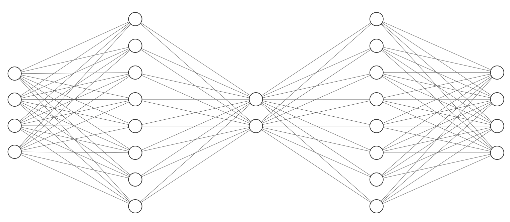

A Variational Autoencoder (VAE) encodes input data into a probabilistic latent space (defined by mean μ and log-variance log(σ²)) and decodes it back to reconstruct the input. The latent space is sampled using the reparameterization trick for differentiability. The loss combines reconstruction error (MSE) and KL divergence to regularize the latent distribution toward a standard normal.

For this numerical example, we've scaled up to:

- Input dimension: 4 (e.g., a vector like `[1.0, 2.0, 3.0, 4.0]`)
- Latent dimension: 2
- Output dimension: 4 (reconstruction of input)
- Hidden layer size: 8 (for both encoder and decoder, to add capacity)

The model uses PyTorch with random initialization (seeded at 42 for reproducibility). All calculations are shown step-by-step, including matrix multiplications where relevant. Weights and biases are explicitly listed below.

##### Model Architecture




- **Encoder**:

    - Linear (fc1): 4 inputs → 8 hidden units, followed by ReLU.
    - Linear to μ (fc_mu): 8 → 2.
    - Linear to logvar (fc_logvar): 8 → 2.

- **Latent**: Sample z from N(μ, σ²) using reparameterization trick.

- **Decoder**:

    - Linear (fc_dec1): 2 latent → 8 hidden units, followed by ReLU.
    - Linear to output (fc_dec2): 8 → 4 (no final activation, assuming Gaussian output for simplicity).

- **Loss**: Summed MSE for reconstruction + KL divergence (without β annealing).

##### Weights and Biases

All parameters are initialized randomly (via torch.manual_seed(42)). Here they are:

---

**Encoder**

- **fc1.weight** (encoder input to hidden, shape [8, 4]):

    ``` python
    [
        [ 0.3823,  0.4150, -0.1171,  0.4593],
        [-0.1096,  0.1009, -0.2434,  0.2936],
        [ 0.4408, -0.3668,  0.4346,  0.0936],
        [ 0.3694,  0.0677,  0.2411, -0.0706],
        [ 0.3854,  0.0739, -0.2334,  0.1274],
        [-0.2304, -0.0586, -0.2031,  0.3317],
        [-0.3947, -0.2305, -0.1412, -0.3006],
        [ 0.0472, -0.4938,  0.4516, -0.4247]
    ]
    ```

- **fc1.bias** (shape [8]):

    ``` python
    [ 0.3860,  0.0832, -0.1624,  0.3090,  0.0779,  0.4040,  0.0547, -0.1577 ]
    ```

- **fc_mu.weight** (hidden to μ, shape [2, 8]):

    ``` python
    [
        [ 0.0950, -0.0959,  0.1488,  0.3157,  0.2044, -0.1546,  0.2041,  0.0633],
        [ 0.1795, -0.2155, -0.3500, -0.1366, -0.2712,  0.2901,  0.1018,  0.1464]
    ]
    ```

- **fc_mu.bias** (shape [2]):

    ``` python
    [ 0.1118, -0.0062 ]
    ```

- **fc_logvar.weight** (hidden to logvar, shape [2, 8]):

    ``` python
    [
        [ 0.2767, -0.2512,  0.0223, -0.2413,  0.1090, -0.1218,  0.1083, -0.0737],
        [ 0.2932, -0.2096, -0.2109, -0.2109,  0.3180,  0.1178,  0.3402, -0.2918]
    ]
    ```

- **fc_logvar.bias** (shape [2]):

    ```python
    [ -0.3507, -0.2766 ]
    ```

---

**Decoder**

- **fc_dec1.weight** (latent to decoder hidden, shape [8, 2]):

    ``` python
    [
        [-0.4757,  0.2864],
        [ 0.2532,  0.5876],
        [-0.3652, -0.4820],
        [ 0.3752, -0.2858],
        [ 0.4292, -0.1678],
        [ 0.4045, -0.5494],
        [-0.3568,  0.2156],
        [ 0.1495, -0.1803]
    ]
    ```

- **fc_dec1.bias** (shape [8]):

    ``` python
    [ 0.4215,  0.4807, -0.5128, -0.3775,  0.6475, -0.2386, -0.2507, -0.6842 ]
    ```

- **fc_dec2.weight** (decoder hidden to output, shape [4, 8]):

    ``` python
    [
        [-0.2025,  0.0883, -0.0467, -0.2566,  0.0083, -0.2415, -0.3000, -0.1947],
        [-0.3094, -0.2251,  0.3534,  0.0668,  0.1090, -0.3298, -0.2322, -0.1177],
        [ 0.0553, -0.3111, -0.1523, -0.2117,  0.0010, -0.1316, -0.0245, -0.2396],
        [-0.2427, -0.2063, -0.1210, -0.2791,  0.2964, -0.0702,  0.3042,  0.1102]
    ]
    ```

- **fc_dec2.bias** (shape [4]):

    ``` python
    [ -0.2994,  0.2447, -0.0973, -0.1355 ]
    ```

##### Forward Pass

1. **Input**:

    ``` python
    x = [ 1.0, 2.0, 3.0, 4.0 ]
    ```

    (batch size 1, dim 4).

2. **Encoding to Hidden Layer**:

    - Compute pre-ReLU: fc1(x) = fc1.weight @ x^T + fc1.bias.

        - This is a matrix multiplication: Each row of fc1.weight dotted with x, plus bias.
        - Result (pre-ReLU):
            ``` python
            [ 3.0842,  0.6196,  1.223,   1.2547,  0.4205,  0.7739, -2.427,  -1.4421 ]
            ```
        - After ReLU (non-negative):
            ``` python
            encoder_8 = [ 3.0842, 0.6196, 1.223,  1.2547, 0.4205, 0.7739, 0., 0. ]
            ```
            (note: last two are zeroed by ReLU).

3. **Compute Mean (μ) in Latent Space**:

    - μ = fc_mu.weight @ hidden^T + fc_mu.bias.
        - Result:
            ``` python
            μ = [ 0.88977581, -0.07508313 ]
            ```
        - This is the mean of the 2D latent Gaussian.

4. **Compute Log-Variance (logvar) in Latent Space**:

    - logvar = fc_logvar.weight @ hidden^T + fc_logvar.bias.

        - Result:
            ```python
            logvar = [ 0.02314189, 0.20015677 ]
            ```
        - Variance σ² = exp(logvar):
            ``` python
            variance = [ 1.02341174, 1.22159425 ]
            ```

5. **Latent Space: Sampling z (Reparameterization Trick)**:

    - std (σ) = exp(0.5 * logvar):
        ``` python
        std = [ 1.01163815, 1.10525755 ]
        ```
    
    - ε ~ N(0, 1) (seeded random):
        ``` python
        ε = [ -0.2387, -0.5050 ]
        ```

    - \( z = \mu + std * \epsilon \)

    - Result:
        ``` python
        z = [ 0.88977581 + 1.01163815*(-0.2387), -0.07508313 + 1.10525755*(-0.5050) ] 
            ≈ [ 0.64829778, -0.63323819 ]
        ```

6. **Decoding to Reconstructed Output**:

    - Decoder: ReLu( fc_dec1.weight @ z^T + fc_dec1.bias ).
        - pre-ReLU:
            ``` python
            decoder_hidden = [ -0.06825467,  0.27275824, -0.44433754,  0.0467208,   1.03200678,  0.37153752, -0.6185388,  -0.47310664 ]
            ```
        - After ReLU:
            ``` python
            decoder_hidden = [ 0., 0.27275824, 0., 0.0467208,  1.03200678, 0.37153752, 0., 0. ]
            ```
    - recon_x = fc_dec2.weight @ decoder_hidden^T + fc_dec2.bias.

        - Result:

            ``` python
            recon_x = [ -0.36846466,  0.17637874, -0.23990821,  0.07499507 ]
            ```

##### Loss Calculation

- **Reconstruction Loss (MSE)**:

    Sum over dimensions of \( (x - \hat{x})^2 ≈ 31.100958927489703 \)

- **KL Divergence**:

    \[
    \text{KL} = -0.5 * \sum \left(1 + \text{logvar} - \mu^2 - \exp(\text{logvar})\right) \approx 0.40952290104490313
    \]
    
- **Total Loss**:

    \[ \text{Loss} = \text{MSE} + \text{KL} \approx 31.510481828534605 \]

##### Backward Pass

The backward pass computes gradients via autograd (chain rule from loss back through the network). This enables training by updating weights (e.g., via SGD). Gradients are zero-initialized before .backward().

After loss.backward(), key gradients \( \displaystyle \frac{\partial \text{Loss}}{\partial \text{param}} \) are:

---

**Decoder**

- **fc_dec2.weight.grad** (shape [4, 8]):

    \[ \displaystyle \frac{\partial \text{L}}{\partial \text{fc_dec2.weight}} \]

    ``` python
    [
        [-0.0000, -0.7467, -0.0000, -0.1278, -2.8242, -1.0167, -0.0000, -0.0000],
        [-0.0000, -0.9951, -0.0000, -0.1703, -3.7638, -1.3549, -0.0000, -0.0000],
        [-0.0000, -1.7679, -0.0000, -0.3025, -6.6867, -2.4071, -0.0000, -0.0000],
        [-0.0000, -2.1417, -0.0000, -0.3664, -8.1006, -2.9161, -0.0000, -0.0000]
    ]
    ```

- **fc_dec2.bias.grad** (shape [4]): 

    ```python
    [ -2.7369, -3.6474, -6.4798, -7.8500 ]
    ```

- **fc_dec1.weight.grad** (shape [8, 2]):

    ``` python
    [
        [ 0.0000, -0.0000],
        [ 2.7321, -2.6684],
        [ 0.0000, -0.0000],
        [ 2.6066, -2.5459],
        [-1.7850,  1.7434],
        [ 2.1179, -2.0685],
        [ 0.0000, -0.0000],
        [ 0.0000, -0.0000]
    ]
    ```

    - Primarily from MSE, backpropagated through decoder.

- **fc_dec1.bias.grad** (shape [8]):

    ``` python
    [ 0.0000,  4.2144,  0.0000,  4.0209, -2.7535,  3.2670,  0.0000,  0.0000 ]
    ```

---

**Encoder**

- **fc_mu.weight.grad** (shape [2, 8]):

    ``` python
    [
        [11.1188,  2.2342,  4.4088,  4.5235,  1.5168,  2.7899,  0.0000,  0.0000],
        [-0.2493, -0.0501, -0.0989, -0.1014, -0.0340, -0.0626, -0.0000, -0.0000]
    ]
    ```
    - Includes ∂KL/∂μ ≈ μ (pulling toward 0) + flow from MSE via z.

- **fc_mu.bias.grad** (shape [2]):

    ``` python
    [ 3.6052, -0.0808 ]
    ```

- **fc_logvar.weight.grad** (shape [2, 8]):

    ``` python
    [
        [-0.9752, -0.1960, -0.3867, -0.3967, -0.1330, -0.2447, -0.0000, -0.0000],
        [ 0.3473,  0.0698,  0.1377,  0.1413,  0.0474,  0.0871,  0.0000,  0.0000]
    ]
    ```
    - From ∂KL/∂logvar ≈ 0.5*(exp(logvar) - 1) + MSE flow.

- **fc_logvar.bias.grad** (shape [2]):

    ``` python
    [ -0.3162,  0.1126 ]
    ```

- **fc1.weight.grad** (shape [8, 4]):
    ``` python
    [
        [ 0.2735,  0.5470,  0.8204,  1.0939],
        [-0.2724, -0.5448, -0.8172, -1.0896],
        [ 0.5339,  1.0679,  1.6018,  2.1358],
        [ 1.2016,  2.4032,  3.6049,  4.8065],
        [ 0.7601,  1.5201,  2.2802,  3.0403],
        [-0.5289, -1.0578, -1.5868, -2.1157],
        [ 0.0000,  0.0000,  0.0000,  0.0000],
        [ 0.0000,  0.0000,  0.0000,  0.0000]
    ]
    ```
    - These flow from both MSE (via reconstruction) and KL (via μ/logvar). Zeros in last rows due to ReLU zeroing those hidden units.

- **fc1.bias.grad** (shape [8]):

    ``` python
    [ 0.2735, -0.2724,  0.5339,  1.2016,  0.7601, -0.5289,  0.0000,  0.0000 ]
    ```


These gradients would update parameters in training (e.g., param -= lr * grad). Note zeros where ReLU gates flow. This example uses a single pass; real training iterates over datasets. If you change the seed, input, or dimensions, values will differ, but the process remains identical.