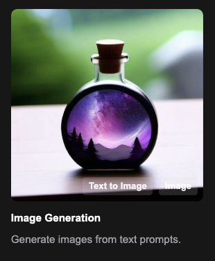

!!! success inline end "Deadline and Submission"

    :date: 16.nov (sunday)
    
    :clock1: Commits until 23:59

    :material-account-group: [Team (2-3 members) form](){:target="_blank"}

    :simple-github: Submission the GitHub Pages' Link via [insper.blackboard.com](https://insper.blackboard.com){:target="_blank"}.

This is a open themed project where you will explore generative models, the only mandatory point is to use **Stable Diffusion**. In this project, you can choose work a framework to work with generative models, such as Text to {Image, Video, Audio}, vice-versa, or other combinations.

A suggestion of platform to explore is [Comfy UI](https://www.comfy.org){:target="_blank"}, which is an open-source platform for building and deploying generative AI models. It provides a user-friendly interface and tools to create, train, and deploy models for various generative tasks. Also, it supports a wide range of generative models, including text-to-image, image-to-image, and more.

{width="40%", align=right }

Build on pipeline using generative models. You can start from templates available in Comfy UI or create your own from scratch. You can also explore other platforms or frameworks if you prefer.

For example, you can create a text-to-image pipeline that generates images based on textual descriptions. So, you have to explain the architecture of the models used, the connections between them, and the results obtained. You can also explore other combinations, such as image-to-text, video-to-audio, etc.

## Criteria

| Criterion | Description |
|:---------:|-------------|
| I | - Delivery of none or incomplete project. |
| D | - Delivery of a basic project with errors;   - ==OR==, explanation of the model architecture is missing. |
| C | - Delivery of one implementation (Image2Video, Video2Image, etc.) with correct model architecture explanation.   - At least, 5 examples of input-output pairs (different parameters). |
| B | - Delivery of two implementations (Image2Video, Video2Image, etc.) with correct model architecture explanation and its respective input-output pairs. |
| A | - Delivery of B.   - Additional use of LoRA, ControlNet, or other advanced techniques. |

A half-grade will be added or subtracted based on the quality of the report, examples provided and creativity of the project.

## Reports and Examples

In your submission, include a report explaining the architecture of the models used, the connections between them, and the results obtained. For example, you can include diagrams or flowcharts to illustrate the pipeline, and, explain the blocks involved with its contribution to the overall system.

{==

In case of not explaining the architecture and the models used and ALL this blocks, the maximum grade will be C.

==}

!!! danger "No Free Lunch"

    Take care with cost of the models. Avoid using paid services or APIs that require payment. The project should be developed using free and open-source tools and platforms.